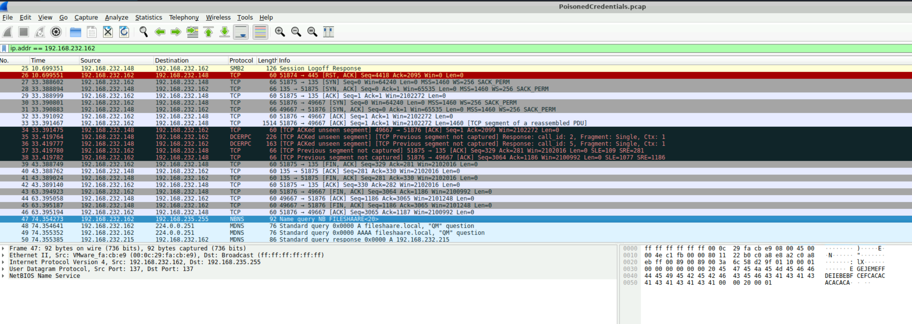
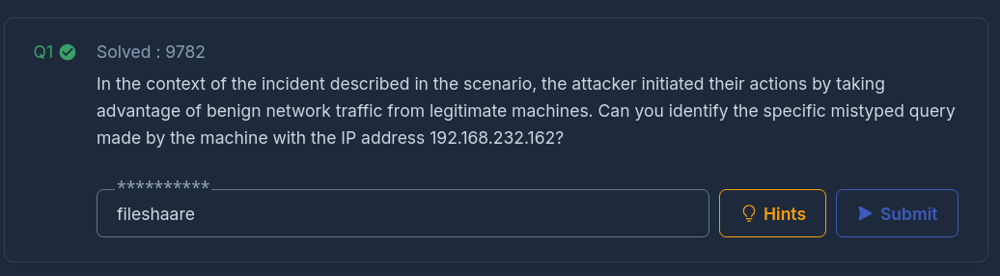
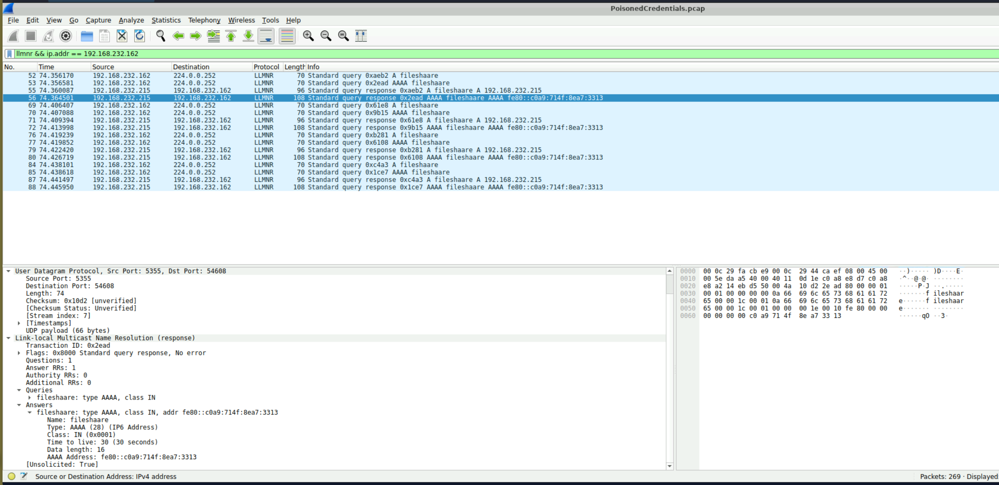
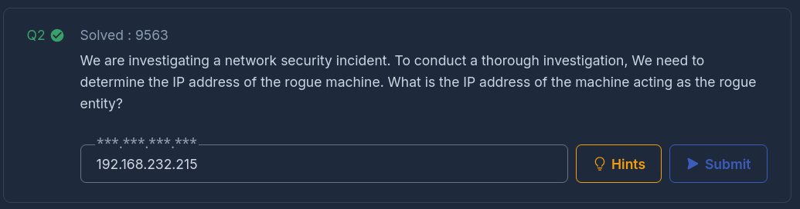
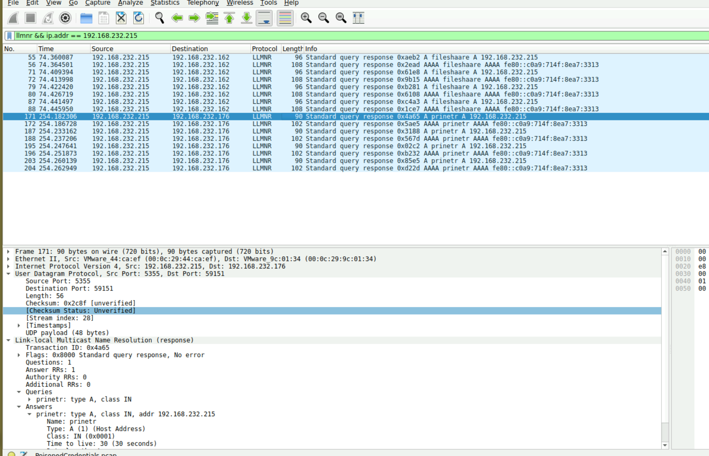
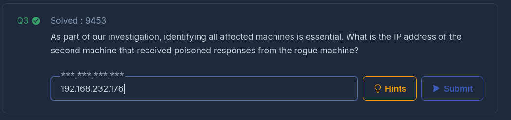
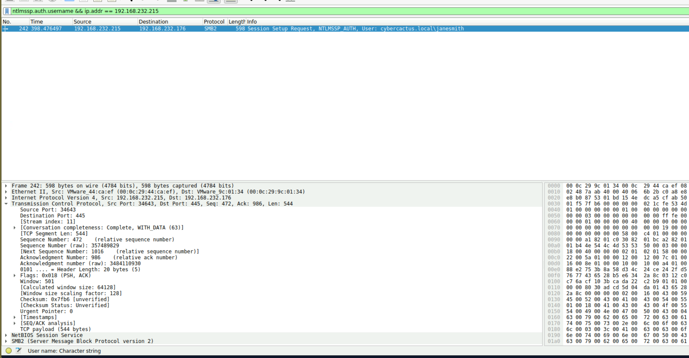
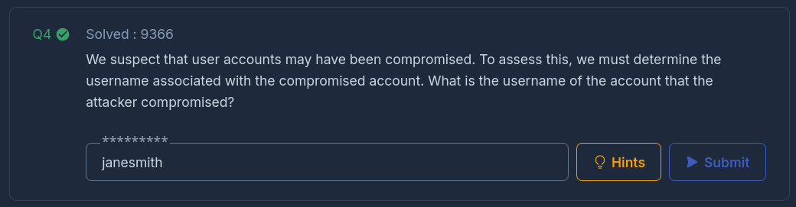
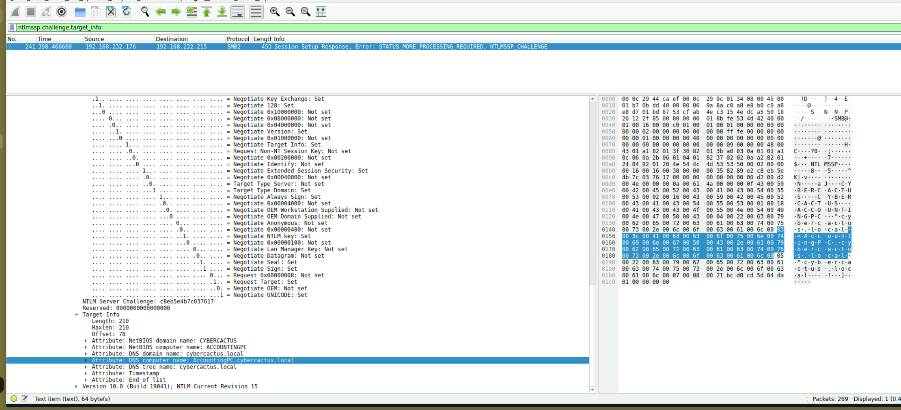
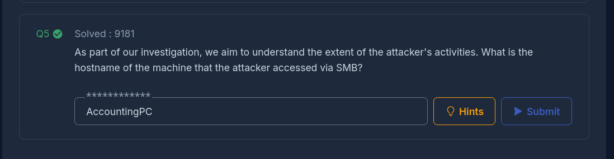

## Summary
Your organization's security team has detected a surge in suspicious network activity. There are concerns that LLMNR (Link-Local Multicast Name Resolution) and NBT-NS (NetBIOS Name Service) poisoning attacks may be occurring within your network. These attacks are known for exploiting these protocols to intercept network traffic and potentially compromise user credentials. Your task is to investigate the network logs and examine captured network traffic.

# PoisonedCredentials – LLMNR / NBT-NS Poisoning Analysis

## LLMNR Initial Query

### Summary

Initial analysis focused on suspicious LLMNR traffic originating from 192.168.232.162. The host issued a broadcast name resolution request due to a mistyped resource query. This is a common precursor to LLMNR poisoning attacks.

The mistyped query observed was:  
fileshaare

### Commands / Filters

ip.addr == 192.168.232.162  
llmnr && ip.addr == 192.168.232.162

## Rogue Responder Identification

### Summary

The rogue machine responded to the LLMNR broadcast request. Analysis showed 192.168.232.215 responding to the victim host, indicating it was impersonating the legitimate service.

This confirms LLMNR poisoning activity.

Rogue Machine IP:  
192.168.232.215

### Commands / Filters

llmnr && ip.addr == 192.168.232.215

## Identifying Additional Affected Hosts

### Summary

Further inspection revealed additional machines receiving poisoned responses from the rogue host.

The second affected machine identified was:  
192.168.232.176

This demonstrates lateral credential exposure beyond the initial victim.

### Commands / Filters

llmnr && ip.addr == 192.168.232.215

## Extracting Compromised Credentials

### Summary

NTLM authentication traffic was examined to determine which user credentials were captured by the attacker.

Analysis of NTLMSSP authentication packets revealed the compromised username:  
janesmith

This confirms credential interception via the rogue responder.

### Commands / Filters

ntlmssp.auth.username && ip.addr == 192.168.232.215

## Target Host Identification via NTLM Challenge

### Summary

Deep inspection of the NTLMSSP challenge message revealed the DNS computer name of the system accessed via SMB.

Navigating to:  
Security Blob → NTLMSSP → Target Info → DNS Computer Name

Revealed:  
AccountingPC

This confirms the specific host the attacker successfully accessed.

### Commands / Filters

ntlmssp.challenge.target_info

## Investigation Summary

This lab demonstrated a classic LLMNR/NBT-NS poisoning attack chain:

1. Victim host broadcasts mistyped name request.
    
2. Rogue machine responds first.
    
3. NTLM authentication is initiated.
    
4. Credentials are captured.
    
5. SMB access confirmed on AccountingPC.
    

Defensive considerations:

- Disable LLMNR and NBT-NS where possible.
    
- Enforce SMB signing.
    
- Monitor for abnormal LLMNR responses.
    
- Alert on multiple NTLM authentication attempts to non-domain controllers.

I successfully completed PoisonedCredentials Blue Team Lab at @CyberDefenders!
https://cyberdefenders.org/blueteam-ctf-challenges/achievements/inksec/poisonedcredentials/
 
#CyberDefenders #CyberSecurity #BlueYard #BlueTeam #InfoSec #SOC #SOCAnalyst #DFIR #CCD #CyberDefender
