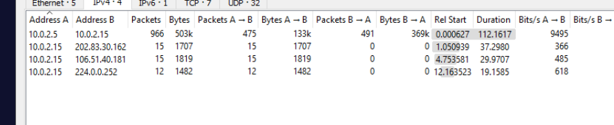
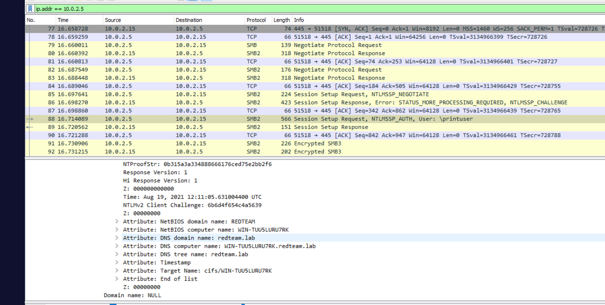
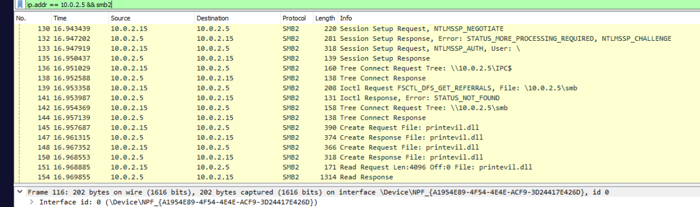
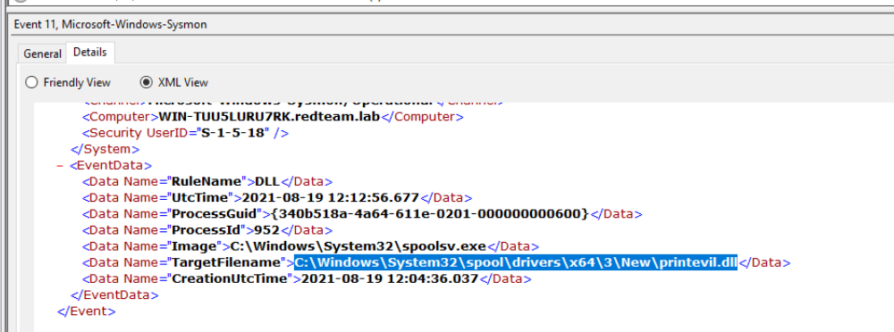
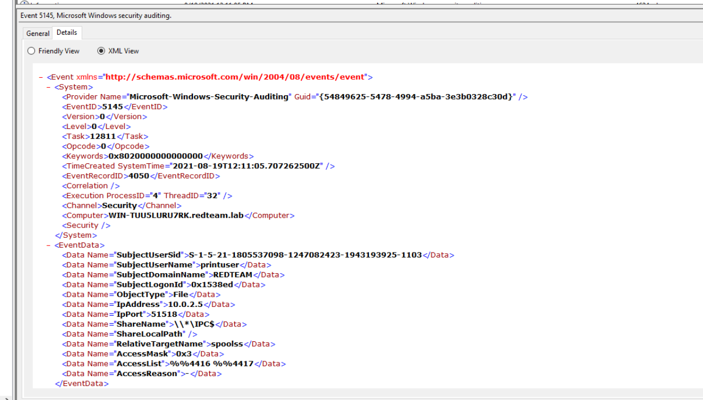
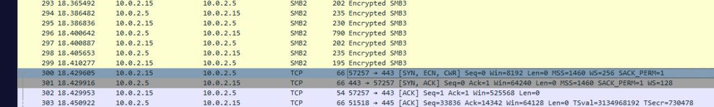
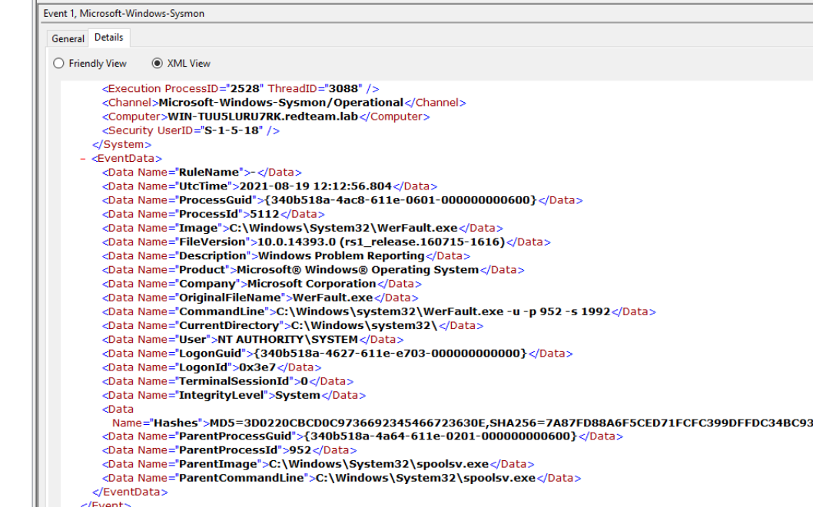
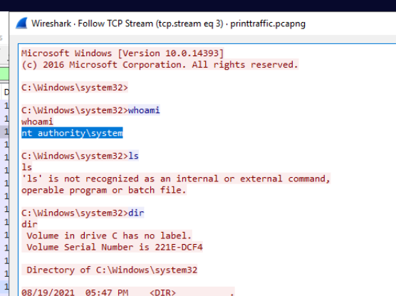

## Overview

The red team executed a PrintNightmare-style exploit against a vulnerable Windows Print Spooler service. As the detection analyst, the task is to extract artifacts from network captures and Windows event logs to build detection rules for the SOC. This lab covers SMB file transfer analysis, Sysmon event correlation, and reverse shell identification.

---

## Network Analysis — Identifying the Attacker

Opening the PCAP in Wireshark and checking **Statistics → Conversations** establishes the two key hosts:

- **Victim:** `192[.]168[.]0[.]15` (10.0.2.15)
- **Attacker:** `10[.]0[.]2[.]5`

To identify the domain name used by the red team, filtering for NTLMSSP authentication traffic reveals the attacker's domain:

**`redteam.lab`**

NTLMSSP is a goldmine for domain enumeration during network forensics — it exposes workstation names, domain names, and usernames in cleartext within the authentication handshake.


---

## SMB File Transfer — printevil.dll

Filtering for SMB2 traffic from the attacker:

```bash
ip.addr == 10.0.2.5 && smb2
```

The traffic reveals the attacker serving a malicious DLL over an SMB share:

**`\\10.0.2.5\smb\printevil.dll`**

The victim host connects to the attacker's SMB share and pulls the DLL — this is the core of the PrintNightmare exploit, abusing the Windows Print Spooler's ability to load printer drivers from remote UNC paths.

---

## System Event Logs — DLL Drop Location

Pivoting to the Windows System event logs, **Event ID 11** (file creation) records exactly where the spooler dropped the malicious DLL:

**`C:\Windows\System32\spool\drivers\x64\3\New\printevil.dll`**

This path is the standard staging location for printer drivers — the exploit tricks the spooler into loading attacker-controlled code from here with SYSTEM privileges.


---

## Security Log — Spoolss Access

Checking the Security event log for lateral movement indicators, filtering for `AccountName=printuser` and `RelativeTargetName=spoolss` surfaces the key event:

- **Event ID:** `5145` — A network share object was checked for access
- **AccessMask:** `0x3`
- **ShareName:** `\\*\IPC$`

Event 5145 is critical for PrintNightmare detection — it records the attacker authenticating to the IPC$ share and accessing the `spoolss` named pipe, which is the mechanism used to trigger remote DLL loading via the `RpcAddPrinterDriverEx` call.

---

## Reverse Shell — C2 Callback

Once `printevil.dll` is loaded by the spooler service running as `NT AUTHORITY\SYSTEM`, the DLL executes and establishes a reverse shell back to the attacker over HTTPS (port 443) to blend into legitimate traffic:

**`10[.]0[.]2[.]5:443`**

Using port 443 for C2 is a common evasion technique — most network monitoring tools whitelist outbound HTTPS, making the reverse shell callback difficult to distinguish from normal web traffic without deep packet inspection.


---

## Sysmon — WerFault.exe Parent Process

The exploit's DLL injection into the spooler process causes instability, triggering Windows Error Reporting. Examining the Sysmon logs for `WerFault.exe` reveals its parent process:

**`c:\Windows\system32\spoolsv.exe`**

`spoolsv.exe` spawning `WerFault.exe` is an anomalous and detectable indicator — under normal operation the print spooler should not be crashing. This parent-child relationship is a strong detection opportunity for PrintNightmare exploitation attempts.


---

## Post-Exploitation — Whoami

With a SYSTEM shell established, the attacker's first command confirms their privilege level:

```zsh
whoami
```

Output: **`nt authority\system`**

Full SYSTEM access achieved via the print spooler service — no privilege escalation required since `spoolsv.exe` already runs as SYSTEM.

---

## IOCs

|Type|Value|
|---|---|
|Attacker IP|`10[.]0[.]2[.]5`|
|Victim IP|`10[.]0[.]2[.]15`|
|C2|`10[.]0[.]2[.]5:443`|
|Malicious DLL|`printevil.dll`|
|DLL Drop Path|`C:\Windows\System32\spool\drivers\x64\3\New\printevil.dll`|
|Domain|`redteam.lab`|
|Attacker SMB Share|`\\10[.]0[.]2[.]5\smb`|


---

<div class="qa-item"> <div class="qa-question-text">Submit the Domain name used by the red teamers for their test setup</div> <div class="flag-reveal"> <input type="checkbox"> <span class="r-placeholder">Click flag to reveal</span> <span class="r-answer">redteam.lab</span> <button class="copy-btn" onclick="event.stopPropagation();navigator.clipboard.writeText(this.previousElementSibling.textContent);this.textContent='copied';setTimeout(()=>this.textContent='copy',1500)">copy</button> </div> </div>

<div class="qa-item"> <div class="qa-question-text">From the network traffic, what is the name of the file that is transferred via SMB?</div> <div class="answer-reveal"> <input type="checkbox"> <span class="r-placeholder">Click to reveal answer</span> <span class="r-answer">printevil.dll</span> <button class="copy-btn" onclick="event.stopPropagation();navigator.clipboard.writeText(this.previousElementSibling.textContent);this.textContent='copied';setTimeout(()=>this.textContent='copy',1500)">copy</button> </div> </div>

<div class="qa-item"> <div class="qa-question-text">What is the C drive location where the file from the previous question is copied?</div> <div class="flag-reveal"> <input type="checkbox"> <span class="r-placeholder">Click flag to reveal</span> <span class="r-answer">C:\Windows\System32\spool\drivers\x64\3\New\printevil.dll</span> <button class="copy-btn" onclick="event.stopPropagation();navigator.clipboard.writeText(this.previousElementSibling.textContent);this.textContent='copied';setTimeout(()=>this.textContent='copy',1500)">copy</button> </div> </div>

<div class="qa-item"> <div class="qa-question-text">What is the attacker's IP:Port for reverse shell?</div> <div class="answer-reveal"> <input type="checkbox"> <span class="r-placeholder">Click to reveal answer</span> <span class="r-answer">10.0.2.5:443</span> <button class="copy-btn" onclick="event.stopPropagation();navigator.clipboard.writeText(this.previousElementSibling.textContent);this.textContent='copied';setTimeout(()=>this.textContent='copy',1500)">copy</button> </div> </div>

<div class="qa-item"> <div class="qa-question-text">Submit EventID, AccessMask, ShareName when Accountname="printuser", Sourceaddress=Attacker's IP and Relative Target Name is "spoolss"</div> <div class="flag-reveal"> <input type="checkbox"> <span class="r-placeholder">Click flag to reveal</span> <span class="r-answer">5145, 0x3, \\*\IPC$</span> <button class="copy-btn" onclick="event.stopPropagation();navigator.clipboard.writeText(this.previousElementSibling.textContent);this.textContent='copied';setTimeout(()=>this.textContent='copy',1500)">copy</button> </div> </div>

<div class="qa-item"> <div class="qa-question-text">Submit Parent Command Line for the process WerFault.exe</div> <div class="answer-reveal"> <input type="checkbox"> <span class="r-placeholder">Click to reveal answer</span> <span class="r-answer">c:\Windows\system32\spoolsv.exe</span> <button class="copy-btn" onclick="event.stopPropagation();navigator.clipboard.writeText(this.previousElementSibling.textContent);this.textContent='copied';setTimeout(()=>this.textContent='copy',1500)">copy</button> </div> </div>

<div class="qa-item"> <div class="qa-question-text">After getting the reverse shell, the attacker tried the command “whoami”, what will be the output of this command? Note: whoami displays user, group, and privileges information for the user who is currently logged on</div> <div class="flag-reveal"> <input type="checkbox"> <span class="r-placeholder">Click flag to reveal</span> <span class="r-answer">nt authority\system</span> <button class="copy-btn" onclick="event.stopPropagation();navigator.clipboard.writeText(this.previousElementSibling.textContent);this.textContent='copied';setTimeout(()=>this.textContent='copy',1500)">copy</button> </div> </div>
