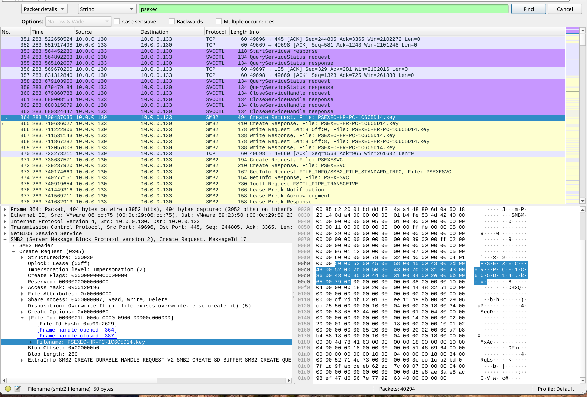
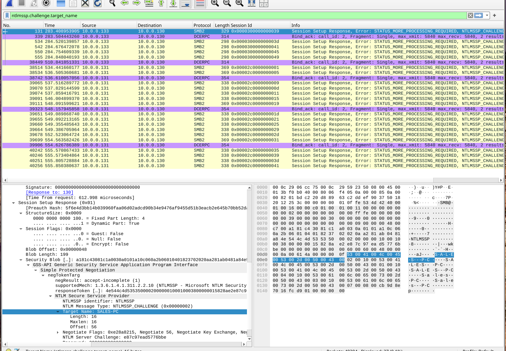
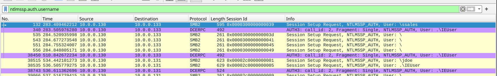
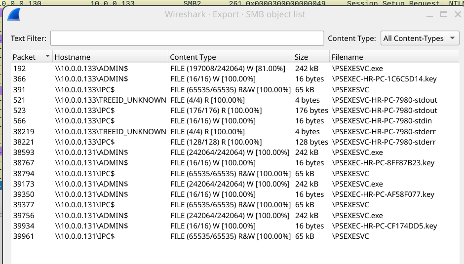
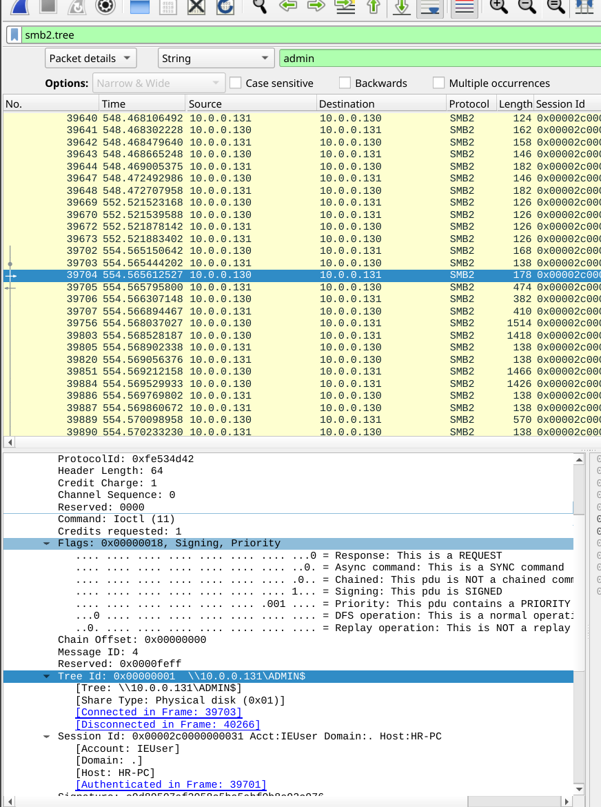
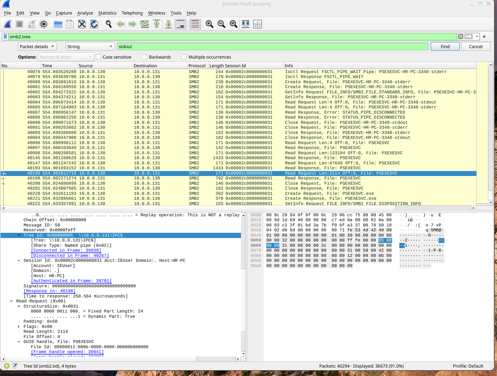

# PsExec Hunt – Lateral Movement Investigation

## Scenario

An IDS alert flagged suspicious lateral movement involving PsExec. As a SOC Analyst, the objective was to analyze the provided PCAP file, trace the attacker’s movement, identify compromised systems, and determine how the breach unfolded within the internal network.

---

## Initial Access – Attacker Source

Reviewing the PCAP revealed repeated SMB and PsExec-related traffic originating from:

**10.0.0.133**

This host initiated lateral movement activity consistent with PsExec behavior, confirming it as the attacker’s pivot source

Using the Wireshark filter:

`ntlmssp.challenge.target_name

The targeted hostname was identified through NTLM challenge messages

The attacker first pivoted to:

**SALES-PC (10.0.0.130)**

## Authentication Analysis

To determine which credentials were used, the following filter was applied:

`ntlmssp.auth.username

This revealed the account used for authentication during lateral movement.

The attacker authenticated using:

**IEUser**

This confirms valid credential abuse rather than exploit-based authentication bypass.

## Service Installation – PsExec Execution

Exporting SMB objects revealed the service executable deployed by the attacker.

Observed service executable:

**PSEXESVC.exe**

This is the standard service binary dropped by PsExec to execute commands remotely.

## Network Share Used for Installation

Applying:

`smb2.tree

Revealed that PsExec used:

**ADMIN$**

This administrative share is commonly abused for service installation during lateral movement

## Network Share Used for Communication

Further SMB analysis confirmed that PsExec used:

**IPC$**

The IPC$ share was used for communication between the attacker system and the compromised host.

## Second Pivot – Additional Compromised Host

Further hostname analysis identified another compromised machine:

**MARKETING-PC (10.0.0.131)**

This confirms continued lateral movement beyond the initial pivot.
## Full Attack Path Reconstruction

1. Initial lateral movement originated from **HR-PC (10.0.0.133)**
    
2. First pivot to **SALES-PC (10.0.0.130)**
    
3. Second pivot to **MARKETING-PC (10.0.0.131)**
    
4. Authentication performed using **IEUser** credentials
    
5. PsExec dropped **PSEXESVC.exe** via **ADMIN$**
    
6. Command and control communication occurred via **IPC$**

## IOCs 

| Type         | Value      |
| ------------ | ---------- |
| MARKETING-PC | 10.0.0.131 |
| SALES-PC     | 10.0.0.130 |
| HR-PC        | 10.0.0.133 |
|              |            |

## MITRE ATT&CK Mapping

- T1021.002 – SMB/Windows Admin Shares
    
- T1570 – Lateral Tool Transfer
    
- T1569.002 – Service Execution
    
- T1078 – Valid Accounts
    

---

## Conclusion

The investigation confirmed unauthorized lateral movement using PsExec within the internal network. The attacker leveraged valid credentials (IEUser), deployed PSEXESVC.exe through the ADMIN$ share, and used IPC$ for command communication.

> Multiple systems were compromised, demonstrating effective credential abuse and administrative share exploitation.

This lab reinforces:

- How PsExec lateral movement appears in PCAP
    
- How to identify service installation via SMB
    
- How NTLM authentication artifacts reveal attacker activity
    
- How to reconstruct pivot chains from network traffic

---
I successfully completed PsExec Hunt Blue Team Lab at @CyberDefenders!
https://cyberdefenders.org/blueteam-ctf-challenges/achievements/inksec/psexec-hunt/
 
#CyberDefenders #CyberSecurity #BlueYard #BlueTeam #InfoSec #SOC #SOCAnalyst #DFIR #CCD #CyberDefender
