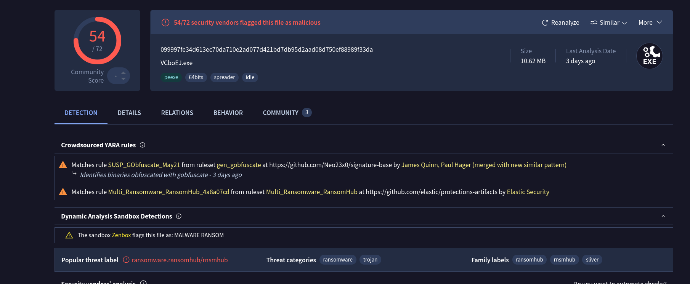
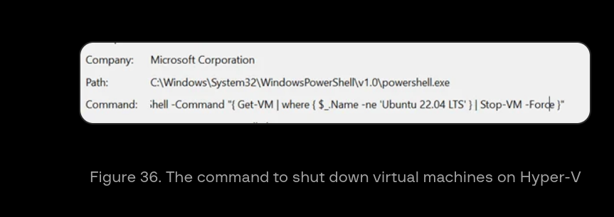
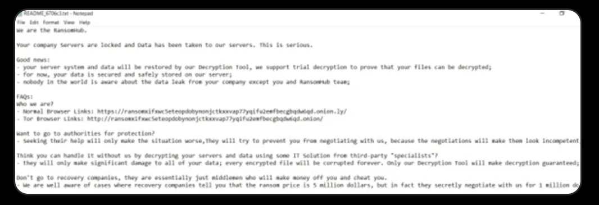

## Scenario

The incident response team was tasked by Wowza Unlimited's parent company to investigate a ransomware attack. A hash of the responsible sample was provided. The goal is to identify the ransomware group, its capabilities, infrastructure, and TTPs to assist leadership in deciding whether to pay the ransom or escalate to authorities.

**SHA256:** `099997fe34d613ec70da710e2ad077d421bd7db95d2aad08d750ef88989f33da`

---

## Attribution

Dropping the hash into VirusTotal immediately returns a family label of **ransomhub**, confirmed across 54/72 vendor detections with tags including `spreader` and the YARA rule `Multi_Ransomware_RansomHub`.

---

## Group Profile

**RansomHub** is a Ransomware-as-a-Service (RaaS) group that emerged in early 2024. According to CISA advisory AA24-242A, RansomHub is formerly known as **Cyclops** and **Knight** — sharing significant code overlap, infrastructure, and features with the Knight ransomware, whose source code was sold on criminal forums in February 2024 before RansomHub's launch.
[Group-IB — RansomHub RaaS](https://www.group-ib.com/blog/ransomhub-raas/#establishment)

### Affiliate Program

RansomHub announced its affiliate program on **2024-02-02**, posting on the RAMP dark-web forum under the handle **koley**. The post outlined a 90/10 split model — affiliates receive 90% of ransom payments — and provided contact details for prospective members via the encrypted messenger **qTox**:

**qTox ID:** `4D598799696AD5399FABF7D40C4D1BE9F05D74CFB311047D7391AC0BF64BED47B56EEE66A528`
[welivesecurity](https://www.welivesecurity.com/en/eset-research/shifting-sands-ransomhub-edrkillshifter/)

### Affiliate Rules — Prohibited Targets

Affiliates are explicitly prohibited from attacking organizations in the following regions:

**CIS, Cuba, North Korea, China**
[Trend Micro — RansomHub Ransomware Spotlight](https://www.trendmicro.com/vinfo/us/security/news/ransomware-spotlight/ransomware-spotlight-ransomhub)

---

## Exploitation — Initial Access

### CVE-2024-3400 (Palo Alto PAN-OS)

RansomHub affiliates have a documented history of exploiting **CVE-2024-3400**, a critical command injection vulnerability in Palo Alto Networks PAN-OS GlobalProtect that resurfaced in 2024. A PoC script used in exploitation was identified on GitHub:
[CVE-2024-3400 PoC — GitHub](https://github.com/pwnj0hn/CVE-2024-3400/blob/main/main.py)

**PoC SHA-256:** `53473d4ce45ba3250281d83480db7dad65e2330e080b79bd0d93b21d024f912b`

### CVE-2020-1472 — ZeroLogon

RansomHub affiliates have also exploited **CVE-2020-1472** (ZeroLogon), a critical Active Directory vulnerability that allows an unauthenticated attacker to gain domain access by impersonating any computer account — including the domain controller itself.
[Halcyon — RansomHub AD Exploitation](https://www.halcyon.ai/blog/ransomhub-targets-patchable-bugs-in-microsoft-active-directory-and-netlogon)

---

## Threat Actor — QuadSwitcher

According to ESET Research, the threat actor **QuadSwitcher** was responsible for compromising a North American governmental institution in August 2024. QuadSwitcher was identified through tracking of RansomHub's custom EDR killer tool, EDRKillShifter, which was used across attacks attributed to RansomHub, Play, Medusa, and BianLian.

During the government compromise, QuadSwitcher deployed **AnyDesk** for remote access using a PowerShell installation script (`anydes.ps1`) sourced from the Conti leaks, setting the AnyDesk password to:
[Conti Leaks — AnyDesk Script](https://github.com/ForbiddenProgrammer/conti-pentester-guide-leak/blob/main/MANUALS/%D0%97%D0%B0%D0%BA%D1%80%D0%B5%D0%BF%20AnyDesk.txt)

**`J9kzQ2Y0qO`**

---

## Ransomware Technical Analysis

### Execution

RansomHub's encryptor requires a passphrase to be supplied at runtime via the `-pass` command-line flag. This passphrase decrypts the embedded configuration file containing C2 details, exclusion lists, and target parameters. If an incorrect passphrase is provided, the malware terminates and prints the following to the console:

**`bad config`**
[Group-IB — RansomHub RaaS](https://www.group-ib.com/blog/ransomhub-raas/#establishment)
### EDR Evasion — EDRKillShifter

RansomHub provides affiliates with a custom EDR killer tool called **EDRKillShifter**. This loader uses a Bring Your Own Vulnerable Driver (BYOVD) technique to escalate privileges and terminate EDR/AV processes. Execution requires a 64-character password; the loader decrypts an embedded BIN resource which unpacks and executes the final payload written in **Go (Golang)**, obfuscated using gobfuscate.
[Trend Micro — How RansomHub Uses EDRKillShifter](https://www.trendmicro.com/en_us/research/24/i/how-ransomhub-ransomware-uses-edrkillshifter-to-disable-edr-and-.html)

### Virtual Machine Termination

Before encryption, RansomHub executes a PowerShell command to enumerate and forcefully stop any running virtual machines:

```
Get-VM | Stop-VM -Force
```

### Log Clearing

RansomHub clears **3** Windows event logs to destroy forensic evidence:

```
cmd.exe /c wevtutil cl security
cmd.exe /c wevtutil cl system
cmd.exe /c wevtutil cl application
```

### Encryption

Files encrypted by RansomHub consistently exhibit the last four bytes: **`0x00ABCDEF`**

### Ransom Note

The first line of the ransom note reads:

**`We are the RansomHub.`**

---

## Data Leak Site

RansomHub operates a TOR-based Data Leak Site (DLS) where victim data is published if ransom demands are not met:

**DLS:** `http://ransomxifxwc5eteopdobynonjctkxxvap77yqifu2emfbecgbqdw6qd.onion/`

## IOCs 

| Type                       | Value                                                                          |
| -------------------------- | ------------------------------------------------------------------------------ |
| SHA256 (sample)            | 099997fe34d613ec70da710e2ad077d421bd7db95d2aad08d750ef88989f33da               |
| SHA256 (CVE-2024-3400 PoC) | `53473d4ce45ba3250281d83480db7dad65e2330e080b79bd0d93b21d024f912b`             |
| qTox ID                    | `4D598799696AD5399FABF7D40C4D1BE9F05D74CFB311047D7391AC0BF64BED47B56EEE66A528` |
| DLS                        | `ransomxifxwc5eteopdobynonjctkxxvap77yqifu2emfbecgbqdw6qd[.]onion`             |
| Encrypted file magic bytes | `0x00ABCDEF`                                                                   |

---

## MITRE ATT&CK

|Technique|ID|
|---|---|
|Exploit Public-Facing Application (PAN-OS)|T1190|
|Exploit Public-Facing Application (ZeroLogon)|T1190|
|Remote Access Software (AnyDesk)|T1219|
|OS Credential Dumping|T1003|
|Inhibit System Recovery|T1490|
|Clear Windows Event Logs|T1070.001|
|Impair Defenses: Disable or Modify Tools (EDRKillShifter)|T1562.001|
|Data Encrypted for Impact|T1486|
|Exfiltration to Cloud Storage|T1537|

---

## References

- [Group-IB — RansomHub RaaS](https://www.group-ib.com/blog/ransomhub-raas/#establishment)
- [CISA Advisory AA24-242A — RansomHub](https://www.cisa.gov/news-events/cybersecurity-advisories/aa24-242a)
- [ESET — Shifting the Sands of RansomHub's EDRKillShifter](https://www.welivesecurity.com/en/eset-research/shifting-sands-ransomhub-edrkillshifter/)
- [Trend Micro — RansomHub Ransomware Spotlight](https://www.trendmicro.com/vinfo/us/security/news/ransomware-spotlight/ransomware-spotlight-ransomhub)
- [Trend Micro — How RansomHub Uses EDRKillShifter](https://www.trendmicro.com/en_us/research/24/i/how-ransomhub-ransomware-uses-edrkillshifter-to-disable-edr-and-.html)
- [Halcyon — RansomHub AD Exploitation](https://www.halcyon.ai/blog/ransomhub-targets-patchable-bugs-in-microsoft-active-directory-and-netlogon)
- [CVE-2024-3400 PoC — GitHub](https://github.com/pwnj0hn/CVE-2024-3400/blob/main/main.py)
- [Conti Leaks — AnyDesk Script](https://github.com/ForbiddenProgrammer/conti-pentester-guide-leak/blob/main/MANUALS/%D0%97%D0%B0%D0%BA%D1%80%D0%B5%D0%BF%20AnyDesk.txt)

---








































