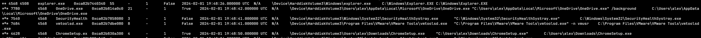
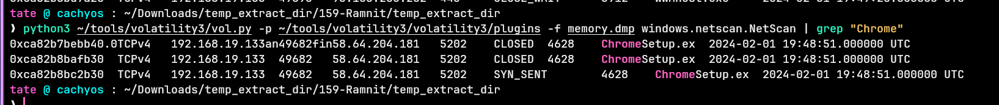
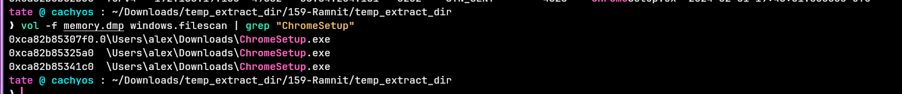
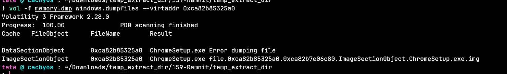
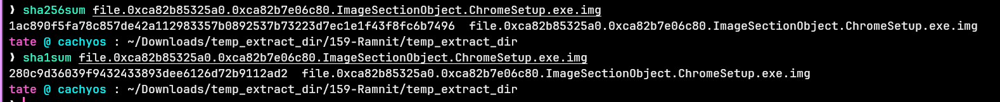
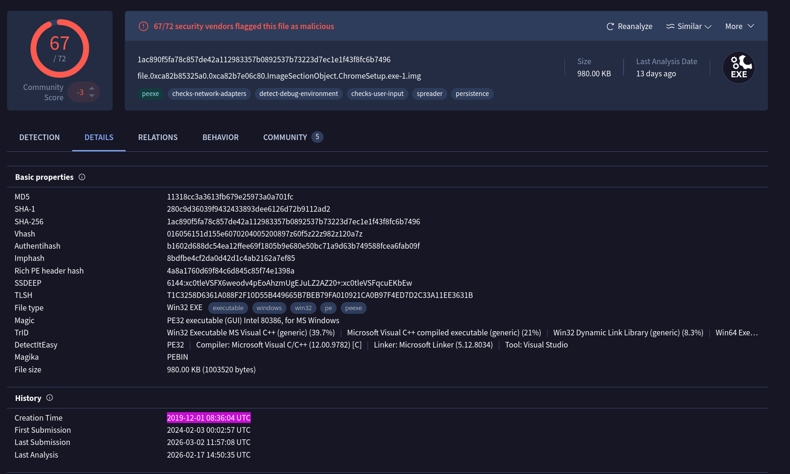
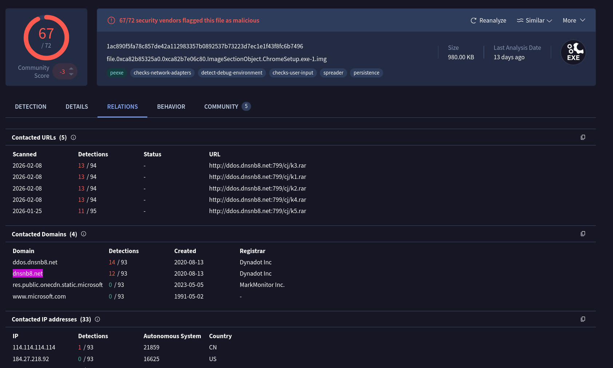

# Ramnit – Memory Forensics Investigation
## Scenario

An intrusion detection system alerted on suspicious behavior on a workstation indicating a likely malware intrusion. A memory dump was captured for analysis. The objective was to identify the malicious process, trace network activity, and extract file artifacts.

---
## Tooling

- Volatility 3 Framework 2.28.0 
- VirusTotal 
- SHA1sum / SHA256sum
---
## Investigation Findings
### 1. Process Analysis
Initial triage using process tree and scan plugins revealed a suspicious process: 
```
vol -f memory.dmp windows.pstree 
vol -f memory.dmp windows.psscan 
vol -f memory.dmp windows.cmdline
```

A process named `ChromeSetup.exe` was identified running from an unusual path: `C:\Users\alex\Downloads\ChromeSetup.exe` Legitimate Chrome installers do not persist as running processes from the Downloads folder. This immediately flagged as suspicious.




---
### 2. Network Connections
```bash
vol -f memory.dmp windows.netscan.NetScan
```
Network scan revealed active and closed connections associated with `ChromeSetup.exe` (PID 4628):


Geolocation of `58.64.204.181` resolves to **Hong Kong**. This is consistent with Ramnit C2 infrastructure.

---
### 3. File Extraction and Hashing
Located the malicious file in memory using filescan:
```bash
vol -f memory.dmp windows.filescan | grep "ChromeSetup"
```
Extracted the file using the virtual address:
```bash
vol -f memory.dmp windows.dumpfiles --virtaddr 0xca82b85325a0
```



Generated hashes for VirusTotal submission:
```bash
sha256sum file.0xca82b85325a0.0xca82b7e06c80.ImageSectionObject.ChromeSetup.exe.img
sha1sum file.0xca82b85325a0.0xca82b7e06c80.ImageSectionObject.ChromeSetup.exe.img
```


VirusTotal results: **67/72 vendors flagged as malicious**
Compilation timestamp from VirusTotal Details: **2019-12-01 08:36:04 UTC** — indicating the malware predates the infection significantly, suggesting it is a known persistent threat.


---
### 4. C2 Infrastructure
VirusTotal Relations tab revealed the C2 domain:
**dnsnb8[.]net**
Contacted URLs followed the pattern: `http://ddos.dnsnb8.net:799/cj/k[1-5].rar` This is consistent with Ramnit's known behaviour of downloading additional payloads via RAR archives.


---

## IOCs 


| Type   | Value                                                            |
| ------ | ---------------------------------------------------------------- |
| File   | ChromeSetup.exe                                                  |
| IP     | 58.64.204.181                                                    |
| C2     | dnsnb8[.]net                                                     |
| SHA1   | 280c9d36039f9432433893dee6126d72b9112ad2                         |
| Path   | C:\Users\alex\Downloads\ChromeSetup.exe                          |
| SHA256 | 1ac890f5fa78c857de42a112983357b0892537b73223d7ec1e1f43f8fc6b7496 |
| MD5    | 11318cc3a3613fb679e25973a0a701fc                                 |

## Conclusion 

> Ramnit malware was deployed on the workstation disguised as a Chrome installer. Memory forensics confirmed active C2 communication to Hong Kong infrastructure and identified staged payload delivery via dnsnb8[.]net.
















I successfully completed Ramnit Blue Team Lab at @CyberDefenders!
https://cyberdefenders.org/blueteam-ctf-challenges/achievements/inksec/ramnit/
 
#CyberDefenders #CyberSecurity #BlueYard #BlueTeam #InfoSec #SOC #SOCAnalyst #DFIR #CCD #CyberDefender
