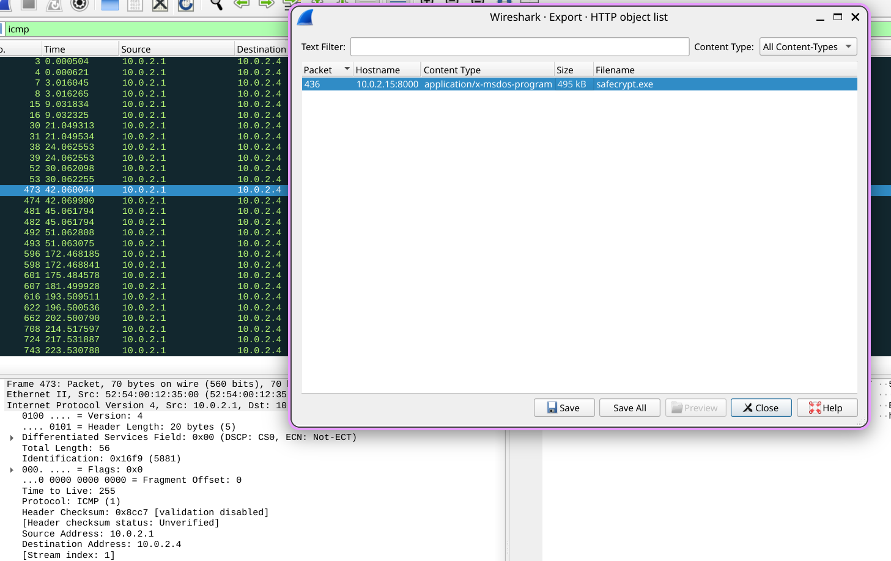
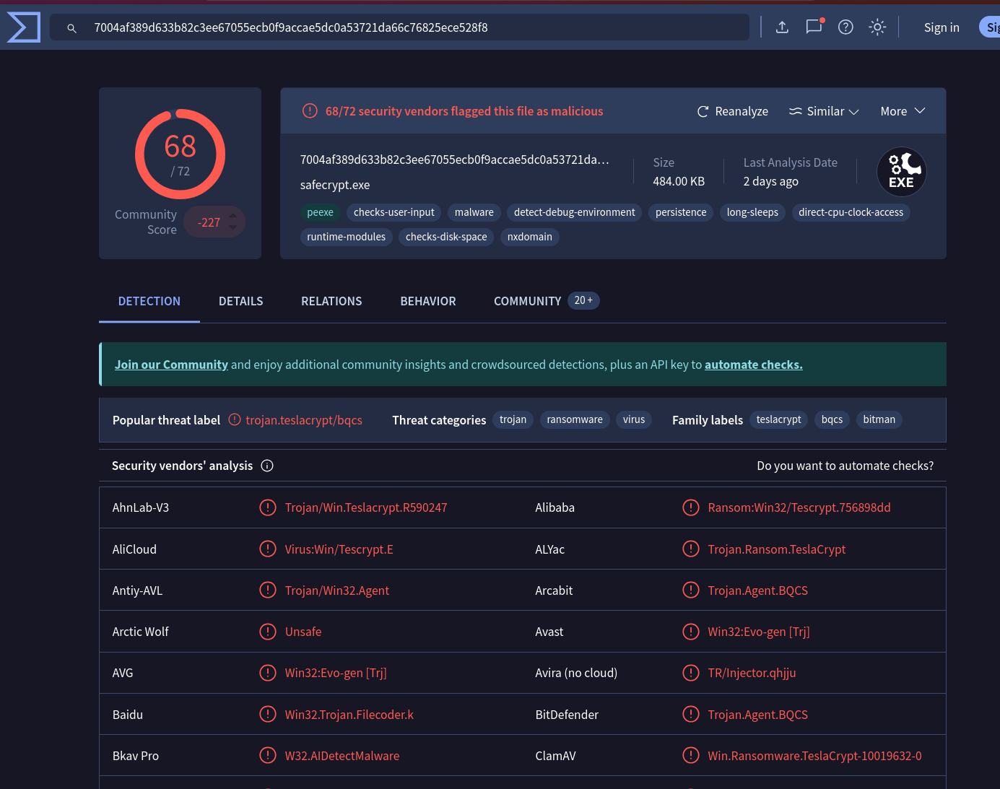
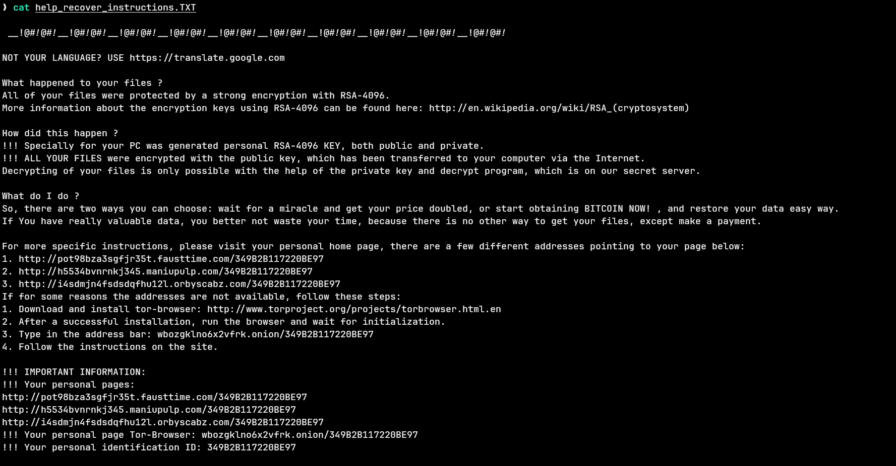
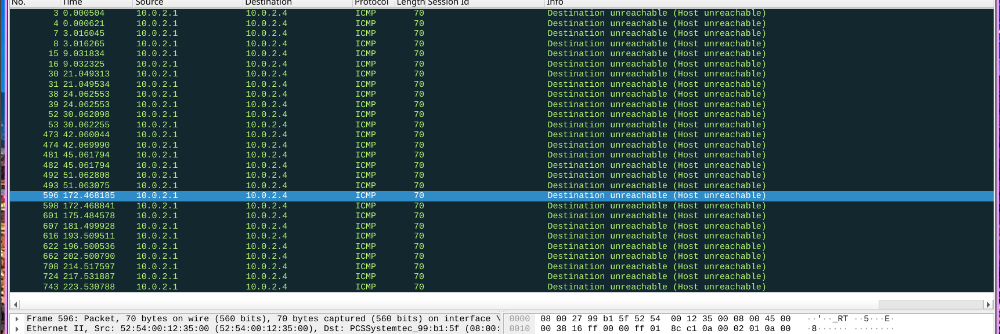
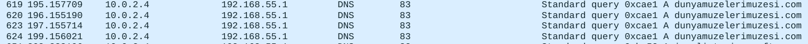
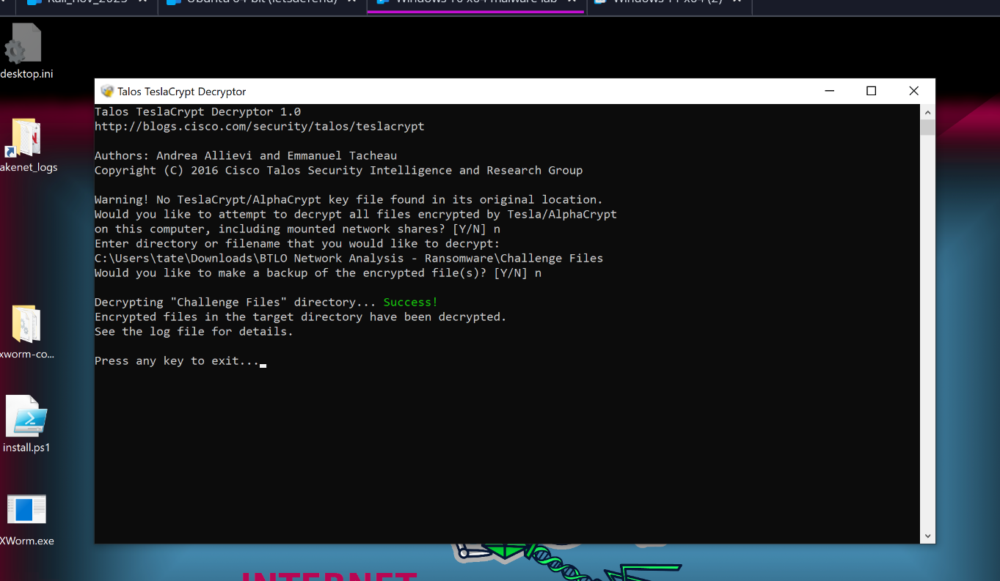
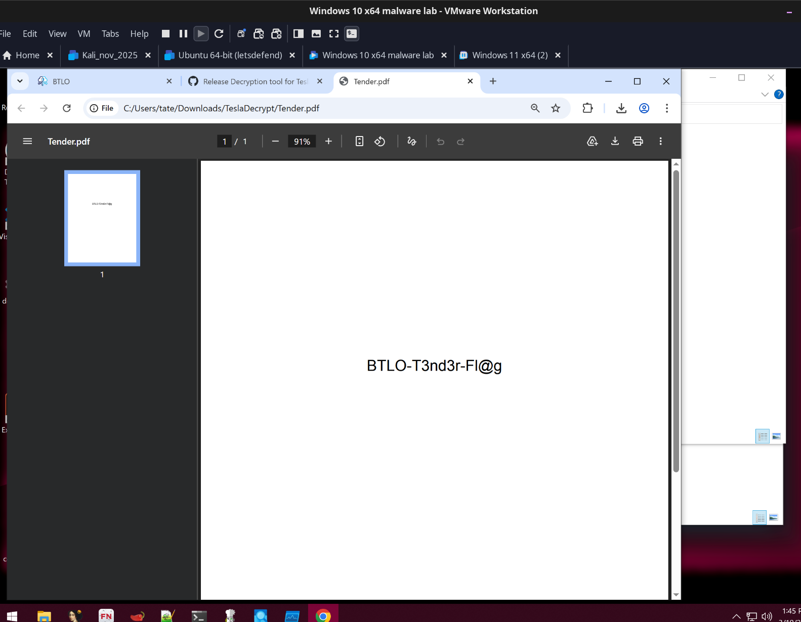

## Overview

ABC Industries had a critical tender document encrypted by ransomware believed to be deployed by a competitor. The challenge provides the network capture, ransom note, and the encrypted file. The task is to identify the ransomware family, analyse the traffic, and decrypt the document.

---

## Investigation

### Identifying the Download

Filtering the PCAP for outbound HTTP traffic from the victim machine immediately surfaces the infection vector:

```
ip.src == 10.0.2.4 && http
```

The victim at `10[.]0[.]2[.]4` pulled down an executable from an attacker-controlled HTTP server at `10[.]0[.]2[.]15:8000`:

`hxxp[://]10[.]0[.]2[.]15:8000/safecrypt.exe`

The file was exported via Wireshark's HTTP object export and hashed for identification:


```zsh
md5sum safecrypt.exe
# 4a1d88603b1007825a9c6b36d1e5de44
```


### Ransomware Identification

Submitting the hash to VirusTotal confirms the family — **TeslaCrypt**.


The ransom note dropped on the system claims RSA-4096 encryption and directs the victim to Tor-based payment pages with a personal ID of `349B2B117220BE97`. This is standard TeslaCrypt social engineering — the RSA-4096 claim is misleading, as TeslaCrypt actually uses elliptic curve cryptography.


### C2 Traffic

DNS queries in the PCAP reveal the ransomware attempting to contact its C2 infrastructure. The standout domain is `dunyamuzelerimuzesi[.]com`, queried repeatedly after execution. All outbound TCP connections to port 443 received ICMP Host Unreachable responses — the sandbox had no internet access, so the key was never successfully exfiltrated.




### Decryption

Despite the C2 being unreachable, decryption is still possible. In May 2016, the TeslaCrypt operators voluntarily shut down their operation and publicly released their master private key — one of the only times a ransomware group has done this. Cisco Talos built a decryptor incorporating that key.

The **Talos TeslaCrypt Decryptor** was run against the challenge directory containing `Tender.pdf.micro`:

Tool: [https://github.com/Cisco-Talos/TeslaDecrypt/releases/tag/1.0](https://github.com/Cisco-Talos/TeslaDecrypt/releases/tag/1.0)


The decryptor successfully recovered the tender document, revealing the flag inside.


---

## IOCs

|Type|Value|
|---|---|
|IP — Victim|`10[.]0[.]2[.]4`|
|IP — Attacker HTTP server|`10[.]0[.]2[.]15`|
|Ransomware download URL|`hxxp[://]10[.]0[.]2[.]15:8000/safecrypt[.]exe`|
|Ransomware MD5|`4a1d88603b1007825a9c6b36d1e5de44`|
|Ransomware family|TeslaCrypt|
|C2 domain|`dunyamuzelerimuzesi[.]com`|
|Victim ID|`349B2B117220BE97`|
|Encrypted file|`Tender.pdf.micro`|

---
## IOCs 

| Type | Value |
| ---- | ----- |
|      |       |


<div class="qa-item"> <div class="qa-question-text">What is the operating system of the host from which the network traffic was captured? (Look at Capture File Properties, copy the details exactly)</div> <div class="flag-reveal"> <input type="checkbox"> <span class="r-placeholder">Click flag to reveal</span> <span class="r-answer">32-bit Windows 7 Service Pack 1, build 7601</span> <button class="copy-btn" onclick="event.stopPropagation();navigator.clipboard.writeText(this.previousElementSibling.textContent);this.textContent='copied';setTimeout(()=>this.textContent='copy',1500)">copy</button> </div> </div>

<div class="qa-item"> <div class="qa-question-text">What is the full URL from which the ransomware executable was downloaded?</div> <div class="answer-reveal"> <input type="checkbox"> <span class="r-placeholder">Click to reveal answer</span> <span class="r-answer">http://10.0.2.15:8000/safecrypt.exe</span> <button class="copy-btn" onclick="event.stopPropagation();navigator.clipboard.writeText(this.previousElementSibling.textContent);this.textContent='copied';setTimeout(()=>this.textContent='copy',1500)">copy</button> </div> </div>

<div class="qa-item"> <div class="qa-question-text">Name the ransomware executable file?</div> <div class="flag-reveal"> <input type="checkbox"> <span class="r-placeholder">Click flag to reveal</span> <span class="r-answer">safecrypt.exe</span> <button class="copy-btn" onclick="event.stopPropagation();navigator.clipboard.writeText(this.previousElementSibling.textContent);this.textContent='copied';setTimeout(()=>this.textContent='copy',1500)">copy</button> </div> </div>

<div class="qa-item"> <div class="qa-question-text">What is the MD5 hash of the ransomware?</div> <div class="answer-reveal"> <input type="checkbox"> <span class="r-placeholder">Click to reveal answer</span> <span class="r-answer">4a1d88603b1007825a9c6b36d1e5de44</span> <button class="copy-btn" onclick="event.stopPropagation();navigator.clipboard.writeText(this.previousElementSibling.textContent);this.textContent='copied';setTimeout(()=>this.textContent='copy',1500)">copy</button> </div> </div>

<div class="qa-item"> <div class="qa-question-text">What is the name of the ransomware?</div> <div class="flag-reveal"> <input type="checkbox"> <span class="r-placeholder">Click flag to reveal</span> <span class="r-answer">teslacrypt</span> <button class="copy-btn" onclick="event.stopPropagation();navigator.clipboard.writeText(this.previousElementSibling.textContent);this.textContent='copied';setTimeout(()=>this.textContent='copy',1500)">copy</button> </div> </div>

<div class="qa-item"> <div class="qa-question-text">What is the encryption algorithm used by the ransomware, according to the ransom note?</div> <div class="answer-reveal"> <input type="checkbox"> <span class="r-placeholder">Click to reveal answer</span> <span class="r-answer">RSA-4096</span> <button class="copy-btn" onclick="event.stopPropagation();navigator.clipboard.writeText(this.previousElementSibling.textContent);this.textContent='copied';setTimeout(()=>this.textContent='copy',1500)">copy</button> </div> </div>

<div class="qa-item"> <div class="qa-question-text">What is the domain beginning with ‘d’ that is related to ransomware traffic?</div> <div class="flag-reveal"> <input type="checkbox"> <span class="r-placeholder">Click flag to reveal</span> <span class="r-answer">dunyamuzelerimuzesi.com</span> <button class="copy-btn" onclick="event.stopPropagation();navigator.clipboard.writeText(this.previousElementSibling.textContent);this.textContent='copied';setTimeout(()=>this.textContent='copy',1500)">copy</button> </div> </div>

<div class="qa-item"> <div class="qa-question-text">Decrypt the Tender document and submit the flag</div> <div class="answer-reveal"> <input type="checkbox"> <span class="r-placeholder">Click to reveal answer</span> <span class="r-answer">BTLO-T3nd3r-Fl@g</span> <button class="copy-btn" onclick="event.stopPropagation();navigator.clipboard.writeText(this.previousElementSibling.textContent);this.textContent='copied';setTimeout(()=>this.textContent='copy',1500)">copy</button> </div> </div>
