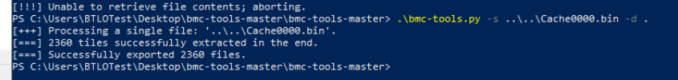
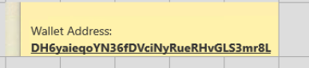
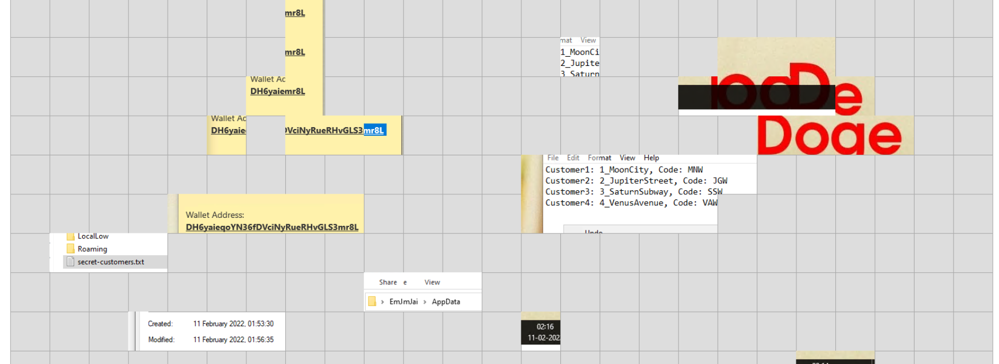
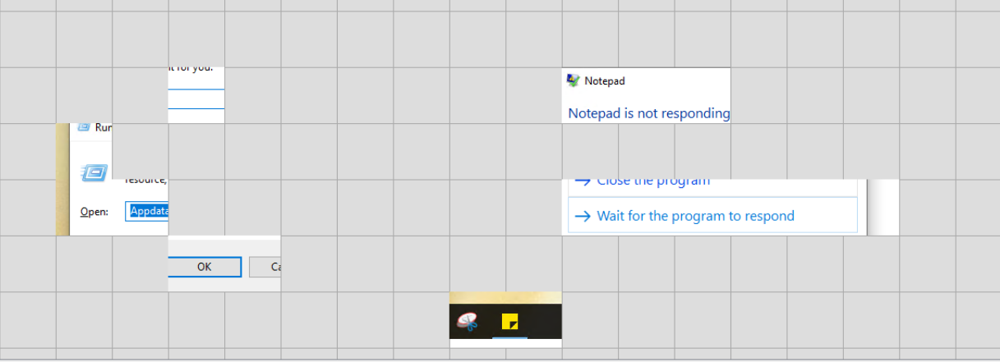

## Scenario

An interplanetary illegal dealer was using a remote machine to store all his trade secrets. Intelligence identified the dealer was from Earth — maintaining a clean local machine and storing sensitive data on a remote machine accessed via RDP. The remote machine was destroyed. The only source of evidence is the forensic disk image of the clean machine. Recover the dealer's trade secrets including their crypto wallet address and customer details.

---

## Methodology

### Triage — FTK Imager

Loading the provided `.ad1` image in FTK Imager and navigating the file tree to `Users\` reveals the local machine username:

```
C:\Users\spiderman\Desktop\RDPCache.ad1
```

The RDP cache files are located at:

```
[root]\Users\spiderman\AppData\Local\Microsoft\Terminal Server Client\Cache\
```

Three files are exported to the desktop for analysis:

```
bcache24.bmc
Cache0000.bin
Cache0000.bin.fileslack
```

The MD5 and SHA1 hashes of the custom content source are recorded:

```
MD5:  2c85d7389e6a7fe1b8cd9739cca4bd36
SHA1: 791ce08116abd3f52316e87c263ec8bbc9ea3295
```

### Tile Extraction — bmc-tools

RDP bitmap cache stores session data as 64×64 pixel tiles rather than full screenshots. `bmc-tools` extracts these tiles as individual PNG files:


```powershell
.\bmc-tools.py -s ..\..\Cache0000.bin -d .
```

```
[+++] Processing a single file: '..\..\Cache0000.bin'.
[===] 2360 tiles successfully extracted in the end.
[===] Successfully exported 2360 files.
````

The `bcache24.bmc` file returned an error indicating empty or corrupt content — all usable data comes from `Cache0000.bin`.

### Reconstruction — RdpCacheStitcher

RdpCacheStitcher imports the 2360 extracted tiles and provides a canvas for manual reconstruction. The Autoplace function did not produce a result, requiring manual tile placement. Scrolling through the tile store and dragging fragments onto the canvas surfaces the following artefacts:

The wallet address tile is immediately identifiable — a yellow notepad background with the address string. Continuing reconstruction recovers a Notepad window containing the full customer code list, a file explorer path revealing the remote username, taskbar fragments showing the date and pinned applications, and a Windows Run dialog with the entered string.

The large red Dogecoin logo is visible across multiple adjacent tiles — the "Color Red" hint in the question directly identifies the cryptocurrency.

A "Notepad is not responding" error dialog and a Windows Run box with `appdata` entered are recovered from separate tile clusters. The yellow Sticky Notes icon is visible in the reconstructed taskbar fragment.

---

## Attack Summary

|Phase|Action|
|---|---|
|Remote Access|Dealer used RDP to access remote machine storing trade secrets|
|Data Storage|Sensitive data stored in `secret-customers.txt` on remote machine|
|Evidence Recovery|RDP bitmap cache on local machine retained tile fragments of remote sessions|
|Credential Discovery|Remote username `EmJmJai` recovered from AppData path in cache tiles|
|Data Exfiltration|Wallet address and customer codes reconstructed from cache fragments|

## IOCs

|Type|Value|
|---|---|
|Local Username|spiderman|
|Remote Username|EmJmJai|
|Crypto Wallet|DH6yaieqoYN36fDVciNyRueRHvGLS3mr8L|
|Cryptocurrency|Dogecoin|
|File|secret-customers.txt|
|Customer Codes|MNW, JGW, SSW, VAW|

## MITRE ATT&CK

|Technique|ID|Description|
|---|---|---|
|Remote Desktop Protocol|T1021.001|Dealer accessed remote machine storing trade secrets via RDP|
|Data from Local System|T1005|RDP bitmap cache on local disk retained fragments of remote session content|

## Defender Takeaways

**RDP cache as a forensic artefact** — The Windows RDP bitmap cache (`Cache0000.bin`, `bcache24.bmc`) persists tile fragments of every remote desktop session on the local machine. Even after the remote machine is destroyed, an investigator with access to the local client machine can partially reconstruct what was visible during RDP sessions. Organisations should be aware that sensitive data displayed during remote sessions leaves traces on the initiating endpoint.

**RdpCacheStitcher and bmc-tools for IR** — The combination of `bmc-tools` for tile extraction and `RdpCacheStitcher` for visual reconstruction is a practical DFIR technique for RDP session recovery. Even partial reconstruction — as demonstrated here — is sufficient to recover credential material, file contents, and application activity without access to the remote machine.

**Sensitive data handling over RDP** — Displaying plaintext credentials, wallet addresses, and customer PII in Notepad over an RDP session creates a persistent forensic record on the client endpoint. Clipboard monitoring, session recording, and cache clearing policies should be enforced on machines used for privileged remote access.

**Lateral movement detection** — RDP connections to internal or external machines from endpoints that have no business need for remote desktop access are a strong lateral movement indicator. Event ID 4624 (logon type 10) and network connections on port 3389 should be monitored and alerted on in any SOC environment.


---

<div class="qa-item"> <div class="qa-question-text">Submit the USERNAME of the dealer&#039;s machine from which the forensic disk image was created (Format: username)</div> <div class="flag-reveal"> <input type="checkbox"> <span class="r-placeholder">Click flag to reveal</span> <span class="r-answer">spiderman</span> <button class="copy-btn" onclick="event.stopPropagation();navigator.clipboard.writeText(this.previousElementSibling.textContent);this.textContent='copied';setTimeout(()=>this.textContent='copy',1500)">copy</button> </div> </div>

<div class="qa-item"> <div class="qa-question-text">Submit the USERNAME of the remoteuser (Format: username)</div> <div class="answer-reveal"> <input type="checkbox"> <span class="r-placeholder">Click to reveal answer</span> <span class="r-answer">EMJAI</span> <button class="copy-btn" onclick="event.stopPropagation();navigator.clipboard.writeText(this.previousElementSibling.textContent);this.textContent='copied';setTimeout(()=>this.textContent='copy',1500)">copy</button> </div> </div>

<div class="qa-item"> <div class="qa-question-text">Submit Wallet Address (Format: Address String)</div> <div class="flag-reveal"> <input type="checkbox"> <span class="r-placeholder">Click flag to reveal</span> <span class="r-answer">DH6yaieqoYN36fDVciNyRueRHvGLS3mr8L</span> <button class="copy-btn" onclick="event.stopPropagation();navigator.clipboard.writeText(this.previousElementSibling.textContent);this.textContent='copied';setTimeout(()=>this.textContent='copy',1500)">copy</button> </div> </div>

<div class="qa-item"> <div class="qa-question-text">Submit the name of the cryptocurrency observed in the cache [Hint: Color Red] (Format: Cryptocurrency Name)</div> <div class="answer-reveal"> <input type="checkbox"> <span class="r-placeholder">Click to reveal answer</span> <span class="r-answer">Dogecoin</span> <button class="copy-btn" onclick="event.stopPropagation();navigator.clipboard.writeText(this.previousElementSibling.textContent);this.textContent='copied';setTimeout(()=>this.textContent='copy',1500)">copy</button> </div> </div>

<div class="qa-item"> <div class="qa-question-text">Submit the Date observed on the taskbar of the remote machine (Format: DD-MM-YYYY)</div> <div class="flag-reveal"> <input type="checkbox"> <span class="r-placeholder">Click flag to reveal</span> <span class="r-answer">11-02-2022</span> <button class="copy-btn" onclick="event.stopPropagation();navigator.clipboard.writeText(this.previousElementSibling.textContent);this.textContent='copied';setTimeout(()=>this.textContent='copy',1500)">copy</button> </div> </div>

<div class="qa-item"> <div class="qa-question-text">Submit the names of the two browsers that have shortcut icons on the Desktop (Format: name one, name two)</div> <div class="answer-reveal"> <input type="checkbox"> <span class="r-placeholder">Click to reveal answer</span> <span class="r-answer">google chrome, microsoft edge</span> <button class="copy-btn" onclick="event.stopPropagation();navigator.clipboard.writeText(this.previousElementSibling.textContent);this.textContent='copied';setTimeout(()=>this.textContent='copy',1500)">copy</button> </div> </div>

<div class="qa-item"> <div class="qa-question-text">Submit the name of the Note keeping tool observed on the taskbar (Format: Name of Windows Tool Used to Take Notes)</div> <div class="flag-reveal"> <input type="checkbox"> <span class="r-placeholder">Click flag to reveal</span> <span class="r-answer">sticky notes</span> <button class="copy-btn" onclick="event.stopPropagation();navigator.clipboard.writeText(this.previousElementSibling.textContent);this.textContent='copied';setTimeout(()=>this.textContent='copy',1500)">copy</button> </div> </div>

<div class="qa-item"> <div class="qa-question-text">Submit the text string that was entered in the &quot;Run&quot; window (Format: String)</div> <div class="answer-reveal"> <input type="checkbox"> <span class="r-placeholder">Click to reveal answer</span> <span class="r-answer">appdata</span> <button class="copy-btn" onclick="event.stopPropagation();navigator.clipboard.writeText(this.previousElementSibling.textContent);this.textContent='copied';setTimeout(()=>this.textContent='copy',1500)">copy</button> </div> </div>

<div class="qa-item"> <div class="qa-question-text">Submit the name of the file which is edited remotely (Format: filename.extension)</div> <div class="flag-reveal"> <input type="checkbox"> <span class="r-placeholder">Click flag to reveal</span> <span class="r-answer">secret-customers.txt</span> <button class="copy-btn" onclick="event.stopPropagation();navigator.clipboard.writeText(this.previousElementSibling.textContent);this.textContent='copied';setTimeout(()=>this.textContent='copy',1500)">copy</button> </div> </div>

<div class="qa-item"> <div class="qa-question-text">Name of the application that presented a &quot;Not Responding&quot; error message (Format: Application Name)</div> <div class="answer-reveal"> <input type="checkbox"> <span class="r-placeholder">Click to reveal answer</span> <span class="r-answer">notepad</span> <button class="copy-btn" onclick="event.stopPropagation();navigator.clipboard.writeText(this.previousElementSibling.textContent);this.textContent='copied';setTimeout(()=>this.textContent='copy',1500)">copy</button> </div> </div>

<div class="qa-item"> <div class="qa-question-text">Submit the Codes of Customer1,Customer2, Customer3, Customer4 (Format: Code1, Code2, Code3, Code4)</div> <div class="flag-reveal"> <input type="checkbox"> <span class="r-placeholder">Click flag to reveal</span> <span class="r-answer">MNW, JGW, SSW, VAW</span> <button class="copy-btn" onclick="event.stopPropagation();navigator.clipboard.writeText(this.previousElementSibling.textContent);this.textContent='copied';setTimeout(()=>this.textContent='copy',1500)">copy</button> </div> </div>
