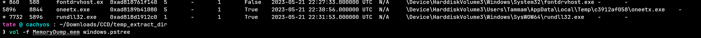
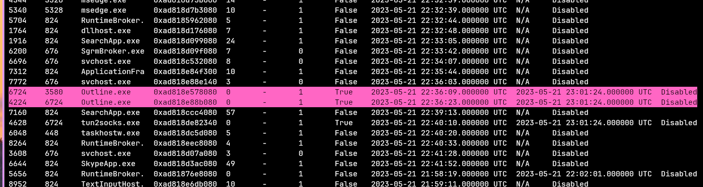
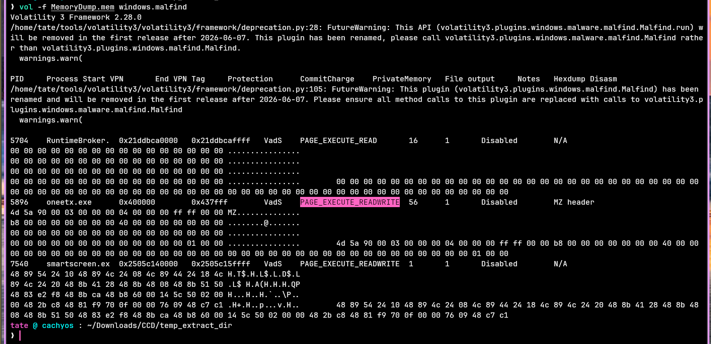
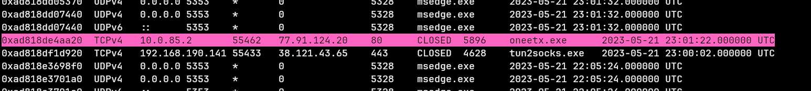
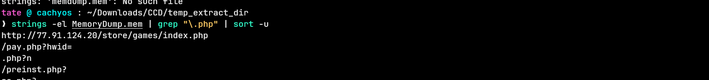
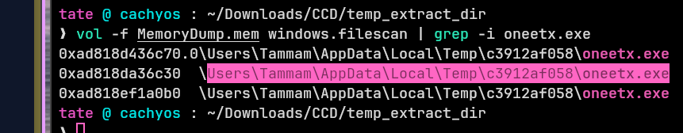

## Overview

Memory forensics investigation into a compromised Windows host. The attacker deployed **Redline Stealer** — a credential harvesting malware — and used a VPN process (`Outline.exe`) to tunnel C2 traffic and bypass the Network Intrusion Detection System. Investigation performed entirely with Volatility 3 and strings.

---

## Process Analysis

Starting with a process tree to identify anything anomalous in the parent/child relationships.

```bash
vol -f MemoryDump.mem windows.pstree
```


`oneetx.exe` immediately stands out — an unknown process with `rundll32.exe` as a child. Legitimate software rarely spawns `rundll32` as a child without a good reason. This is a classic injection setup.

```bash
vol -f MemoryDump.mem windows.pslist
```


Full process list confirms `oneetx.exe` running from a temp path. No parent legitimacy.

---

## Memory Protection — Injection Indicator

`windows.malfind` scans for memory regions with suspicious protection flags — specifically `PAGE_EXECUTE_READWRITE`, which allows a region to be written to and executed, a hallmark of process injection.

```bash
vol -f MemoryDump.mem windows.malfind
```


`oneetx.exe` flagged with **PAGE_EXECUTE_READWRITE** — confirms shellcode or injected code living in memory. The child `rundll32.exe` is the likely execution vehicle post-injection.

**MITRE: T1055 — Process Injection**

---

## Network Connections — VPN NIDS Bypass

```bash
vol -f MemoryDump.mem windows.netscan
```


`Outline.exe` is present with an active connection. Outline is a legitimate VPN client — the attacker used it to tunnel C2 traffic, making it appear as encrypted VPN traffic to the NIDS rather than malware beaconing.

**MITRE: T1572 — Protocol Tunneling**

---

## C2 URL Extraction — strings

With the attacker's IP in hand from netscan (`77[.]91[.]124[.]20`), using strings to pull the full PHP endpoint from memory. Wide strings first — Redline is .NET and stores strings as UTF-16:

```bash
strings -el MemoryDump.mem | grep "\.php" | sort -u
```



Full C2 endpoint recovered:
```
hxxp[://]77[.]91[.]124[.]20/store/games/index[.]php
````

This is the Redline Stealer gate — the PHP endpoint that receives harvested credentials, browser data, and session tokens.

**MITRE: T1071.001 — Application Layer Protocol: Web Protocols**  
**MITRE: T1041 — Exfiltration Over C2 Channel**

---

## Malware Path — filescan

```bash
vol -f MemoryDump.mem windows.filescan | grep -i oneetx.exe
```



Full path on disk:
```
C:\Users\Tammam\AppData\Local\Temp\c3912af058\oneetx.exe
````

Dropped into `AppData\Local\Temp` under a randomised subdirectory — standard Redline delivery pattern, keeping it off obvious locations while remaining accessible for execution.

**MITRE: T1036.005 — Masquerading: Match Legitimate Name or Location**

---

## IOCs

|Type|Value|
|---|---|
|Malicious Process|oneetx.exe|
|Child Process|rundll32.exe|
|Attacker IP|77[.]91[.]124[.]20|
|C2 Endpoint|hxxp[://]77[.]91[.]124[.]20/store/games/index[.]php|
|Malware Path|C:\Users\Tammam\AppData\Local\Temp\c3912af058\oneetx[.]exe|
|VPN Bypass Process|Outline.exe|

---

## MITRE ATT&CK

|Technique|ID|Notes|
|---|---|---|
|Process Injection|T1055|PAGE_EXECUTE_READWRITE region in oneetx.exe|
|Masquerading|T1036.005|rundll32.exe as injection vehicle|
|Protocol Tunneling|T1572|Outline VPN to bypass NIDS|
|Application Layer Protocol|T1071.001|C2 over HTTP to PHP gate|
|Exfiltration Over C2|T1041|Credentials sent to index.php endpoint|
|Credentials from Web Browsers|T1555.003|Redline stealer primary capability|
|Ingress Tool Transfer|T1105|Malware dropped to Temp directory|

---

## Lessons Learned

- **strings -el is essential for .NET malware** — UTF-16 wide strings won't appear in a standard `strings` run, Redline's C2 URL was only visible with the `-el` flag
- **Outline.exe as NIDS bypass** — legitimate VPN software as a proxy for C2 is an effective evasion technique; netscan attribution requires correlating the VPN process back to the malware process timeline rather than looking for direct C2 connections
- **PAGE_EXECUTE_READWRITE = injection** — any malfind hit with this flag warrants immediate follow-up; it's not definitive proof but is a strong signal worth pursuing in every memory investigation

---

<div class="qa-item"> <div class="qa-question-text">What is the name of the suspicious process?</div> <div class="flag-reveal"> <input type="checkbox"> <span class="r-placeholder">Click flag to reveal</span> <span class="r-answer">oneetx.exe</span> <button class="copy-btn" onclick="event.stopPropagation();navigator.clipboard.writeText(this.previousElementSibling.textContent);this.textContent='copied';setTimeout(()=>this.textContent='copy',1500)">copy</button> </div> </div>

<div class="qa-item"> <div class="qa-question-text">What is the child process name of the suspicious process?</div> <div class="answer-reveal"> <input type="checkbox"> <span class="r-placeholder">Click to reveal answer</span> <span class="r-answer">rundll32.exe</span> <button class="copy-btn" onclick="event.stopPropagation();navigator.clipboard.writeText(this.previousElementSibling.textContent);this.textContent='copied';setTimeout(()=>this.textContent='copy',1500)">copy</button> </div> </div>

<div class="qa-item"> <div class="qa-question-text">What is the memory protection applied to the suspicious process memory region?</div> <div class="flag-reveal"> <input type="checkbox"> <span class="r-placeholder">Click flag to reveal</span> <span class="r-answer">PAGE_EXECUTE_READWRITE	</span> <button class="copy-btn" onclick="event.stopPropagation();navigator.clipboard.writeText(this.previousElementSibling.textContent);this.textContent='copied';setTimeout(()=>this.textContent='copy',1500)">copy</button> </div> </div>

<div class="qa-item"> <div class="qa-question-text">What is the name of the process responsible for the VPN connection?</div> <div class="answer-reveal"> <input type="checkbox"> <span class="r-placeholder">Click to reveal answer</span> <span class="r-answer">Outline.exe</span> <button class="copy-btn" onclick="event.stopPropagation();navigator.clipboard.writeText(this.previousElementSibling.textContent);this.textContent='copied';setTimeout(()=>this.textContent='copy',1500)">copy</button> </div> </div>

<div class="qa-item"> <div class="qa-question-text">What is the attacker's IP address?</div> <div class="flag-reveal"> <input type="checkbox"> <span class="r-placeholder">Click flag to reveal</span> <span class="r-answer">77.91.124.20</span> <button class="copy-btn" onclick="event.stopPropagation();navigator.clipboard.writeText(this.previousElementSibling.textContent);this.textContent='copied';setTimeout(()=>this.textContent='copy',1500)">copy</button> </div> </div>

<div class="qa-item"> <div class="qa-question-text">What is the full URL of the PHP file that the attacker visited?</div> <div class="answer-reveal"> <input type="checkbox"> <span class="r-placeholder">Click to reveal answer</span> <span class="r-answer">http://77.91.124.20/store/games/index.php</span> <button class="copy-btn" onclick="event.stopPropagation();navigator.clipboard.writeText(this.previousElementSibling.textContent);this.textContent='copied';setTimeout(()=>this.textContent='copy',1500)">copy</button> </div> </div>

<div class="qa-item"> <div class="qa-question-text">What is the full path of the malicious executable?</div> <div class="flag-reveal"> <input type="checkbox"> <span class="r-placeholder">Click flag to reveal</span> <span class="r-answer">c:\Users\Tammam\AppData\Local\Temp\c3912af058\oneetx.exe</span> <button class="copy-btn" onclick="event.stopPropagation();navigator.clipboard.writeText(this.previousElementSibling.textContent);this.textContent='copied';setTimeout(()=>this.textContent='copy',1500)">copy</button> </div> </div>

