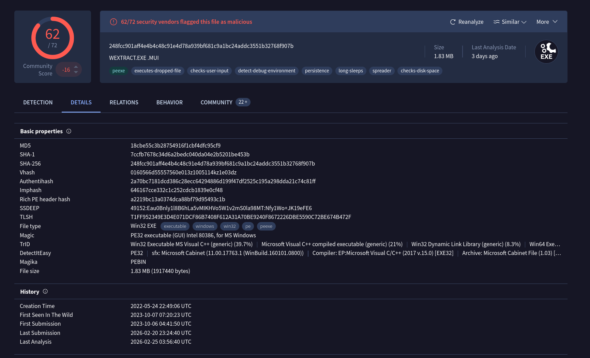
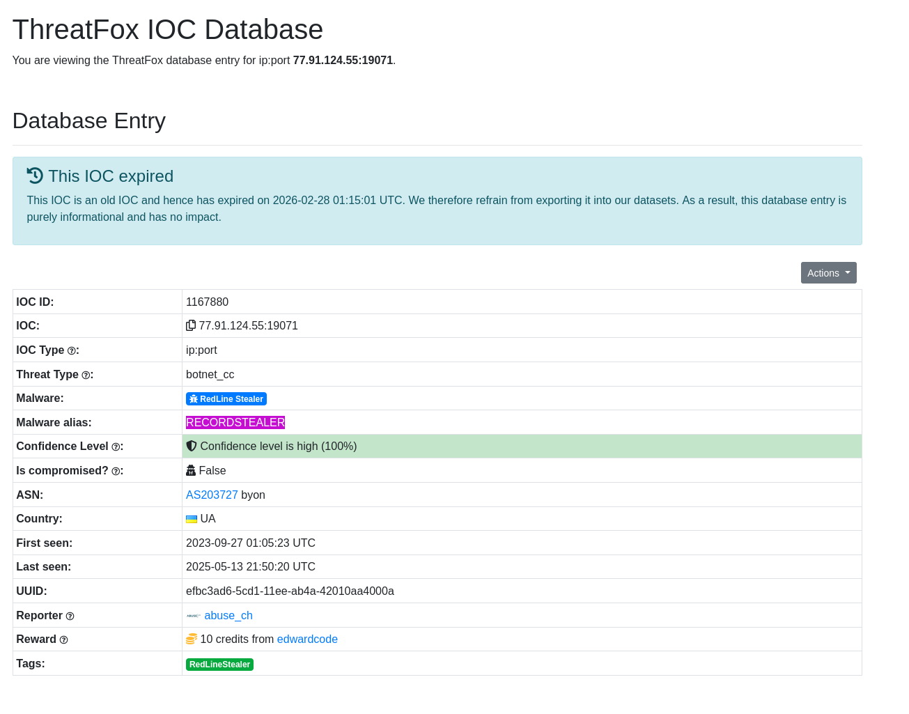
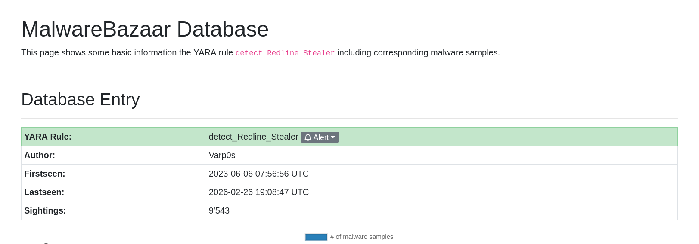

# Red Stealer – Threat Intel Hash Investigation

## Scenario

A suspicious executable was discovered on a user workstation and is suspected to be communicating with a command and control server. As the Threat Intelligence analyst, the goal is to pivot off the malware hash and produce actionable intel for SOC and IR teams, including classification, infrastructure, and detection artifacts

## Evidence Provided

SHA256  
248FCC901AFF4E4B4C48C91E4D78A939BF681C9A1BC24ADDC3551B32768F907B

## Investigation Workflow and Findings

## 1. Malware Category and Family

Pivoting the SHA256 into VirusTotal, Microsoft detection classified the sample as:  
`Trojan:Win32/Redline!rfn
This aligns with stealer-style behavior and supports treating the host as potentially credential-compromised.

## 2. Malware Filename

The associated filename observed for the sample was:  
`WEXTRACT.EXE.MUI`
## 3. First Seen Timestamp

VirusTotal first submission time (UTC):  
2023-10-06 04:41
## 4. Pre-Exfil System Data Collection MITRE Technique

Technique ID for collecting local system data prior to exfiltration:  
T1005 Data from Local System

## 5. Social Media Related Domains Resolved

DNS and web activity showed requests to Facebook-related infrastructure, including:  
connect.facebook.net
This is useful for network hunt logic because commodity stealers often blend legitimate-looking traffic with malicious beacons.
## 6. C2 Infrastructure

Command and control IP and port:  
77.91.124.55:19071
This can be pushed immediately into perimeter blocks and detection rules (FW, proxy, EDR network events).

 ## 7. MalwareBazaar YARA Rule (Varp0s)

One of the best lessons from this lab was pivoting through **MalwareBazaar** using hash/IOC lookups to find community detection content.

YARA rule name created by Varp0s:  
detect_Redline_Stealer

## 8. ThreatFox Alias for the Malicious IP

ThreatFox IOC entry for the C2 infrastructure maps the IP to an alias:  
RECORDSTEALER
This is useful because different vendors/platforms may use different naming (Redline vs RecordStealer), and alias mapping improves correlation across telemetry.

## 9. DLL Used for Privilege Escalation

Imported DLL identified as relevant for privilege escalation behavior:  
ADVAPI32.dll
This is a useful hunting input when combined with suspicious process ancestry and unusual API usage patterns.
## IOCs 

| Type            | Value                                                            |
| --------------- | ---------------------------------------------------------------- |
| c2              | 77.91.124.55:19071                                               |
| url             | https://connect.facebook.net:443/security/hsts-pixel.gif         |
| Sha256          | 248FCC901AFF4E4B4C48C91E4D78A939BF681C9A1BC24ADDC3551B32768F907B |
| malware family  | Trojan:Win32/Redline!rfn                                         |
| Filename        | WEXTRACT                                                         |
| YARA rule       | detect_Redline_Stealer                                           |
| ThreatFox alias | RECORDSTEALER                                                    |
| DLL             | ADVAPI32.dll                                                     |

## Conclusion

This hash-led threat intel investigation identified the sample as a Redline/RecordStealer-family trojan, confirmed associated infrastructure (77.91.124.55:19071), and produced detection-ready artifacts including MalwareBazaar YARA coverage and ThreatFox alias mapping. 
>The strongest takeaway from this lab was learning to pivot through MalwareBazaar using hashes and IOCs to quickly enrich investigations with community detections and related samples.

I successfully completed Red Stealer Blue Team Lab at @CyberDefenders!
https://cyberdefenders.org/blueteam-ctf-challenges/achievements/inksec/red-stealer/
 
#CyberDefenders #CyberSecurity #BlueYard #BlueTeam #InfoSec #SOC #SOCAnalyst #DFIR #CCD #CyberDefender
