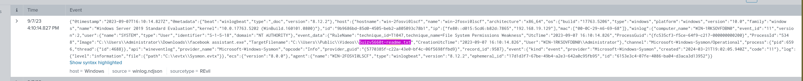
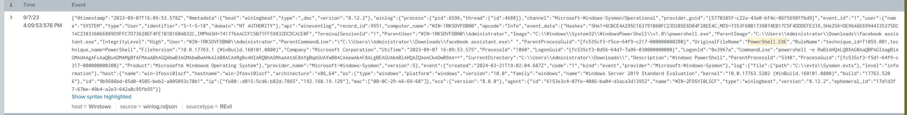
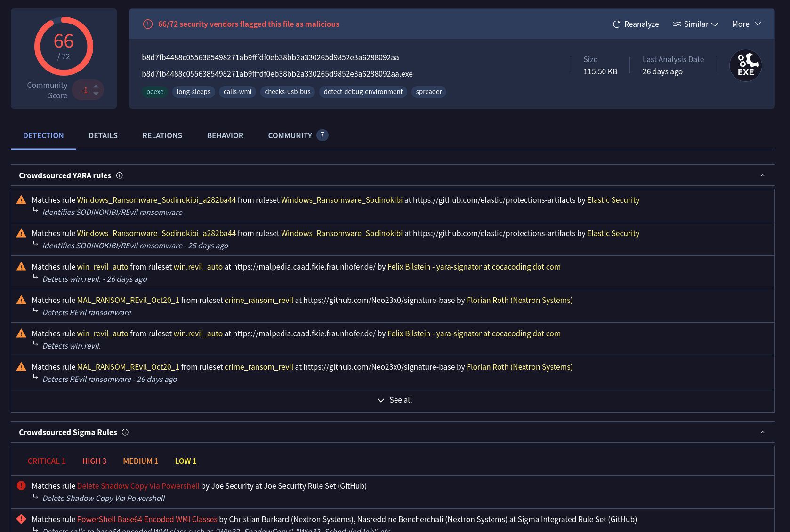

## Overview

A ransomware attack encrypted multiple employee machines at a client organisation. Affected users reported ransom notes on their desktops and changed desktop backgrounds. Using Splunk SIEM containing Sysmon event logs from one of the encrypted machines, this investigation traces the full attack chain — from initial execution through shadow copy deletion to attacker C2 infrastructure identification.

---

## Investigation

### Identifying the Ransom Note

Sysmon Event ID 11 (FileCreate) logs file creation activity. Searching for readme file creation events reveals the ransom note dropped by the ransomware:

bash

```bash
index=revil "event.code"=11 "readme"
```


This single query surfaces the majority of the initial investigation data — the ransom note filename, the process responsible, and the executable path.

**Ransom note filename:** `5uizv5660t-readme.txt` **Process ID:** `5348` **Ransomware executable:** `C:\Users\Administrator\Downloads\facebook assistant.exe`

---

### Shadow Copy Deletion

A key ransomware behaviour is destroying Volume Shadow Copies to prevent system recovery. Checking Event ID 26 (file delete) returned only one result — not the shadow copy deletion. Pivoting to PowerShell execution via Event ID 1:

```bash
index=revil powershell.exe "event.code"=1
```



The results revealed an obfuscated PowerShell command using Base64 encoding:
```
powershell -e RwBlAHQALQBXAG0AaQBPAGIAagBlAGMAdAAgAFcAaQBuADMAMgBfAFMAaABhAGQAbwB3AGMAbwBwAHkAIAB8ACAAR...
````

Decoding the Base64 string reveals the shadow copy deletion command:

**Decoded:** `Get-WmiObject Win32_Shadowcopy | ForEach-Object {$_.Delete();}`

Classic ransomware anti-recovery technique — wiping all VSS snapshots before or during encryption to prevent the victim from restoring files without paying.

---

### SHA256 Hash — Malware Verification

Extracting the hash of the ransomware executable from Sysmon process creation logs:

```bash
index=revil event.code=1 "facebook assistant.exe" | table winlog.event_data.Hashes
```

The Hashes field returned all hash types logged by Sysmon:
```
SHA1=E5D8D5EECF7957996485CBC1CDBEAD9221672A1A
MD5=4D84641B65D8BB6C3EF03BF59434242D
SHA256=B8D7FB4488C0556385498271AB9FFFDF0EB38BB2A330265D9852E3A6288092AA
IMPHASH=C686E5B9F7A178EB79F1CF16460B6A18
````

**SHA256:** `B8D7FB4488C0556385498271AB9FFFDF0EB38BB2A330265D9852E3A6288092AA`

VirusTotal confirms the hash as a known REvil (Sodinokibi) ransomware sample — attributed to the GOLD SOUTHFIELD threat actor group.


---

### Attacker C2 — Onion Domain

Cross-referencing the SHA256 hash against threat intelligence sources including tria.ge (`hxxps://tria[.]ge/260212-qazsyabv9d`) and the ransom note content identified the attacker's Tor-based communication channel:

**Onion domain:** `aplebzu47wgazapdqks6vrcv6zcnjppkbxbr6wketf56nf6aq2nmyoyd[.]onion`


This domain is the victim portal used by REvil to negotiate ransom payments and deliver decryption keys.

---

## IOCs

|Type|Value|
|---|---|
|Filename|`facebook assistant.exe`|
|Filename|`5uizv5660t-readme.txt`|
|SHA256|`B8D7FB4488C0556385498271AB9FFFDF0EB38BB2A330265D9852E3A6288092AA`|
|MD5|`4D84641B65D8BB6C3EF03BF59434242D`|
|SHA1|`E5D8D5EECF7957996485CBC1CDBEAD9221672A1A`|
|Onion|`aplebzu47wgazapdqks6vrcv6zcnjppkbxbr6wketf56nf6aq2nmyoyd[.]onion`|
|Path|`C:\Users\Administrator\Downloads\facebook assistant.exe`|

---

## MITRE ATT&CK

|Technique|ID|
|---|---|
|User Execution: Malicious File|T1204.002|
|Inhibit System Recovery|T1490|
|Command and Scripting Interpreter: PowerShell|T1059.001|
|Obfuscated Files or Information: Command Obfuscation|T1027.010|
|Data Encrypted for Impact|T1486|

---

## Lessons Learned

The lab demonstrates that Sysmon Event ID 11 is a powerful starting point for ransomware investigations — file creation events tie the ransom note directly to the responsible process and executable path with a single query. The obfuscated Base64 PowerShell command is a textbook technique; any `-e` or `-EncodedCommand` flag in PowerShell execution logs should be treated as suspicious and decoded immediately. Sysmon's hash logging in Event ID 1 is invaluable — a single query surfaces SHA256, MD5, SHA1, and IMPHASH simultaneously, enabling immediate threat intel cross-referencing without needing endpoint access.

---

<div class="qa-item"> <div class="qa-question-text">To begin your investigation, can you identify the filename of the note that the ransomware left behind?</div> <div class="flag-reveal"> <input type="checkbox"> <span class="r-placeholder">Click flag to reveal</span> <span class="r-answer">5uizv5660t-readme.txt</span> </div> </div>

<div class="qa-item"> <div class="qa-question-text">After identifying the ransom note, the next step is to pinpoint the source. What's the process ID of the ransomware that's likely involved</div> <div class="answer-reveal"> <input type="checkbox"> <span class="r-placeholder">Click to reveal answer</span> <span class="r-answer">5348</span> </div> </div>

<div class="qa-item"> <div class="qa-question-text">Having determined the ransomware's process ID, the next logical step is to locate its origin. Where can we find the ransomware's executable file?</div> <div class="flag-reveal"> <input type="checkbox"> <span class="r-placeholder">Click flag to reveal</span> <span class="r-answer">C:\Users\Administrator\Downloads\facebook assistant.exe</span> </div> </div>

<div class="qa-item"> <div class="qa-question-text">Now that you've pinpointed the ransomware's executable location, let's dig deeper. It's a common tactic for ransomware to disrupt system recovery methods. Can you identify the command that was used for this purpose?</div> <div class="answer-reveal"> <input type="checkbox"> <span class="r-placeholder">Click to reveal answer</span> <span class="r-answer">Get-WmiObject Win32_Shadowcopy | ForEach-Object {$_.Delete();}</span> </div> </div>

<div class="qa-item"> <div class="qa-question-text">As we trace the ransomware's steps, a deeper verification is needed. Can you provide the sha256 hash of the ransomware's executable to cross-check with known malicious signatures?</div> <div class="flag-reveal"> <input type="checkbox"> <span class="r-placeholder">Click flag to reveal</span> <span class="r-answer">B8D7FB4488C0556385498271AB9FFFDF0EB38BB2A330265D9852E3A6288092AA</span> </div> </div>

<div class="qa-item"> <div class="qa-question-text">One crucial piece remains: identifying the attacker's communication channel. Can you leverage threat intelligence and known Indicators of Compromise (IoCs) to pinpoint the ransomware author's onion domain?</div> <div class="answer-reveal"> <input type="checkbox"> <span class="r-placeholder">Click to reveal answer</span> <span class="r-answer">aplebzu47wgazapdqks6vrcv6zcnjppkbxbr6wketf56nf6aq2nmyoyd.onion</span> </div> </div>


I successfully completed REvil - GOLD SOUTHFIELD Blue Team Lab at @CyberDefenders!
https://cyberdefenders.org/blueteam-ctf-challenges/achievements/inksec/revil-gold-southfield/
 
#CyberDefenders #CyberSecurity #BlueYard #BlueTeam #InfoSec #SOC #SOCAnalyst #DFIR #CCD #CyberDefender