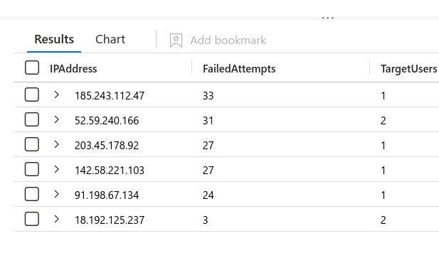
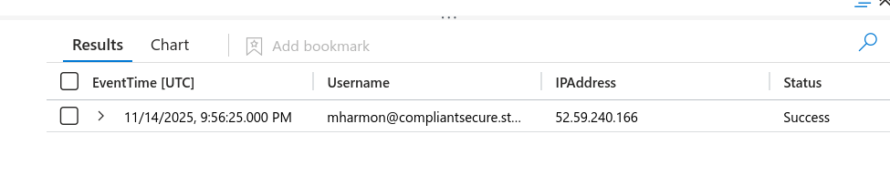
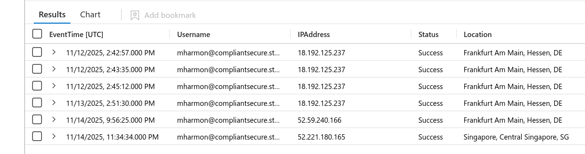
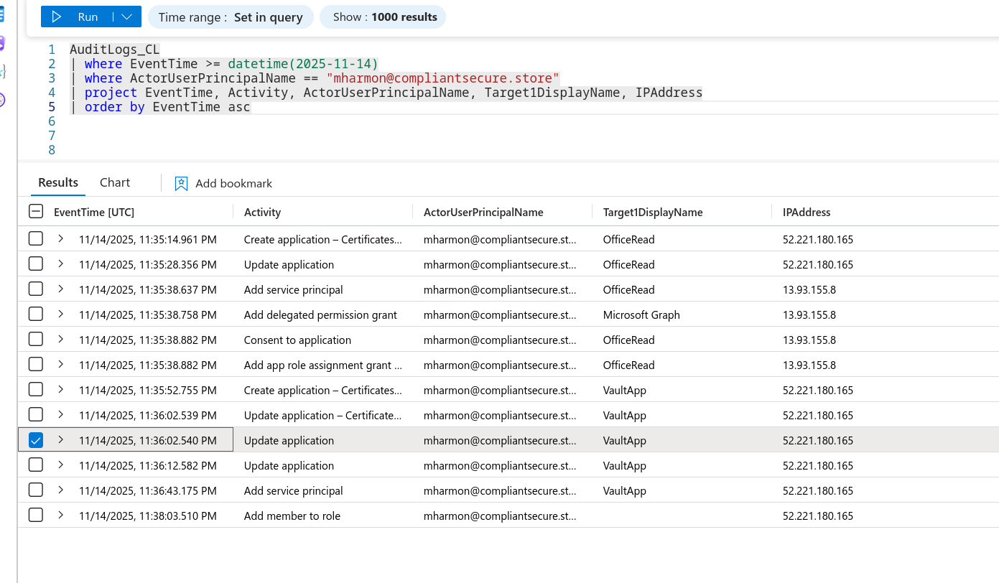
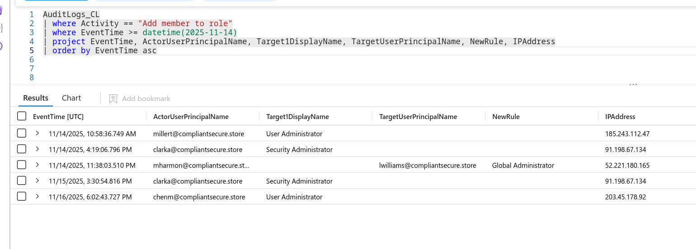
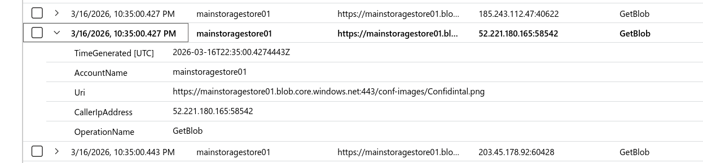

## Overview

Azure tenant compromise investigation using **KQL (Kusto Query Language)** in Microsoft Sentinel. The attacker executed a password spray, compromised an admin account, registered malicious applications for persistence, escalated a second account to Global Administrator, then exfiltrated sensitive data from Azure Blob Storage.

**Key lesson:** Azure log tables in Sentinel use `_CL` suffix for custom logs — `SigninLogs` becomes `InteractiveSignIns_CL`, `AuditLogs` becomes `AuditLogs_CL`. Also allow **5-10 minutes** for log ingestion after lab start, and set time range to **Last 7 days**.

---

## Environment Setup

Microsoft Sentinel → Logs → KQL mode. Three tables available:

```bash
search *
| distinct $table
| order by $table asc
```

|Table|Contents|
|---|---|
|`InteractiveSignIns_CL`|Azure AD sign-in events|
|`AuditLogs_CL`|Admin actions, app registrations, role changes|
|`StorageBlobLogs_CL`|Blob storage access and downloads|

---

## Stage 1 — Initial Access: Password Spray

A password spray differs from brute force — one IP attempts multiple usernames with common passwords rather than hammering a single account. Look for high failure counts across multiple target users from a single IP.

```bash
InteractiveSignIns_CL
| where Status == "Failure"
| summarize FailedAttempts = count(), TargetUsers = dcount(Username) by IPAddress
| order by FailedAttempts desc
```



`52.59.240.166` — 31 failed attempts across 2 users. The multi-user targeting confirms spray behaviour vs targeted brute force.

**MITRE: T1110.003 — Brute Force: Password Spraying**

---

## Stage 2 — First Compromised Account

Query successful logins from the spray IP to find the first account that was successfully compromised:

```bash
InteractiveSignIns_CL
| where IPAddress == "52.59.240.166"
| where Status == "Success"
| project EventTime, Username, IPAddress, Status
| order by EventTime asc
```



Compromised account: `mharmon@compliantsecure.store`

**MITRE: T1078 — Valid Accounts**

---

## Stage 3 — Infrastructure Pivot

After compromising `mharmon`, the attacker switched to a different IP for post-exploitation — a common OpSec practice to separate noisy spray activity from quiet post-exploitation. Track all successful logins for the compromised account:

```bash
InteractiveSignIns_CL
| where Username == "mharmon@compliantsecure.store"
| where Status == "Success"
| project EventTime, Username, IPAddress, Status, Location
| order by EventTime asc
```



Timeline:

- `18.192.125.237` — earlier access (pre-compromise, likely recon)
- `52.59.240.166` — spray IP, successful 2025-11-14 09:56
- `52.221.180.165` — new IP at 11:34 on 2025-11-14, post-exploitation pivot

**MITRE: T1550.001 — Use Alternate Authentication Material**

---

## Stage 4 — Post-Exploitation: Full Attack Timeline

Query everything `mharmon` did after the compromise date to see the full attack chain:

```bash
AuditLogs_CL
| where EventTime >= datetime(2025-11-14)
| where ActorUserPrincipalName == "mharmon@compliantsecure.store"
| project EventTime, Activity, ActorUserPrincipalName, Target1DisplayName, IPAddress
| order by EventTime asc
```



Full chain visible in chronological order:

|Time|Action|Target|
|---|---|---|
|11:35:14|Create application|OfficeRead|
|11:35:28|Update application|OfficeRead|
|11:35:38|Add service principal|OfficeRead|
|11:35:38|Add delegated permission grant|Microsoft Graph|
|11:35:38|Consent to application|OfficeRead|
|11:35:52|Create application|VaultApp|
|11:36:02|Update application|VaultApp|
|11:36:43|Add service principal|VaultApp|
|11:38:03|Add member to role|lwilliams|

---

## Stage 5 — Persistence: Malicious App Registrations

Two malicious applications registered within minutes of each other using the Singapore IP — a persistence technique that survives password resets since the apps authenticate independently via service principals.

First app: `OfficeRead`

- Registered with Microsoft Graph delegated permissions
- Designed to read Office 365 data

Second app: `VaultApp`

- Registered to access directory information
- Service principal added for non-interactive authentication

**MITRE: T1136 — Create Account (Service Principal)** **MITRE: T1098.001 — Account Manipulation: Additional Cloud Credentials**

---

## Stage 6 — Privilege Escalation: Global Administrator

Query role assignment events to identify the backdoor account:

```bash
AuditLogs_CL
| where Activity == "Add member to role"
| where EventTime >= datetime(2025-11-14)
| project EventTime, ActorUserPrincipalName, Target1DisplayName, TargetUserPrincipalName, NewRule, IPAddress
| order by EventTime asc
```



At 11:38, `mharmon` assigned `lwilliams@compliantsecure.store` the **Global Administrator** role from `52.221.180.165`. This creates a redundant backdoor — even if `mharmon` is remediated, `lwilliams` retains full tenant control.

**MITRE: T1484.001 — Domain Policy Modification: Group Policy Modification**

---

## Stage 7 — Exfiltration: Azure Blob Storage

Query blob storage for `GetBlob` operations — downloads from storage accounts — filtering to the attacker's IP:

```bash
StorageBlobLogs_CL
| where TimeGenerated >= datetime(2025-11-14)
| where OperationName == "GetBlob"
| project TimeGenerated, AccountName, Uri, CallerIpAddress, OperationName
| order by TimeGenerated asc
```



`52.221.180.165` (Singapore IP) issued a `GetBlob` request to:
```
https://mainstoragestore01[.]blob[.]core[.]windows[.]net/conf-images/Confidintal[.]png
````

Note the deliberate typo — "Confidintal" not "Confidential" — likely an attacker-created decoy or staging file.

**MITRE: T1530 — Data from Cloud Storage** **MITRE: T1567 — Exfiltration Over Web Service**

---

## IOCs

|Type|Value|
|---|---|
|Password Spray IP|52[.]59[.]240[.]166|
|Post-Exploitation IP|52[.]221[.]180[.]165|
|Compromised Account|mharmon[@]compliantsecure[.]store|
|Backdoor Account|lwilliams[@]compliantsecure[.]store|
|Malicious App 1|OfficeRead|
|Malicious App 2|VaultApp|
|Storage Account|mainstoragestore01|
|Exfiltrated File|Confidintal[.]png|
|Storage URI|hxxps[://]mainstoragestore01[.]blob[.]core[.]windows[.]net/conf-images/Confidintal[.]png|

---

## MITRE ATT&CK

|Technique|ID|Notes|
|---|---|---|
|Password Spraying|T1110.003|31 attempts across 2 accounts from 52.59.240.166|
|Valid Accounts|T1078|mharmon credentials compromised|
|Infrastructure Pivot|T1550.001|Switched to Singapore IP post-compromise|
|Create Service Principal|T1136|OfficeRead + VaultApp registered|
|Additional Cloud Credentials|T1098.001|Service principals for persistent API access|
|Global Admin Assignment|T1484.001|lwilliams escalated to Global Administrator|
|Data from Cloud Storage|T1530|mainstoragestore01 blob accessed|
|Exfiltration Over Web|T1567|Confidintal.png downloaded via HTTPS|

---

## Lessons Learned

- **KQL vs SPL** — KQL syntax maps closely to Splunk SPL: `where` = `where`, `summarize` = `stats`, `project` = `fields`, `order by` = `sort`. The mental model transfers well once you know the table names
- **`_CL` suffix** — Custom log tables in Sentinel always append `_CL`. Always run `search * | distinct $table` first to discover actual table names before writing queries
- **App registrations as persistence** — Malicious service principals survive password resets and MFA changes — remediating the compromised user account alone is insufficient. App registrations and service principals must be audited and revoked
- **Spray vs brute force detection** — Key differentiator is `dcount(Username)` — spray hits multiple users, brute force hits one. High `FailedAttempts` with `TargetUsers > 1` from a single IP is the signature
- **Log ingestion delay** — Azure logs take 5-10 minutes to ingest into Sentinel after lab start. If queries return nothing, wait and retry before troubleshooting


---

<div class="qa-item"> <div class="qa-question-text">The investigation begins by analyzing a password spray attack that targeted several users in the primary tenant. What IP address did the attacker originate the password spray attack from?</div> <div class="flag-reveal"> <input type="checkbox"> <span class="r-placeholder">Click flag to reveal</span> <span class="r-answer">52.59.240.166</span> <button class="copy-btn" onclick="event.stopPropagation();navigator.clipboard.writeText(this.previousElementSibling.textContent);this.textContent='copied';setTimeout(()=>this.textContent='copy',1500)">copy</button> </div> </div>

<div class="qa-item"> <div class="qa-question-text">After numerous failed attempts, the attacker successfully gained access to an account. What is the username of the first account that was compromised?</div> <div class="answer-reveal"> <input type="checkbox"> <span class="r-placeholder">Click to reveal answer</span> <span class="r-answer">mharmon@compliantsecure.store</span> <button class="copy-btn" onclick="event.stopPropagation();navigator.clipboard.writeText(this.previousElementSibling.textContent);this.textContent='copied';setTimeout(()=>this.textContent='copy',1500)">copy</button> </div> </div>

<div class="qa-item"> <div class="qa-question-text">Following the initial compromise, the attacker began using a new infrastructure for post-exploitation activities. What is the second IP address used by the attacker?</div> <div class="flag-reveal"> <input type="checkbox"> <span class="r-placeholder">Click flag to reveal</span> <span class="r-answer">52.221.180.165</span> <button class="copy-btn" onclick="event.stopPropagation();navigator.clipboard.writeText(this.previousElementSibling.textContent);this.textContent='copied';setTimeout(()=>this.textContent='copy',1500)">copy</button> </div> </div>

<div class="qa-item"> <div class="qa-question-text">From which country did the successful sign-in originate when the attacker pivoted to their secondary infrastructure for post-exploitation activities?</div> <div class="answer-reveal"> <input type="checkbox"> <span class="r-placeholder">Click to reveal answer</span> <span class="r-answer">Singapore</span> <button class="copy-btn" onclick="event.stopPropagation();navigator.clipboard.writeText(this.previousElementSibling.textContent);this.textContent='copied';setTimeout(()=>this.textContent='copy',1500)">copy</button> </div> </div>

<div class="qa-item"> <div class="qa-question-text">To establish persistence, the attacker registered malicious applications. What is the name of the first application they created?</div> <div class="flag-reveal"> <input type="checkbox"> <span class="r-placeholder">Click flag to reveal</span> <span class="r-answer">OfficeRead</span> <button class="copy-btn" onclick="event.stopPropagation();navigator.clipboard.writeText(this.previousElementSibling.textContent);this.textContent='copied';setTimeout(()=>this.textContent='copy',1500)">copy</button> </div> </div>

<div class="qa-item"> <div class="qa-question-text">The attacker created a second application to ensure persistent access, this one intended to access directory information. What is the name of this second application?</div> <div class="answer-reveal"> <input type="checkbox"> <span class="r-placeholder">Click to reveal answer</span> <span class="r-answer">VaultApp</span> <button class="copy-btn" onclick="event.stopPropagation();navigator.clipboard.writeText(this.previousElementSibling.textContent);this.textContent='copied';setTimeout(()=>this.textContent='copy',1500)">copy</button> </div> </div>

<div class="qa-item"> <div class="qa-question-text">To create a redundant backdoor, the attacker used the compromised administrator account to elevate the privileges of another user. What is the User Principal Name of the account that had its privileges escalated?</div> <div class="flag-reveal"> <input type="checkbox"> <span class="r-placeholder">Click flag to reveal</span> <span class="r-answer">lwilliams@compliantsecure.store</span> <button class="copy-btn" onclick="event.stopPropagation();navigator.clipboard.writeText(this.previousElementSibling.textContent);this.textContent='copied';setTimeout(()=>this.textContent='copy',1500)">copy</button> </div> </div>

<div class="qa-item"> <div class="qa-question-text">What highly privileged role was assigned to the second user account to grant it administrative control over the tenant?</div> <div class="answer-reveal"> <input type="checkbox"> <span class="r-placeholder">Click to reveal answer</span> <span class="r-answer">Global Administrator</span> <button class="copy-btn" onclick="event.stopPropagation();navigator.clipboard.writeText(this.previousElementSibling.textContent);this.textContent='copied';setTimeout(()=>this.textContent='copy',1500)">copy</button> </div> </div>

<div class="qa-item"> <div class="qa-question-text">The attacker's final objective was data exfiltration. They targeted a specific storage resource to access sensitive files. What is the name of the storage account they accessed?</div> <div class="flag-reveal"> <input type="checkbox"> <span class="r-placeholder">Click flag to reveal</span> <span class="r-answer">mainstoragestore01</span> <button class="copy-btn" onclick="event.stopPropagation();navigator.clipboard.writeText(this.previousElementSibling.textContent);this.textContent='copied';setTimeout(()=>this.textContent='copy',1500)">copy</button> </div> </div>

<div class="qa-item"> <div class="qa-question-text">The attacker successfully downloaded a sensitive file from the storage account. What is the name of the exfiltrated file?</div> <div class="answer-reveal"> <input type="checkbox"> <span class="r-placeholder">Click to reveal answer</span> <span class="r-answer">ANSWER</span> <button class="copy-btn" onclick="event.stopPropagation();navigator.clipboard.writeText(this.previousElementSibling.textContent);this.textContent='copied';setTimeout(()=>this.textContent='copy',1500)">copy</button> </div> </div>

I successfully completed Rogue Azure Blue Team Lab at @CyberDefenders!
https://cyberdefenders.org/blueteam-ctf-challenges/achievements/inksec/rogue-azure/
 
#CyberDefenders #CyberSecurity #BlueYard #BlueTeam #InfoSec #SOC #SOCAnalyst #DFIR #CCD #CyberDefender