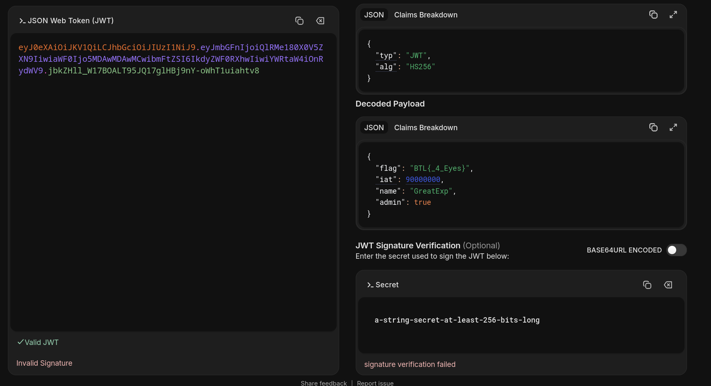
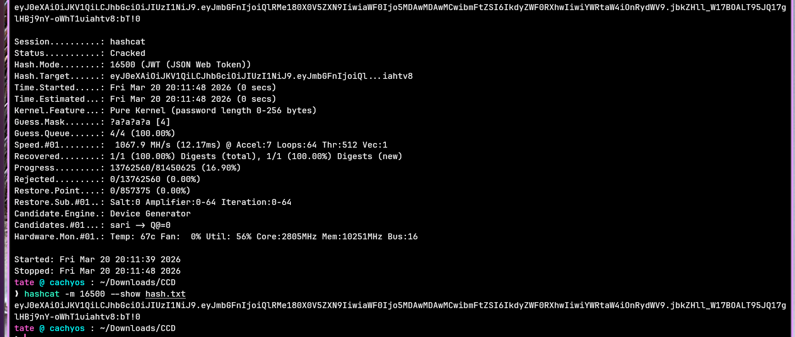
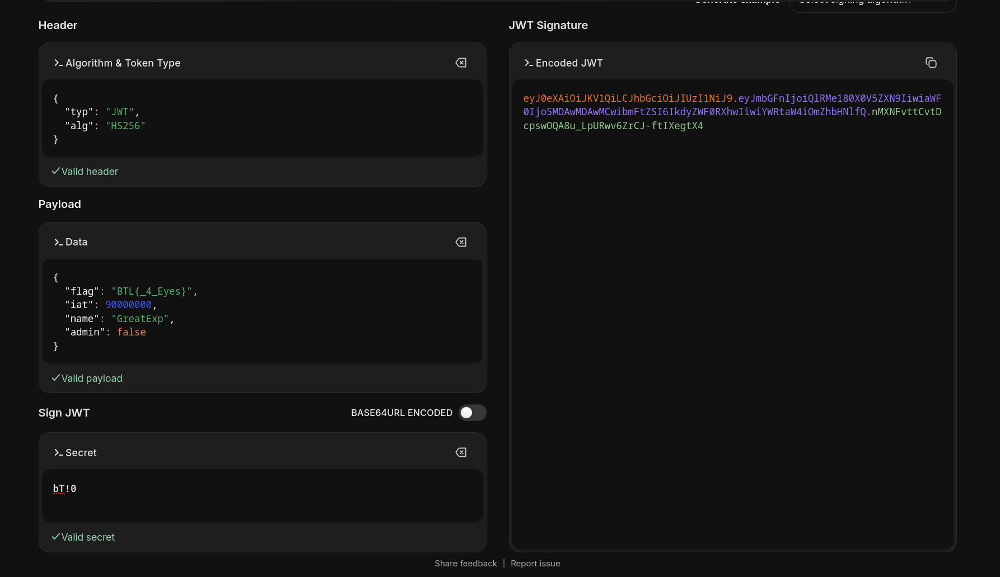

## Overview

A high-privilege action was detected coming from an unknown source. The suspicious ticket was captured and handed over for analysis. The task is to identify the token type, extract any useful hints from the payload, crack the signing secret, and forge a new low-privilege token to prove the technique is understood.

---

## Investigation

### Identifying the Token

The provided ticket is a long base64-looking string split into three parts separated by dots. Decoding the first part reveals the header:

```zsh
echo "eyJ0eXAiOiJKV1QiLCJhbGciOiJIUzI1NiJ9.eyJmbGFnIjoiQlRMe..." | base64 -d
{"typ":"JWT","alg":"HS256"}
```

This is a **JWT — JSON Web Token**. JWTs are used to pass authentication claims between systems and have the structure `Header.Payload.Signature`. The header tells us it's signed with **HS256**, which means a shared secret is used to create the signature.

---

### Reading the Payload

Pasting the full token into jwt.io shows the signature is invalid — which confirms the secret is not publicly known. But the payload is readable without knowing the secret, since the middle section is just base64:


```json
{
  "flag": "BTL{_4_Eyes}",
  "iat": 90000000,
  "name": "GreatExp",
  "admin": true
}
```

The `flag` field stands out immediately — `_4_Eyes` is our hint for the secret. The `admin: true` field is the privilege escalation vector. Anyone holding this token would be treated as an administrator.

---

### Cracking the Secret

With the hint in hand, hashcat can brute-force the signing secret. JWT cracking uses mode `16500`:

```bash
hashcat -m 16500 hash.txt -a 3 -i '?a?a?a?a'
```

The `-i` flag enables incremental mode, trying all lengths up to 4 characters. hashcat cracks it quickly:
```
eyJ0eXAiOiJKV1QiLCJhbGciOiJIUzI1NiJ9....:bT!0
````

The secret is **`bT!0`** — a short 4-character password, which is why it fell so fast.

---

### Forging the Low-Privilege Token

Now that the secret is known, a new token can be signed. Back in jwt.io, the secret `bT!0` is entered and the payload is modified to drop the admin flag:

```json
{
  "flag": "BTL{_4_Eyes}",
  "iat": 90000000,
  "name": "GreatExp",
  "admin": false
}
```

jwt.io generates a new valid token with a verified signature:

```
yJ0eXAiOiJKV1QiLCJhbGciOiJIUzI1NiJ9.eyJmbGFnIjoiQlRMe180X0V5ZXN9IiwiaWF0Ijo5MDAwMDAwMCwibmFtZSI6IkdyZWF0RXhwIiwiYWRtaW4iOmZhbHNlfQ.nMXNFvttCvtDcpswOQA8u_LpURwv6ZrCJ-ftIXegtX4
````

The signature now passes — same secret, same structure, but `admin` is `false`. This demonstrates exactly why weak JWT secrets are dangerous: anyone who cracks the secret can sign whatever claims they want.

---

<div class="qa-item"> <div class="qa-question-text">#1) Can you identify the name of the token?</div> <div class="flag-reveal"> <input type="checkbox"> <span class="r-placeholder">Click flag to reveal</span> <span class="r-answer">jwt</span> <button class="copy-btn" onclick="event.stopPropagation();navigator.clipboard.writeText(this.previousElementSibling.textContent);this.textContent='copied';setTimeout(()=>this.textContent='copy',1500)">copy</button> </div> </div>

<div class="qa-item"> <div class="qa-question-text">#2) What is the structure of this token?</div> <div class="answer-reveal"> <input type="checkbox"> <span class="r-placeholder">Click to reveal answer</span> <span class="r-answer">Header.Payload.Signature</span> <button class="copy-btn" onclick="event.stopPropagation();navigator.clipboard.writeText(this.previousElementSibling.textContent);this.textContent='copied';setTimeout(()=>this.textContent='copy',1500)">copy</button> </div> </div>

<div class="qa-item"> <div class="qa-question-text">#3) What is the hint you found from this token?</div> <div class="flag-reveal"> <input type="checkbox"> <span class="r-placeholder">Click flag to reveal</span> <span class="r-answer">_4_Eyes</span> <button class="copy-btn" onclick="event.stopPropagation();navigator.clipboard.writeText(this.previousElementSibling.textContent);this.textContent='copied';setTimeout(()=>this.textContent='copy',1500)">copy</button> </div> </div>

<div class="qa-item"> <div class="qa-question-text">#4) What is the Secret?</div> <div class="answer-reveal"> <input type="checkbox"> <span class="r-placeholder">Click to reveal answer</span> <span class="r-answer">bT!0</span> <button class="copy-btn" onclick="event.stopPropagation();navigator.clipboard.writeText(this.previousElementSibling.textContent);this.textContent='copied';setTimeout(()=>this.textContent='copy',1500)">copy</button> </div> </div>

<div class="qa-item"> <div class="qa-question-text">#5) Can you generate a new verified signature ticket with a low privilege?</div> <div class="flag-reveal"> <input type="checkbox"> <span class="r-placeholder">Click flag to reveal</span> <span class="r-answer">yJ0eXAiOiJKV1QiLCJhbGciOiJIUzI1NiJ9.eyJmbGFnIjoiQlRMe180X0V5ZXN9IiwiaWF0Ijo5MDAwMDAwMCwibmFtZSI6IkdyZWF0RXhwIiwiYWRtaW4iOmZhbHNlfQ.nMXNFvttCvtDcpswOQA8u_LpURwv6ZrCJ-ftIXegtX4</span> <button class="copy-btn" onclick="event.stopPropagation();navigator.clipboard.writeText(this.previousElementSibling.textContent);this.textContent='copied';setTimeout(()=>this.textContent='copy',1500)">copy</button> </div> </div>

