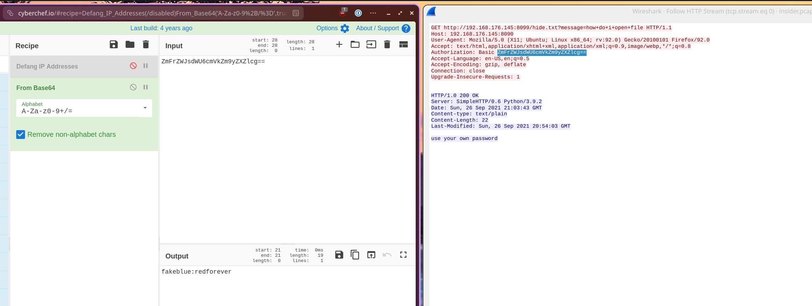
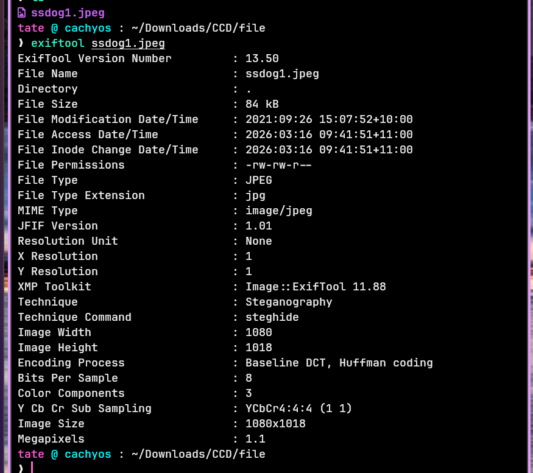
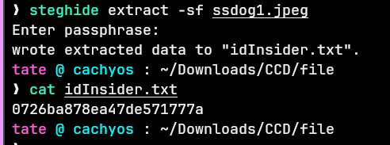
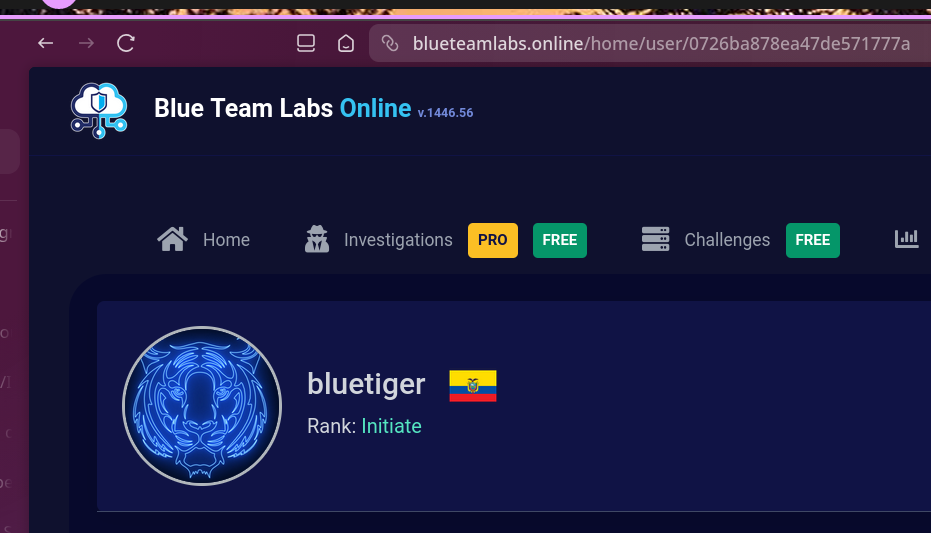

## Overview

A steganography-focused challenge combining PCAP analysis, credential extraction, and hidden data recovery. The investigation follows a chain: decode credentials from HTTP traffic → crack a ZIP → extract metadata from an image → retrieve a hidden payload using steghide → identify the attacker via their BTLO profile.

---

## PCAP Analysis

Opening the PCAP in Wireshark reveals a small capture containing a single HTTP GET request. Following the HTTP stream shows the server response:

**`use your own password`**

Inspecting the request headers more closely reveals a Base64-encoded Authorization header — standard HTTP Basic Auth format. Decoding it:

```zsh
echo "base64string" | base64 -d
```

Returns the credentials: `fakeblue:redforever`


---
## ZIP Extraction

Using `redforever` as the ZIP password extracts the archive contents — an image file and a README. The README confirms no further passwords are needed for the remainder of the challenge.

---

## Metadata Analysis — Exiftool

Running Exiftool against the extracted image reveals embedded metadata:

bash

```bash
exiftool image.jpg
```

Among the standard fields, one stands out:

**`Technique: Steganography`**

This is a direct hint — data has been hidden inside the image file itself.



---

## Steganography Extraction — Steghide

With steganography confirmed via the metadata, steghide is the appropriate extraction tool:

bash

```bash
steghide extract -sf image.jpg
```

The hidden payload is extracted, revealing an ID string:

**`0726ba878ea47de571777a`**

---

## Attacker Identification

The challenge name "Insider" is the key — this ID corresponds to a BTLO user profile. Searching the ID on the BTLO platform identifies the attacker's profile as **bluetiger**.



---

<div class="qa-item"> <div class="qa-question-text">What is the response message obtained from the PCAP file?</div> <div class="flag-reveal"> <input type="checkbox"> <span class="r-placeholder">Click flag to reveal</span> <span class="r-answer">use your own password</span> <button class="copy-btn" onclick="event.stopPropagation();navigator.clipboard.writeText('use your own password');this.textContent='copied';setTimeout(()=>this.textContent='copy',1500)">copy</button> </div> </div>

<div class="qa-item"> <div class="qa-question-text">What is the password of the ZIP file?</div> <div class="answer-reveal"> <input type="checkbox"> <span class="r-placeholder">Click to reveal answer</span> <span class="r-answer">redforever</span> <button class="copy-btn" onclick="event.stopPropagation();navigator.clipboard.writeText('redforever');this.textContent='copied';setTimeout(()=>this.textContent='copy',1500)">copy</button> </div> </div>

<div class="qa-item"> <div class="qa-question-text">Will more passwords be required?</div> <div class="flag-reveal"> <input type="checkbox"> <span class="r-placeholder">Click flag to reveal</span> <span class="r-answer">no</span> <button class="copy-btn" onclick="event.stopPropagation();navigator.clipboard.writeText('no');this.textContent='copied';setTimeout(()=>this.textContent='copy',1500)">copy</button> </div> </div>

<div class="qa-item"> <div class="qa-question-text">What is the name of a widely-used tool that can be used to obtain file information?</div> <div class="answer-reveal"> <input type="checkbox"> <span class="r-placeholder">Click to reveal answer</span> <span class="r-answer"></span>Exiftool <button class="copy-btn" onclick="event.stopPropagation();navigator.clipboard.writeText('Exiftool');this.textContent='copied';setTimeout(()=>this.textContent='copy',1500)">copy</button> </div> </div>

<div class="qa-item"> <div class="qa-question-text">What is the name and value of the interesting information obtained from the image file metadata?</div> <div class="flag-reveal"> <input type="checkbox"> <span class="r-placeholder">Click flag to reveal</span> <span class="r-answer">Technique:Steganography</span> <button class="copy-btn" onclick="event.stopPropagation();navigator.clipboard.writeText('Technique:Steganography');this.textContent='copied';setTimeout(()=>this.textContent='copy',1500)">copy</button> </div> </div>

<div class="qa-item"> <div class="qa-question-text">Based on the answer from the previous question, what tool needs to be used to retrieve the information hidden in the file?</div> <div class="answer-reveal"> <input type="checkbox"> <span class="r-placeholder">Click to reveal answer</span> <span class="r-answer">steghide</span> <button class="copy-btn" onclick="event.stopPropagation();navigator.clipboard.writeText('steghide');this.textContent='copied';setTimeout(()=>this.textContent='copy',1500)">copy</button> </div> </div>

<div class="qa-item"> <div class="qa-question-text">Enter the ID retrieved.</div> <div class="flag-reveal"> <input type="checkbox"> <span class="r-placeholder">Click flag to reveal</span> <span class="r-answer">0726ba878ea47de571777a</span> <button class="copy-btn" onclick="event.stopPropagation();navigator.clipboard.writeText('0726ba878ea47de571777a');this.textContent='copied';setTimeout(()=>this.textContent='copy',1500)">copy</button> </div> </div>

<div class="qa-item"> <div class="qa-question-text">What is the profile name of the attacker?</div> <div class="answer-reveal"> <input type="checkbox"> <span class="r-placeholder">Click to reveal answer</span> <span class="r-answer">bluetiger</span> <button class="copy-btn" onclick="event.stopPropagation();navigator.clipboard.writeText('bluetiger');this.textContent='copied';setTimeout(()=>this.textContent='copy',1500)">copy</button> </div> </div>
