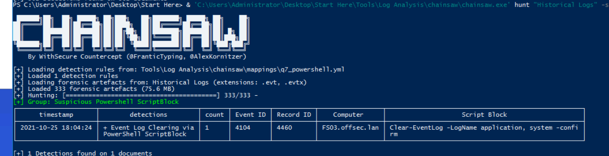
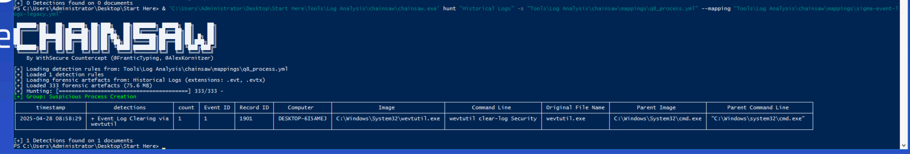
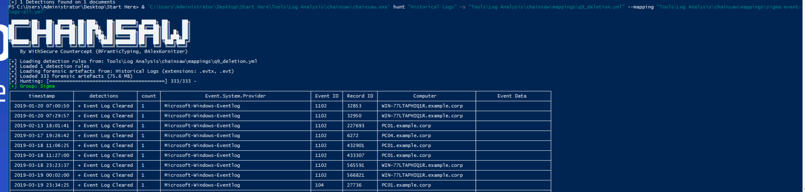

## Overview

Operating as a Detection & Hunting Engineer within CyberPredator Enterprise, this lab focuses on deconstructing Windows Event Log Clearing (T1070.001) as observed in campaigns attributed to APT28, APT41, and Aquatic Panda. The objective is to map adversary tradecraft, identify high-fidelity telemetry sources, craft Sigma detection rules, and validate them against historical EVTX datasets using Chainsaw.

---

## Tradecraft Research

### Process Creation Detection

The primary built-in Windows utility for managing and clearing event logs is `wevtutil`, used by attackers via `wevtutil cl <logname>` or `wevtutil clear-log <logname>`.

When attackers use WMIC to clear event logs the WMI class that appears in logs is `nteventlog`, exposing the `ClearEventLog()` method.

### PowerShell Detection

To capture PowerShell-based log clearing, **PowerShell Script Block Logging** must be enabled, monitoring **Event ID 4104** on the `Microsoft-Windows-PowerShell/Operational` channel — as recommended on the MITRE ATT&CK T1070.001 page.

The built-in PowerShell cmdlets commonly abused are `Clear-EventLog` and `Remove-EventLog`.

Attackers can also invoke native .NET API methods directly from PowerShell to avoid cmdlet-level detection:

- `EventLogSession.ClearLog()` — from the `System.Diagnostics.Eventing.Reader` namespace
- `EventLog.Clear()` — from the `System.Diagnostics` namespace

### File Deletion Detection

The two Event IDs that indicate log clearing at the OS level are:

|Event ID|Channel|Meaning|
|---|---|---|
|1102|Security|Security audit log cleared|
|104|System|System log cleared|

---

## Sigma Rules

### Q7 — PowerShell ScriptBlock Detection

Targets Event ID 4104 ScriptBlock content for known log-clearing cmdlets. PowerShell is operating in Constrained Language Mode so .NET binaries are excluded.
```
title: Event Log Clearing via PowerShell ScriptBlock
id: 12345678-1234-1234-123456789001
status: experimental
description: detects event log clearing via powershell cmdlets
author: tate
date: 2026/03/08
tags:
    - attack.defense_evasion
    - attack.t1070.001
logsource:
    product: windows
    service: powershell
detection:
    selection:
        EventID: 4104
        ScriptBlockText|contains:
            - 'Clear-EventLog'
            - 'Remove-EventLog'
            - 'Clearlog'
    condition: selection
falsepositives:
    - Legitimate admin activity
level: high

```



### Q8 — Process Creation Detection (wevtutil)

Targets Sysmon Event ID 1 for wevtutil execution, excluding WMI-spawned instances. Raw `Event.EventData` field paths are used to bypass mapping translation issues in Chainsaw.


```
title: Event Log Clearing via wevtutil
id: 12345678-1234-1234-1234-123456789002
status: experimental
description: detects event log clearing via wevtutil cli
author: tate
date: 2026/03/08
logsource:
    category: process_creation
    product: windows
detection:
    selection:
        EventID: 1
        'Event.EventData.Image|endswith': '\wevtutil.exe'
    filter_wmi:
        'Event.EventData.ParentImage|contains': 'WmiPrvSE'
    condition: selection and not filter_wmi
level: high

```

### Q9 — File Deletion / Event Log Cleared

Targets the native Windows Event IDs generated when logs are cleared, requiring no additional tooling or logging configuration.


```
title: Event Log Cleared
status: experimental
description: detects clearing of event log via eventid 104
tags:
    - attack.defense_evasion
    - attack.t1070.001
logsource:
    product: windows
    service: system
detection:
    selection:
        EventID:
            - 104
            - 1102
    condition: selection
falsepositivies:
    - Legitimate admin activity
level: high

```

## Chainsaw Validation

All rules were validated against 333 historical EVTX files (75.6 MB) using Chainsaw.

**Key lessons learned during validation:**

- YAML is whitespace-sensitive — tabs cause silent rule rejection. All indentation must use spaces. In Notepad++ use **Edit → Blank Operations → TAB to Space** before saving.
- Chainsaw's `sigma-event-logs-all.yml` mapping does not include PowerShell ScriptBlock (EventID 4104) — the `sigma-event-logs-legacy.yml` mapping must be used for PowerShell rules.
- When Chainsaw's field mapping translations fail, using raw `Event.EventData.<FieldName>` paths in detection logic bypasses the mapping entirely and matches directly against the EVTX structure.

**Chainsaw commands used:**

```powershell
# Q7 - PowerShell (from Start Here directory)
.\chainsaw.exe hunt "Historical Logs" -s "Tools\Log Analysis\chainsaw\mappings\q7_powershell.yml" --mapping "Tools\Log Analysis\chainsaw\mappings\sigma-event-logs-legacy.yml"

# Q8 - Process Creation
.\chainsaw.exe hunt "Historical Logs" -s "Tools\Log Analysis\chainsaw\mappings\q8_process.yml" --mapping "Tools\Log Analysis\chainsaw\mappings\sigma-event-logs-all.yml"

# Q9 - File Deletion
.\chainsaw.exe hunt "Historical Logs" -s "Tools\Log Analysis\chainsaw\mappings\q9_deletion.yml" --mapping "Tools\Log Analysis\chainsaw\mappings\sigma-event-logs-all.yml"
```

**Notable detections:**

Q7 captured: `Clear-EventLog -LogName application, system -confirm` executed on `FS03.offsec.lan`

Q8 captured: `wevtutil clear-log Security` spawned from `cmd.exe` on `DESKTOP-6ISAMEJ`

Q9 captured 153 instances of log clearing across multiple hosts and date ranges spanning 2019–2022, confirming sustained attacker activity across the historical dataset.

## MITRE ATT&CK

|Technique|ID|
|---|---|
|Indicator Removal: Clear Windows Event Logs|T1070.001|
|Command and Scripting Interpreter: PowerShell|T1059.001|
|Command and Scripting Interpreter: Windows Command Shell|T1059.003|

---

## Key Takeaway

This lab demonstrates a core detection engineering workflow: research the tradecraft, identify the telemetry, write the rule, validate against real data, tune. The critical insight is that **multiple detection layers are required** — a sophisticated attacker may evade one method (e.g. disabling ScriptBlock logging before clearing logs) but the 104/1102 Event IDs are generated by the OS itself and cannot be suppressed by the attacker before the act of clearing occurs. Layering all three rule types provides the most resilient detection coverage.



















