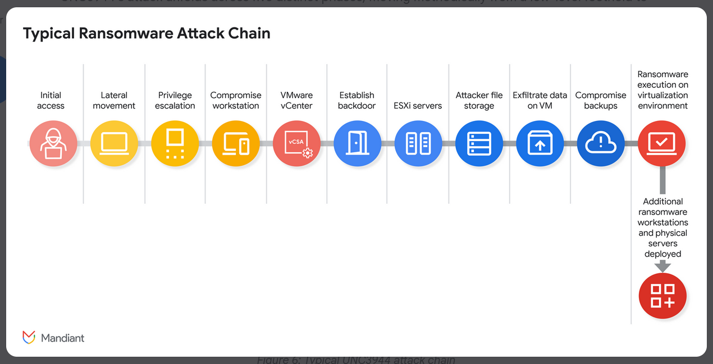

## Overview

Scattered Spider (tracked by Mandiant as **UNC3944**) is a native English-speaking, financially motivated threat group active since 2022. They're best known for bypassing enterprise security through social engineering rather than technical exploits — targeting help desks, abusing SSO platforms, and pivoting through cloud infrastructure once inside. This lab is a deep-dive TI investigation into their TTPs, tooling, and RaaS affiliations.

---

## Investigation

### Identity & Attribution

Mandiant tracks this group as **UNC3944**. The group is also referred to as Octo Tempest and Storm-0875 depending on the vendor. Their most publicised breach was against **Caesars Entertainment** in September 2023, where they exfiltrated approximately six terabytes of data and deployed ransomware.

### Phishing Infrastructure

Scattered Spider creates convincing SSO-themed phishing pages impersonating the target organisation. A documented example targeting Walmart employees used the domain **walmartsso[.]com**, registered through **Hosting Concepts B.V. d/b/a Registrar.eu**.

Source: [Sekoia — Scattered Spider Laying New Eggs](https://blog.sekoia.io/scattered-spider-laying-new-eggs/)

### RaaS Affiliation

Prior to ALPHV/BlackCat's apparent shutdown, Scattered Spider operated as an **ALPHV** affiliate — leveraging the RaaS for their high-profile casino attacks. In 2024, the group shifted to emerging RaaS platforms **Qilin** and **RansomHub**.

Sources: [Darktrace — Untangling the Web](https://www.darktrace.com/blog/untangling-the-web-darktraces-investigation-of-scattered-spiders-evolving-tactics)

### EDR Abuse

In a Mandiant-reported incident, the group abused CrowdStrike Falcon's **Real Time Response (RTR)** module to execute commands including `whoami` and `quser` directly within the victim environment — living off the security tooling already present.

Source: [Google Cloud / Mandiant — UNC3944 Targets SaaS Applications](https://cloud.google.com/blog/topics/threat-intelligence/unc3944-targets-saas-applications)

### VM Persistence & Defense Evasion

The group establishes persistence by creating new virtual machines in vSphere and Azure, then deploying a batch script called **privacy-script.bat** to disable defenses on the freshly spun-up VMs.

For Azure credential and secret enumeration, they use the open-source PowerShell toolkit **MicroBurst** — capable of pulling storage keys, secrets, and connection strings from Azure environments.

Source: [Google Cloud / Mandiant — UNC3944 Targets SaaS Applications](https://cloud.google.com/blog/topics/threat-intelligence/unc3944-targets-saas-applications)

### Credential Access & Bypassing Domain Controls

In vSphere environments, Scattered Spider uses **PCUnlocker** to reset local administrator passwords, effectively bypassing domain controls and gaining persistent local access.

For browser-based credential theft, the group deploys **Raccoon Stealer** to harvest browser history and cookies post-foothold.

Source: [MITRE ATT&CK — Raccoon Stealer S1148](https://attack.mitre.org/software/S1148/)

### Cloud Exfiltration

The group exfiltrates data from cloud-hosted sources to attacker-controlled S3 buckets using ETL (Extract, Transform, Load) tools — specifically **Airbyte** and **Fivetran** — to blend in with legitimate data pipeline traffic.

Source: [Google Cloud / Mandiant — UNC3944 Targets SaaS Applications](https://cloud.google.com/blog/topics/threat-intelligence/unc3944-targets-saas-applications)

### Ransomware Binary Analysis

Analysis of the ransomware binary (SHA256: `df8d000833243acc0004595b3a8d4b66fcd7b76d8685d5c2ff61ee2a40a0e92c`) via Joe Sandbox reveals a YARA-detectable string indicating VSS deletion:

```
vssadmin.exe Delete Shadows /all /quietshadow_copy::remove_all_vss=
```

Source: [Joe Sandbox Report](https://www.joesandbox.com/analysis/1612710/0/html)

---

## MITRE ATT&CK

|Tactic|Technique|Description|
|---|---|---|
|Reconnaissance|T1598|Phishing for Information (SSO/help desk lures)|
|Initial Access|T1566|Phishing (smishing, SSO-themed pages)|
|Initial Access|T1621|MFA Request Generation (MFA fatigue)|
|Persistence|T1136|Create Account (new VMs in vSphere/Azure)|
|Defense Evasion|T1562.001|Impair Defenses (privacy-script.bat)|
|Defense Evasion|T1656|Impersonation|
|Credential Access|T1003|OS Credential Dumping (PCUnlocker)|
|Credential Access|T1539|Steal Web Session Cookie (Raccoon Stealer)|
|Discovery|T1059.001|PowerShell (MicroBurst — Azure enumeration)|
|Collection|T1530|Data from Cloud Storage Object|
|Exfiltration|T1567|Exfiltration Over Web Service (ETL tools to S3)|
|Impact|T1486|Data Encrypted for Impact (ALPHV/Qilin/RansomHub)|
|Impact|T1657|Financial Theft|

---

## IOCs

|Type|Value|
|---|---|
|Phishing Domain|walmartsso[.]com|
|Ransomware SHA256|df8d000833243acc0004595b3a8d4b66fcd7b76d8685d5c2ff61ee2a40a0e92c|


---


























