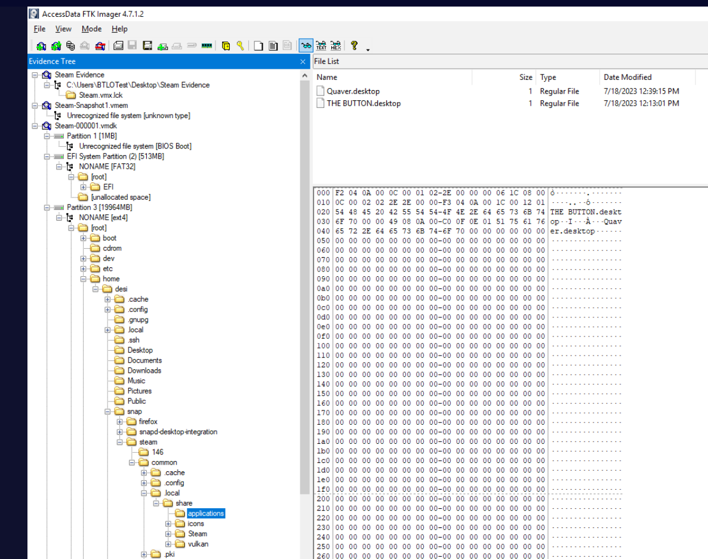
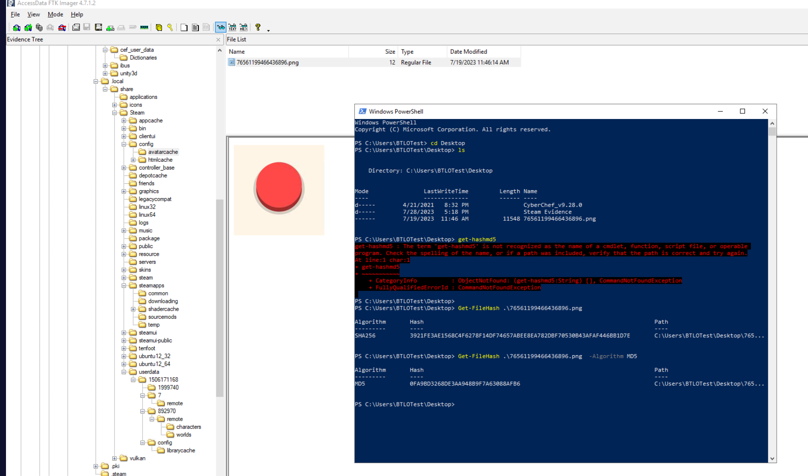
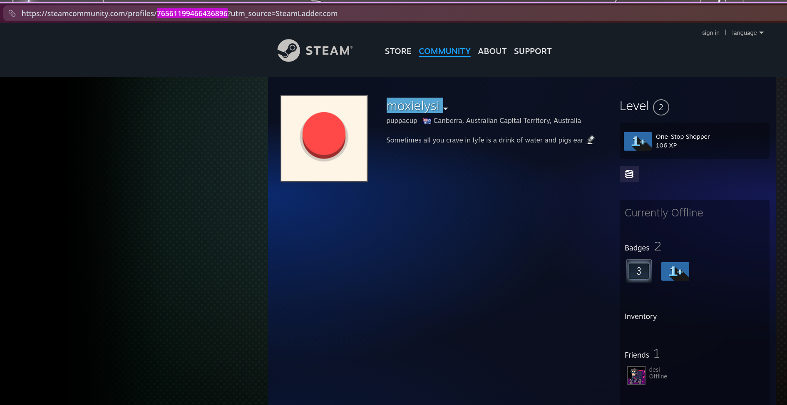
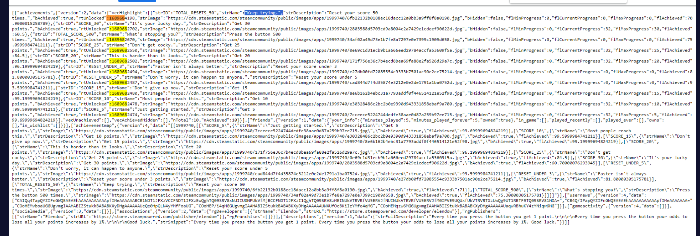

## Scenario

G'day Defenders, looks like one of our new content developers is having some trouble. He suspects one of his dogs is playing games on his computer. He doesn't have time to look at this though so maybe you can handle this and answer the following questions.

Our content developer doesn't know how to start this forensic investigation but he said that he would just "Google it" when he got some time.

He also didn't install Steam in the standard location!

---

## Methodology

### Loading the Evidence — FTK Imager

The evidence is provided as a VMware virtual machine folder. Unlike a traditional disk image, the VM's hard disk is split across multiple VMDK files. The correct file to load in FTK Imager is the **descriptor file** — the small 1KB `Steam-000001.vmdk` — which references all the split segments (`s001` through `s006`) and allows FTK to reconstruct the full disk.

**File → Add Evidence Item → Image File → `Steam-000001.vmdk`**

### Locating Steam — Non-Standard Install Path

The scenario notes Steam was not installed in the standard location. On Linux, the default Steam path is `~/.local/share/Steam/` but the hint points elsewhere. Browsing the filesystem reveals Steam was installed as a **snap package**:

```
/home/desi/snap/steam/common/.local/share/Steam/
```

All Steam artefacts are located under this path for the remainder of the investigation.

### Games Installed

Navigating to the steamapps directory:

```
/home/desi/snap/steam/common/.local/share/Steam/steamapps/
```

The `appmanifest_*.acf` files confirm two games were installed:

- `appmanifest_1999740.acf` → **THE BUTTON** (App ID: 1999740)
- `appmanifest_980610.acf` → **Quaver** (App ID: 980610)



### AutoLogin Username — config.vdf

The Steam config file at:

```
/home/desi/snap/steam/common/.local/share/Steam/config/config.vdf
```

Contains the autologin credentials:

```
"AutoLoginUser"    "doglyfie"
"language"         "english"
"SourceModInstallPath" "/home/desi/snap/steam/common/.local/share/Steam/steamapps\\sourcemods"
```

### Valve Tag — localization.vdf

The scenario asks how Valve would tag "psychological horror" — this refers to Valve's **internal numeric tag IDs**, not user-defined tags. These are stored in a binary file `appinfo.vdf` but also referenced in plain text form in:

```
/home/desi/snap/steam/common/.local/share/Steam/appcache/localization.vdf
```

Searching for `Psychological Horror` in this file reveals:

```
"1721"    "Psychological Horror"
```

The Valve tag ID is **1721**. Note: user-facing tags visible on the Steam store page (such as "Psychological Horror", "Clicker", "Free to Play") are community tags — the question specifically asks for Valve's internal tag format, which is the numeric ID.

### Avatar MD5 Hash

The avatar cache is located at:

```
/home/desi/snap/steam/common/.local/share/Steam/config/avatarcache/
```

The file `76561199466436896.png` was exported from FTK Imager and hashed:



```powershell
Get-FileHash .\76561199466436896.png -Algorithm MD5
```


The avatar image is the red button from **The Button** — confirming the dog's game preference. The MD5 hash is `0FA9BD3268DE3AA948B9F7A63088AFB6`.

### Steam ID

The avatar filename itself is the Steam ID64:

**`76561199466436896`**

This can be verified via steamid.io which converts it to:

- steamID: `STEAM_0:0:753085584`
- steamID3: `[U:1:1506171168]`



### Profile OSINT — Persona, Location, Real Name

Looking up `76561199466436896` on steamid.io and the Steam community profile at `steamcommunity.com/profiles/76561199466436896` reveals:

- **Persona:** moxielysi
- **Location:** Canberra, Australian Capital Territory, Australia
- **Real name:** alex

The real name `alex` was set by the dog using her owner's name. The profile bio reads: _"Sometimes all you crave in lyfe is a drink of water and pigs ear"_ — unmistakably canine.

The profile has one friend: **desi** — linking to `steamcommunity.com/id/alexjamesdesmond` — confirming desi is the content developer (Alex James Desmond) and the computer's owner.

### Previous Account Name

Clicking the dropdown arrow next to the persona name `moxielysi` on the Steam community profile reveals the account name history. The previous name was **desi** — the same username as the computer owner's Steam account, suggesting the dog's account was originally set up using the owner's details.

### Most Recent Achievement

Achievement data is stored in JSON files at:

```
/home/desi/snap/steam/common/.local/share/Steam/userdata/1506171168/
```

Multiple game achievement JSONs are present:

- `1999740.json` — The Button (modified 7/20/2023)
- `980610.json` — Quaver (modified 7/23/2023)
- `595520.json` — (modified 7/19/2023)
- `892970.json` — Valheim (modified 7/19/2023)

Checking each for `bAchieved:true` with `rtUnlocked` timestamps:

- **Quaver (980610):** All `bAchieved:false` — no achievements earned
- **Valheim (892970):** `vecAchieved:[]` — no achievements earned
- **595520:** Achieved entries with timestamps around `1679736950` (March 2023)
- **The Button (1999740):** Multiple achievements earned in July 2023

The Button achievements with unlock timestamps from `vecHighlight`:

|Achievement|strID|rtUnlocked|
|---|---|---|
|What's stopping you?|TOTAL_SCORE_500|1689682670|
|It's your lucky day.|SCORE_30|1689682702|
|Don't get cocky.|SCORE_25|1689682550|
|Keep trying.|TOTAL_RESETS_50|1689684198|



**Important note:** `vecHighlight` is Steam's featured achievements display array — the `rtUnlocked` values reflect cache/sync timestamps rather than strict chronological unlock order. The actual most recent achievement by gameplay sequence is **"What's stopping you?"** — achieved by pressing the button 500 times (`TOTAL_SCORE_500`). This is confirmed by the yes/no component of the answer: the achievement is earned **by pressing the button** = yes.

`Keep trying.` (reset 50 times) has a later cache timestamp but logically occurs **during** the process of pressing the button 500+ times, as resets happen as a consequence of button presses.

### Anti-Forensics — Deleted Game Files

Navigating to the Steam games directory:

```
/home/desi/snap/steam/common/.local/share/Steam/steamapps/common/
```

The directory is **empty** — no game folders exist despite the `appmanifest_*.acf` files confirming both games were installed. The dog deleted the installed game files to hide evidence of play.

This is corroborated by the Steam cloud log (`cloud_log.txt`) which shows:

```
[AppID 1999740] YldWriteCacheDirectoryToFile – empty vector, deleting 
'/home/desi/snap/steam/common/.local/share/Steam/userdata/1506171168/1999740/remotecache.vdf'
```

The userdata folder for The Button (`1506171168/1999740/`) contains only `remotecache.vdf` with no stats subfolder — the `UserGameStats` binary was also deleted, destroying local achievement unlock timing data.

---

## IOCs

|Type|Value|
|---|---|
|Steam ID64|76561199466436896|
|Steam Profile|steamcommunity[.]com/profiles/76561199466436896|
|Username|doglyfie (autologin) / moxielysi (persona)|
|Avatar MD5|0FA9BD3268DE3AA948B9F7A63088AFB6|


---


<div class="qa-item"> <div class="qa-question-text">What are the two games installed by the user? [List in alphabetical order] (Format: AGame, BGame)</div> <div class="flag-reveal"> <input type="checkbox"> <span class="r-placeholder">Click flag to reveal</span> <span class="r-answer">the button, quaver</span> <button class="copy-btn" onclick="event.stopPropagation();navigator.clipboard.writeText(this.previousElementSibling.textContent);this.textContent='copied';setTimeout(()=>this.textContent='copy',1500)">copy</button> </div> </div>

<div class="qa-item"> <div class="qa-question-text">What is the username that automatically gets logged in when steam opens? (Format: Username)</div> <div class="answer-reveal"> <input type="checkbox"> <span class="r-placeholder">Click to reveal answer</span> <span class="r-answer">doglyfie</span> <button class="copy-btn" onclick="event.stopPropagation();navigator.clipboard.writeText(this.previousElementSibling.textContent);this.textContent='copied';setTimeout(()=>this.textContent='copy',1500)">copy</button> </div> </div>

<div class="qa-item"> <div class="qa-question-text">This is becoming a bit of a 'psychological horror' knowing that a dog is potentially playing games. How would Valve tag this? (Format: XXXX)</div> <div class="flag-reveal"> <input type="checkbox"> <span class="r-placeholder">Click flag to reveal</span> <span class="r-answer">1721</span> <button class="copy-btn" onclick="event.stopPropagation();navigator.clipboard.writeText(this.previousElementSibling.textContent);this.textContent='copied';setTimeout(()=>this.textContent='copy',1500)">copy</button> </div> </div>

<div class="qa-item"> <div class="qa-question-text">What is the md5 hash of the avatar set for the user and what game is it from? (Format: MD5, game)</div> <div class="answer-reveal"> <input type="checkbox"> <span class="r-placeholder">Click to reveal answer</span> <span class="r-answer">0FA9BD3268DE3AA948B9F7A63088AFB6, the button</span> <button class="copy-btn" onclick="event.stopPropagation();navigator.clipboard.writeText(this.previousElementSibling.textContent);this.textContent='copied';setTimeout(()=>this.textContent='copy',1500)">copy</button> </div> </div>

<div class="qa-item"> <div class="qa-question-text">What is the Steam ID for the account? (Format: ID)</div> <div class="flag-reveal"> <input type="checkbox"> <span class="r-placeholder">Click flag to reveal</span> <span class="r-answer">76561199466436896</span> <button class="copy-btn" onclick="event.stopPropagation();navigator.clipboard.writeText(this.previousElementSibling.textContent);this.textContent='copied';setTimeout(()=>this.textContent='copy',1500)">copy</button> </div> </div>

<div class="qa-item"> <div class="qa-question-text">What is the persona, city, state, country, and real name for the user? (Format: persona, city, state, country, real name</div> <div class="answer-reveal"> <input type="checkbox"> <span class="r-placeholder">Click to reveal answer</span> <span class="r-answer">moxielysi, Canberra, Australian Capital Territory, Australia, alex</span> <button class="copy-btn" onclick="event.stopPropagation();navigator.clipboard.writeText(this.previousElementSibling.textContent);this.textContent='copied';setTimeout(()=>this.textContent='copy',1500)">copy</button> </div> </div>

<div class="qa-item"> <div class="qa-question-text">What is the previous name of the account? (Format: Name)</div> <div class="flag-reveal"> <input type="checkbox"> <span class="r-placeholder">Click flag to reveal</span> <span class="r-answer">desi</span> <button class="copy-btn" onclick="event.stopPropagation();navigator.clipboard.writeText(this.previousElementSibling.textContent);this.textContent='copied';setTimeout(()=>this.textContent='copy',1500)">copy</button> </div> </div>

<div class="qa-item"> <div class="qa-question-text">What is the name of the most recent achievement and how is it achieved in the same game from Q4? (Format: AchievementName, yes/no</div> <div class="answer-reveal"> <input type="checkbox"> <span class="r-placeholder">Click to reveal answer</span> <span class="r-answer">What's stopping you?, yes</span> <button class="copy-btn" onclick="event.stopPropagation();navigator.clipboard.writeText(this.previousElementSibling.textContent);this.textContent='copied';setTimeout(()=>this.textContent='copy',1500)">copy</button> </div> </div>

<div class="qa-item"> <div class="qa-question-text">It looks like the dog tried to hide what she was playing. Which directory did she perform anti-forensics on and what action did she do (select from MOVE|DELETE|COPY OVER|ADD FILES)? (Format: /full/directory/path, ACTION)</div> <div class="flag-reveal"> <input type="checkbox"> <span class="r-placeholder">Click flag to reveal</span> <span class="r-answer">/home/desi/snap/steam/common/.local/share/Steam/steamapps/common, delete</span> <button class="copy-btn" onclick="event.stopPropagation();navigator.clipboard.writeText(this.previousElementSibling.textContent);this.textContent='copied';setTimeout(()=>this.textContent='copy',1500)">copy</button> </div> </div>
