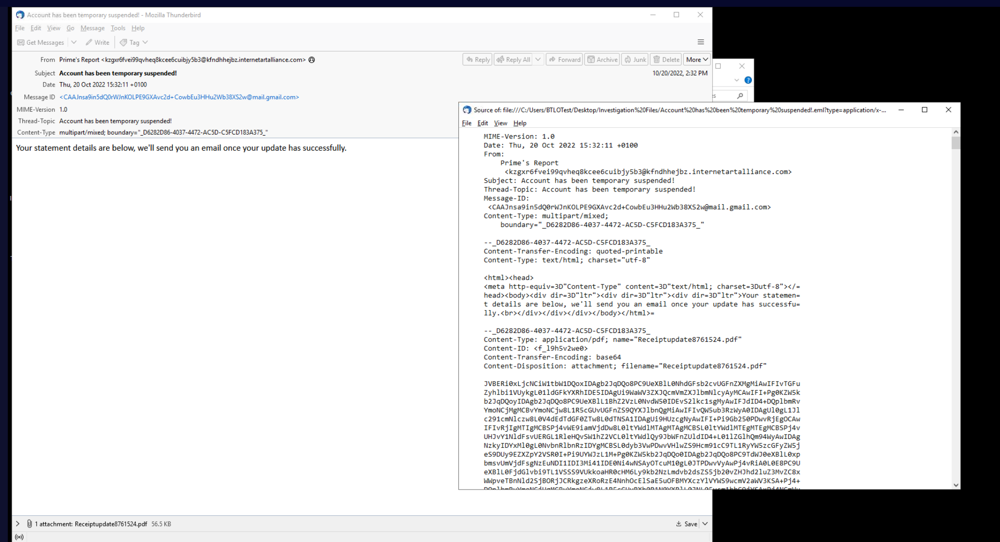
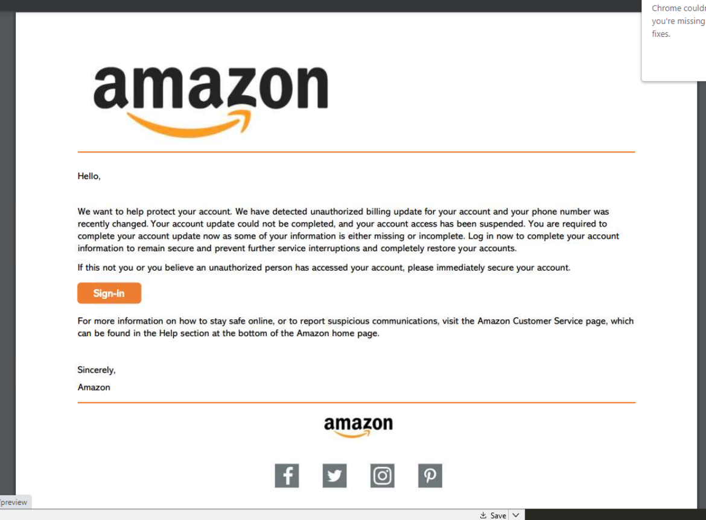
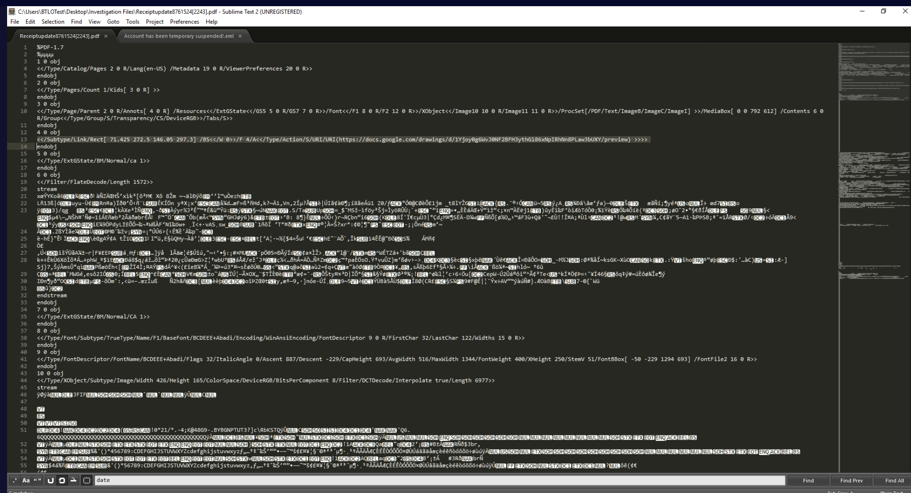

## Scenario

A phishing email is submitted to the SOC for analysis. The task is to triage the email file, extract indicators for scoping and defensive activities, and trace the attack chain from initial lure through to the final malicious destination.

---

## Methodology

### Stage 1 — Email Header Analysis

Opening the raw email file in Sublime Text exposes the full header structure and message body. The key fields for scoping and attribution:



```
Subject:  Account has been temporary suspended!
Date:     Thu, 20 Oct 2022 15:32:11 +0100
From:     Prime's Report <kzgxr6fvei99qvheq8kcee6cuibjy5b3@kfndhhejbz.internetartalliance.com>
```

The from address is the first red flag — a legitimate Amazon communication would never originate from `internetartalliance.com`. The randomised local part (`kzgxr6fvei99qvheq8kcee6cuibjy5b3`) and the domain are entirely unrelated to Amazon. The display name `Prime's Report` is crafted to trigger concern in recipients who are Amazon Prime subscribers.

The subject line `Account has been temporary suspended!` is a classic urgency lure — grammatical errors (`temporary` instead of `temporarily`) are common in phishing emails and serve as a passive filter to select less security-aware targets.

### Stage 2 — Attachment Extraction

The email contains an attachment declared in the Content-Disposition header:

```
Content-Disposition: attachment; filename="Receiptupdate8761524.pdf"
```

The filename mimics a legitimate Amazon receipt update notification — designed to appear routine and encourage opening. The attachment body in the raw email is Base64 encoded, which is standard for email attachments but also convenient for analysts — it can be extracted and decoded directly in CyberChef.

### Stage 3 — PDF Analysis via CyberChef

Extracting the Base64 content from the email body and decoding it in CyberChef reveals the raw PDF content. Searching the decoded output for `http` surfaces the embedded URL:

```
https://docs.google.com/drawings/d/1Yjoy0g6WvJ0NF2BFH3ythG186xNpIRhNn8PLaw3bUXY/preview
```

The PDF links to a Google Drawings page rather than a directly malicious URL — a deliberate evasion technique. Google Drawings URLs pass reputation-based URL filters because `docs.google.com` is a trusted domain. The malicious content is one hop further, hosted on the Google infrastructure as a staging layer.

### Stage 4 — PDF File Hashing

The extracted PDF file is hashed for IOC generation and EDR/SIEM searching:

```zsh
Get-FileHash '.\Receiptupdate8761524[2243].pdf'
```
```
SHA256: 71B6E937013A6A961F3BA8A4FE942DC34A58B9DDEBC79C628E1C0AD572B3755B
```

This hash can be submitted to VirusTotal and used as an EDR search term to identify any endpoints that have received or executed the file.

### Stage 5 — Lure Document Analysis

Opening the PDF reveals a convincing Amazon impersonation — logos, branding, and formatting designed to appear as a legitimate account suspension notice:



The document contains a call-to-action button linking to the Google Drawings URL. The Google Drawings page in turn renders what appears to be an Amazon login prompt with a clickable button — a second-stage lure designed to redirect the victim to the actual phishing domain.

### Stage 6 — URL Chain Analysis

Opening the Google Drawings page and inspecting the call-to-action button reveals the full redirect URL:


```
https://www.google.com/url?q=http://gaykauaiwedding.com/&sa=D&source=editors&ust=1666280016126192&usg=AOvVaw2-OKnMwaN5jcbNehzfwq7p
````

The redirect chain is: **PDF → Google Drawings → Google redirect → gaykauaiwedding.com**

The attacker routes through two Google-hosted layers before reaching the final destination. Each hop adds legitimacy — URL scanners and gateway filters that evaluate only the immediately visible link see `docs.google.com` and `google.com`, not `gaykauaiwedding.com`. The final domain is the credential harvesting site.

The full attack chain uses both a malicious attachment (T1566.001) and an embedded malicious link (T1566.002) — two phishing sub-techniques deployed in a single email.

---

## Attack Summary

|Phase|Action|
|---|---|
|Delivery|Phishing email from Prime's Report via internetartalliance.com|
|Lure|Subject line claims Amazon account suspended — urgency trigger|
|Attachment|Receiptupdate8761524.pdf — Base64 encoded, embedded malicious URL|
|Redirect Hop 1|PDF links to Google Drawings page (docs.google.com — trusted domain)|
|Redirect Hop 2|Google Drawings links via google.com/url redirect|
|Final Destination|gaykauaiwedding.com — credential harvesting site|
|Impersonation|Amazon branding throughout PDF and Google Drawings page|

---

## IOCs

|Type|Value|
|---|---|
|Subject Line|Account has been temporary suspended!|
|From Name|Prime's Report|
|From Address|kzgxr6fvei99qvheq8kcee6cuibjy5b3@kfndhhejbz[.]internetartalliance[.]com|
|Date|Thu, 20 Oct 2022 15:32:11 +0100|
|Attachment|Receiptupdate8761524.pdf|
|SHA256|71B6E937013A6A961F3BA8A4FE942DC34A58B9DDEBC79C628E1C0AD572B3755B|
|URL (Stage 1)|hxxps[://]docs[.]google[.]com/drawings/d/1Yjoy0g6WvJ0NF2BFH3ythG186xNpIRhNn8PLaw3bUXY/preview|
|URL (Stage 2)|hxxps[://]www[.]google[.]com/url?q=hxxp[://]gaykauaiwedding[.]com/|
|Domain (Final)|gaykauaiwedding[.]com|
|Brand Impersonated|Amazon|

---

## MITRE ATT&CK

|Technique|ID|Description|
|---|---|---|
|Phishing: Spearphishing Attachment|T1566.001|Malicious PDF attachment embedded in email lure|
|Phishing: Spearphishing Link|T1566.002|Multi-hop redirect chain embedded in PDF leading to credential harvesting domain|

---

## Defender Takeaways

**Multi-hop redirect chains bypass URL reputation filtering** — routing the victim through `docs.google.com` and `google.com/url` before reaching the malicious domain is a deliberate evasion technique. Standard URL reputation filters evaluate the immediately visible link, not the final redirect destination. Sandboxing email attachments and following redirect chains to their final destination — rather than checking only the first hop — is required to detect this pattern. Solutions like URLScan or email gateways with full redirect chain analysis address this gap.

**Trusted platform abuse is a detection blind spot** — Google Drawings, Google Docs, and similar SaaS platforms are frequently abused as phishing staging infrastructure because their domains have near-universal trust. Blocking or alerting on outbound connections to `docs.google.com` is not practical, but monitoring for users navigating from Google Drawings pages directly to credential entry forms — or flagging Google redirect URLs (`google.com/url?q=`) in email bodies — provides a more targeted detection layer.

**Base64 PDF analysis as a standard triage step** — the entire attack chain was recoverable from the raw email file without executing any payload. Extracting and decoding Base64 email attachments in CyberChef to inspect embedded URLs is a fast, safe triage technique that surfaces IOCs before any sandbox detonation is needed. This should be standard practice for any suspicious email containing an attachment.

**Subject line and sender domain are primary triage signals** — `internetartalliance.com` has no relationship to Amazon and the randomised local part of the address is a clear indicator of automated phishing infrastructure. Email gateway rules alerting on display name spoofing (display name contains "Amazon" but sending domain is not amazon.com) would have flagged this before delivery.

---

<div class="qa-item"> <div class="qa-question-text">Question 1) To help us understand which employees have received this email, we can search in our email gateway for the subject line. What is the subject line of the email? (Format: Subject Line)</div> <div class="flag-reveal"> <input type="checkbox"> <span class="r-placeholder">Click flag to reveal</span> <span class="r-answer">Account has been temporary suspended!</span> <button class="copy-btn" onclick="event.stopPropagation();navigator.clipboard.writeText(this.previousElementSibling.textContent);this.textContent='copied';setTimeout(()=>this.textContent='copy',1500)">copy</button> </div> </div>

<div class="qa-item"> <div class="qa-question-text">Question 2) Alternatively, we can use the sending address to help scope this incident. What is the From name, and the mailbox used to send the email? (Format: From Name, mailbox@domain.tld)</div> <div class="answer-reveal"> <input type="checkbox"> <span class="r-placeholder">Click to reveal answer</span> <span class="r-answer">Prime's Report, kzgxr6fvei99qvheq8kcee6cuibjy5b3@kfndhhejbz.internetartalliance.com</span> <button class="copy-btn" onclick="event.stopPropagation();navigator.clipboard.writeText(this.previousElementSibling.textContent);this.textContent='copied';setTimeout(()=>this.textContent='copy',1500)">copy</button> </div> </div>

<div class="qa-item"> <div class="qa-question-text">Question 3) Based on the email file when viewed in a text editor, what is the value of the Date property? (Format: Date Value)</div> <div class="flag-reveal"> <input type="checkbox"> <span class="r-placeholder">Click flag to reveal</span> <span class="r-answer">Thu, 20 Oct 2022 15:32:11 +0100</span> <button class="copy-btn" onclick="event.stopPropagation();navigator.clipboard.writeText(this.previousElementSibling.textContent);this.textContent='copied';setTimeout(()=>this.textContent='copy',1500)">copy</button> </div> </div>

<div class="qa-item"> <div class="qa-question-text">Question 4) What is the filename of the attachment? We can see if any employees have downloaded the attachment by checking our EDR (Format: filename.ext)</div> <div class="answer-reveal"> <input type="checkbox"> <span class="r-placeholder">Click to reveal answer</span> <span class="r-answer">Receiptupdate8761524.pdf</span> <button class="copy-btn" onclick="event.stopPropagation();navigator.clipboard.writeText(this.previousElementSibling.textContent);this.textContent='copied';setTimeout(()=>this.textContent='copy',1500)">copy</button> </div> </div>

<div class="qa-item"> <div class="qa-question-text">Question 5) Extract the Base64 from the email file and use CyberChef to decode - this allows us to see the contents of the attached file. Search for http/https. What is the URL contained within the PDF? (Format: http/s://domain/tld/something)</div> <div class="flag-reveal"> <input type="checkbox"> <span class="r-placeholder">Click flag to reveal</span> <span class="r-answer">https://docs.google.com/drawings/d/1Yjoy0g6WvJ0NF2BFH3ythG186xNpIRhNn8PLaw3bUXY/preview</span> <button class="copy-btn" onclick="event.stopPropagation();navigator.clipboard.writeText(this.previousElementSibling.textContent);this.textContent='copied';setTimeout(()=>this.textContent='copy',1500)">copy</button> </div> </div>

<div class="qa-item"> <div class="qa-question-text">Question 6) Investigate the attached file (found in the Investigation Files folder on the Desktop). What is the SHA256 hash of this file? (Format: SHA256)</div> <div class="answer-reveal"> <input type="checkbox"> <span class="r-placeholder">Click to reveal answer</span> <span class="r-answer">71B6E937013A6A961F3BA8A4FE942DC34A58B9DDEBC79C628E1C0AD572B3755B</span> <button class="copy-btn" onclick="event.stopPropagation();navigator.clipboard.writeText(this.previousElementSibling.textContent);this.textContent='copied';setTimeout(()=>this.textContent='copy',1500)">copy</button> </div> </div>

<div class="qa-item"> <div class="qa-question-text">Question 7) Open the attached file. What company is this document imitating? (Format: Company Name)</div> <div class="flag-reveal"> <input type="checkbox"> <span class="r-placeholder">Click flag to reveal</span> <span class="r-answer">amazon</span> <button class="copy-btn" onclick="event.stopPropagation();navigator.clipboard.writeText(this.previousElementSibling.textContent);this.textContent='copied';setTimeout(()=>this.textContent='copy',1500)">copy</button> </div> </div>

<div class="qa-item"> <div class="qa-question-text">Question 8) To identify if any users have clicked the link within the file, we could search for network connections in our EDR or SIEM. Open the web page file associated with the URL destination. What is the full URL of the call-to-action button? (Format: Full URL)</div> <div class="answer-reveal"> <input type="checkbox"> <span class="r-placeholder">Click to reveal answer</span> <span class="r-answer">https://www.google.com/url?q=http://gaykauaiwedding.com/&sa=D&source=editors&ust=1666280016126192&usg=AOvVaw2-OKnMwaN5jcbNehzfwq7p</span> <button class="copy-btn" onclick="event.stopPropagation();navigator.clipboard.writeText(this.previousElementSibling.textContent);this.textContent='copied';setTimeout(()=>this.textContent='copy',1500)">copy</button> </div> </div>

<div class="qa-item"> <div class="qa-question-text">Question 9) Click the button with the malicious URL and let it (try to) load in the browser (remember, we have no internet in our analysis machine - this is fine). What is the domain name of this site? (Format: domain.tld)</div> <div class="flag-reveal"> <input type="checkbox"> <span class="r-placeholder">Click flag to reveal</span> <span class="r-answer">gaykauaiwedding.com</span> <button class="copy-btn" onclick="event.stopPropagation();navigator.clipboard.writeText(this.previousElementSibling.textContent);this.textContent='copied';setTimeout(()=>this.textContent='copy',1500)">copy</button> </div> </div>

<div class="qa-item"> <div class="qa-question-text">Question 10) Look at the Phishing technique on MITRE ATT&CK. Which two sub-techniques are used by this actor? (Format: TXXXX.XXX, TXXXX.XXX)</div> <div class="answer-reveal"> <input type="checkbox"> <span class="r-placeholder">Click to reveal answer</span> <span class="r-answer">T1566.001, T1566.002</span> <button class="copy-btn" onclick="event.stopPropagation();navigator.clipboard.writeText(this.previousElementSibling.textContent);this.textContent='copied';setTimeout(()=>this.textContent='copy',1500)">copy</button> </div> </div>

