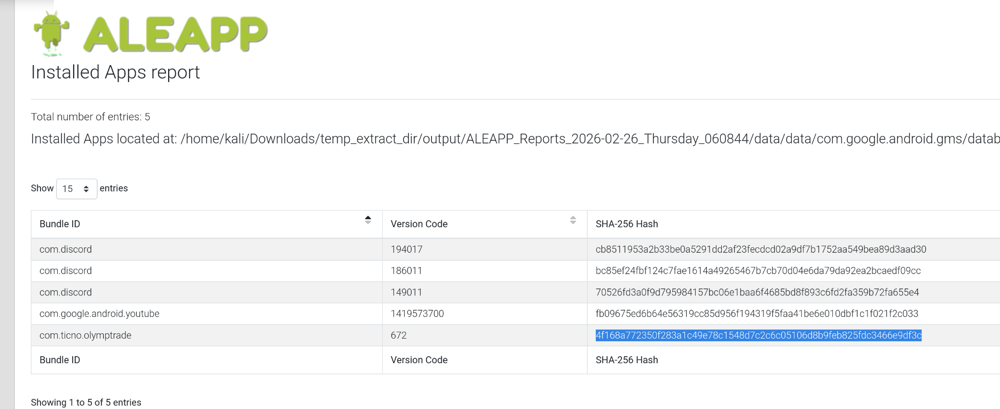
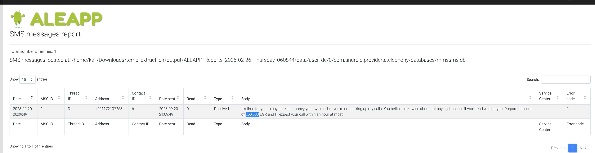
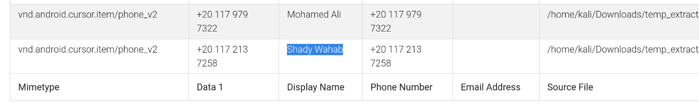
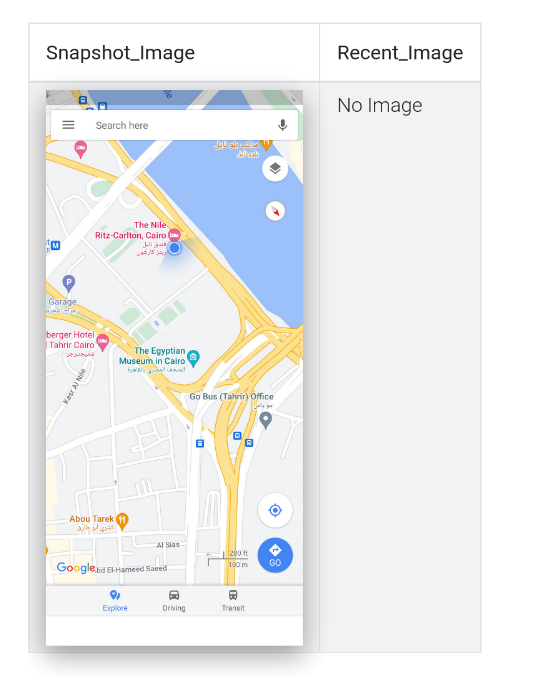
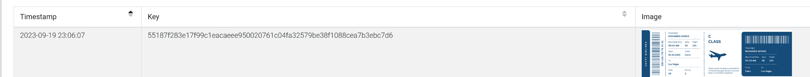
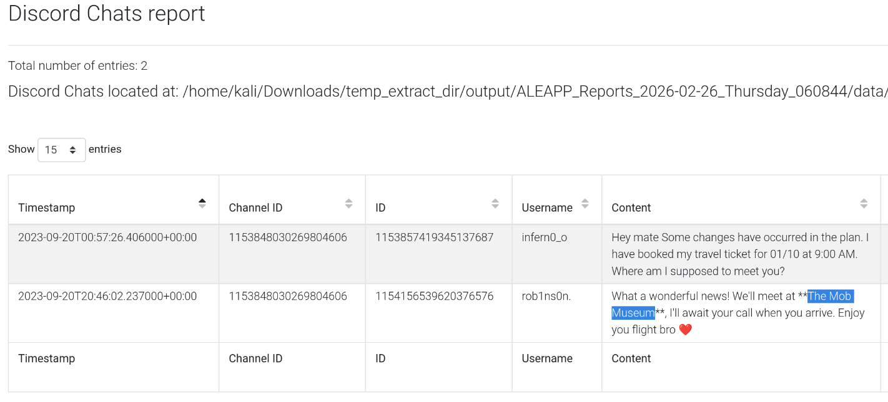

# The Crime – Android Mobile Forensic Investigation

## Overview

During an active homicide investigation, law enforcement acquired the victim’s Android device as critical digital evidence. Witness statements revealed financial distress, suspicious calls, and abrupt travel prior to disappearance.

Using **ALEAPP (Android Logs Events and Protobuf Parser)**, a full filesystem extraction was parsed to reconstruct:

- Financial activity
    
- Communications
    
- Location history
    
- Travel plans
    
- Meeting arrangements
    

The objective was to correlate testimonial evidence with mobile artifacts to establish a timeline of events.

---

## Tooling

- ALEAPP v3.4.0
    
- Full Android filesystem extraction
    
- SMS database analysis
    
- Contacts database review
    
- Discord artifact parsing
    
- Google Maps snapshot review
    
- Image cache inspection 

 Report generated using `python aleappGUI.py`
# Investigation Findings

---

## 1. Trading Activity – Financial Motive

Witnesses stated the victim had invested heavily in trading and accumulated debt.

From the **Installed Applications report** (page 2), the application:

com.ticno.olymptrade

was identified on the device.

**SHA256:**

4f168a772350f283a1c49e78c1548d7c2c6c05106d8b9feb825fdc3466e9df3c

This confirms the victim primarily used **OlympTrade**, a trading platform, supporting the financial instability narrative.

## 2. Debt Confirmation – SMS Analysis

The SMS report (page 3) revealed a threatening message demanding repayment.

Analysis confirmed:

- Outstanding debt: **250,000 EGP**
    
- Sender phone number: **+201172137258**
    
- Contact name: **Shady Wahab**
    

The message tone indicates pressure and potential escalation risk.

This aligns directly with witness testimony about ignored calls and unpaid debt.

## 3. Last Known Location – September 20

Family members stated the victim left home on **September 20, 2023** without notice.

Using Google Maps snapshot artifacts (page 4), the last recorded location shows:

**The Nile Ritz-Carlton, Cairo**

Map evidence places the victim near:

- The Nile River
    
- Tahrir Square
    
- Egyptian Museum
    

This suggests hotel accommodation prior to departure.

## 4. Travel Intent – Airline Ticket Recovery

Photo cache analysis revealed a stored boarding pass image.

Recovered ticket hash:

55187f283e17f99c1eacaeee950020761c04fa32579be38f1088cea7b3ebc7d6

Destination identified:

**Las Vegas**

This matches hotel testimony that the victim booked accommodation for 10 days and had a scheduled flight.

## 5. Discord Communications – Planned Meeting

Discord chat artifacts (page 5) reveal communication between:

- rob1ns0n.
    
- infern0_o
    

Channel ID:

1153848030269804606

Conversation confirms:

- Travel coordination
    
- Change of meeting plan
    
- Final meeting location:
    

**The Mob Museum**

This strongly indicates the victim had arranged an in-person meeting upon arrival.

# Timeline Reconstruction

1. Victim heavily invested in trading via OlympTrade
    
2. Accumulated 250,000 EGP debt to Shady Wahab
    
3. Received pressure messages regarding repayment
    
4. Checked into Ritz-Carlton Cairo on Sept 20
    
5. Stored airline ticket for Las Vegas
    
6. Coordinated meeting at The Mob Museum via Discord
    

This sequence suggests financial distress leading to foreign travel and a prearranged meeting.

---
## IOCs 

| Type | Value |
| ---- | ----- |
| OlympTrade SHA256   | 4f168a772350f283a1c49e78c1548d7c2c6c05106d8b9feb825fdc3466e9df3c |
| Debt Contact        | Shady Wahab                                                      |
| Phone Number        | +201172137258                                                    |
| rob1ns0n.           | 1154156539620376576                                              |
| infern0_o           | 1153857419345137687                                              |
| discord channel     | 1153848030269804606                                              |
| Airline Ticket Hash | 55187f283e17f99c1eacaeee950020761c04fa32579be38f1088cea7b3ebc7d6 |

# Conclusion

Mobile forensic analysis confirmed:

- Significant financial distress linked to trading activity
    
- Verifiable debt and creditor identity
    
- Last known Cairo location prior to departure
    
- Confirmed travel to Las Vegas
    
- Planned meeting at The Mob Museum
    

Correlating device artifacts with witness testimony allowed reconstruction of the victim’s final movements and associations.

This case demonstrates the investigative power of:

- Mobile artifact correlation
    
- Application metadata analysis
    
- SMS evidence extraction
    
- Geolocation reconstruction
    
- Social platform artifact analysis
    

---

I successfully completed The Crime Blue Team Lab at @CyberDefenders!
https://cyberdefenders.org/blueteam-ctf-challenges/achievements/inksec/the-crime/
 
#CyberDefenders #CyberSecurity #BlueYard #BlueTeam #InfoSec #SOC #SOCAnalyst #DFIR #CCD #CyberDefender
