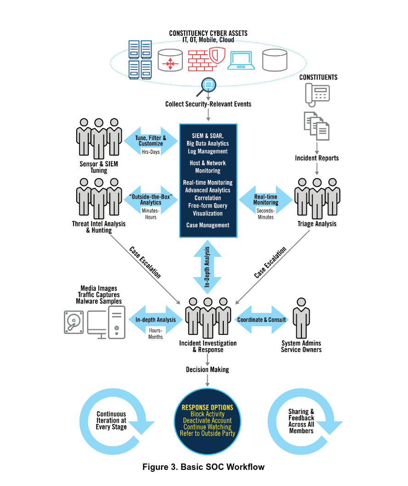
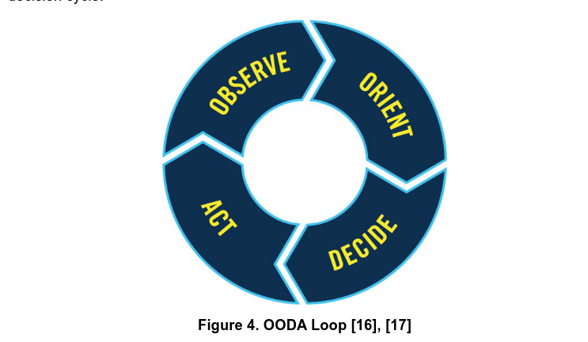
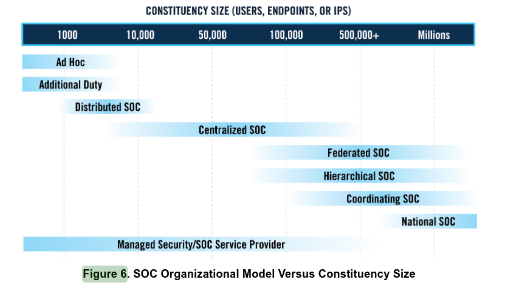
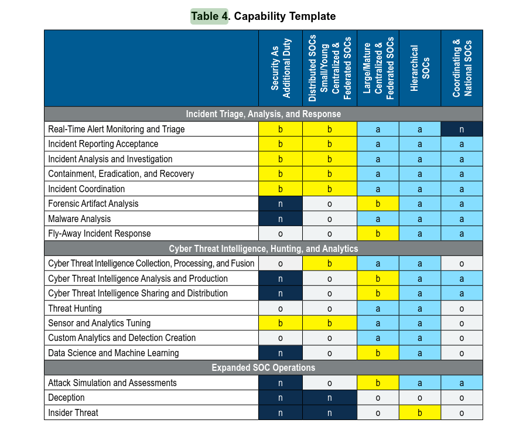
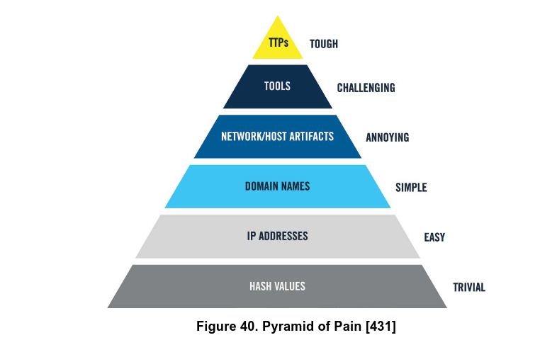

## Overview

This challenge is based on the MITRE publication _11 Strategies of a World-Class Cybersecurity Operations Center_ by Knerler, Parker, and Zimmerman. The task is to read through the document and answer questions covering SOC structure, incident response workflow, data management, and advanced operations.

---

## Investigation

### SOC Team Distinctions

The document clearly distinguishes between three types of units that are often confused:

- The **NOC** (Network Operations Center) is responsible for maintaining network and other IT equipment
- The **SOC** (Security Operations Center) handles incident detection and response
- **ISCM** (Information Security Continuous Monitoring) focuses on security compliance and risk measurement

### Basic SOC Workflow — Response Options

Figure 3 in the Fundamentals section diagrams the Basic SOC Workflow. After collection, triage, in-depth analysis, and decision making, the workflow terminates in a **RESPONSE OPTIONS** box listing four possible actions:

- **Block Activity**
- **Deactivate Account**
- **Continue Watching**
- **Refer to Outside Party**

### Situational Awareness — OODA Loop

The document references the **OODA Loop** (Observe, Orient, Decide, Act) as the military strategy adapted by SOCs to achieve high levels of situational awareness. Originally developed for fighter pilots, the OODA Loop is a self-reinforcing decision cycle that analysts apply continuously — from seconds to years — as they build familiarity with their constituency and threat landscape.

### SOC Organisational Models by Constituency Size

Figure 6 maps constituency size to recommended SOC model. For organisations with **1,000 to 10,000 employees**, the document recommends a **Distributed SOC** — a formal SOC authority comprised of a decentralised pool of resources housed across the constituency.

### Large Centralised SOC — Role Responsibilities

In a Large Centralised SOC, the **SOC Operations Lead** is responsible for generating SOC metrics, maintaining situational awareness, and conducting both internal and external trainings. In smaller SOCs these functions fall to the SOC Lead as an additional duty, but in a large SOC they warrant a dedicated section.

### Coordinating & National SOC — Optional Capabilities

Table 4 (Capability Template) maps functions to SOC models. Under the Expanded SOC Operations category, two functions are listed as **Optional (o)** for Coordinating & National SOCs:

- **Deception**
- **Insider Threat**

### Virtual Console Technologies for Remote Work

Section 3.7.3 discusses succeeding with Virtual SOCs during events like COVID-19. Two virtual console technologies are explicitly named to support remote access to SOC infrastructure:

- **iLO** (Integrated Lights-Out — HP)
- **iDRAC** (Integrated Dell Remote Access Controller)

### Follow the Sun Model

The **Follow the Sun** model distributes SOC 24x7 coverage across two or three operations floors separated by many time zones. Each floor works local business hours (e.g. 9am–5pm), handing off to the next floor at shift end. This eliminates the need for analysts to work night shifts while maintaining continuous coverage.

### Incident Prioritisation

Table 6 (Sample Incident Prioritisation Planning) assigns priorities as follows for the three activities asked about:

|Incident/Event|Priority|
|---|---|
|Phishing|Medium|
|Insider Threat|High|
|Pre-incident Port Scanning|Low|

### Mobile Incident Response — Open Source OS

Section 5.7 covers incident response with mobile devices. For mobile forensics investigations, the document recommends **Santoku** — an open source toolkit specifically designed for mobile forensics, malware analysis, and security that enables investigators to image and analyse devices as well as decompile and disassemble malware.

### CTI Tool Standards

Section 6.6 (CTI Tools) advises that before choosing a CTI tool, organisations should ensure support for two open threat intelligence standards:

- **STIX** (Structured Threat Information eXpression)
- **TAXII** (Trusted Automated eXchange of Intelligence Information)

### Highest Volume Data Source

From Appendix E and supporting footnotes: **PCAP** (full packet capture) is explicitly noted as the data source whose volume "generally dwarfs all other data sources" — typically consuming TBs per day depending on network throughput.

### EDR Data Retention for Forensics

Table 15 (Suggested Minimum Data Retention Time Frames) specifies that EDR, network sensor alerts, and SIEM-correlated alerts should be retained for **6 months** to support SOC forensics and investigations.

### Pyramid of Pain — Indicator Difficulty

The Pyramid of Pain (Figure 40) classifies how difficult each indicator type is for an adversary to change:

|Difficulty|Indicator|
|---|---|
|Trivial|Hash Values|
|Easy|IP Addresses|
|Challenging|Tools|
|Tough|TTPs|

### Red Teaming — Adversary Emulation

Section 11.2.3 describes **Adversary Emulation** as the red teaming approach that specifically mimics the TTPs of a known real-world adversary. Unlike generalised red teaming, adversary emulation is based on a specific named threat actor, mirrors their documented TTPs, and targets the same assets that actor is known to pursue.

---

 
Submit the name of the units/teams (in short form) that are responsible for maintaining network and other IT equipment, incident detection and response, and security compliance and risk measurement
 
 <input type="checkbox"> Click flag to reveal NOC, SOC, ISCM <button class="copy-btn" onclick="event.stopPropagation();navigator.clipboard.writeText(this.previousElementSibling.textContent);this.textContent='copied';setTimeout(()=>this.textContent='copy',1500)">copy</button> 
 

 
Question 2) After investigation, what are the 4 suggested 'Response Options' mentioned in Basic SOC Workflow?
 
 <input type="checkbox"> Click to reveal answer Block Activity, Deactivate Account, Continue Watching, Refer to Outside Party <button class="copy-btn" onclick="event.stopPropagation();navigator.clipboard.writeText(this.previousElementSibling.textContent);this.textContent='copied';setTimeout(()=>this.textContent='copy',1500)">copy</button> 
 

 
Question 3) What is the name of a military strategy used in SOCs to achieve a high level of situational awareness?
 
 <input type="checkbox"> Click flag to reveal OODA Loop <button class="copy-btn" onclick="event.stopPropagation();navigator.clipboard.writeText(this.previousElementSibling.textContent);this.textContent='copied';setTimeout(()=>this.textContent='copy',1500)">copy</button> 
 

 
Question 4) What is the name of the suggested organisational model if the constituency size is between 1000 to 10,000 employees
 
 <input type="checkbox"> Click to reveal answer distributed soc <button class="copy-btn" onclick="event.stopPropagation();navigator.clipboard.writeText(this.previousElementSibling.textContent);this.textContent='copied';setTimeout(()=>this.textContent='copy',1500)">copy</button> 
 

 
Question 5) In a Large Centralised SOC, who is responsible for generating SOC metrics, maintaining situational awareness, and conducting internal/external trainings?
 
 <input type="checkbox"> Click flag to reveal soc operations lead <button class="copy-btn" onclick="event.stopPropagation();navigator.clipboard.writeText(this.previousElementSibling.textContent);this.textContent='copied';setTimeout(()=>this.textContent='copy',1500)">copy</button> 
 

 
Question 6) In Coordinating & National SOCs model what are the 2 functions mentioned as Optional Capability under Expanded SOC Operations Category?
 
 <input type="checkbox"> Click to reveal answer Deception, Insider Threat <button class="copy-btn" onclick="event.stopPropagation();navigator.clipboard.writeText(this.previousElementSibling.textContent);this.textContent='copied';setTimeout(()=>this.textContent='copy',1500)">copy</button> 
 

 
Question 7) What are the two virtual console technologies (in short form) mentioned to support Virtual SOC/ Remote Work scenarios during pandemics?
 
 <input type="checkbox"> Click flag to reveal iLO, iDRAC <button class="copy-btn" onclick="event.stopPropagation();navigator.clipboard.writeText(this.previousElementSibling.textContent);this.textContent='copied';setTimeout(()=>this.textContent='copy',1500)">copy</button> 
 

 
Question 8) What is the name of the model used to distribute work load of SOC 24/7 across different timezones to eliminate working at night hours?
 
 <input type="checkbox"> Click to reveal answer Follow the Sun <button class="copy-btn" onclick="event.stopPropagation();navigator.clipboard.writeText(this.previousElementSibling.textContent);this.textContent='copied';setTimeout(()=>this.textContent='copy',1500)">copy</button> 
 

 
Question 9) Submit the priorities(Low, Medium, High) assigned to Phishing, Insider Threat and Pre-incident Port Scanning activities respectively as per the Incident Prioritization mentioned in the document
 
 <input type="checkbox"> Click flag to reveal Medium, High, Low <button class="copy-btn" onclick="event.stopPropagation();navigator.clipboard.writeText(this.previousElementSibling.textContent);this.textContent='copied';setTimeout(()=>this.textContent='copy',1500)">copy</button> 
 

 
Question 10) Mention the name of the Open source Operating system mentioned, that can help in mobile incident investigations
 
 <input type="checkbox"> Click to reveal answer Santoku <button class="copy-btn" onclick="event.stopPropagation();navigator.clipboard.writeText(this.previousElementSibling.textContent);this.textContent='copied';setTimeout(()=>this.textContent='copy',1500)">copy</button> 
 

 
Question 11) Before choosing a CTI tool, the document suggests tool support for 2 open threat intelligence standards (short forms), what are they?
 
 <input type="checkbox"> Click flag to reveal NOC, SOC, ISCM <button class="copy-btn" onclick="event.stopPropagation();navigator.clipboard.writeText(this.previousElementSibling.textContent);this.textContent='copied';setTimeout(()=>this.textContent='copy',1500)">copy</button> 
 

 
Question 12) Name the Data Source which consumes the highest volume (typically TB's/day)?
 
 <input type="checkbox"> Click to reveal answer pcap <button class="copy-btn" onclick="event.stopPropagation();navigator.clipboard.writeText(this.previousElementSibling.textContent);this.textContent='copied';setTimeout(()=>this.textContent='copy',1500)">copy</button> 
 

 
Question 13) In order to support forensics, what is the recommended data retention period (in months) to store logged EDR data?
 
 <input type="checkbox"> Click flag to reveal 6 <button class="copy-btn" onclick="event.stopPropagation();navigator.clipboard.writeText(this.previousElementSibling.textContent);this.textContent='copied';setTimeout(()=>this.textContent='copy',1500)">copy</button> 
 

 
Question 14) According to the threat intelligence concept the 'Pyramid of Pain', what indicators are Trivial, Easy, Challenging, Tough for adversaries to change?
 
 <input type="checkbox"> Click to reveal answer Hash Values, IP Addresses, tools, TTPs <button class="copy-btn" onclick="event.stopPropagation();navigator.clipboard.writeText(this.previousElementSibling.textContent);this.textContent='copied';setTimeout(()=>this.textContent='copy',1500)">copy</button> 
 

 
Question 15) Name of the Red Teaming approach to mimic the TTPs of an adversary?
 
 <input type="checkbox"> Click flag to reveal Adversary Emulation <button class="copy-btn" onclick="event.stopPropagation();navigator.clipboard.writeText(this.previousElementSibling.textContent);this.textContent='copied';setTimeout(()=>this.textContent='copy',1500)">copy</button> 
 

