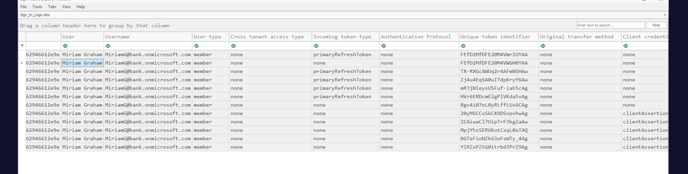
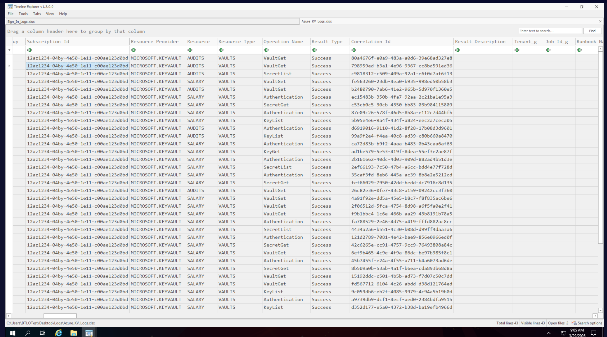

## Scenario

Microsoft Defender for Cloud fires an alert — "Unusual access to the key vault from a suspicious IP" — flagging anomalous Key Vault access from `201.231.8.199`. The alert is classified as Credential Access, severity Medium. Two log sources are provided: Azure Sign-In logs and Azure Key Vault Diagnostic logs, both loaded into Timeline Explorer for analysis.

---

## Methodology

### Stage 1 — Sign-In Log Analysis: Account Attribution

The first task is attributing the suspicious IP to a specific account. Opening `Sign_In_Logs.xlsx` in Timeline Explorer and filtering the IP address column for `201.231.8.199` surfaces the compromised identity immediately:



Key fields from the matching sign-in event:

- **Display Name**: Miriam Graham
- **UPN**: [miriamg@bank.onmicrosoft.com](mailto:miriamg@bank.onmicrosoft.com)
- **User Type**: Member — a full internal account, not a guest or external identity
- **Incoming Token Type**: primaryRefreshToken — a long-lived token that provides persistent access across multiple Azure services without repeated authentication
- **Conditional Access**: Not applied — no policy enforced requiring MFA or blocking the suspicious IP

The `primaryRefreshToken` is significant. PRTs are issued to devices registered in Azure AD and allow seamless SSO across the tenant. If an attacker obtains a PRT — via token theft, pass-the-token, or device compromise — they can authenticate as the user to any Azure resource without knowing the password and without triggering credential-based detections. The absence of Conditional Access meant there was no compensating control to block the anomalous sign-in.

### Stage 2 — Key Vault Diagnostic Logs: Vault Enumeration

Switching to `Azure_KV_Logs.xlsx`, the subscription ID and resource group are visible in the resource path column:


- **Subscription ID**: Id12az1234-04by-4e50-1e11-c00ae123d0bd
- **Resource Group**: FINANCE
- **Vaults accessed**: `SALARY` and `AUDITS` — two Key Vaults within the FINANCE resource group

The resource paths follow the pattern:

```
/RESOURCEGROUPS/FINANCE/PROVIDERS/MICROSOFT.KEYVAULT/VAULTS/SALARY
/RESOURCEGROUPS/FINANCE/PROVIDERS/MICROSOFT.KEYVAULT/VAULTS/AUDITS
```

Both vaults were accessed, with the majority of sensitive operations concentrated in SALARY.

### Stage 3 — Application Attribution via App ID

Sorting the `identity_claim_appid_g` column and filtering for the known Microsoft Azure CLI application ID `04b07795-8ddb-461a-bbee-02f9e1bf7b46` reveals the tooling used:

- **Operations executed**: 14
- **Application Display Name**: Microsoft Azure CLI
- **User Agent**: `azsdk-python-keyvault-secrets/4.7.0 Python/3.11.5 (Windows-10-10.0.19044-SP0)`

The Python SDK user agent confirms the attacker used Azure CLI scripting — the `azsdk-python-keyvault-secrets` library is the backend the CLI uses for Key Vault secret operations. Running 14 operations programmatically against sensitive financial vaults via CLI indicates this was scripted enumeration, not manual portal browsing.

### Stage 4 — Key and Secret Identification

Examining the `request_Uri_s` column for SALARY vault operations surfaces both a cryptographic key and a secret:

```
https://salary.vault.azure.net/keys/Payroll
https://salary.vault.azure.net/secrets/Confidential
```

- **Key Vault containing the key**: salary
- **Key name**: Payroll — a cryptographic key stored in the SALARY vault, likely used for encrypting payroll data
- **Secret name**: Confidential — a secret value stored in the same vault, accessed via SecretGet operations

The operation sequence visible in the logs — Authentication → KeyList → SecretList → KeyGet → SecretGet — follows a systematic enumeration pattern: first discover what exists, then retrieve the values. This is consistent with automated credential harvesting tooling.

### Stage 5 — Correlation ID Investigation

Filtering the `Correlation Id` column for `9c059db6-eb2f-4085-9979-4c94a5b19b0d` returns a single row:

- **Operation**: KeyList
- **Request URI**: `https://salary.vault.azure.net/keys?api-version=7.0`
- **Application**: Microsoft Azure PowerShell

The PowerShell client info field confirms: `FxVersion/4.8.4645.0 ... Microsoft.Azure.KeyVault.KeyVaultClient/3.0.1.0 AzurePowershell/v0.0.0 PSVersion/v5.1.19041.1237 Az.KeyVault/5.0.1`

This reveals the attacker used two distinct tools — Azure CLI (Python SDK) for secret operations and Azure PowerShell for key enumeration — indicating a prepared attack toolkit rather than opportunistic manual access.

---

## Attack Summary

|Phase|Action|
|---|---|
|Initial Access|Miriam Graham's account accessed from suspicious IP 201.231.8.199 using primaryRefreshToken|
|No MFA Enforcement|No Conditional Access policy applied — sign-in succeeded without challenge|
|Vault Discovery|FINANCE resource group enumerated — SALARY and AUDITS vaults identified|
|Key Enumeration|KeyList operations via Azure PowerShell against SALARY vault|
|Secret Enumeration|SecretList → SecretGet operations via Azure CLI Python SDK|
|Data Access|Payroll key and Confidential secret retrieved from SALARY vault|
|Tooling|Azure CLI (azsdk-python-keyvault-secrets/4.7.0) + Azure PowerShell (Az.KeyVault/5.0.1)|

---

## IOCs

|Type|Value|
|---|---|
|IP (Suspicious)|201[.]231[.]8[.]199|
|Account (Compromised)|Miriam Graham|
|UPN|miriamg@bank[.]onmicrosoft[.]com|
|Token Type|primaryRefreshToken|
|Subscription ID|Id12az1234-04by-4e50-1e11-c00ae123d0bd|
|Resource Group|FINANCE|
|Vault 1|SALARY|
|Vault 2|AUDITS|
|Key Accessed|Payroll|
|Secret Accessed|Confidential|
|App ID|04b07795-8ddb-461a-bbee-02f9e1bf7b46|
|App Name|Microsoft Azure CLI|
|User Agent (CLI)|azsdk-python-keyvault-secrets/4.7.0 Python/3.11.5 (Windows-10-10.0.19044-SP0)|
|User Agent (PS)|FxVersion/4.8.4645.0 Microsoft.Azure.KeyVault.KeyVaultClient/3.0.1.0 AzurePowershell/v0.0.0 Az.KeyVault/5.0.1|

---

## MITRE ATT&CK

|Technique|ID|Description|
|---|---|---|
|Steal Application Access Token|T1528|primaryRefreshToken used to authenticate as Miriam Graham from external IP|
|Data from Cloud Storage|T1530|Key Vault secrets and keys accessed from FINANCE resource group vaults|
|Credentials in Files|T1552.001|Payroll key and Confidential secret retrieved from Azure Key Vault|

---

## Defender Takeaways

**primaryRefreshToken theft is a high-value attack primitive** — PRTs enable persistent, MFA-bypassing access to all Azure services the user has permissions for. Unlike password theft, PRT theft doesn't trigger password-based detection rules. Monitoring for PRT usage from anomalous IPs, unusual geographies, or new devices — and implementing Conditional Access policies that evaluate sign-in risk continuously rather than only at initial authentication — are the primary mitigations.

**Conditional Access was the missing control** — if a policy had been in place requiring MFA for sign-ins from non-corporate IPs, or blocking access from high-risk sign-in locations, the attacker's session would have been challenged or blocked regardless of the token they held. Conditional Access is not optional for cloud-connected tenants with sensitive resources.

**Key Vault access should be tightly scoped** — a member account having List and Get permissions on both the Payroll key and Confidential secret in a FINANCE vault is excessive for most user roles. Key Vault access policies and Azure RBAC should follow least privilege — users should access only the specific secrets their role requires, logged and alertable at the individual secret level.

**Dual-tool usage indicates prepared tooling** — the combination of Azure CLI Python SDK for secret operations and Azure PowerShell for key enumeration is not accidental. This attack was scripted and prepared in advance. User agent string monitoring in Key Vault diagnostic logs can detect SDK-based access that doesn't match expected application patterns — `azsdk-python-keyvault-*` appearing in logs for a banking tenant with no Python-based applications is an immediate anomaly worth alerting on.

**Defender for Cloud alerts require log correlation** — the initial alert identified the suspicious IP but required cross-referencing Sign-In logs with Key Vault diagnostic logs to establish full attribution. Centralising both log sources in a SIEM with pre-built correlation rules connecting sign-in events to downstream resource access would have surfaced the full attack chain automatically rather than requiring manual Timeline Explorer analysis.

---

<div class="qa-item"> <div class="qa-question-text"> Q1) Utilizing Azure Sign-In logs, identify the individual associated with the login from the suspicious IP address “201.231.8.199” (Format: Name Name) </div> <div class="flag-reveal"> <input type="checkbox"> <span class="r-placeholder">Click flag to reveal</span> <span class="r-answer">Miriam Graham</span> <button class="copy-btn" onclick="event.stopPropagation();navigator.clipboard.writeText(this.previousElementSibling.textContent);this.textContent='copied';setTimeout(()=>this.textContent='copy',1500)">copy</button> </div> </div>

<div class="qa-item"> <div class="qa-question-text"> Q2) Determine the User Principal Name (UPN) of the identified user (Format: mailbox@domain.com) </div> <div class="answer-reveal"> <input type="checkbox"> <span class="r-placeholder">Click to reveal answer</span> <span class="r-answer">miriamg@bank.onmicrosoft.com</span> <button class="copy-btn" onclick="event.stopPropagation();navigator.clipboard.writeText(this.previousElementSibling.textContent);this.textContent='copied';setTimeout(()=>this.textContent='copy',1500)">copy</button> </div> </div>

<div class="qa-item"> <div class="qa-question-text"> Q3) Ascertain whether the user is categorized as a member, guest, or an external account. (Hint: "User Type" field) (Format: xxxxxx) </div> <div class="flag-reveal"> <input type="checkbox"> <span class="r-placeholder">Click flag to reveal</span> <span class="r-answer">member</span> <button class="copy-btn" onclick="event.stopPropagation();navigator.clipboard.writeText(this.previousElementSibling.textContent);this.textContent='copied';setTimeout(()=>this.textContent='copy',1500)">copy</button> </div> </div>

<div class="qa-item"> <div class="qa-question-text"> Q4) Identify the token type issued to the user. (Hint: Refer to "Incoming Token Type") (Format: Token Type) </div> <div class="answer-reveal"> <input type="checkbox"> <span class="r-placeholder">Click to reveal answer</span> <span class="r-answer">primaryRefreshToken</span> <button class="copy-btn" onclick="event.stopPropagation();navigator.clipboard.writeText(this.previousElementSibling.textContent);this.textContent='copied';setTimeout(()=>this.textContent='copy',1500)">copy</button> </div> </div>

<div class="qa-item"> <div class="qa-question-text"> Q5) Was there any conditional access policy applied during sign-in? (Hint: "Conditional Access" column) (Format: yes/no) </div> <div class="flag-reveal"> <input type="checkbox"> <span class="r-placeholder">Click flag to reveal</span> <span class="r-answer">no</span> <button class="copy-btn" onclick="event.stopPropagation();navigator.clipboard.writeText(this.previousElementSibling.textContent);this.textContent='copied';setTimeout(()=>this.textContent='copy',1500)">copy</button> </div> </div>

<div class="qa-item"> <div class="qa-question-text"> Q6) Investigate the Azure Key Vault Diagnostic logs to provide the subscription ID for the user who accessed key vaults in the Azure tenant (Format: ID) </div> <div class="answer-reveal"> <input type="checkbox"> <span class="r-placeholder">Click to reveal answer</span> <span class="r-answer">Id12az1234-04by-4e50-1e11-c00ae123d0bd</span> <button class="copy-btn" onclick="event.stopPropagation();navigator.clipboard.writeText(this.previousElementSibling.textContent);this.textContent='copied';setTimeout(()=>this.textContent='copy',1500)">copy</button> </div> </div>

<div class="qa-item"> <div class="qa-question-text"> Q7) What is the name of the resource group where the key vaults were accessed? (Format: NAME) </div> <div class="flag-reveal"> <input type="checkbox"> <span class="r-placeholder">Click flag to reveal</span> <span class="r-answer">FINANCE</span> <button class="copy-btn" onclick="event.stopPropagation();navigator.clipboard.writeText(this.previousElementSibling.textContent);this.textContent='copied';setTimeout(()=>this.textContent='copy',1500)">copy</button> </div> </div>

<div class="qa-item"> <div class="qa-question-text"> Q8) Determine the total number of Key Vaults present in the identified resource group (Format: Number of Key Vault) </div> <div class="answer-reveal"> <input type="checkbox"> <span class="r-placeholder">Click to reveal answer</span> <span class="r-answer">2</span> <button class="copy-btn" onclick="event.stopPropagation();navigator.clipboard.writeText(this.previousElementSibling.textContent);this.textContent='copied';setTimeout(()=>this.textContent='copy',1500)">copy</button> </div> </div>

<div class="qa-item"> <div class="qa-question-text"> Q9) How many operations were executed using the application ID "04b07795-8ddb-461a-bbee-02f9e1bf7b46"? (Filter the results using the column "identity_claim_appid_g") (Format: Number of Operations) </div> <div class="flag-reveal"> <input type="checkbox"> <span class="r-placeholder">Click flag to reveal</span> <span class="r-answer">14</span> <button class="copy-btn" onclick="event.stopPropagation();navigator.clipboard.writeText(this.previousElementSibling.textContent);this.textContent='copied';setTimeout(()=>this.textContent='copy',1500)">copy</button> </div> </div>

<div class="qa-item"> <div class="qa-question-text"> Q10) Retrieve the application display name associated with the aforementioned application ID (Format: String) </div> <div class="answer-reveal"> <input type="checkbox"> <span class="r-placeholder">Click to reveal answer</span> <span class="r-answer">Microsoft Azure CLI </span> <button class="copy-btn" onclick="event.stopPropagation();navigator.clipboard.writeText(this.previousElementSibling.textContent);this.textContent='copied';setTimeout(()=>this.textContent='copy',1500)">copy</button> </div> </div>

<div class="qa-item"> <div class="qa-question-text"> Q11) What is the User Agent associated with key-related operations performed by the above application? (Format: User-Agent String) </div> <div class="flag-reveal"> <input type="checkbox"> <span class="r-placeholder">Click flag to reveal</span> <span class="r-answer">azsdk-python-keyvault-secrets/4.7.0 Python/3.11.5 (Windows-10-10.0.19044-SP0)</span> <button class="copy-btn" onclick="event.stopPropagation();navigator.clipboard.writeText(this.previousElementSibling.textContent);this.textContent='copied';setTimeout(()=>this.textContent='copy',1500)">copy</button> </div> </div>

<div class="qa-item"> <div class="qa-question-text"> Q12) In which specific key vault was a key identified? (Format: Key Vault Name) </div> <div class="answer-reveal"> <input type="checkbox"> <span class="r-placeholder">Click to reveal answer</span> <span class="r-answer">salary</span> <button class="copy-btn" onclick="event.stopPropagation();navigator.clipboard.writeText(this.previousElementSibling.textContent);this.textContent='copied';setTimeout(()=>this.textContent='copy',1500)">copy</button> </div> </div>

<div class="qa-item"> <div class="qa-question-text"> Q13) Provide the name of the key present in the identified key vault (Format: Xxxxxxx) </div> <div class="flag-reveal"> <input type="checkbox"> <span class="r-placeholder">Click flag to reveal</span> <span class="r-answer">payroll</span> <button class="copy-btn" onclick="event.stopPropagation();navigator.clipboard.writeText(this.previousElementSibling.textContent);this.textContent='copied';setTimeout(()=>this.textContent='copy',1500)">copy</button> </div> </div>

<div class="qa-item"> <div class="qa-question-text"> Q14) Identify the secret name found in one of the key vaults (Format: Secret Name) </div> <div class="answer-reveal"> <input type="checkbox"> <span class="r-placeholder">Click to reveal answer</span> <span class="r-answer">Confidential</span> <button class="copy-btn" onclick="event.stopPropagation();navigator.clipboard.writeText(this.previousElementSibling.textContent);this.textContent='copied';setTimeout(()=>this.textContent='copy',1500)">copy</button> </div> </div>

<div class="qa-item"> <div class="qa-question-text"> Q15) Determine the operation associated with the correlation ID "9c059db6-eb2f-4085-9979-4c94a5b19b0d" (Format: Operation Name) </div> <div class="flag-reveal"> <input type="checkbox"> <span class="r-placeholder">Click flag to reveal</span> <span class="r-answer">keylist</span> <button class="copy-btn" onclick="event.stopPropagation();navigator.clipboard.writeText(this.previousElementSibling.textContent);this.textContent='copied';setTimeout(()=>this.textContent='copy',1500)">copy</button> </div> </div>

<div class="qa-item"> <div class="qa-question-text"> Q16) What is the application name associated with the aforementioned operation? (Format: Application) </div> <div class="answer-reveal"> <input type="checkbox"> <span class="r-placeholder">Click to reveal answer</span> <span class="r-answer">Microsoft Azure powershell</span> <button class="copy-btn" onclick="event.stopPropagation();navigator.clipboard.writeText(this.previousElementSibling.textContent);this.textContent='copied';setTimeout(()=>this.textContent='copy',1500)">copy</button> </div> </div>

