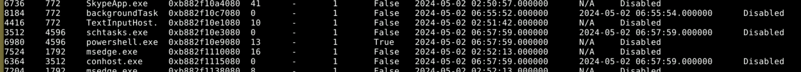
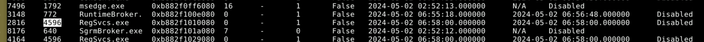
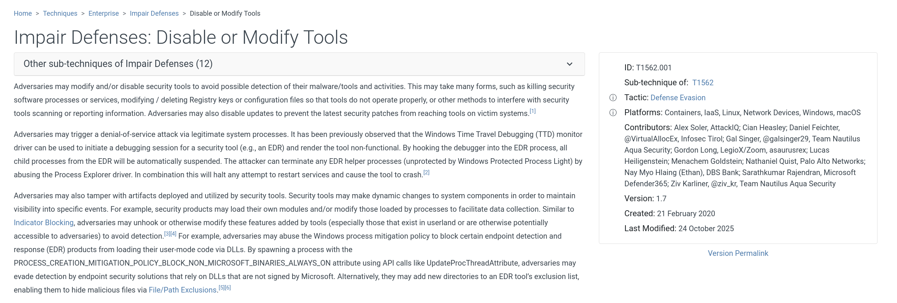
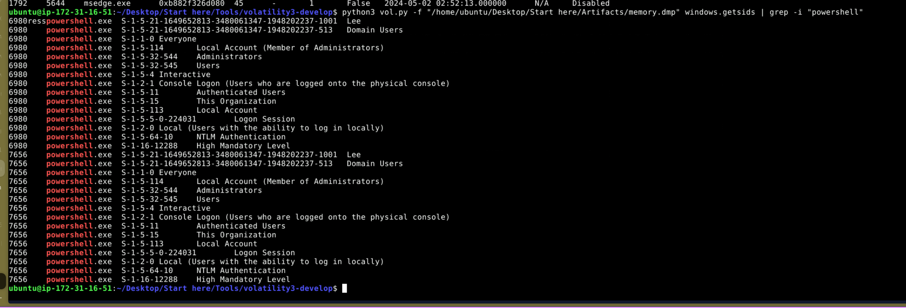

# Volatility Traces Lab Writeup

## Overview

This investigation focused on analyzing a Windows memory dump using Volatility to identify suspicious processes, persistence mechanisms, defense evasion activity, and the user account associated with malicious behavior.

Only three primary plugins were required:

windows.psscan  
windows.cmdline  
windows.getsids

The analysis revealed malicious PowerShell execution, antivirus exclusions being added, and suspicious executables linked to a specific user account.

---

## Evidence Source

Memory Image  
memory.dmp

Tool Used  
Volatility 3

---

# Step 1 – Identify Suspicious Parent Process

Command used:

`python3 vol.py -f memory.dmp windows.psscan

The scan revealed a suspicious executable:

InvoiceCheckList.exe

Further review showed that this process spawned two malicious PowerShell processes.

Suspicious parent process  
InvoiceCheckList.exe

# Step 2 – Analyze Process Command Lines

Command used:

`python3 vol.py -f memory.dmp windows.cmdline

The cmdline output revealed:

InvoiceCheckList.exe  
HcdmIYYf.exe

The PowerShell processes were launched with parameters modifying Windows Defender settings using Add-MpPreference with ExclusionPath.

This confirms defense evasion and persistence.

# Step 3 – Identify Defense Evasion Technique

From the PowerShell command line analysis:

The malware used the PowerShell cmdlet:

Add-MpPreference

This cmdlet was used to modify antivirus exclusions.

The malware excluded two applications from protection.

Excluded applications  
InvoiceCheckList.exe  
HcdmIYYf.exe

This behavior aligns with MITRE ATTACK sub-technique:

T1562.001  
Impair Defenses Disable or Modify Tools

# Step 4 – Identify Associated User Account

Command used:

`python3 vol.py -f memory.dmp windows.getsids | grep -i powershell

The SID mapping revealed the user account associated with the malicious PowerShell processes:

lee

## IOCs 

| Type     | Value                |
| -------- | -------------------- |
| pid 4596 | InvoiceCheckList.exe |
| pid 4596 | HcdmIYYf.exe         |
| pid 4596 | powershell.exe       |
| user     | lee                  |

# Timeline Summary

1. InvoiceCheckList.exe executed
    
2. Spawned two malicious PowerShell processes
    
3. PowerShell used Add-MpPreference to exclude files from Defender
    
4. HcdmIYYf.exe identified as persistence executable
    
5. Malware activity tied to local user account lee
    

---

# Key Findings

- Malicious parent process identified
    
- Persistence executable confirmed
    
- Antivirus exclusions added via PowerShell
    
- MITRE technique mapped to T1562.001
    
- Activity attributed to user lee
    

---

# Lessons Learned

- psscan is useful for detecting hidden or terminated processes
    
- cmdline reveals attacker intent clearly through parameters
    
- getsids links malicious processes to user accounts
    
- Add-MpPreference is a strong indicator of defense evasion
    
- Mapping findings to MITRE enhances reporting quality
    

---

# Conclusion

>The investigation successfully identified the malicious process chain, persistence mechanism, defense evasion technique, and associated user account using minimal but effective Volatility plugins.

This lab reinforces the importance of:

Process hierarchy analysis  
Command-line inspection  
SID correlation  
MITRE ATTACK mapping

I successfully completed Volatility Traces Blue Team Lab at @CyberDefenders!
https://cyberdefenders.org/blueteam-ctf-challenges/achievements/inksec/volatility-traces/
 
#CyberDefenders #CyberSecurity #BlueYard #BlueTeam #InfoSec #SOC #SOCAnalyst #DFIR #CCD #CyberDefender
