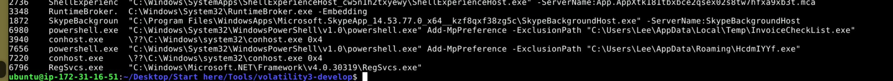
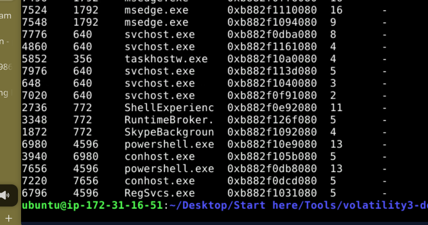
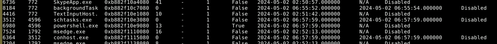
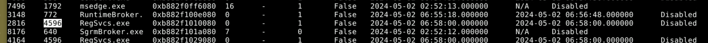
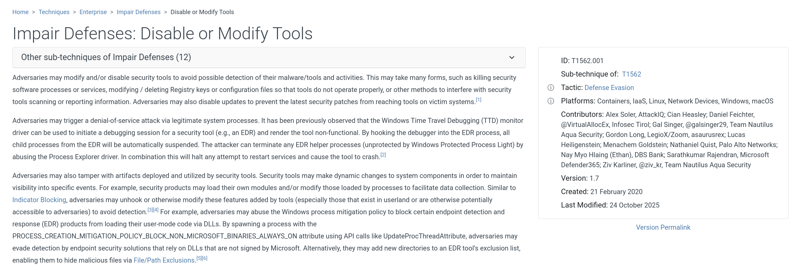
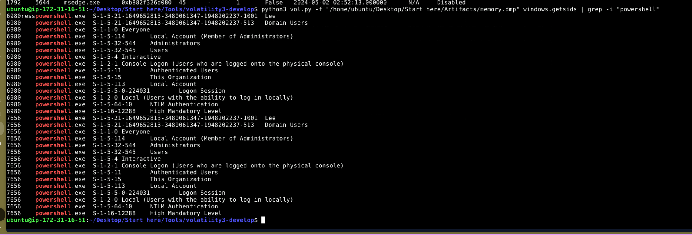

## Overview

This investigation focused on analyzing a Windows memory dump using Volatility to identify suspicious processes, persistence mechanisms, defense evasion activity, and the user account associated with malicious behavior.

Only three plugins were required: `windows.psscan`, `windows.cmdline`, and `windows.getsids`. The analysis revealed malicious PowerShell execution, antivirus exclusions being added, and suspicious executables linked to a specific user account.

---

## Evidence Source

| Artifact | Detail |
|----------|--------|
| Memory Image | memory.dmp |
| Tool | Volatility 3 |

---

## Step 1 — Identify Suspicious Parent Process

Running `windows.psscan` against the memory dump revealed the process hierarchy. One executable stood out — it had spawned two child PowerShell processes, which is uncommon for legitimate software.

```
python3 vol.py -f memory.dmp windows.psscan
```





The parent process was suspicious by name alone — a document-themed executable with no legitimate reason to be spawning PowerShell children.

---

## Step 2 — Analyze Process Command Lines

With the suspicious parent identified, `windows.cmdline` was used to extract the full command line arguments of all running processes. This is where attacker intent becomes clear.

```
python3 vol.py -f memory.dmp windows.cmdline
```





Both PowerShell processes were launched with parameters targeting Windows Defender's exclusion list using `Add-MpPreference` with `-ExclusionPath`. This is a well-known defense evasion pattern — the malware is carving out a safe zone for itself before executing its payload.

A secondary executable was also identified as active under the same parent — a persistence mechanism designed to survive reboots.

---

## Step 3 — Map to MITRE ATT&CK

The PowerShell activity maps directly to a specific sub-technique. Modifying antivirus exclusion settings falls under **Impair Defenses** — the adversary is not disabling AV entirely (which would alert), but surgically excluding their own tools from scanning.



---

## Step 4 — Identify Associated User Account

The final step linked the malicious processes to a local user account using `windows.getsids`, filtering for PowerShell processes. The SID mapping revealed which account the attacker was operating under.

```
python3 vol.py -f memory.dmp windows.getsids | grep -i powershell
```



---

## IOCs

| Type | Value |
|------|-------|
| Suspicious Parent (PID 4596) | InvoiceCheckList.exe |
| Persistence Executable | HcdmIYYf.exe |
| Child Processes | powershell.exe ×2 |
| Additional Process (PID 4596) | RegSvcs.exe |
| Associated User | Lee |
| MITRE Technique | T1562.001 |

---

## Lessons Learned

`psscan` scans physical memory directly — it catches processes unlinked from the standard process list to evade detection. `cmdline` reveals attacker intent more clearly than any other artifact; the PowerShell parameters here told the whole story. Pairing `getsids` with process filtering is an efficient way to pivot from process to user context.

The use of `Add-MpPreference` as a defense evasion technique is worth adding to your detection playbook — it is legitimate PowerShell, which means it rarely triggers alerts on its own. Behavioral detection (PowerShell spawned from a document-themed executable) is the more reliable signal.

> The investigation successfully identified the malicious process chain, persistence mechanism, defense evasion technique, and associated user account using three focused Volatility plugins. A narrow, methodical approach was more effective than running every available plugin.

---

## Lab Questions














