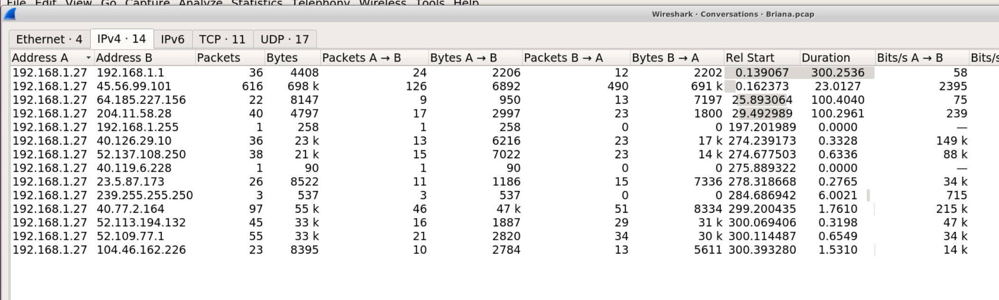
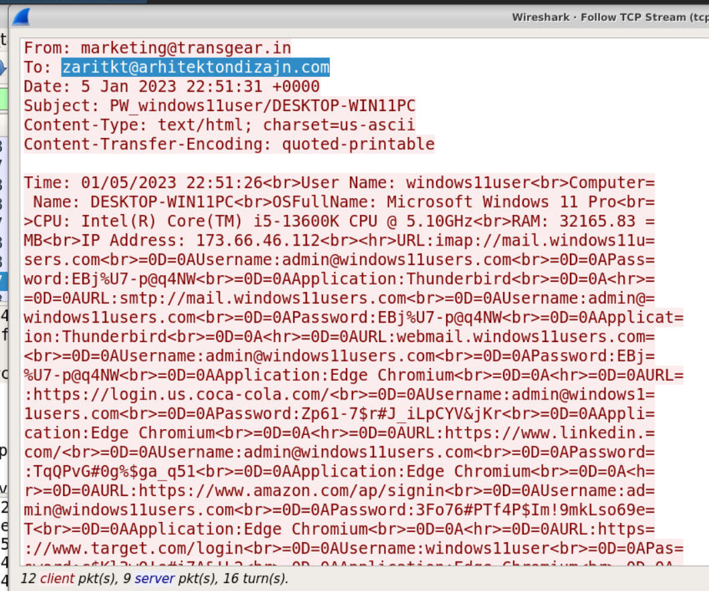
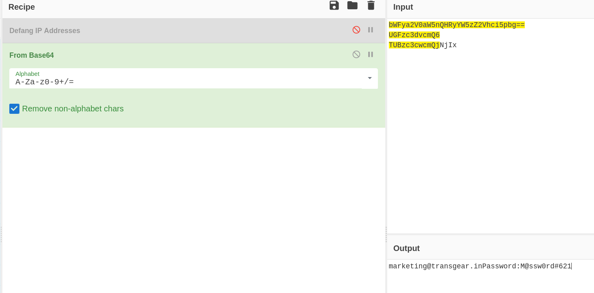

## Overview

Briana, an employee at Transgear Corp, clicked a malicious link from a phishing email promising Amazon gift cards. The link delivered a stealer malware that silently harvested credentials, system information, and session data — exfiltrating everything via SMTP to an attacker-controlled inbox. This lab involves analyzing the PCAP to reconstruct the attack chain, identify the C2 infrastructure, and recover the stolen data.

---

## Network Analysis — Conversations

Opening the PCAP in Wireshark and checking **Statistics → Conversations** immediately surfaces a large volume of traffic between Briana's endpoint and an external IP:

- **Victim IP:** `192[.]168[.]1[.]27`
- **C2 IP:** `45[.]56[.]99[.]101` (port 80)

The volume and pattern of connections to this external host confirms C2 activity — the malware beaconing out and transmitting harvested data.


---
## System Fingerprint — Exfiltrated Beacon Data

Following the HTTP stream reveals the malware's initial system survey transmitted to the attacker. The beacon contains a full fingerprint of Briana's workstation:


```text
Time: 01/05/2023 22:51:26
User Name: windows11user
Computer Name: DESKTOP-WIN11PC
OSFullName: Microsoft Windows 11 Pro
CPU: Intel(R) Core(TM) i5-13600K CPU @ 5.10GHz
RAM: 32165.83 MB
IP Address: 173.66.46.112
```

First contact with the malicious website occurred at `22:51:00.243743`.

---

## Credential Theft — SMTP Exfiltration

The stealer harvested saved credentials from Briana's browsers and mail client, then exfiltrated them via SMTP to:

**`zaritkt[at]arhitektondizajn[.]com`**

Credentials recovered from the email data stream include accounts across multiple platforms — Thunderbird, Edge Chromium, LinkedIn, Amazon, Coca-Cola, Target, and NYT. The malware captured username/password pairs for every stored credential.

Notable stolen credentials:

|Platform|Username|Password|
|---|---|---|
|IMAP/SMTP|`admin@windows11users[.]com`|`EBj%U7-p@q4NW`|
|LinkedIn|`admin@windows11users[.]com`|`TqQPvG#0g%$ga_q51`|
|Amazon|`admin@windows11users[.]com`|`3Fo76#PTf4P$Im!9mkLso69e=T`|
|Coca-Cola|`admin@windows11users[.]com`|`Zp61-7$r#J_iLpCYV&jKr`|

---

## SMTP Authentication — Base64 Decode

Filtering for SMTP traffic reveals the attacker authenticating to `webhostbox[.]net` to send the exfiltrated data. The AUTH LOGIN exchange contains Base64-encoded credentials:

```zsh
AUTH login bWFya2V0aW5nQHRyYW5zZ2Vhci5pbg==
334 UGFzc3dvcmQ6
TUBzc3cwcmQjNjIx
235 Authentication succeeded
```

Decoding:

The attacker authenticated using internal Transgear Corp credentials — indicating the compromised account `marketing@transgear.in` was used as the sending relay, likely harvested from Briana's mail client.

---

## IOCs

| Type                | Value                               |
| ------------------- | ----------------------------------- |
| Victim IP           | `192[.]168[.]1[.]27`                |
| C2 IP               | `45[.]56[.]99[.]101`                |
| Attacker Email      | `zaritkt[at]arhitektondizajn[.]com` |
| Compromised Account | `marketing[at]transgear[.]in`       |
| Victim Machine      | `DESKTOP-WIN11PC`                   |
| Victim MAC          | `bc:ea:fa:22:74:fb`                 |

---

<div class="qa-item"> <div class="qa-question-text">What time did the suspected user system/browser connect to the malicious website?</div> <div class="flag-reveal"> <input type="checkbox"> <span class="r-placeholder">Click flag to reveal</span> <span class="r-answer">22:51:00:243743</span> <button class="copy-btn" onclick="event.stopPropagation();navigator.clipboard.writeText(this.previousElementSibling.textContent);this.textContent='copied';setTimeout(()=>this.textContent='copy',1500)">copy</button> </div> </div>

<div class="qa-item"> <div class="qa-question-text">What is Briana’s IP address?</div> <div class="answer-reveal"> <input type="checkbox"> <span class="r-placeholder">Click to reveal answer</span> <span class="r-answer">192.168.1.27</span> <button class="copy-btn" onclick="event.stopPropagation();navigator.clipboard.writeText(this.previousElementSibling.textContent);this.textContent='copied';setTimeout(()=>this.textContent='copy',1500)">copy</button> </div> </div>

<div class="qa-item"> <div class="qa-question-text">What is Briana’s MAC/Ethernet address? What is the vendor name for the MAC address?</div> <div class="flag-reveal"> <input type="checkbox"> <span class="r-placeholder">Click flag to reveal</span> <span class="r-answer">bc:ea:fa:22:74:fb, Hewlett Packard</span> <button class="copy-btn" onclick="event.stopPropagation();navigator.clipboard.writeText(this.previousElementSibling.textContent);this.textContent='copied';setTimeout(()=>this.textContent='copy',1500)">copy</button> </div> </div>

<div class="qa-item"> <div class="qa-question-text">What is Briana’s Windows machine name?</div> <div class="answer-reveal"> <input type="checkbox"> <span class="r-placeholder">Click to reveal answer</span> <span class="r-answer">DESKTOP-WIN11PC</span> <button class="copy-btn" onclick="event.stopPropagation();navigator.clipboard.writeText(this.previousElementSibling.textContent);this.textContent='copied';setTimeout(()=>this.textContent='copy',1500)">copy</button> </div> </div>

<div class="qa-item"> <div class="qa-question-text">What is Briana’s Windows username?</div> <div class="flag-reveal"> <input type="checkbox"> <span class="r-placeholder">Click flag to reveal</span> <span class="r-answer">admin@windows11users.com</span> <button class="copy-btn" onclick="event.stopPropagation();navigator.clipboard.writeText(this.previousElementSibling.textContent);this.textContent='copied';setTimeout(()=>this.textContent='copy',1500)">copy</button> </div> </div>

<div class="qa-item"> <div class="qa-question-text">What email address was the attacker sending data to?</div> <div class="answer-reveal"> <input type="checkbox"> <span class="r-placeholder">Click to reveal answer</span> <span class="r-answer">zaritkt@arhitektondizajn.com</span> <button class="copy-btn" onclick="event.stopPropagation();navigator.clipboard.writeText(this.previousElementSibling.textContent);this.textContent='copied';setTimeout(()=>this.textContent='copy',1500)">copy</button> </div> </div>

<div class="qa-item"> <div class="qa-question-text">What type of CPU does Briana’s computer use?</div> <div class="flag-reveal"> <input type="checkbox"> <span class="r-placeholder">Click flag to reveal</span> <span class="r-answer">Intel(R) Core(TM) i5-13600K CPU</span> <button class="copy-btn" onclick="event.stopPropagation();navigator.clipboard.writeText(this.previousElementSibling.textContent);this.textContent='copied';setTimeout(()=>this.textContent='copy',1500)">copy</button> </div> </div>

<div class="qa-item"> <div class="qa-question-text">How much RAM does Briana’s computer have—in GBs?</div> <div class="answer-reveal"> <input type="checkbox"> <span class="r-placeholder">Click to reveal answer</span> <span class="r-answer">32gb</span> <button class="copy-btn" onclick="event.stopPropagation();navigator.clipboard.writeText(this.previousElementSibling.textContent);this.textContent='copied';setTimeout(()=>this.textContent='copy',1500)">copy</button> </div> </div>

<div class="qa-item"> <div class="qa-question-text">What type of account login data was stolen by the attacker?</div> <div class="flag-reveal"> <input type="checkbox"> <span class="r-placeholder">Click flag to reveal</span> <span class="r-answer">username, password</span> <button class="copy-btn" onclick="event.stopPropagation();navigator.clipboard.writeText(this.previousElementSibling.textContent);this.textContent='copied';setTimeout(()=>this.textContent='copy',1500)">copy</button> </div> </div>

<div class="qa-item"> <div class="qa-question-text">What are the username and password related to the Amazon account?</div> <div class="answer-reveal"> <input type="checkbox"> <span class="r-placeholder">Click to reveal answer</span> <span class="r-answer">admin@windows11users.com:3Fo76#PTf4P$Im!9mkLso69e=T</span> <button class="copy-btn" onclick="event.stopPropagation();navigator.clipboard.writeText(this.previousElementSibling.textContent);this.textContent='copied';setTimeout(()=>this.textContent='copy',1500)">copy</button> </div> </div>

<div class="qa-item"> <div class="qa-question-text">What username did Briana use to authenticate to webhostbox[.]net? Can you decode it?</div> <div class="flag-reveal"> <input type="checkbox"> <span class="r-placeholder">Click flag to reveal</span> <span class="r-answer">marketing@transgear.in</span> <button class="copy-btn" onclick="event.stopPropagation();navigator.clipboard.writeText(this.previousElementSibling.textContent);this.textContent='copied';setTimeout(()=>this.textContent='copy',1500)">copy</button> </div> </div>

<div class="qa-item"> <div class="qa-question-text">What password did Briana use to authenticate to webhostbox[.]net? Can you decode it?</div> <div class="answer-reveal"> <input type="checkbox"> <span class="r-placeholder">Click to reveal answer</span> <span class="r-answer">M@ssw0rd#621</span> <button class="copy-btn" onclick="event.stopPropagation();navigator.clipboard.writeText(this.previousElementSibling.textContent);this.textContent='copied';setTimeout(()=>this.textContent='copy',1500)">copy</button> </div> </div>

