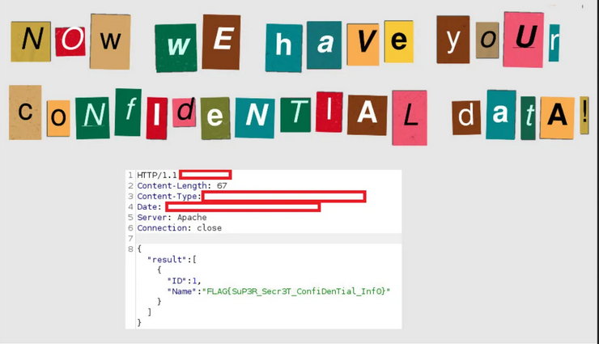

## Scenario

Cloth45.shop, a small e-commerce company with no dedicated security team, receives an extortion email containing a screenshot proving the attacker has exfiltrated confidential data from their database. The service sits behind an OWASP ModSecurity WAF running the Core Ruleset (CRS) and a Traefik load balancer. Three artefacts are provided: `access.log` (Traefik), `modsec_audit.log` (ModSecurity), and `screenshot.png` (attacker-provided proof of compromise). The task is to reconstruct the attack, identify the bypass technique, and attribute the successful request.

---

## Methodology

### Stage 1 — Screenshot Analysis

The attacker-provided screenshot is the starting point. The HTTP response body reveals the exfiltrated data:



```json
{
  "result":[
    {
      "ID":1,
      "Name":"FLAG{SuP3R_Secr3T_ConfiDenTial_InfO}"
    }
  ]
}
```

Key observables from the screenshot:

- **Content-Length: 67** — a precise and unique value to grep for in the access log
- **Server: Apache** — the backend is Apache, consistent with the Docker service architecture
- **Status, Content-Type, and Date fields are redacted** — the attacker deliberately obscured these to hinder attribution, but Content-Length 67 is sufficient to correlate

The JSON structure confirms a UNION-based SQL injection — `ID` and `Name` are the two columns returned, meaning the attacker injected a second SELECT to retrieve data alongside the original query's column count.

### Stage 2 — Log Orientation

Three files in the investigation directory:

```zsh
ls -lh ~/Desktop/InvestigationFiles/
# access.log     modsec_audit.log     screenshot.png
```

`access.log` is the Traefik load balancer log — records all inbound requests including those the WAF passes through. `modsec_audit.log` is the ModSecurity audit log — records transactions the WAF detected or blocked, with full rule match detail.

### Stage 3 — Unique Visitor Count

```zsh
awk '{print $1}' access.log | sort -u | wc -l
```

**3 unique IPs** in the Traefik access log — a small environment, which makes anomaly detection straightforward.

### Stage 4 — WAF Ruleset Version

```zsh
grep -i "OWASP\|CRS\|version" modsec_audit.log | head -20
```

The ModSecurity audit log header confirms the active ruleset: **OWASP CRS/3.3.4**. CRS 3.3.4 includes SQLi detection rules — the attacker either bypassed them or the successful payload slipped through a gap in coverage.

### Stage 5 — Attacker IPs Flagged by WAF

```zsh
grep -oP '"remote_address":"[\d.]+"' modsec_audit.log | sort -u
```

Two internal IPs flagged by the WAF: `172.18.0.2` and `172.18.0.3`. These are Docker internal addresses — the WAF sees the internal network addresses after Traefik proxies the request, while the Traefik access log records the original client IPs. **2 unique attacker IPs** identified by the WAF.

### Stage 6 — Correlating the Successful Request

With Content-Length 67 from the screenshot, grepping the Traefik access log surfaces the exact request:

```zsh
grep " 67 " access.log
```
```
10.25.126.7 - - [23/Nov/2022:20:44:32 +0000] "GET /cloth/5'UNION%20SELECT%201,flag%20FROM%20super_secret_table;-- HTTP/1.1" 200 67 "-" "Mozilla/5.0 (Windows NT 10.0; Win64; x64) AppleWebKit/537.36 (KHTML, like Gecko) Chrome/106.0.5249.62 Safari/537.36" 40 "waf-clothmarket@docker" "http://172.18.0.4:80" 2ms
````

This single line resolves Q4 through Q8 simultaneously:

- **Timestamp**: `23/Nov/2022:20:44:32`
- **Attacker IP**: `10.25.126.7`
- **SQL payload**: `'UNION SELECT 1,flag FROM super_secret_table;--`
- **Table**: `super_secret_table`
- **Column**: `flag`
- **Browser**: `Chrome/106.0.5249.62`
- **HTTP status**: `200` — the WAF passed the request and the backend executed the injection

The payload structure reveals the attacker had already enumerated the column count of the original query (2 columns) before crafting the UNION. The `1` is a filler for the first column (ID) and `flag` extracts the confidential data from `super_secret_table`. The `--` terminates the original query.

The WAF failed to block this request despite CRS 3.3.4 being active — likely due to the minimal, clean payload structure avoiding common SQLi signatures, or a gap in rule coverage for this specific UNION syntax variant.

A second entry with Content-Length 67 in the same grep output is a different request from `10.25.126.6` to a `.back` file — a backup file enumeration attempt, separate from the SQLi attacker.

---

## Attack Summary

|Phase|Action|
|---|---|
|Reconnaissance|Backup file enumeration — GET /Y2XuDR1k.back from 10.25.126.6|
|WAF Probing|Multiple requests detected and logged by ModSecurity CRS 3.3.4|
|SQL Injection|UNION-based SQLi via /cloth/5'UNION SELECT 1,flag FROM super_secret_table;--|
|WAF Bypass|Payload returned HTTP 200 — CRS failed to block the successful request|
|Exfiltration|flag column from super_secret_table returned in JSON response body|
|Extortion|Attacker emailed screenshot proving database access to Cloth45.shop|

---

## IOCs

|Type|Value|
|---|---|
|IP (SQLi Attacker)|10[.]25[.]126[.]7|
|IP (Backup Enumeration)|10[.]25[.]126[.]6|
|URL (Successful Payload)|hxxp[://]cloth45[.]shop/cloth/5'UNION%20SELECT%201,flag%20FROM%20super_secret_table;--|
|Table Exfiltrated|super_secret_table|
|Column Exfiltrated|flag|
|Browser|Chrome/106.0.5249.62|
|Timestamp|23/Nov/2022:20:44:32 +0000|
|WAF Ruleset|OWASP CRS/3.3.4|
|Backend Server|Apache ([http://172.18.0.4:80](http://172.18.0.4:80))|

---

## MITRE ATT&CK

|Technique|ID|Description|
|---|---|---|
|Exploit Public-Facing Application|T1190|UNION-based SQL injection against Cloth45.shop product endpoint|
|Command and Scripting Interpreter|T1059.003|SQL executed server-side via injected UNION SELECT bypassing WAF|

---

## Defender Takeaways

**WAF bypass via minimal payload** — CRS 3.3.4 detected and logged multiple requests from both attacker IPs but failed to block the successful UNION payload. WAF rules are not a guarantee — a sufficiently clean or unusual payload can slip through even a well-maintained ruleset. Parameterised queries at the application layer are the only reliable SQLi defence; WAF is a compensating control, not a primary one.

**Content-Length as a correlation primitive** — the attacker redacted status code, content-type, and date from the proof screenshot but left Content-Length 67 visible. A unique response size is often sufficient to identify a specific transaction in access logs. When investigating data exfiltration where the exact request is unknown, filtering access logs by response size is a fast and underused technique.

**Backup file exposure** — `10.25.126.6` successfully retrieved `/Y2XuDR1k.back` with a 200 response and Content-Length 67. Backup files, configuration dumps, and any non-application artefacts in the web root are high-value targets for initial access. Web servers should deny access to `.back`, `.bak`, `.sql`, `.zip`, and similar extensions by default via server configuration, not WAF rules.

**Log correlation across WAF and load balancer** — ModSecurity records internal Docker addresses (`172.18.0.2`, `172.18.0.3`) while Traefik records the original client IPs. Correlating across both log sources by timestamp is necessary for full attribution. In production, `X-Forwarded-For` header preservation through the proxy chain and consistent log enrichment with original client IPs prevents this ambiguity.

**Small company, no security team** — the scenario explicitly notes the absence of a dedicated security function. The attacker knew this — the extortion email relied on the company having no capability to detect or respond. Detection coverage via a managed WAF with alerting and a SIEM ingesting both Traefik and ModSecurity logs would have surfaced the attack pattern before the successful payload executed.

---

<div class="qa-item"> <div class="qa-question-text">How many unique IP addresses (visitors) are observable in the logs? (Format: IP Count)</div> <div class="flag-reveal"> <input type="checkbox"> <span class="r-placeholder">Click flag to reveal</span> <span class="r-answer">3</span> <button class="copy-btn" onclick="event.stopPropagation();navigator.clipboard.writeText(this.previousElementSibling.textContent);this.textContent='copied';setTimeout(()=>this.textContent='copy',1500)">copy</button> </div> </div>

<div class="qa-item"> <div class="qa-question-text">What is the version of WAF Ruleset that was active on the system for blocking malicious requests? (Format: X.X.X)</div> <div class="answer-reveal"> <input type="checkbox"> <span class="r-placeholder">Click to reveal answer</span> <span class="r-answer">3.3.4</span> <button class="copy-btn" onclick="event.stopPropagation();navigator.clipboard.writeText(this.previousElementSibling.textContent);this.textContent='copied';setTimeout(()=>this.textContent='copy',1500)">copy</button> </div> </div>

<div class="qa-item"> <div class="qa-question-text">How many unique attacker IPs were identified by WAF? (Format: IP Count)</div> <div class="flag-reveal"> <input type="checkbox"> <span class="r-placeholder">Click flag to reveal</span> <span class="r-answer">2</span> <button class="copy-btn" onclick="event.stopPropagation();navigator.clipboard.writeText(this.previousElementSibling.textContent);this.textContent='copied';setTimeout(()=>this.textContent='copy',1500)">copy</button> </div> </div>

<div class="qa-item"> <div class="qa-question-text">Based on the remaining information in screenshot, try to correlate the request/response with log files. When did the successful attack from screenshot occured? (Format: dd/MMM/yyyy:HH:mm:ss)</div> <div class="answer-reveal"> <input type="checkbox"> <span class="r-placeholder">Click to reveal answer</span> <span class="r-answer">23/Nov/2022:20:44:32</span> <button class="copy-btn" onclick="event.stopPropagation();navigator.clipboard.writeText(this.previousElementSibling.textContent);this.textContent='copied';setTimeout(()=>this.textContent='copy',1500)">copy</button> </div> </div>

<div class="qa-item"> <div class="qa-question-text">What is the IP address of the attacker? (Format: X.X.X.X)</div> <div class="flag-reveal"> <input type="checkbox"> <span class="r-placeholder">Click flag to reveal</span> <span class="r-answer">10.25.126.7</span> <button class="copy-btn" onclick="event.stopPropagation();navigator.clipboard.writeText(this.previousElementSibling.textContent);this.textContent='copied';setTimeout(()=>this.textContent='copy',1500)">copy</button> </div> </div>

<div class="qa-item"> <div class="qa-question-text">What is the database table that attackers were able to reach and exfiltrate confidential information? (Format: TableName)</div> <div class="answer-reveal"> <input type="checkbox"> <span class="r-placeholder">Click to reveal answer</span> <span class="r-answer">super_secret_table</span> <button class="copy-btn" onclick="event.stopPropagation();navigator.clipboard.writeText(this.previousElementSibling.textContent);this.textContent='copied';setTimeout(()=>this.textContent='copy',1500)">copy</button> </div> </div>

<div class="qa-item"> <div class="qa-question-text">What is the column name attackers got confidential information in the exploited table? (Format: ColumnName)</div> <div class="flag-reveal"> <input type="checkbox"> <span class="r-placeholder">Click flag to reveal</span> <span class="r-answer">flag</span> <button class="copy-btn" onclick="event.stopPropagation();navigator.clipboard.writeText(this.previousElementSibling.textContent);this.textContent='copied';setTimeout(()=>this.textContent='copy',1500)">copy</button> </div> </div>

<div class="qa-item"> <div class="qa-question-text">What is the browser and version attacker most probably used? (Format: BrowserName X.X.X.X)</div> <div class="answer-reveal"> <input type="checkbox"> <span class="r-placeholder">Click to reveal answer</span> <span class="r-answer">Chrome/106.0.5249.62</span> <button class="copy-btn" onclick="event.stopPropagation();navigator.clipboard.writeText(this.previousElementSibling.textContent);this.textContent='copied';setTimeout(()=>this.textContent='copy',1500)">copy</button> </div> </div>

<div class="qa-item"> <div class="qa-question-text">Based on the WAF logs for the attacker IP, what kind of common vulnerability attacker tried to exploit? (Format: Vulnerability Name)</div> <div class="flag-reveal"> <input type="checkbox"> <span class="r-placeholder">Click flag to reveal</span> <span class="r-answer">SQL Injection</span> <button class="copy-btn" onclick="event.stopPropagation();navigator.clipboard.writeText(this.previousElementSibling.textContent);this.textContent='copied';setTimeout(()=>this.textContent='copy',1500)">copy</button> </div> </div>
