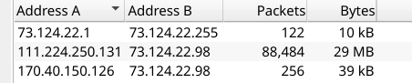
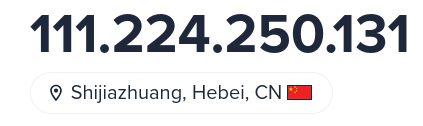
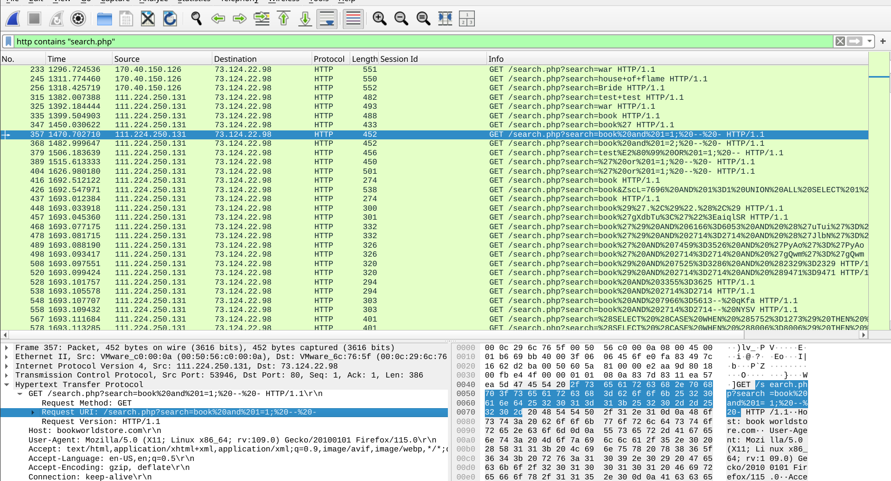
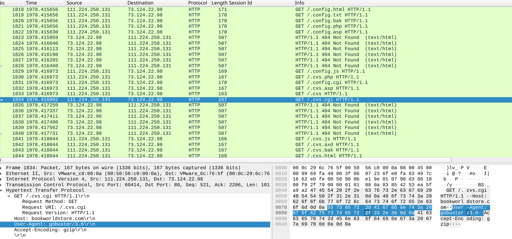
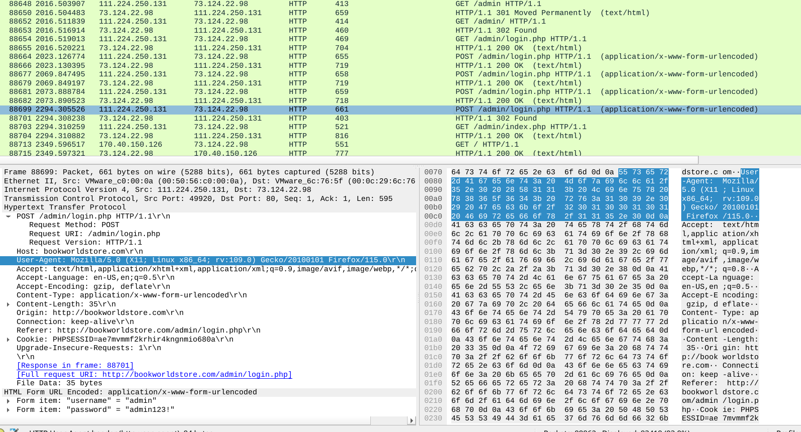
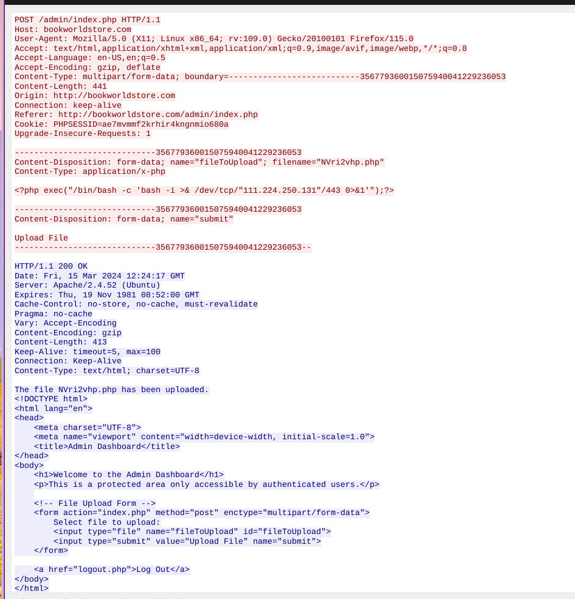

## Scenario

BookWorld, an online bookstore, triggered an automated alert on unusual database query volume and elevated server resource usage. As SOC analyst, the task is to analyse the network capture, identify the attack vector, determine the scope of data access, and establish whether the attacker achieved persistent access to the web server.

---

## Methodology

### Attacker Identification

Opening the PCAP in Wireshark and checking **Statistics → Conversations** immediately surfaces the anomaly — a single external IP generating a disproportionate volume of TCP traffic against the web server:



The source is `111.224.250.131`. A quick lookup via ipinfo.io geolocates this IP to Shijiazhuang, China — a region with no expected business relationship with BookWorld, which is consistent with an opportunistic or targeted external attack.



### Reconnaissance — SQL Injection Probing

Filtering on `http contains "search.php"` narrows traffic to the vulnerable endpoint and establishes the attack timeline from packet 357 onward.



The attacker's first probe is a classic boolean-based injection test against `search.php`:

```
GET /search.php?search=book and 1=1; -- -
```

This is a tautology test — if the application returns normal results, it confirms the parameter is unsanitised and injectable. With injection confirmed, the attacker escalated to UNION-based enumeration to extract schema metadata.

### Exploitation — Database Enumeration via UNION Injection

The attacker used sqlmap-style UNION payloads to enumerate the database structure. The schema discovery request:

```
GET /search.php?search=book' UNION ALL SELECT NULL,CONCAT(0x7178766271,JSON_ARRAYAGG(CONCAT_WS(0x7a76676a636b,schema_name)),0x7176706a71) FROM INFORMATION_SCHEMA.SCHEMATA-- -
```

The hex literals `0x7178766271` and `0x7176706a71` are sqlmap boundary markers (`qxvbq` and `qvpjq`) used to delimit injection output from surrounding HTML. The server response confirmed three databases in the `INFORMATION_SCHEMA`:

```html
<p>qxvbq["admin", "books", "customers"]qvpjq</p>
```

A follow-up query against `INFORMATION_SCHEMA.TABLES` enumerated all tables, identifying `customers` as the table containing user data — the primary exfiltration target.
```
GET /search.php?search=book%27%20UNION%20ALL%20SELECT%20NULL%2CCONCAT%280x7178766271%2CJSON_ARRAYAGG...FROM%20INFORMATION_SCHEMA.TABLES%20WHERE%20table_schema...
```

### Discovery — Directory Brute Force

With the database mapped, the attacker pivoted to web server directory enumeration using gobuster, visible in Wireshark as a rapid burst of GET requests with the gobuster User-Agent across common directory paths:



The scan returned `/admin/` — the administrative panel, not linked from the public site but accessible without network-level restriction.

### Initial Access — Admin Panel Credential Attack

With `/admin/` identified, the attacker launched a credential brute force. Four failed attempts preceded a successful login on the fifth try:


```
admin:admin123!
```

The credential is a trivially weak default — `admin` username with a predictable password. No account lockout or rate limiting was in place to slow the attack.

### Execution — Web Shell Upload

Authenticated to the admin panel, the attacker uploaded a PHP web shell via the file upload functionality:


```
NVri2vhp.php
````

The randomised filename is consistent with tool-generated web shells designed to avoid pattern-based detection. Once uploaded and accessible via HTTP, this file provides the attacker with arbitrary OS command execution on the web server, completing the transition from network intrusion to full host compromise.

---

## Attack Summary

|Phase|Action|
|---|---|
|Reconnaissance|Wireshark conversation analysis identifies `111.224.250.131` as attacker|
|Initial Probe|Boolean SQLi test against `search.php` confirms unsanitised input|
|Enumeration|UNION-based injection enumerates schemas and tables via `INFORMATION_SCHEMA`|
|Data Access|`customers` table identified as containing user data|
|Discovery|Gobuster directory scan discovers `/admin/` panel|
|Credential Access|Brute force against `/admin/` — `admin:admin123!` succeeds on 5th attempt|
|Execution|`NVri2vhp.php` web shell uploaded via admin file upload|

---

## IOCs

|Type|Value|
|---|---|
|Attacker IP|111[.]224[.]250[.]131|
|Attacker Geo|Shijiazhuang, China|
|Vulnerable Endpoint|/search.php|
|Admin Panel|/admin/|
|Credentials|admin:admin123!|
|Web Shell|NVri2vhp.php|
|SQLi Marker|0x7178766271 / 0x7176706a71 (sqlmap boundary delimiters)|

---

## MITRE ATT&CK

|Technique|ID|Description|
|---|---|---|
|Exploit Public-Facing Application|T1190|UNION-based SQLi against unsanitised `search` parameter in `search.php`|
|Network Service Discovery|T1046|Gobuster directory brute force enumerates `/admin/`|
|Brute Force: Password Guessing|T1110.001|Credential stuffing against `/admin/` login — success on 5th attempt|
|Server Software Component: Web Shell|T1505.003|`NVri2vhp.php` uploaded via admin panel for persistent RCE|
|Command and Scripting Interpreter: Unix Shell|T1059.004|Web shell provides OS command execution on compromised web server|

---

## Defender Takeaways

**Parameterised queries eliminate SQLi** — the `search.php` endpoint concatenated user input directly into the SQL query. Prepared statements with bound parameters make UNION injection structurally impossible regardless of input content. This is a decades-old vulnerability class with a well-established fix; there is no excuse for it appearing in a production application.

**Directory brute force is loud and detectable** — gobuster generates a distinctive burst of 404s across sequential paths in a short window. A WAF or IDS rule alerting on more than a threshold of 404 responses from a single IP within a rolling time window would flag this immediately. Rate limiting on non-existent paths adds friction at minimal cost.

**Account lockout stops credential brute force** — four failed logins before success means a lockout policy triggering on three consecutive failures would have prevented admin panel compromise entirely. Progressive delays or CAPTCHA on login forms are minimum viable controls for any internet-exposed admin interface.

**Admin panels should not be internet-exposed** — `/admin/` being accessible from an arbitrary external IP with no network-level restriction is the root cause that made the credential attack possible. Admin interfaces should sit behind VPN, IP allowlist, or at minimum require MFA before the login form is even reached.

**File upload requires server-side type enforcement** — the admin panel accepted an arbitrary `.php` file and placed it in a web-accessible location. Upload functionality must validate file type server-side (not client-side), strip executable extensions, and store uploads outside the web root. A PHP file that can be requested via HTTP is a shell by definition.

---

<div class="qa-item"> <div class="qa-question-text">By knowing the attacker's IP, we can analyze all logs and actions related to that IP and determine the extent of the attack, the duration of the attack, and the techniques used. Can you provide the attacker's IP?</div> <div class="flag-reveal"> <input type="checkbox"> <span class="r-placeholder">Click flag to reveal</span> <span class="r-answer">111.224.250.131</span> <button class="copy-btn" onclick="event.stopPropagation();navigator.clipboard.writeText(this.previousElementSibling.textContent);this.textContent='copied';setTimeout(()=>this.textContent='copy',1500)">copy</button> </div> </div>

<div class="qa-item"> <div class="qa-question-text">If the geographical origin of an IP address is known to be from a region that has no business or expected traffic with our network, this can be an indicator of a targeted attack. Can you determine the origin city of the attacker?</div> <div class="answer-reveal"> <input type="checkbox"> <span class="r-placeholder">Click to reveal answer</span> <span class="r-answer">Shijiazhuang</span> <button class="copy-btn" onclick="event.stopPropagation();navigator.clipboard.writeText(this.previousElementSibling.textContent);this.textContent='copied';setTimeout(()=>this.textContent='copy',1500)">copy</button> </div> </div>

<div class="qa-item"> <div class="qa-question-text">Identifying the exploited script allows security teams to understand exactly which vulnerability was used in the attack. This knowledge is critical for finding the appropriate patch or workaround to close the security gap and prevent future exploitation. Can you provide the vulnerable PHP script name?</div> <div class="flag-reveal"> <input type="checkbox"> <span class="r-placeholder">Click flag to reveal</span> <span class="r-answer">search.php</span> <button class="copy-btn" onclick="event.stopPropagation();navigator.clipboard.writeText(this.previousElementSibling.textContent);this.textContent='copied';setTimeout(()=>this.textContent='copy',1500)">copy</button> </div> </div>

<div class="qa-item"> <div class="qa-question-text">Establishing the timeline of an attack, starting from the initial exploitation attempt, what is the complete request URI of the first SQLi attempt by the attacker?</div> <div class="answer-reveal"> <input type="checkbox"> <span class="r-placeholder">Click to reveal answer</span> <span class="r-answer">/search.php?search=book and 1=1; -- -</span> <button class="copy-btn" onclick="event.stopPropagation();navigator.clipboard.writeText(this.previousElementSibling.textContent);this.textContent='copied';setTimeout(()=>this.textContent='copy',1500)">copy</button> </div> </div>

<div class="qa-item"> <div class="qa-question-text">Can you provide the complete request URI that was used to read the web server's available databases?</div> <div class="flag-reveal"> <input type="checkbox"> <span class="r-placeholder">Click flag to reveal</span> <span class="r-answer">/search.php?search=book' UNION ALL SELECT NULL,CONCAT(0x7178766271,JSON_ARRAYAGG(CONCAT_WS(0x7a76676a636b,schema_name)),0x7176706a71) FROM INFORMATION_SCHEMA.SCHEMATA-- -</span> <button class="copy-btn" onclick="event.stopPropagation();navigator.clipboard.writeText(this.previousElementSibling.textContent);this.textContent='copied';setTimeout(()=>this.textContent='copy',1500)">copy</button> </div> </div>

<div class="qa-item"> <div class="qa-question-text">Assessing the impact of the breach and data access is crucial, including the potential harm to the organization's reputation. What's the table name containing the website users data?</div> <div class="answer-reveal"> <input type="checkbox"> <span class="r-placeholder">Click to reveal answer</span> <span class="r-answer">customers</span> <button class="copy-btn" onclick="event.stopPropagation();navigator.clipboard.writeText(this.previousElementSibling.textContent);this.textContent='copied';setTimeout(()=>this.textContent='copy',1500)">copy</button> </div> </div>

<div class="qa-item"> <div class="qa-question-text">The website directories hidden from the public could serve as an unauthorized access point or contain sensitive functionalities not intended for public access. Can you provide the name of the directory discovered by the attacker?</div> <div class="flag-reveal"> <input type="checkbox"> <span class="r-placeholder">Click flag to reveal</span> <span class="r-answer">/admin/</span> <button class="copy-btn" onclick="event.stopPropagation();navigator.clipboard.writeText(this.previousElementSibling.textContent);this.textContent='copied';setTimeout(()=>this.textContent='copy',1500)">copy</button> </div> </div>

<div class="qa-item"> <div class="qa-question-text">Knowing which credentials were used allows us to determine the extent of account compromise. What are the credentials used by the attacker for logging in?</div> <div class="answer-reveal"> <input type="checkbox"> <span class="r-placeholder">Click to reveal answer</span> <span class="r-answer">admin:admin123!</span> <button class="copy-btn" onclick="event.stopPropagation();navigator.clipboard.writeText(this.previousElementSibling.textContent);this.textContent='copied';setTimeout(()=>this.textContent='copy',1500)">copy</button> </div> </div>

<div class="qa-item"> <div class="qa-question-text">We need to determine if the attacker gained further access or control of our web server. What's the name of the malicious script uploaded by the attacker?</div> <div class="flag-reveal"> <input type="checkbox"> <span class="r-placeholder">Click flag to reveal</span> <span class="r-answer">NVri2vhp.php</span> <button class="copy-btn" onclick="event.stopPropagation();navigator.clipboard.writeText(this.previousElementSibling.textContent);this.textContent='copied';setTimeout(()=>this.textContent='copy',1500)">copy</button> </div> </div>
