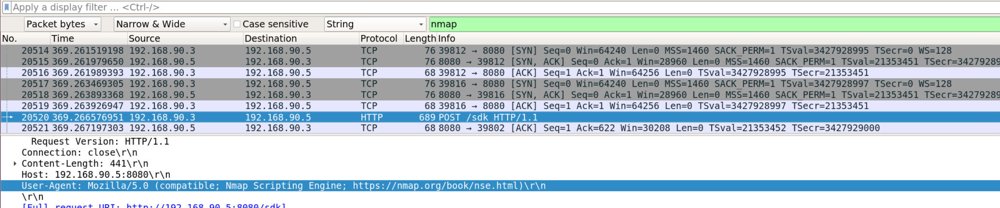
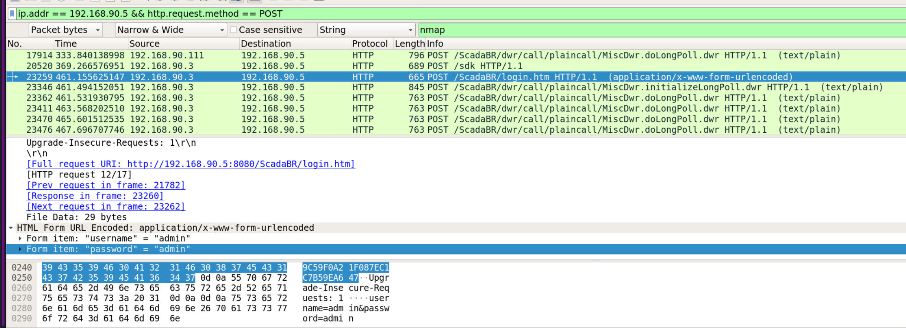
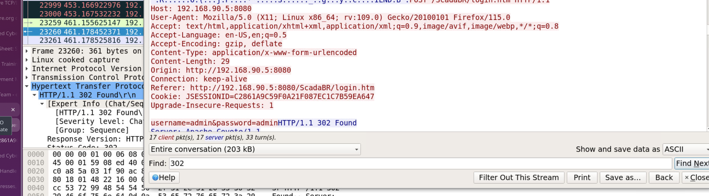

## Overview

Network forensics investigation of a PCAP captured from a monitoring workstation in an industrial chemical plant DMZ. The scenario involves suspected threat actor **Glacier** targeting OT/SCADA infrastructure — a critical concern given the potential for operational disruption in an industrial environment.

The capture is from a dual-homed workstation sitting at the boundary between the IT network and the DMZ where SCADA systems operate.

---

## Host Identification

Opening the capture in Wireshark, the **Statistics → Conversations** view immediately identifies the host with the highest traffic volume — `192.168.1.120`. This is the monitoring workstation, and as a machine with both internet access and DMZ connectivity it must have two network interfaces.

Pivoting on this, filtering for traffic from the second network space reveals the DMZ-side IP of the same host: `192.168.90.5`.

**MITRE: T1590 — Gather Victim Network Information**

---

## Reconnaissance — ARP Scan then Nmap

Before any targeted activity, ARP broadcast traffic visible in the capture indicates an **ARP scan** was performed — a layer 2 host discovery technique used to enumerate live hosts on the local segment before committing to a more intrusive port scan.

Following the ARP scan, searching through the capture for nmap signatures surfaces the tool in the info column of a POST request:

```
POST /sdk HTTP/1.1
```


Nmap's `/sdk` probe is a characteristic fingerprint — it queries VMware vSphere SDK endpoints as part of its service detection routines. This confirms active network reconnaissance was conducted against the DMZ from an attacker-controlled position.

The nmap scan also identifies the other endpoint present in the DMZ: `192.168.90.3`.

**MITRE: T1595 — Active Scanning** **MITRE: T1595.001 — Scanning IP Blocks**

---

## Open Ports

TCP traffic analysis from the nmap scan results confirms two open ports on `192.168.90.3`:

- **Port 8009** — AJP connector (Apache JServ Protocol — commonly associated with Tomcat)
- **Port 8080** — HTTP

HTTP is running on the higher port (8080), exposing a web interface to the DMZ network.

---

## SCADA Credential Extraction

Filtering for HTTP POST requests from the host's DMZ interface reveals login traffic to the SCADA system:

```bash
ip.addr == 192.168.90.5 && http.request.method == POST
```



The login URL and credentials are transmitted in cleartext over HTTP — a critical security failure in an OT environment:
```
URL: hxxp[://]192[.]168[.]90[.]5:8080/ScadaBR/login[.]htm
Credentials: admin:admin
````

**ScadaBR** is an open source SCADA platform. Default credentials (`admin:admin`) were never changed — a textbook industrial security failure that gives an attacker immediate access to process control interfaces.

**MITRE: T1190 — Exploit Public-Facing Application** **MITRE: T1552.001 — Unsecured Credentials: Credentials In Files**

---

## Post-Login Redirect

After the credentials are submitted, filtering for HTTP 302 responses identifies the redirect packet that follows successful authentication:

```bash
http.response.code == 302
```


Packet **23260** contains the 302 redirect response — confirming successful login to the ScadaBR interface and marking the point at which the attacker gained access to the SCADA control panel.

**MITRE: T1133 — External Remote Services**

---

## IOCs

|Type|Value|
|---|---|
|Host IP (IT side)|192[.]168[.]1[.]120|
|Host IP (DMZ side)|192[.]168[.]90[.]5|
|DMZ Target|192[.]168[.]90[.]3|
|Open Ports|8009, 8080|
|SCADA Platform|ScadaBR|
|Login URL|hxxp[://]192[.]168[.]90[.]5:8080/ScadaBR/login[.]htm|
|Credentials|admin:admin|
|Post-Auth Redirect Packet|23260|

---

## MITRE ATT&CK

|Technique|ID|Notes|
|---|---|---|
|Gather Victim Network Info|T1590|Dual-homed host identified via traffic analysis|
|Active Scanning|T1595|ARP scan then nmap against DMZ segment|
|Scanning IP Blocks|T1595.001|ARP host discovery pre-nmap|
|Exploit Public-Facing App|T1190|ScadaBR web interface exposed on port 8080|
|Unsecured Credentials|T1552.001|Default admin:admin credentials never changed|
|External Remote Services|T1133|SCADA interface accessible from DMZ|

---

## Lessons Learned

- **Conversations view first** — Wireshark Statistics → Conversations immediately identifies the top talker and maps the network topology without writing a single filter. Always start here on unknown PCAPs
- **ARP before nmap** — attackers typically run ARP scans before nmap to enumerate live hosts at layer 2 before committing to noisier TCP scanning. ARP traffic in a PCAP before port scan signatures is a reliable indicator of staged reconnaissance
- **OT/SCADA default credentials** — `admin:admin` on internet-accessible SCADA infrastructure is a critical finding. Industrial control systems are increasingly targeted and default credential hardening is a baseline control that is frequently missing
- **Cleartext HTTP in OT environments** — credentials and control commands transmitted over HTTP rather than HTTPS in an industrial DMZ represent a significant risk — any network tap or MITM position gives an attacker full visibility into SCADA operations


---

<div class="qa-item"> <div class="qa-question-text">The host machine in the capture has the highest amount of traffic, what is the host endpoints IP?</div> <div class="flag-reveal"> <input type="checkbox"> <span class="r-placeholder">Click flag to reveal</span> <span class="r-answer">192.168.1.120</span> <button class="copy-btn" onclick="event.stopPropagation();navigator.clipboard.writeText(this.previousElementSibling.textContent);this.textContent='copied';setTimeout(()=>this.textContent='copy',1500)">copy</button> </div> </div>

<div class="qa-item"> <div class="qa-question-text">The engineers on site tell us that this machine connects into the DMZ but also has internet access. That means the endpoint must have two network [blank]?</div> <div class="answer-reveal"> <input type="checkbox"> <span class="r-placeholder">Click to reveal answer</span> <span class="r-answer">interface</span> <button class="copy-btn" onclick="event.stopPropagation();navigator.clipboard.writeText(this.previousElementSibling.textContent);this.textContent='copied';setTimeout(()=>this.textContent='copy',1500)">copy</button> </div> </div>

<div class="qa-item"> <div class="qa-question-text">hmm if there are two of those then that must mean there is another IP. If I were an attacker I’d probably start with one of the first steps of the cyber kill chain. What network reconnaissance tool is used and what is the string in the info column where the name first appears?</div> <div class="flag-reveal"> <input type="checkbox"> <span class="r-placeholder">Click flag to reveal</span> <span class="r-answer">nmap, POST /sdk HTTP/1.1</span> <button class="copy-btn" onclick="event.stopPropagation();navigator.clipboard.writeText(this.previousElementSibling.textContent);this.textContent='copied';setTimeout(()=>this.textContent='copy',1500)">copy</button> </div> </div>

<div class="qa-item"> <div class="qa-question-text">This can then help us get the other IP of the host machine</div> <div class="answer-reveal"> <input type="checkbox"> <span class="r-placeholder">Click to reveal answer</span> <span class="r-answer">192.168.90.5</span> <button class="copy-btn" onclick="event.stopPropagation();navigator.clipboard.writeText(this.previousElementSibling.textContent);this.textContent='copied';setTimeout(()=>this.textContent='copy',1500)">copy</button> </div> </div>

<div class="qa-item"> <div class="qa-question-text">Looking at what happened before the nmap scan it looks like there was another type of scan run. We just need the generic name and not the tool</div> <div class="flag-reveal"> <input type="checkbox"> <span class="r-placeholder">Click flag to reveal</span> <span class="r-answer">arp scan</span> <button class="copy-btn" onclick="event.stopPropagation();navigator.clipboard.writeText(this.previousElementSibling.textContent);this.textContent='copied';setTimeout(()=>this.textContent='copy',1500)">copy</button> </div> </div>

<div class="qa-item"> <div class="qa-question-text">What’s the IP of the endpoint in the DMZ with our host?</div> <div class="answer-reveal"> <input type="checkbox"> <span class="r-placeholder">Click to reveal answer</span> <span class="r-answer">192.168.90.3</span> <button class="copy-btn" onclick="event.stopPropagation();navigator.clipboard.writeText(this.previousElementSibling.textContent);this.textContent='copied';setTimeout(()=>this.textContent='copy',1500)">copy</button> </div> </div>

<div class="qa-item"> <div class="qa-question-text">Based on the scan from Q3 what two ports are open?</div> <div class="flag-reveal"> <input type="checkbox"> <span class="r-placeholder">Click flag to reveal</span> <span class="r-answer">8009, 8080</span> <button class="copy-btn" onclick="event.stopPropagation();navigator.clipboard.writeText(this.previousElementSibling.textContent);this.textContent='copied';setTimeout(()=>this.textContent='copy',1500)">copy</button> </div> </div>

<div class="qa-item"> <div class="qa-question-text">What protocol is running on the higher port?</div> <div class="answer-reveal"> <input type="checkbox"> <span class="r-placeholder">Click to reveal answer</span> <span class="r-answer">http</span> <button class="copy-btn" onclick="event.stopPropagation();navigator.clipboard.writeText(this.previousElementSibling.textContent);this.textContent='copied';setTimeout(()=>this.textContent='copy',1500)">copy</button> </div> </div>

<div class="qa-item"> <div class="qa-question-text">We know the plant has some operations software running on that endpoint. What is the login URL, and what are the credentials to access?</div> <div class="flag-reveal"> <input type="checkbox"> <span class="r-placeholder">Click flag to reveal</span> <span class="r-answer">http://192.168.90.5:8080/ScadaBR/login.htm, admin:admin</span> <button class="copy-btn" onclick="event.stopPropagation();navigator.clipboard.writeText(this.previousElementSibling.textContent);this.textContent='copied';setTimeout(()=>this.textContent='copy',1500)">copy</button> </div> </div>

<div class="qa-item"> <div class="qa-question-text">Oh no this is bad. Looks like Glacier might have gotten into the network. I’m going to cut-the-wire between OT and IT but can you find the packet number which corresponds to the redirect after the credentials are entered?</div> <div class="answer-reveal"> <input type="checkbox"> <span class="r-placeholder">Click to reveal answer</span> <span class="r-answer">23260</span> <button class="copy-btn" onclick="event.stopPropagation();navigator.clipboard.writeText(this.previousElementSibling.textContent);this.textContent='copied';setTimeout(()=>this.textContent='copy',1500)">copy</button> </div> </div>

