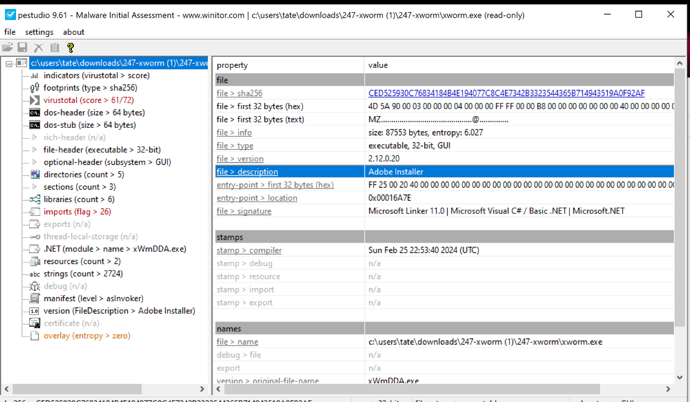
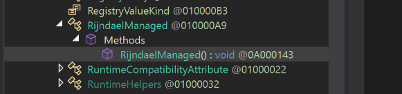
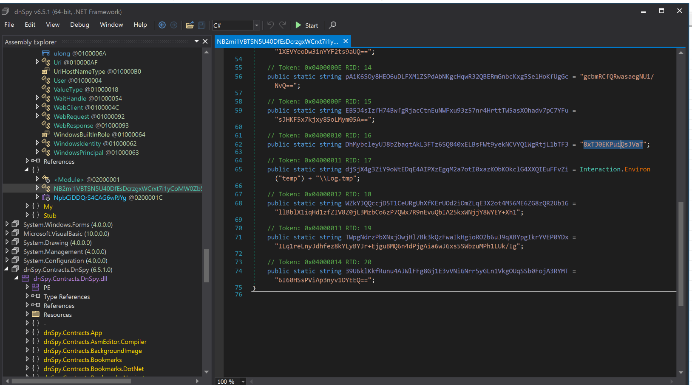
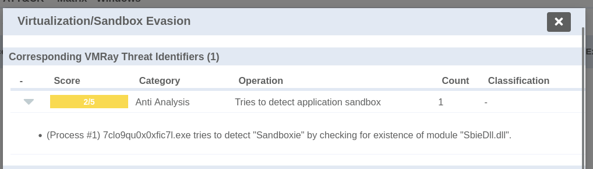
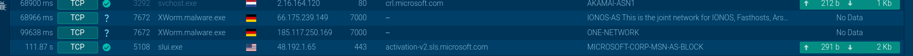
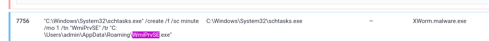

---

## Overview

An employee received a phishing email and accidentally executed a malicious attachment. The sample ran silently, establishing persistence, communicating with C2 infrastructure, and deploying keylogging and USB spreading capabilities. This lab involves static and dynamic analysis of the XWorm v2 RAT sample using PEStudio, dnSpy, and Any.run.

---

## Sample Information

|Field|Value|
|---|---|
|SHA256|`ced525930c76834184b4e194077c8c4e7342b3323544365b714943519a0f92af`|
|Compile Timestamp|`2024-02-25 22:53 UTC`|
|File Type|32-bit .NET PE executable|
|Impersonates|Adobe Installer|
|File Description|Adobe Installer (fake)|

## Static Analysis

### Impersonation

PEStudio revealed the malware sets its `FileDescription` to `Adobe Installer` — a social engineering tactic to appear legitimate and reduce suspicion if a victim inspects the file properties.


### Decompilation — AES Encryption

Loading the sample in dnSpy exposed the malware's .NET internals. Browsing the decompiled class structure revealed a `RijndaelManaged` class — .NET's implementation of AES encryption — used to encrypt and obfuscate the malware's configuration data.

Digging into the encryption method exposed the hardcoded key string used to derive the AES key and IV:

**Hardcoded key:** `8xTJ0EKPuiQsJVaT`


### Anti-Analysis Checks

The sample performs **5 anti-analysis checks** to detect sandboxes and debugging environments, including checking for the presence of `SbieDll.dll` — a DLL associated with the Sandboxie sandbox environment. Detection of this DLL causes the malware to alter or halt its execution.


### Critical APIs Identified

|API|Purpose|
|---|---|
|`RtlSetProcessIsCritical`|Marks the malware process as critical — terminating it triggers a system BSOD|
|`SetWindowsHookEx`|Installs a keyboard hook into running processes for keylogging|
|`CallNextHookEx`|Passes keystrokes along the hook chain after capture|

---

## Dynamic Analysis — Any.run

Executing the sample in Any.run sandbox revealed the full runtime behaviour including C2 communication, file drops, and persistence mechanisms.

### C2 Communication

The malware decrypts its C2 configuration at runtime using the hardcoded AES key and establishes outbound connections:

|C2 IP|Port|
|---|---|
|`185[.]117[.]250[.]169`|`7000`|
|`66[.]175[.]239[.]149`|`7000`|
|`185[.]117[.]249[.]43`|`7000`|

### Persistence

The malware drops a copy of itself to:

```
C:\Users\admin\AppData\Roaming\WmiPrvSE.exe
```

A scheduled task named **WmiPrvSE** is created to execute the dropped binary with elevated privileges — masquerading as the legitimate Windows Management Instrumentation process to blend in.

### USB Spreading

XWorm copies itself to every connected removable device as `USB.exe`. To ensure autoexecution on the target device it creates `.lnk` shortcut files — when the victim opens the drive and clicks the shortcut, the malware executes.

### Registry Manipulation

The malware modifies the `ShowSuperHidden` registry key to control hidden file visibility in Windows Explorer — concealing its dropped files and persistence artifacts from casual inspection.

![[xworm_super_hidden.png]]

## Attack Chain

```
Phishing email → victim executes fake Adobe Installer
        ↓
Anti-analysis checks (5) — SbieDll.dll detection, sandbox evasion
        ↓
Drops WmiPrvSE.exe to AppData
        ↓
Creates scheduled task WmiPrvSE for persistence
        ↓
Modifies ShowSuperHidden registry key — hides artifacts
        ↓
Marks process critical via RtlSetProcessIsCritical
        ↓
Installs keyboard hook via SetWindowsHookEx — keylogger active
        ↓
Decrypts C2 config (AES / 8xTJ0EKPuiQsJVaT) → beacons to C2 on port 7000
        ↓
Copies self to removable drives as USB.exe + .lnk autorun
```

---
## IOCs 

| Type                | Value                                                              |
| ------------------- | ------------------------------------------------------------------ |
| SHA256              | `ced525930c76834184b4e194077c8c4e7342b3323544365b714943519a0f92af` |
| Dropped binary      | `C:\Users\admin\AppData\Roaming\WmiPrvSE.exe`                      |
| Scheduled task      | `WmiPrvSE`                                                         |
| USB spread filename | `USB.exe`                                                          |
| C2 IP               | `185[.]117[.]250[.]169`                                            |
| C2 IP               | `66[.]175[.]239[.]149`                                             |
| C2 IP               | `185[.]117[.]249[.]43`                                             |
| C2 Port             | `7000`                                                             |
| AES key             | `8xTJ0EKPuiQsJVaT`                                                 |
| Sandbox evasion DLL | `SbieDll.dll`                                                      |
| Compile time        | `2024-02-25 22:53 UTC`                                             |

## MITRE ATT&CK

|Technique|ID|
|---|---|
|Phishing: Spearphishing Attachment|T1566.001|
|Masquerading|T1036|
|Scheduled Task/Job|T1053.005|
|Boot or Logon Autostart Execution|T1547|
|Virtualization/Sandbox Evasion|T1497|
|Obfuscated Files or Information: Encrypted/Encoded File|T1027.013|
|Input Capture: Keylogging|T1056.001|
|Replication Through Removable Media|T1091|
|Application Layer Protocol|T1071|
|Modify Registry|T1112|
## Key Takeaway

XWorm v2 demonstrates a layered approach to persistence and evasion — from scheduled task masquerading as a legitimate Windows process, to marking itself as a critical process to survive termination attempts. The `RtlSetProcessIsCritical` API is a notable technique worth flagging in detections as it is rarely used by legitimate software and immediately indicates malicious intent. Static analysis via dnSpy on .NET malware consistently yields high-value findings — config decryption keys, C2 infrastructure, and API usage — without requiring full sandbox execution.

---
## References

- [Any.run Report](https://any.run/report/ced525930c76834184b4e194077c8c4e7342b3323544365b714943519a0f92af/97390c28-4844-408a-a574-2659e9ea37fa#i-table-processes-f087ebce-66cf-4043-ad79-a971dda51103)
- [Threat.rip Config Extract](https://www.threat.rip/file/ced525930c76834184b4e194077c8c4e7342b3323544365b714943519a0f92af/config)
- [VMRay Analysis](https://www.vmray.com/analyses/_vt/ced525930c76/report/overview.html)
---
































