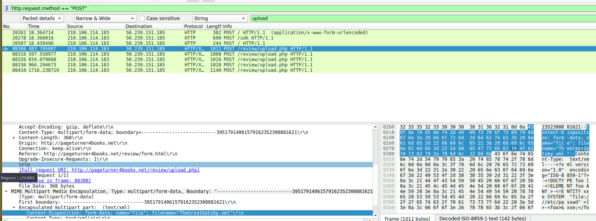
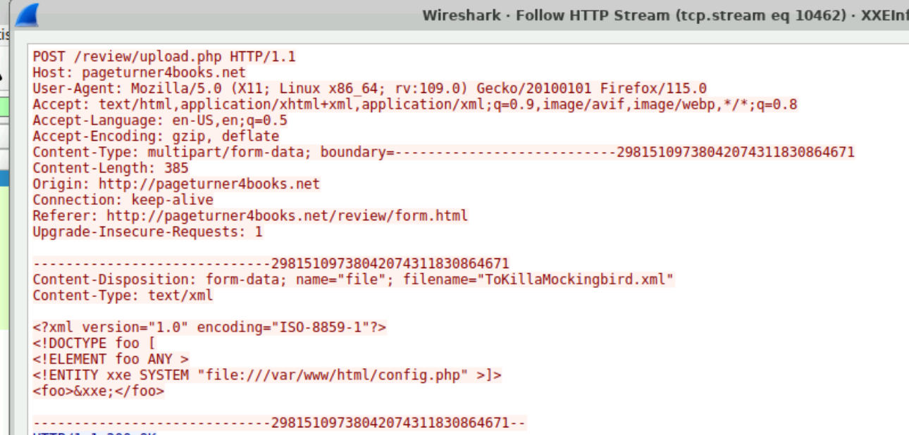
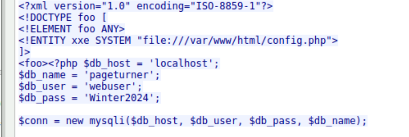
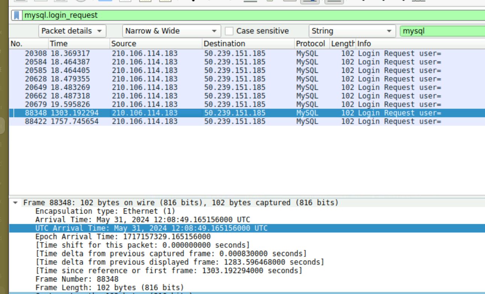
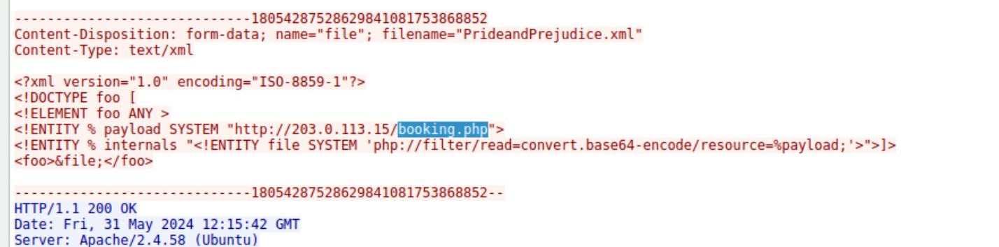

## Overview

An automated alert flagged unusual XML processing activity on a web server. Analysis of the provided PCAP reveals a full attack chain — port scanning, directory enumeration via Gobuster, XXE injection to read sensitive server files, credential theft leading to MySQL access, and finally webshell upload for persistent RCE.

---

## Investigation

### Port Scan Detection

Filtering for completed TCP handshakes identifies the attacker's initial reconnaissance:

bash

```bash
tcp.flags.syn == 1 && tcp.flags.ack == 1
```

The highest open port discovered on the victim web server was **3306** — MySQL, which becomes significant later in the attack chain.

---

### Directory Enumeration

The attacker used **Gobuster 3.6** to brute-force the web server, discovering the vulnerable upload endpoint:

**Vulnerable URI:** `/review/upload.php`

---

### XXE Injection — File Read

Filtering for POST requests reveals the attacker's XXE payload delivery:

bash

```zsh
http.request.method == "POST"
```



The first malicious XML file uploaded was **TheGreatGatsby.xml** — containing an XXE payload targeting the server's filesystem. The payload read the web application configuration file directly from the server:

**Target:** `file:///var/www/html/config.php`



The response exposed database credentials stored in plaintext within `config.php`:



|Credential|Value|
|---|---|
|Database User|`webuser`|
|Password|`Winter2024`|

---

### MySQL Access

With credentials in hand the attacker connected directly to the MySQL server on port 3306. Filtering for the login request:

bash

```bash
mysql.login_request
```



**Initial MySQL connection timestamp:** `2024-05-31 12:08`

---

### Webshell Upload — Persistence

Following database access the attacker uploaded a PHP webshell to establish persistent remote code execution on the server:

**Webshell filename:** `booking.php`



`booking.php` provided the attacker with ongoing RCE capability, surviving any credential rotation that may follow incident response.

---

## IOCs

|Type|Value|
|---|---|
|Port|`3306`|
|URI|`/review/upload.php`|
|Filename|`TheGreatGatsby.xml`|
|Filename|`config.php`|
|Filename|`booking.php`|
|Credential|`webuser:Winter2024`|

---

## MITRE ATT&CK

|Technique|ID|
|---|---|
|Network Service Discovery|T1046|
|Exploit Public-Facing Application|T1190|
|Server Software Component: Web Shell|T1505.003|
|Credentials in Files|T1552.001|
|Command and Scripting Interpreter: PHP|T1059.006|

---

## Lessons Learned

XXE injection remains a critical risk in any application processing user-supplied XML without disabling external entity resolution. Storing database credentials in plaintext config files within the web root compounds the impact significantly — a single file read vulnerability escalated to full database compromise and persistent access. Detection opportunities exist at each stage: anomalous XML POST requests, unexpected outbound filesystem reads in application logs, and direct database connections from the web server process rather than the application layer.


<div class="qa-item"> <div class="qa-question-text">Identifying the open ports discovered by an attacker helps us understand which services are exposed and potentially vulnerable. Can you identify the highest-numbered port that is open on the victim's web server?</div> <div class="flag-reveal"> <input type="checkbox"> <span class="r-placeholder">Click flag to reveal</span> <span class="r-answer">3306</span> </div> </div>

<div class="qa-item"> <div class="qa-question-text">By identifying the vulnerable PHP script, security teams can directly address and mitigate the vulnerability. What's the complete URI of the PHP script vulnerable to XXE Injection?</div> <div class="answer-reveal"> <input type="checkbox"> <span class="r-placeholder">Click to reveal answer</span> <span class="r-answer">/review/upload.php</span> </div> </div>

<div class="qa-item"> <div class="qa-question-text">To construct the attack timeline and determine the initial point of compromise. What's the name of the first malicious XML file uploaded by the attacker?</div> <div class="flag-reveal"> <input type="checkbox"> <span class="r-placeholder">Click flag to reveal</span> <span class="r-answer">TheGreatGatsby.xml</span> </div> </div>

<div class="qa-item"> <div class="qa-question-text">Understanding which sensitive files were accessed helps evaluate the breach's potential impact. What's the name of the web app configuration file the attacker read?</div> <div class="answer-reveal"> <input type="checkbox"> <span class="r-placeholder">Click to reveal answer</span> <span class="r-answer">config.php</span> </div> </div>

<div class="qa-item"> <div class="qa-question-text">To assess the scope of the breach, what is the password for the compromised database user?</div> <div class="flag-reveal"> <input type="checkbox"> <span class="r-placeholder">Click flag to reveal</span> <span class="r-answer">Winter2024</span> </div> </div>

<div class="qa-item"> <div class="qa-question-text">Following the database user compromise. What is the timestamp of the attacker's initial connection to the MySQL server using the compromised credentials after the exposure?</div> <div class="answer-reveal"> <input type="checkbox"> <span class="r-placeholder">Click to reveal answer</span> <span class="r-answer">ANSWER</span> </div> </div>

<div class="qa-item"> <div class="qa-question-text">To eliminate the threat and prevent further unauthorized access, can you identify the name of the web shell that the attacker uploaded for remote code execution and persistence?</div> <div class="flag-reveal"> <input type="checkbox"> <span class="r-placeholder">Click flag to reveal</span> <span class="r-answer">booking.php</span> </div> </div>

I successfully completed XXE Infiltration Blue Team Lab at @CyberDefenders!
https://cyberdefenders.org/blueteam-ctf-challenges/achievements/inksec/xxe-infiltration/
 
#CyberDefenders #CyberSecurity #BlueYard #BlueTeam #InfoSec #SOC #SOCAnalyst #DFIR #CCD #CyberDefender