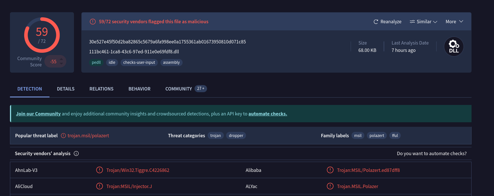
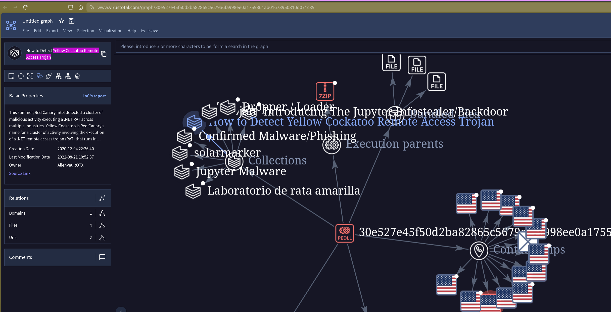
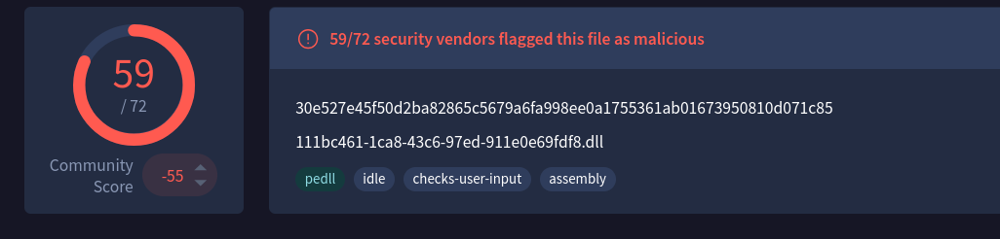
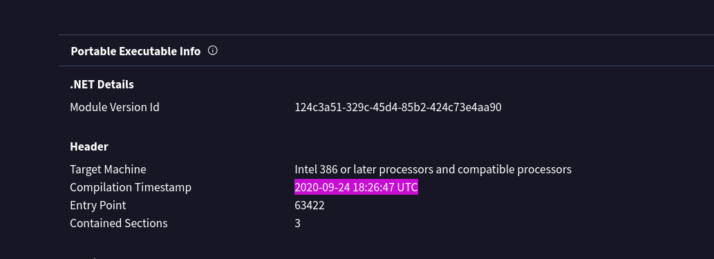
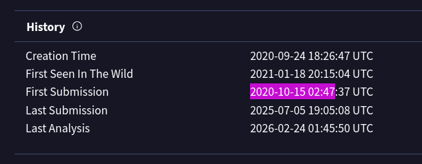
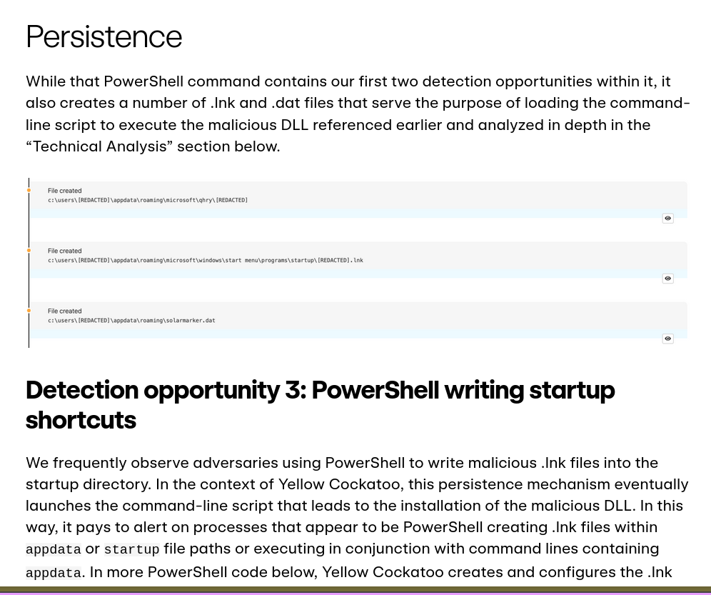
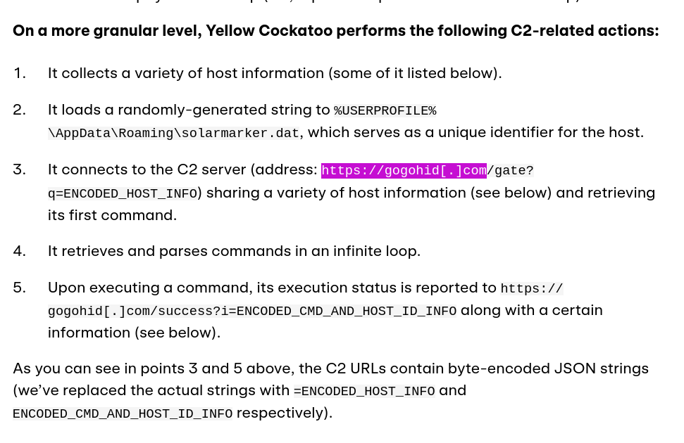

#### Scenario

During a regular IT security check at GlobalTech Industries, abnormal network traffic was detected from multiple workstations. Upon initial investigation, it was discovered that certain employees' search queries were being redirected to unfamiliar websites. This discovery raised concerns and prompted a more thorough investigation. Your task is to investigate this incident and gather as much information as possible.

A suspicious DLL was identified and analyzed using threat intelligence platforms.

**Malware Hash:**

30E527E45F50D2BA82865C5679A6FA998EE0A1755361AB01673950810D071C85

# 🔎 Initial Identification

---

## 1️⃣ Identify Malware Family

### Method

- Searched hash in **VirusTotal**
    
- Reviewed community detections & behavior graph
    

### Finding

The malware belongs to:

Yellow Cockatoo RAT

This explains:

- Browser redirection
    
- C2 beaconing
    
- Persistence mechanisms
-

## Identify Common Filename

From VirusTotal metadata:

111bc461-1ca8-43c6-97ed-911e0e69fdf8.dll

This can be used for:

- Enterprise-wide IOC scanning
    
- EDR threat hunting
    
- SIEM retroactive searches

## Compilation Timestamp

From PE header analysis:

2020-09-24 18:26:47 UTC

This helps determine:

- Malware age
    
- Campaign lifecycle
    
- Possible reuse

## First Submission to VirusTotal

From file history:

2020-10-15 02:47 UTC

Useful for:

- Estimating dwell time
    
- Community awareness timeline

## Persistence Mechanism

The malware drops:

solarmarker.dat

Location:

%AppData%\Roaming\

It also:

- Creates `.lnk` startup files
    
- Uses PowerShell to execute the DLL
    
- Maintains persistence via startup directory

## Command & Control (C2)

The malware communicates with:

https://gogohid.com

Observed behavior:

- Sends encoded host information
    
- Retrieves commands from `/gate`
    
- Reports execution results via `/success`
    

This confirms active remote access functionality.

# Final Assessment

- Malware Family: Yellow Cockatoo RAT
    
- Type: Remote Access Trojan
    
- Capabilities:
    
    - Host profiling
        
    - Persistence
        
    - C2 beaconing
        
    - Command execution
        
    - Data exfiltration
        

High confidence malicious.

## IOCs

| Type         | Value                                                            |
| ------------ | ---------------------------------------------------------------- |
| SHA256       | 30e527e45f50d2ba82865c5679a6fa998ee0a1755361ab01673950810d071c85 |
| Filename     | 111bc461-1ca8-43c6-97ed-911e0e69fdf8.dll                         |
| C2 Domain    | https://gogohid[.]com                                            |
| C2 Path      | /gate (beacon), /success (execution report)                      |
| Dropped File | solarmarker.dat — %AppData%\Roaming\                             |
| Persistence  | .lnk startup file via PowerShell — %AppData%\Roaming\Startup\    |
| Compiled     | 2020-09-24 18:26:47 UTC                                          |
| First Seen   | 2020-10-15 02:47 UTC                                             |

I successfully completed Yellow RAT Blue Team Lab at @CyberDefenders!
https://cyberdefenders.org/blueteam-ctf-challenges/achievements/inksec/yellow-rat/
 
#CyberDefenders #CyberSecurity #BlueYard #BlueTeam #InfoSec #SOC #SOCAnalyst #DFIR #CCD #CyberDefender
