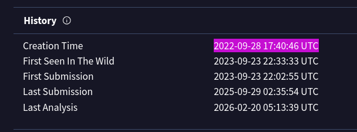
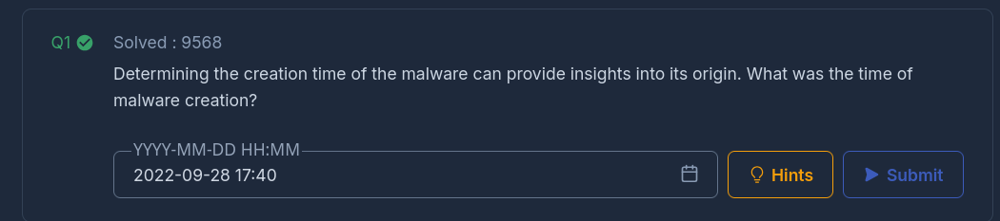
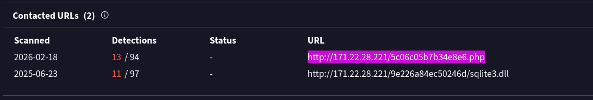
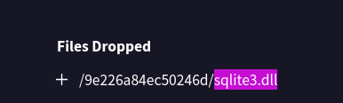
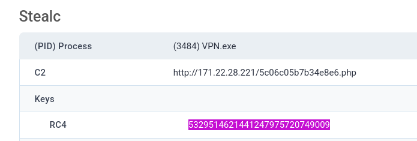
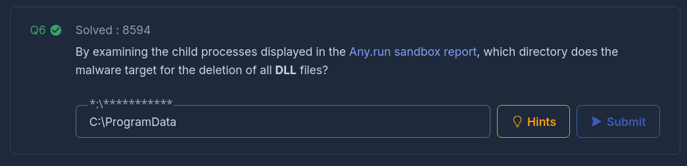

# Oski Lab – Stealc Malware Sandbox Analysis

## Overview

In this lab, I analysed a malicious PowerPoint-delivered payload using **Any.Run** and threat intelligence platforms to:

- Identify Stealc malware behaviour
    
- Extract configuration details
    
- Identify command & control infrastructure
    
- Map activity to MITRE ATT&CK
    

Category: Threat Intelligence  
Tools Used: VirusTotal, Any.Run

MD5 Hash:

12c1842c3ccafe7408c23ebf292ee3d9

Category:

[Threat Intel](https://cyberdefenders.org/blueteam-ctf-challenges/?categories=threat-intel)

Tactics:

[Initial Access](https://cyberdefenders.org/blueteam-ctf-challenges/?tactics=initial-access)[Execution](https://cyberdefenders.org/blueteam-ctf-challenges/?tactics=execution)[Defense Evasion](https://cyberdefenders.org/blueteam-ctf-challenges/?tactics=defense-evasion)[Credential Access](https://cyberdefenders.org/blueteam-ctf-challenges/?tactics=credential-access)[Command and Control](https://cyberdefenders.org/blueteam-ctf-challenges/?tactics=command-and-control)[Exfiltration](https://cyberdefenders.org/blueteam-ctf-challenges/?tactics=exfiltration)

Tools:

[VirusTotal](https://cyberdefenders.org/blueteam-ctf-challenges/?tools=virustotal)[ANY.RUN](https://cyberdefenders.org/blueteam-ctf-challenges/?tools=anyrun)

## Initial Threat Intelligence

The provided MD5 hash was analysed using VirusTotal.

Results:

- **61/72 vendors flagged the file as malicious**
    
- Classified as ransomware / Stealc variant
    

This immediately confirms high-confidence malicious classification.

### File Timeline

From the **Details** tab in VirusTotal:

- Creation Time: `2022-09-28 17:40:46 UTC`
    
- First Seen in the Wild: `2023-09-23`
    
- Last Analysis: `2026-02-20`
    

Creation timestamps can provide insight into malware development lifecycle and campaign age.

## Command & Control Infrastructure

From the **Relations** tab in VirusTotal:

C2 Server:

http://171.22.28.221/5c06c05b7b34e8e6.php

This URL indicates:

- PHP-based panel endpoint
    
- Likely credential harvesting or exfil endpoint
    

Tracking C2 infrastructure is critical for:

- IOC development
    
- Threat hunting
    
- Blocking outbound traffic
    

---

## Dropped Files

From sandbox analysis:

The malware drops:

sqlite3.dll

This suggests interaction with local browser data stores, aligning with Stealc’s credential harvesting behaviour.

## Encryption Key (RC4)

From the Any.Run sandbox report:

RC4 Key:

5329514621441247975720749009

This key is used to decrypt base64-encoded strings within the malware configuration.

Extracting encryption keys allows analysts to:

- Decode configuration data
    
- Identify additional C2 endpoints
    
- Recover embedded payloads

## MITRE ATT&CK Mapping

From the Any.Run behavioural mapping:

- **T1555.003** – Credentials from Web Browsers
    
- **T1552.001** – Credentials in Files
    
- **T1070.004** – File Deletion (Self-deletion via CMD)
    

The primary technique observed:

T1555 – Credentials from Password Stores

This confirms Stealc’s core objective: browser credential theft. 

## Defense Evasion & Self-Deletion

Sandbox behaviour shows:

- Execution of `cmd.exe`
    
- Use of timeout mechanism (`timeout /t 5`)
    
- Deletion of:
    
    C:\ProgramData

- Self-deletion after **5 seconds**
    

This behaviour aligns with:

- Anti-forensics
    
- Evidence removal
    
- Sandbox evasion
    

Self-deletion reduces artifact persistence on infected hosts.

## Attack Chain Summary

1. User opens malicious PPT attachment.
    
2. Malware executes and establishes C2 communication.
    
3. Stealc extracts browser credentials.
    
4. RC4 encryption used for configuration protection.
    
5. Dropped DLL interacts with credential stores.
    
6. Malware deletes itself after 5 seconds to evade detection.
    

---

## Detection & Defensive Considerations

- Monitor outbound HTTP to unknown PHP endpoints.
    
- Alert on suspicious DLL drops (e.g., sqlite3.dll in unusual paths).
    
- Detect use of `cmd.exe` with delayed self-deletion commands.
    
- Inspect PowerPoint-delivered payload execution.
    
- Monitor abnormal browser credential access patterns.
    

---

## Lessons Learned

- Sandbox behavioural analysis rapidly exposes attacker objectives.
    
- Hash intelligence provides quick high-confidence classification.
    
- RC4 keys are valuable pivot points for deeper malware analysis.
    
- Even short-lived malware execution can leave critical forensic evidence.
    

---

This lab was particularly enjoyable because it mirrors realistic SOC triage:

- Alert → Hash lookup → Sandbox → IOC extraction → MITRE mapping.
    

It reinforces the value of structured threat intelligence workflows in day-one SOC operations.

I successfully completed Oski Blue Team Lab at @CyberDefenders!
https://cyberdefenders.org/blueteam-ctf-challenges/achievements/inksec/oski/
 
#CyberDefenders #CyberSecurity #BlueYard #BlueTeam #InfoSec #SOC #SOCAnalyst #DFIR #CCD #CyberDefender

