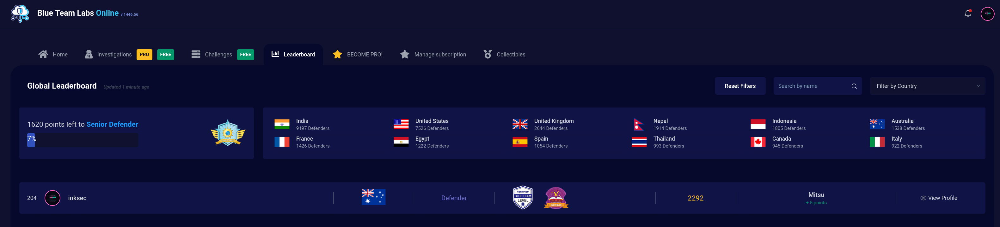
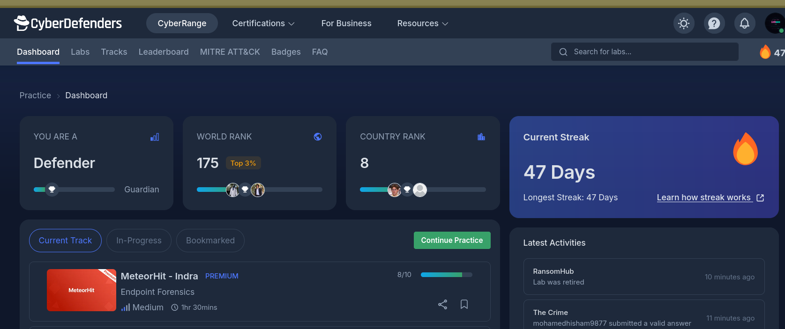
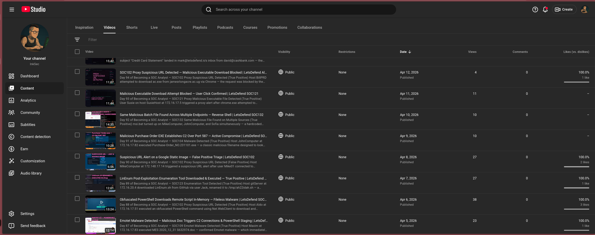

I finished the LetsDefend SOC Analyst pathway and liked the alerts sections enough that I wanted more of them. That was the start of it.

The self-doubt problem

As I built out the portfolio I started to feel genuinely proud of it. The rankings were real, the labs were real, the certs were real. Then the self-doubt crept in — and it wasn't about the technical side.

I'm not your typical SOC analyst candidate. I'm not 20. I'm covered head to toe in tattoos. I know that hiring decisions are supposed to be made on value and capability, not appearance, but I couldn't shake the thought: what if a hiring manager lands on inksec.io, thinks this is exactly who we need, calls me in — and the second I walk through the door the bias kicks in and none of the work matters.

I tried to address it first with my avatar — a Ghibli-style version that's reasonably close to how I actually look. Then I thought about it more and landed somewhere more useful: if I record myself working through alerts live, a hiring manager can see how I think, how I talk, and what I look like before we ever waste each other's time with an interview. If any of those things are a problem for them, we find that out for free. That's not pessimism, it's efficiency.

And yes, I know I'm overthinking it. But that same overthinking is what got me to top 204 globally on BTLO within a month and top 3% on CyberDefenders within 20 days. It's not always a liability.

### What the format actually is

No prior investigation. Sit down, hit record, work through the alert live. Whatever happens, happens. Some days it flows. Some days I misread something early and have to backtrack on camera. The backtrack episodes are the most honest ones.

I have 2-3 views per video. They're probably bots, or someone who clicked off after five seconds. It doesn't matter — the accountability is to the act of recording, not the audience. Doing it in public is what stops me skipping days.

What does matter is that each week I'm trying to improve something. I've gone from auto-generated thumbnails to hooks and engagement arrows to a full intro screen with transitions and an outro. When I get into something I do it properly — that's just how I'm wired, and at a certain point hyper-focus stops being a quirk and starts being a pattern.

### Where it's sitting at 100 days

Honestly, after a month of labs I'm already fairly confident I want to be doing more than L1 alert triage. The work is starting to feel like a floor, not a ceiling. But I still sit down every day and record an alert because when I land that first SOC role I want day one to feel familiar — not like I'm learning the format under pressure for the first time.

The goal is 365. I'll be here.
