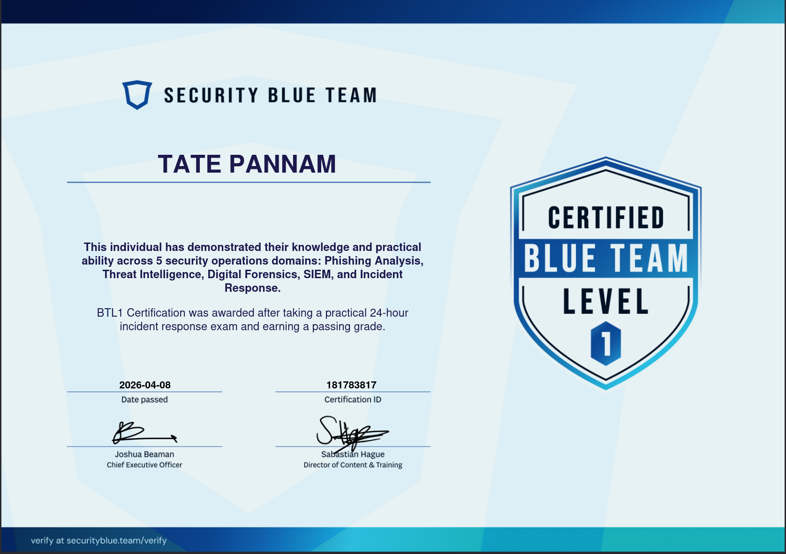
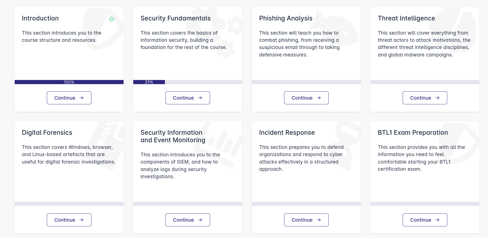
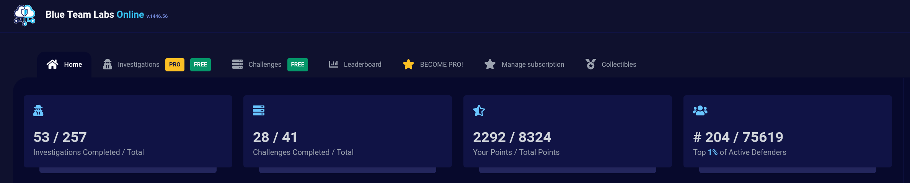

I'll be upfront — I came into BTL1 with CDSA already done. That's not nothing. If you're completely new to blue team tooling this review might not map directly to your situation, but I think the core lesson still holds.

The learning material problem

I struggle badly with wall-of-text learning. Always have. When I got access to BTL1 and opened the training material my heart sank — it's dense, text-heavy, and not how I absorb anything. The saving grace was supposed to be the AI auto-read feature. In practice it was painful. Hello DOT. Today we COMMA. At the price point BTL1 and BTL2 are sitting at, a proper voice actor isn't an unreasonable ask. It's a real gap in the product for anyone who relies on audio as a learning crutch.

So I ignored the material entirely and leaned on what had already been working.

### The lab grind

Before I even bought BTL1 I'd gotten genuinely addicted to BTLO labs. I worked through every BTL1-tagged lab on the platform — no hints, no walkthroughs available, just figure it out. At the same time I was running through the CyberDefenders SOC Level 1 path, which does have hints available if you need them. Combined it was close to 100 labs across both platforms.

The result of that was real comfort with the tools that actually matter — Volatility, Autopsy, Wireshark, Splunk, PEStudio, IDA. Not "I've watched a tutorial on these" comfortable. "I've used them to solve problems under pressure" comfortable. That distinction matters a lot in an exam environment.

Within a month of starting the BTLO grind I'd hit top 12 AU and top 204 globally. The rankings were a side effect — the actual output was internalised methodology.

### Using one attempt

BTL1 gives you two exam attempts in the package. Most people treat the first as a practice run. I used mine to see if the labs had been enough to pass outright without touching the study path. They were. The exam felt like a longer, more connected version of the investigations I'd already been doing. The open-book format rewards having a mental index of where to look — the labs build that index in a way that reading material doesn't.

The one lab I'd single out from the whole BTLO grind is Extensity — not BTL1 tagged, just a regular lab that sat me down for four hours and made me question everything. If that one humbles you, you're in good company.

### Is there a better way to spend the money?

Genuinely — I'd suggested to Security Blue Team that they consider offering a BTLO Pro plan plus exam-only fee as an alternative to the full 4-month learning path. They don't currently offer it, but for hands-on learners it would be a legitimate option. Do all the BTL1-tagged labs, push through some of the BTL2-tagged ones while you're at it and walk into the exam knowing Splunk, Autopsy, and Wireshark properly.

The cert itself is solid. The exam is well-designed, scenario-driven, and practically relevant. I just think for hands-on learners the training material is the weakest part of the package and there's a valid path around it.